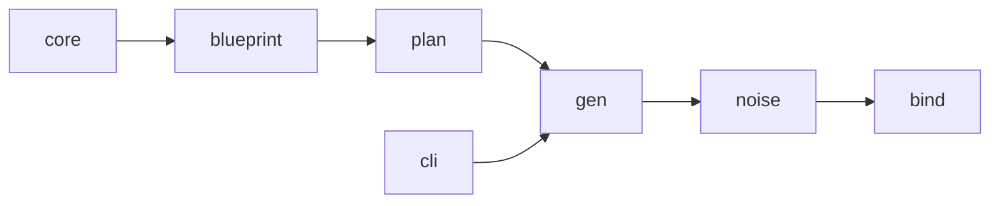

# Contributing to Knit

Thank you for your interest in contributing! This guide covers the development
workflow, conventions, and expectations for pull requests.

## Prerequisites

- **Rust 1.92+** (install via [rustup](https://rustup.rs))
- **Cargo** (bundled with Rust)
- Git

## Getting Started

```bash
git clone https://github.com/Yaming-Hub/knit.git
cd knit
cargo build
```

## Development Workflow

### Build

```bash
cargo build
```

### Test

```bash
# Run all tests (default features)
cargo test

# Run with all features enabled
cargo test --all-features
```

### Lint

```bash
cargo clippy --all-features --all-targets --locked -- -D warnings
```

### Format

```bash
cargo fmt
cargo fmt --check   # CI verification
```

### Documentation

```bash
cargo doc --all-features --no-deps --open
```

### Coverage

Coverage reports are generated in CI using `cargo-llvm-cov`. To run locally:

```bash
rustup component add llvm-tools-preview
cargo install cargo-llvm-cov
cargo llvm-cov --all-features --html --open
```

### Dependency Audit

```bash
cargo install cargo-deny
cargo deny --locked --all-features check
```

### Benchmarks

```bash
# Compile benchmarks (CI does this to catch regressions)
cargo bench --locked --all-features --no-run

# Run benchmarks locally
cargo bench --locked --all-features
```

## Code Conventions

- **Doc comments** — All public structs, enums, traits, and functions must have
  `///` doc comments. Module-level `//!` docs are encouraged.
- **Logging** — Use the `tracing` crate (`tracing::info!`, `tracing::warn!`,
  etc.) for all runtime logging. Do not use `println!` except in the CLI for
  user-facing output.
- **Error handling** — Use `thiserror` for library error types and `anyhow` in
  the CLI binary. Never call `.unwrap()` on user-provided data; use proper error
  propagation.
- **Determinism** — Generators must be deterministic for a given RNG state.
  Always derive per-field RNGs from the `RngTree` to ensure reproducibility.
- **Testing** — Write unit tests in `#[cfg(test)]` modules. Integration tests
  live in `tests/`.

## Pull Request Guidelines

- **Branch naming** — Use `feat/<topic>`, `fix/<topic>`, or `refactor/<topic>`.
- **Size limit** — Keep PRs under 2000 lines where possible. Split large
  changes into stacked PRs.
- **Test coverage** — Every new public API should have at least one test.
  Bug-fix PRs should include a regression test.
- **CI must pass** — All tests, clippy, and formatting checks must pass before
  merge.
- **Commit messages** — Use conventional commit style
  (`feat:`, `fix:`, `docs:`, `refactor:`, `test:`).

## Architecture

Knit is a single Cargo crate with a library (`src/lib.rs`) and a binary
(`src/main.rs`). Internally it is organized into focused modules:



Each module has a single responsibility. Each module depends only on modules to
its left — upstream modules never depend on downstream ones. See the
[README module table](README.md#module-structure) for descriptions of all
modules including `learn`, `scale`, `tokenize`, `enrich`, `model`, and
`decision`.

## Reporting Issues

- Use GitHub Issues for bug reports and feature requests.
- Include the output of `knit --version` and a minimal reproducing blueprint.
