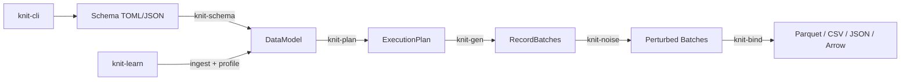

# Knit

**High-performance synthetic data generation toolkit.**

Knit generates realistic, schema-driven synthetic datasets at scale. Define your
data model in a declarative TOML or JSON schema, and Knit handles execution
planning, deterministic generation, output formatting, and optional noise
injection — all from a single CLI command.

[](https://www.rust-lang.org)
[](LICENSE)

---

## Features

- **Declarative schema language** — Define entities, fields, generators, and
  relationships in `.weave.toml` files with inheritance via `extends`.
- **Rich generator library** — Sequences, distributions (normal, uniform,
  Pareto, Zipf, …), patterns, UUIDs, one-of, derived expressions, temporal
  generators, correlated fields, and graph topologies.
- **Deterministic output** — Seeded RNG tree ensures identical datasets across
  runs for any given seed.
- **Multiple output formats** — Parquet, CSV, JSON, JSONL, and Arrow IPC with
  configurable compression (Snappy, LZ4, Zstd).
- **Noise injection** — Post-generation perturbation pipeline with 7 built-in
  perturbators (typos, null injection, outliers, drift, swap, truncation, format
  variation).
- **Reverse engineering** — Ingest existing data, profile distributions, and fit
  schemas automatically (`knit learn`).
- **Incremental learning** — Process datasets larger than memory in bounded
  chunks with streaming statistics and persistent state files.
- **Dictionary extraction** — Automatically extracts domain-specific vocabularies
  from eligible high-cardinality string columns for realistic text generation.
- **Foreign-key integrity** — Automatic topological ordering and key stores
  ensure referential integrity across entities.
- **Plugin architecture** — Register custom generators at runtime via the
  `GeneratorPlugin` trait.
- **Scalable** — Batch-oriented Arrow columnar engine with Rayon parallelism;
  sampled key stores for 100M+ row entities.

## Architecture



## Quick Start

### Install

```bash
# Clone and build
git clone https://github.com/Yaming-Hub/knit.git
cd knit
cargo build --release

# The binary is at target/release/knit
```

### Create a Schema

Create a file called `demo.weave.toml`:

```toml
schema_version = "1.0"

[model]
name = "demo"
seed = 42

[[entities]]
name = "users"
count = 10000

[[entities.fields]]
name = "id"
data_type = "int"
primary_key = true
[entities.fields.generator]
type = "sequence"
start = 1
step = 1

[[entities.fields]]
name = "email"
data_type = "string"
[entities.fields.generator]
type = "pattern"
pattern = "user####@example.com"

[[entities.fields]]
name = "age"
data_type = "int"
[entities.fields.generator]
type = "distribution"
kind = "normal"
[entities.fields.generator.params]
mean = 35.0
std_dev = 12.0
```

### Generate

```bash
# Validate schema
knit validate demo.weave.toml

# Preview execution plan
knit plan demo.weave.toml

# Generate data (default: Parquet)
knit generate demo.weave.toml -o ./data

# Generate as CSV with a specific seed
knit generate demo.weave.toml --format csv --seed 123 -o ./data

# Dry run — validate and plan without generating
knit generate demo.weave.toml --dry-run
```

## Crate Structure

| Crate | Description |
|---|---|
| `knit-core` | Shared types: `DataModel`, `Entity`, `Field`, `Value`, `GeneratorSpec` |
| `knit-schema` | TOML/JSON parsing, validation, schema inheritance (`extends`) |
| `knit-plan` | Compiles a `DataModel` into an `ExecutionPlan` with RNG tree |
| `knit-gen` | Generation engine: executes plans → Arrow `RecordBatch`es |
| `knit-noise` | Post-generation perturbation pipeline (7 perturbators) |
| `knit-bind` | Output sinks: Parquet, CSV, JSON, JSONL, Arrow IPC |
| `knit-learn` | Data ingestion, profiling, distribution fitting, schema inference |
| `knit-cli` | Binary: `validate`, `plan`, `generate`, `schema`, `init`, `learn` |

## Examples

The `examples/` directory contains sample schemas:

- `ecommerce.weave.toml` — Users, products, orders, reviews with FK relationships
- `financial.weave.toml` — Accounts and transactions with risk scoring
- `hr_org.weave.toml` — Employees, departments with self-referential FKs
- `iot_sensors.weave.toml` — Devices, sensor readings, and alerts with FK chains
- `server_logs.weave.toml` — Servers, HTTP requests, and error logs
- `cli_test.weave.toml` — Minimal schema for integration testing

Generate all examples:

```bash
for schema in examples/*.weave.toml; do
  knit generate "$schema" -o data/$(basename "$schema" .weave.toml) --format csv
done
```

### Reverse Engineering

Infer a schema from existing data and re-generate:

```bash
# Learn a schema from CSV files
knit learn ./my-data/ -o inferred.weave.toml

# Learn from a large dataset (sample first 10k rows per table)
knit learn ./big-data/ -o inferred.weave.toml --sample 10000

# Review and customize the inferred schema, then generate
knit generate inferred.weave.toml -o ./synthetic-data --format parquet
```

### Incremental Learning

For datasets too large to fit in memory, use incremental mode to process data
in chunks. Each invocation updates a persistent state file:

```bash
# Process data in batches — each call updates the state file
knit learn ./chunk1/ --state learn.state
knit learn ./chunk2/ --state learn.state
knit learn ./chunk3/ --state learn.state

# Finalize: emit schema from accumulated statistics
knit learn --state learn.state --finalize -o schema.weave.toml
```

Incremental mode uses streaming algorithms (Welford for mean/variance,
HyperLogLog for cardinality, reservoir sampling for distribution fitting) so
memory usage stays bounded regardless of dataset size.

### Dictionary Extraction

When learning from data, Knit automatically extracts domain-specific
dictionaries for eligible high-cardinality string columns (e.g., product names,
person names) that don't match a standard faker pattern:

```bash
knit learn ./products/ -o schema.weave.toml
# Creates: schema.weave.toml + products_name.dict.txt (alongside the schema)
```

The learned schema references the dictionary file, and generation draws values
from it — producing output that matches the domain vocabulary of the original
data. Dictionary extraction works in both batch and incremental modes.
Extracted dictionaries are capped at ~10,000 entries for large vocabularies.

### Parameterized Schemas

Derived expressions can reference `--param` values using `${param.key}` syntax:

```toml
[[entities.fields]]
name = "email"
data_type = "string"
[entities.fields.generator]
type = "derived"
expr = "${name}@${param.domain}"
depends_on = ["name"]
```

```bash
knit generate schema.weave.toml -o out/ --param domain=example.com
```

Unresolved params stay as literal `${param.key}` in the output.

## CLI Reference

```
knit [OPTIONS] <COMMAND>

Commands:
  validate   Parse and validate a schema file
  plan       Show execution plan (dry run)
  generate   Generate synthetic data
  schema     Schema manipulation (expand, normalize, diff)
  init       Create a starter schema
  learn      Infer schema from data
  inspect    Inspect incremental learning state file

Global options:
  --seed <N>            Override schema seed
  --format <FMT>        Output format (parquet|csv|json|jsonl|arrow)
  --compression <ALG>   Compression (none|snappy|gzip|lz4|zstd)
  --parallel <N>        Worker threads (0 = auto)
  --batch-size <N>      Rows per batch (default: 8192)
  --count <N|Nx>        Override row count (absolute or multiplier, e.g. 100, 0.1x, 10x)
  --param key=value     Override schema parameter (repeatable)
  --json                Machine-readable JSON output
  --dry-run             Validate and plan only
  --no-noise            Skip noise injection
  -q, --quiet           Suppress non-error output
  -v, --verbose         Debug logging
  --version             Show version

Learn-specific options:
  --sample <N>          Limit rows per table (faster profiling on large data)
  --state <PATH>        Incremental mode: persist statistics to a state file
  --finalize            Emit schema from state without processing new data
  --strict              Error on reprocessing same source into same state (default: warn)
```

## Contributing

See [CONTRIBUTING.md](CONTRIBUTING.md) for build instructions, coding
conventions, and PR guidelines.

## License

This project is licensed under the MIT License — see [LICENSE](LICENSE) for
details.
