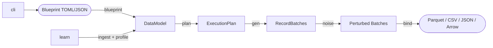

# Knit

**High-performance synthetic data generation toolkit.**

Knit generates realistic, blueprint-driven synthetic datasets at scale. Define your
data model in a declarative TOML or JSON blueprint, and Knit handles execution
planning, deterministic generation, output formatting, and optional noise
injection — all from a single CLI command.

[](https://www.rust-lang.org)
[](LICENSE)
[](https://crates.io/crates/knit)
[](https://github.com/Yaming-Hub/knit/actions/workflows/ci.yml)
[](https://codecov.io/gh/Yaming-Hub/knit)

---

## Installation

```bash
cargo install knit
```

Or build from source:

```bash
git clone https://github.com/Yaming-Hub/knit.git
cd knit
cargo build --release
```

## Features

- **Declarative blueprint language** — Define entities, fields, generators, and
  relationships in `.knit.toml` files with inheritance via `extends`,
  modular composition via `include`, reusable field groups via `mixins`,
  and custom domain types.
- **Rich generator library** — Sequences (with jitter and cyclic values),
  distributions (normal, uniform, Pareto, Zipf, Dirichlet, multinomial, …),
  patterns, UUIDs, one-of, derived expressions (63+ built-in functions with
  pipe `|>` operator), temporal generators (event streams, relative offsets),
  conditional distributions, correlated fields (copulas), and graph topologies.
- **Expression engine** — Full arithmetic, comparison, boolean, math, string,
  and type-cast functions in derived field expressions with Pratt-parser
  evaluation and vectorized Arrow execution.
- **Deterministic output** — Seeded RNG tree ensures identical datasets across
  runs for any given seed.
- **Multiple output formats** — Parquet, CSV, JSON, JSONL, Arrow IPC, Avro,
  and SQL INSERT with configurable compression (Snappy, LZ4, Zstd).
- **Noise injection** — Post-generation perturbation pipeline with 11 built-in
  perturbators (null injection, Gaussian noise, typos, outliers, duplicates,
  value drift, format corruption, swap, truncation, FK violation, temporal
  spikes) plus scoped/conditional noise with `where` predicates and
  `missing_field` at the serialization layer.
- **Time series** — Composable numeric time series (trend, seasonality, AR,
  mean-reversion, regime-switching, holiday effects) and irregular event
  streams with exponential arrivals, seasonality, and business-hour filtering.
- **Graph modeling** — 7 topology models (ER, Barabási–Albert, Watts–Strogatz,
  lattice, stochastic block, configuration, complete) with edge properties,
  degree distributions, self-referential hierarchies, and selection strategies.
- **Reverse engineering** — Ingest existing data, profile distributions, and fit
  blueprints automatically (`knit learn`).
- **Behavioral modeling** — Define actor personas with trait distributions,
  activity-driven row counts, temporal biases, social graphs, and conversation
  threading. Learn behavioral patterns from existing data with `knit learn --actors`.
- **Incremental learning** — Process datasets larger than memory in bounded
  chunks with streaming statistics and persistent state files.
- **Dictionary extraction** — Automatically extracts domain-specific vocabularies
  from eligible high-cardinality string columns for realistic text generation.
- **Foreign-key integrity** — Automatic topological ordering and key stores
  ensure referential integrity across entities.
- **Plugin architecture** — Register custom generators at runtime via the
  `GeneratorPlugin` trait, or load WASM modules dynamically with
  `--plugin path/to/gen.wasm` (requires `wasm-plugins` feature).
- **Scalable** — Batch-oriented Arrow columnar engine with Rayon parallelism;
  sampled key stores for 100M+ row entities.

## Architecture



## Quick Start

### Install

```bash
# Clone and build
git clone https://github.com/Yaming-Hub/knit.git
cd knit
cargo build --release

# The binary is at target/release/knit
```

### Create a Blueprint

Create a file called `demo.knit.toml`:

```toml
blueprint_version = "1.0"

[model]
name = "demo"
seed = 42

[[entities]]
name = "users"
count = 10000

[[entities.fields]]
name = "id"
data_type = "int"
primary_key = true
[entities.fields.generator]
type = "sequence"
start = 1
step = 1

[[entities.fields]]
name = "email"
data_type = "string"
[entities.fields.generator]
type = "pattern"
pattern = "user####@example.com"

[[entities.fields]]
name = "age"
data_type = "int"
[entities.fields.generator]
type = "distribution"
kind = "normal"
[entities.fields.generator.params]
mean = 35.0
std_dev = 12.0
```

### Generate

```bash
# Validate blueprint
knit validate demo.knit.toml

# Preview execution plan
knit plan demo.knit.toml

# Generate data (default: Parquet)
knit generate demo.knit.toml -o ./data

# Generate as CSV with a specific seed
knit generate demo.knit.toml --format csv --seed 123 -o ./data

# Dry run — validate and plan without generating
knit generate demo.knit.toml --dry-run
```

### Blueprint Composition

Build large blueprints from reusable fragments using `include`:

```toml
# main.knit.toml
include = ["users.knit.toml", "products.knit.toml"]

[model]
name = "my_project"
seed = 42

# Add entities specific to this blueprint
[[entities]]
name = "orders"
count = 5000
# ...

[[relationships]]
name = "orders_to_users"
from = "orders"
to = "users"
kind = "many_to_one"
```

**Rules:**
- Fragments define entities, relationships, personas, etc. — but no `[model]` section
- Name conflicts between included fragments are errors; the main blueprint silently overrides
- Includes are recursive and diamond-safe (each file loaded at most once)
- Security: absolute paths and `..` traversal are rejected

See `examples/modular/` for a working example.

## Module Structure

Knit is published as a single crate. Internally it is organized into modules:

| Module | Description |
|---|---|
| `knit::core` | Shared types: `DataModel`, `Entity`, `Field`, `Value`, `GeneratorSpec` |
| `knit::blueprint` | TOML/JSON parsing, validation, blueprint inheritance (`extends`) |
| `knit::plan` | Compiles a `DataModel` into an `ExecutionPlan` with RNG tree |
| `knit::gen` | Generation engine: executes plans → Arrow `RecordBatch`es |
| `knit::noise` | Post-generation perturbation pipeline (11 perturbators) |
| `knit::bind` | Output sinks: Parquet, CSV, JSON, JSONL, Arrow IPC, Avro, SQL |
| `knit::learn` | Data ingestion, profiling, distribution fitting, blueprint inference, behavioral persona discovery |
| `knit::scale` | Multi-dimensional scaling: actor, time, and custom categorical dimensions |
| `knit::tokenize` | Dataset tokenization for safe sharing (string replacement, numeric/temporal shifts) |
| `knit::enrich` | Enrich models with statistical knowledge from reference data samples |
| `knit::model` | Serialization and conversion of learned model directories |
| `knit::decision` | Decision logging and reporting for pipeline transparency |
| `knit::cli` | Binary commands: `validate`, `plan`, `generate`, `blueprint`, `init`, `learn`, `inspect`, `completions`, `generators`, `scale`, `tokenize`, `enrich`, `model` |

## Examples

The `examples/` directory contains 32 sample blueprints. Highlights:

- `ecommerce.knit.toml` — Users, products, orders, reviews with FK relationships
- `ecommerce_behavioral.knit.toml` — Persona-driven purchasing: 4 customer
  segments, activity-driven orders, temporal shopping biases, review threading
- `email_traffic.knit.toml` — Email messaging with sender/receiver personas
- `financial.knit.toml` — Accounts and transactions with risk scoring
- `hr_org.knit.toml` — Employees with behavioral personas, activity-driven tasks,
  manager hierarchy, and work-hour temporal biases
- `iot_sensors.knit.toml` — Devices, sensor readings, and alerts with FK chains
- `server_logs.knit.toml` — Servers, HTTP requests, and error logs
- `social_platform.knit.toml` — Social network with actor graphs, persona-driven
  temporal patterns, burst sessions, and posts/comments/DMs
- `time_series_metrics.knit.toml` — Composable numeric time series with trend,
  seasonality, AR, mean-reversion, and holiday effects
- `event_stream.knit.toml` — Irregular time series with exponential arrivals
- `conditional_distribution.knit.toml` — Distribution-dependent field correlations
- `vector_distributions.knit.toml` — Dirichlet and multinomial distributions
- `relative_offset.knit.toml` — Distribution, constant, and simple offset modes
- `scoped_noise.knit.toml` — Conditional noise injection with scope predicates
- `pipe_operator.knit.toml` — Expression function composition with `|>`
- `mixins.knit.toml` — Reusable field groups across entities
- `custom_types.knit.toml` — Domain type aliases
- `sequence_jitter.knit.toml` — Temporal randomization with jitter offsets
- `sequence_values.knit.toml` — Round-robin cyclic value sequences
- `timezone_business_hours.knit.toml` — Timezone-aware event generation
- `selection_strategies.knit.toml` — FK selection strategies (sequential, clustered)
- `edge_properties.knit.toml` — Relationship properties on graph edges
- `hierarchy.knit.toml` — Self-referential hierarchies with depth control
- `holiday_effect.knit.toml` — Date-based time series spikes/dips
- `count_expressions.knit.toml` — Parameterized entity counts
- `degree_distribution.knit.toml` — Power-law cardinality patterns
- `nested_objects.knit.toml` — Hierarchical struct fields
- `modular/` — Modular composition example: `users.knit.toml` and
  `products.knit.toml` fragments composed via `include` in `ecommerce.knit.toml`
- `cli_test.knit.toml` — Minimal blueprint for integration testing

Generate all examples:

```bash
find examples -name '*.knit.toml' | while read schema; do
  knit generate "$schema" -o "data/$(basename "$schema" .knit.toml)" --format csv
done
```

### Reverse Engineering

Infer a blueprint from existing data and re-generate:

```bash
# Learn a blueprint from CSV files
knit learn ./my-data/ -o inferred.knit.toml

# Learn from a large dataset (sample first 10k rows per table)
knit learn ./big-data/ -o inferred.knit.toml --sample 10000

# Review and customize the inferred blueprint, then generate
knit generate inferred.knit.toml -o ./synthetic-data --format parquet
```

### Incremental Learning

For datasets too large to fit in memory, use incremental mode to process data
in chunks. Each invocation updates a persistent state file:

```bash
# Process data in batches — each call updates the state file
knit learn ./chunk1/ --state learn.state
knit learn ./chunk2/ --state learn.state
knit learn ./chunk3/ --state learn.state

# Finalize: emit blueprint from accumulated statistics
knit learn --state learn.state --finalize -o schema.knit.toml
```

Incremental mode uses streaming algorithms (Welford for mean/variance,
HyperLogLog for cardinality, reservoir sampling for distribution fitting) so
memory usage stays bounded regardless of dataset size.

### Dictionary Extraction

When learning from data, Knit automatically extracts domain-specific
dictionaries for eligible high-cardinality string columns (e.g., product names,
person names) that don't match a standard faker pattern:

```bash
knit learn ./products/ -o schema.knit.toml
# Creates: schema.knit.toml + products_name.dict.txt (alongside the schema)
```

The learned blueprint references the dictionary file, and generation draws values
from it — producing output that matches the domain vocabulary of the original
data. Dictionary extraction works in both batch and incremental modes.
Extracted dictionaries are capped at ~10,000 entries for large vocabularies.

### Behavioral Modeling

Define actor personas with distinct behavioral traits to generate data with
realistic human-like patterns:

```toml
# Define behavioral segments
[[personas]]
name = "power_user"
weight = 0.15
[personas.traits]
activity_rate = 20.0    # events/month
peak_hours = 9.0        # preferred hour of day

[[personas]]
name = "casual_user"
weight = 0.85
[personas.traits]
activity_rate = 3.0
peak_hours = 20.0

# Mark an entity as an actor with persona assignment
[[entities]]
name = "users"
count = 1000
actor = true
persona_distribution = "personas"

# Activity-driven row counts (total rows = sum of per-actor trait values)
[[entities]]
name = "events"
count = 5000  # fallback estimate
[entities.activity_count]
actor_field = "user_id"
trait = "activity_rate"

# FK field linking events to their actor
[[entities.fields]]
name = "user_id"
data_type = "int"
actor_column = true

# Temporal bias — timestamps cluster around each actor's peak_hours
[[entities.fields]]
name = "created_at"
data_type = "datetime"
[entities.fields.generator]
type = "actor_temporal"
trait = "peak_hours"

# Relationship required for activity_count resolution
[[relationships]]
name = "event_user"
from = "events"
to = "users"
kind = "many_to_one"
foreign_key = "user_id"
```

Learn behavioral patterns from existing data:

```bash
# Infer personas and actor relationships from data
knit learn ./my-data/ --actors -o behavioral.knit.toml

# Inspect discovered behavioral structure
knit inspect behavioral.knit.toml --actors

# Generate with persona-driven realism
knit generate behavioral.knit.toml -o ./synthetic
```

See `examples/social_platform.knit.toml` and `examples/ecommerce_behavioral.knit.toml`
for complete behavioral blueprints.

### Parameterized Blueprints

Derived expressions can reference `--param` values using `${param.key}` syntax:

```toml
[[entities.fields]]
name = "email"
data_type = "string"
[entities.fields.generator]
type = "derived"
expr = "${name}@${param.domain}"
depends_on = ["name"]
```

```bash
knit generate schema.knit.toml -o out/ --param domain=example.com
```

Unresolved params stay as literal `${param.key}` in the output.

### Dataset Scaling

Scale a learned blueprint along discovered dimensions (actors, time, custom
categories) to generate larger or smaller datasets while preserving
statistical proportions:

```bash
# Analyze a blueprint to discover scaling dimensions
knit scale schema.knit.toml --analyze

# Scale to 10,000 actors (dependents scale proportionally)
knit scale schema.knit.toml --actors 10000 -o ./scaled-data

# Scale time range to 1 year of weekly data
knit scale schema.knit.toml --time 52w --cadence 1w -o ./scaled-data

# Combine scaling dimensions
knit scale schema.knit.toml --actors 5000 --time 26w --count 2.0 -o ./scaled-data

# Increase density for a specific entity without changing other dimensions
knit scale schema.knit.toml --density orders=3.0 -o ./scaled-data
```

### Dataset Tokenization

Replace sensitive string values with opaque tokens for safe data sharing.
Preserves dataset structure, relationships, and statistical properties:

```bash
# Tokenize all string columns in a dataset
knit tokenize ./data/ -o ./tokenized/

# Only tokenize specific columns
knit tokenize ./data/ -o ./tokenized/ --tokenize-columns email,name,phone

# Also shift numeric and date values
knit tokenize ./data/ -o ./tokenized/ --tokenize-numbers --tokenize-dates

# Restore original data using the generated dictionary
knit tokenize ./tokenized/ -o ./restored/ --restore --dictionary ./tokenized/.knit-tokens.json
```

### Model Enrichment

Enrich a blueprint with statistical knowledge from reference data samples.
Automatically maps columns between the reference data and blueprint entities,
then updates generator parameters to match the reference distribution:

```bash
# Enrich a blueprint with reference data (auto-detect entity)
knit enrich schema.knit.toml --ref reference.csv -o enriched.knit.toml

# Enrich a specific entity with interactive confirmation
knit enrich schema.knit.toml --ref sales.parquet --entity orders --interactive

# Dry run to preview column mappings without modifying the blueprint
knit enrich schema.knit.toml --ref reference.csv --dry-run
```

## CLI Reference

```
knit [OPTIONS] <COMMAND>

Commands:
  validate     Parse and validate a blueprint file
  plan         Show the execution plan without generating data
  generate     Generate synthetic data from a blueprint
  blueprint    Blueprint manipulation operations
  init         Initialize a new knit project with a starter blueprint
  learn        Infer a knit blueprint from existing data files or directories
  inspect      Inspect a learning state file or blueprint file
  generators   List available generator types with descriptions and examples
  completions  Generate shell completion scripts
  scale        Scale a learned blueprint along discovered dimensions
  tokenize     Tokenize a dataset for safe sharing (replace strings with opaque tokens)
  enrich       Enrich a model with statistical knowledge from reference samples
  model        Model directory operations (convert, info)

Global options:
  --seed <N>              Override blueprint seed
  --format <FMT>          Output format (parquet|csv|json|jsonl|arrow|avro|sql)
  --compression <ALG>     Compression (none|snappy|gzip|lz4|zstd)
  --parallel <N>          Worker threads (0 = auto)
  --batch-size <N>        Rows per batch (default: 8192)
  --count <N|Nx>          Override row count (absolute or multiplier, e.g. 100, 0.1x, 10x)
  --param key=value       Override blueprint parameter (repeatable)
  --json                  Machine-readable JSON output
  --dry-run               Validate and plan only
  --no-noise              Skip noise injection
  --sql-create-table      Include CREATE TABLE DDL in SQL output
  --sql-transaction       Wrap SQL output in BEGIN/COMMIT transaction
  --plugin <PATH>         Load a WASM generator plugin (repeatable)
  --plugin-dir <DIR>      Load all .wasm plugins from a directory
  --log-format <FMT>      Log format: text (default) or json
  --log-file <PATH>       Write all log events to a file (JSON format)
  --log-filter <FILTER>   Tracing filter directive (e.g. "learn=debug,gen=info")
  --decision-report <PATH>  Write a JSON decision report capturing pipeline decisions
  -q, --quiet             Suppress non-error output
  -v, --verbose           Debug logging
  --version               Show version

Learn-specific options:
  --sample <N>          Limit rows per table (faster profiling on large data)
  --state <PATH>        Incremental mode: persist statistics to a state file
  --finalize            Emit blueprint from state without processing new data
  --strict              Error on reprocessing same source into same state (default: warn)
  --actors              Enable behavioral modeling (persona discovery, actor graphs)

Scale-specific options:
  --analyze             Show discovered dimensions without generating
  --actors <N>          Target actor count (e.g. 100)
  --time <SPEC>         Target time range (e.g. "52w", "6m", "2024-01-01..2025-12-31")
  --dim name=count      Scale custom dimension (repeatable)
  --count <N>           Additional uniform row multiplier (e.g. 2.0)
  --cadence <SPEC>      Override detected time cadence (e.g. "7d", "1w")
  --density Entity=N    Per-entity density multiplier (repeatable)

Tokenize-specific options:
  -o, --output <PATH>   Output directory (required)
  --restore             Restore tokenized dataset to original using dictionary
  --verify <PATH>       Verify tokenized dataset matches original structure
  --dictionary <PATH>   Token dictionary path (default: <output>/.knit-tokens.json)
  --tokenize-numbers    Also tokenize numeric values
  --tokenize-dates      Also tokenize date/timestamp values
  --tokenize-headers    Also tokenize column headers
  --tokenize-paths      Also tokenize file and folder names
  --tokenize-columns <COLS>   Only tokenize these columns (comma-separated)
  --preserve-columns <COLS>   Tokenize all except these columns (comma-separated)
  --preserve-partitions       Keep partition folder values as-is
  --report              Generate a detailed tokenization report
  --output-format <FMT> Convert output files to this format

Enrich-specific options:
  --ref <PATH>          Path to reference data file (CSV, Parquet, JSON)
  --entity <NAME>       Only enrich this entity (default: auto-detect)
  --min-confidence <N>  Minimum confidence for column mapping (0.0-1.0, default: 0.7)
  --max-rows <N>        Maximum rows to read from reference
  --interactive         Interactively confirm each column mapping

Inspect options:
  --actors              Show behavioral summary (personas, relationships, generators)

Model subcommands:
  model convert         Convert between flat blueprint and structured model directory
  model info            Show summary information about a model
```

## Benchmarks

See [BENCHMARKS.md](BENCHMARKS.md) for generation pipeline performance
baselines and instructions on running benchmarks locally.

## Contributing

See [CONTRIBUTING.md](CONTRIBUTING.md) for build instructions, coding
conventions, and PR guidelines.

## License

This project is licensed under the MIT License — see [LICENSE](LICENSE) for
details.
