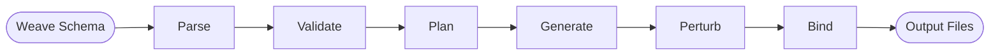
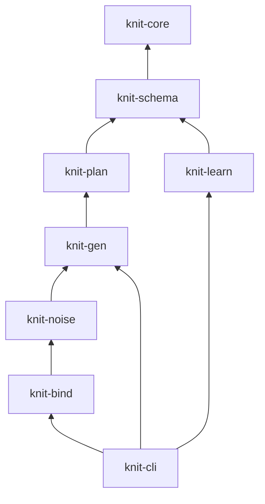
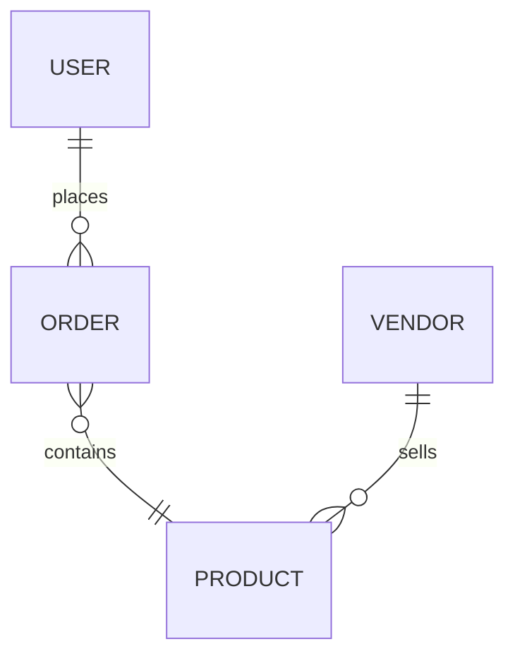
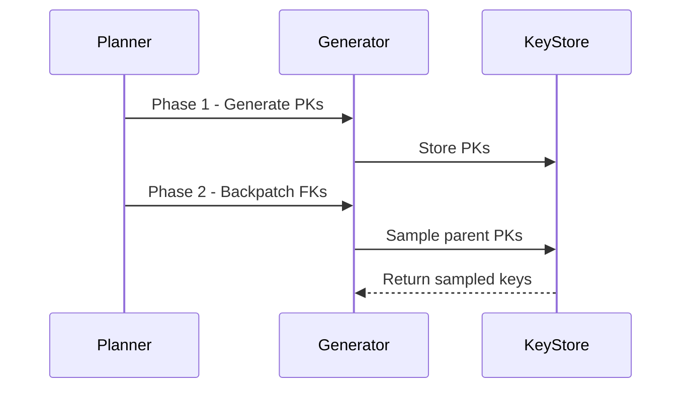

# Agent Skills & Conventions

This document defines reusable skills and conventions for AI agents working on
the Knit project.

---

## Skill: Mermaid Diagrams

**Rule:** All diagrams in markdown documentation **must** use
[Mermaid](https://mermaid.js.org/) syntax instead of ASCII art.

### Why

- Renders natively on GitHub, GitLab, VS Code, and most markdown viewers
- Easier for AI agents to generate, parse, and modify programmatically
- Scales to complex diagrams without manual alignment
- Version-control friendly (text-based diffs)

### Supported Diagram Types

Use the appropriate Mermaid diagram type for the concept:

| Concept | Mermaid Type | Example Use |
|---------|-------------|-------------|
| Data/control flow | `flowchart` or `graph` | Pipeline stages, architecture overview |
| Sequence of operations | `sequenceDiagram` | Request/response flows, multi-phase generation |
| State machines | `stateDiagram-v2` | Record lifecycle, pipeline states |
| Class/type hierarchies | `classDiagram` | Trait relationships, type system |
| Entity relationships | `erDiagram` | Data model, entity-relationship diagrams |
| Gantt / phases | `gantt` | Implementation phases, timelines |
| Block layouts | `block-beta` | System component layouts |

### Syntax Guidelines

1. **Use `flowchart` (not `graph`)** for directional flow diagrams — it supports
   more features and is the modern Mermaid recommendation.

2. **Prefer `TB` (top-to-bottom) or `LR` (left-to-right)** direction based on
   the diagram's natural reading order:
   - `LR` for pipelines and sequential flows
   - `TB` for hierarchies and dependency trees

3. **Use descriptive node IDs** — not `A`, `B`, `C`, but `parse`, `validate`, `plan`:
   ```mermaid
   flowchart LR
       parse[Parse Schema] --> validate[Validate]
       validate --> plan[Plan]
   ```

4. **Use subgraphs** to group related components:
   ```mermaid
   flowchart TB
       subgraph forward[Forward Pipeline]
           parse --> validate --> plan --> gen
       end
   ```

5. **Use node shapes** to convey meaning:
   - `[text]` — rectangle (process/tool)
   - `([text])` — stadium (input/output)
   - `{text}` — diamond (decision)
   - `[(text)]` — cylinder (data store)
   - `[[text]]` — subroutine

6. **Keep diagrams focused** — one concept per diagram. Split complex systems
   into multiple diagrams rather than cramming everything into one.

7. **Style sparingly** — only use `style` or `classDef` when differentiation
   is genuinely needed (e.g., highlighting a critical path).

### Examples

#### Pipeline Flow


#### Dependency Graph


#### Entity Relationship


#### Sequence (Multi-Phase Generation)

