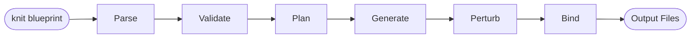
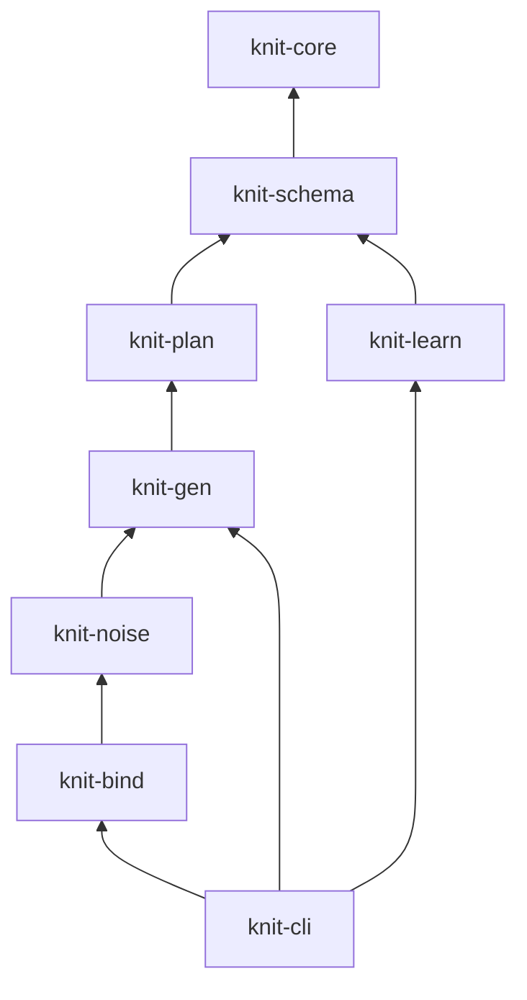
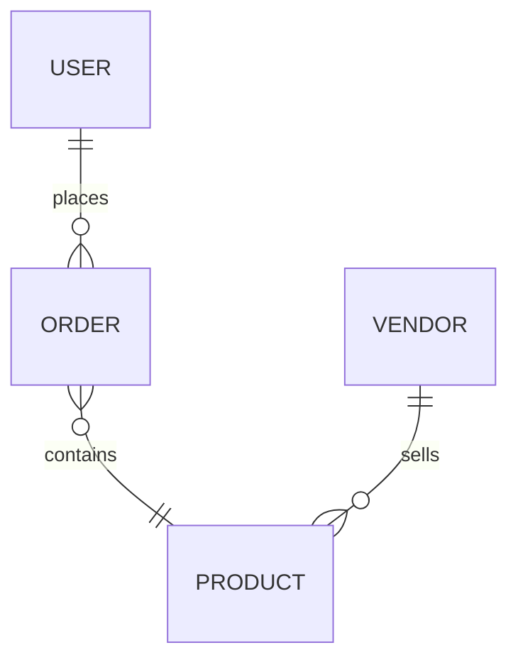
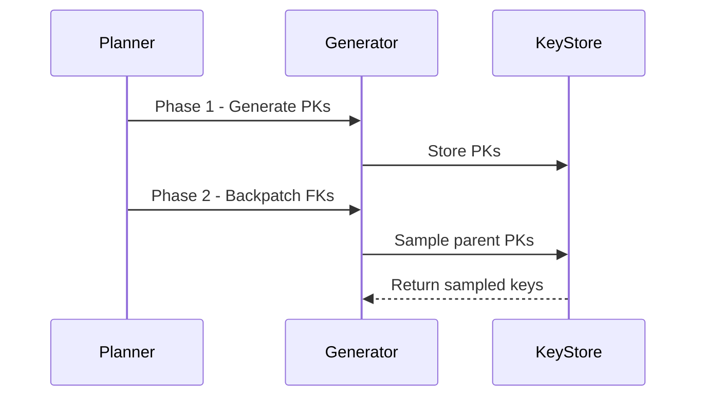

# Agent Skills & Conventions

This document defines reusable skills and conventions for AI agents working on
the Knit project.

---

## Convention: Rust Documentation Comments

**Rule:** All public structs, enums, traits, and functions **must** have `///` doc
comments. Key components must also document their responsibilities and
interactions with other crates/components.

### What to Document

| Item | Required | Guidelines |
|------|----------|------------|
| Public struct | ✅ | Purpose, when it's created, who consumes it |
| Public enum | ✅ | Purpose, variant semantics |
| Public function | ✅ | What it does, params, return value, errors |
| Public trait | ✅ | Contract, who implements it, who calls it |
| Key component (crate-level) | ✅ | Responsibility, inputs/outputs, interactions with other crates |
| Private helpers | Optional | Only when logic is non-obvious |

### Style

1. **First line is a summary sentence** — imperative mood, no period:
   ```rust
   /// Compile a validated DataModel into an ExecutionPlan
   pub fn compile(model: &DataModel) -> Result<ExecutionPlan, PlanError> { ... }
   ```

2. **For key types, document the role in the pipeline and interactions:**
   ```rust
   /// A complete execution plan produced by `knit-plan` from a validated `DataModel`.
   ///
   /// The plan is consumed by `knit-gen` to drive parallel data generation.
   /// It contains phase ordering, partition assignments, generator plans,
   /// and the deterministic RNG seed tree.
   ///
   /// # Determinism
   ///
   /// The same `DataModel` always produces the same `ExecutionPlan`,
   /// regardless of platform or thread count.
   pub struct ExecutionPlan { ... }
   ```

3. **Document enum variants when semantics aren't obvious:**
   ```rust
   /// How to store primary keys for foreign key sampling.
   pub enum KeyStoreKind {
       /// In-memory Vec — fast, used for entities < 10M rows.
       InMemoryVec,
       /// Memory-mapped file — for 10M–100M rows.
       MemoryMapped,
       /// Sampled subset — for > 100M rows.
       SampledSubset { sample_size: usize },
   }
   ```

4. **Use `# Errors`, `# Panics`, `# Examples` sections** where appropriate.

5. **Cross-reference related types** using backtick-delimited paths:
   ```rust
   /// Convert a [`GeneratorSpec`] from the schema into a [`GeneratorPlan`]
   /// ready for execution.
   ```

### Crate-Level Documentation

Each crate's `lib.rs` should have a `//!` module-level doc comment explaining:
- What the crate does
- Where it sits in the pipeline
- Key public types and entry points
- Example usage (if applicable)

```rust
//! # knit-plan
//!
//! Compiles a validated [`DataModel`] into an [`ExecutionPlan`] that drives
//! parallel data generation in `knit-gen`.
//!
//! ## Pipeline Position
//!
//! ```text
//! knit blueprint → knit-schema → DataModel → knit-plan → ExecutionPlan → knit-gen
//! ```
//!
//! ## Key Entry Point
//!
//! - [`compile()`] — the main planning function
```

---

## Skill: Mermaid Diagrams

**Rule:** All diagrams in markdown documentation **must** use
[Mermaid](https://mermaid.js.org/) syntax instead of ASCII art.

### Why

- Renders natively on GitHub, GitLab, VS Code, and most markdown viewers
- Easier for AI agents to generate, parse, and modify programmatically
- Scales to complex diagrams without manual alignment
- Version-control friendly (text-based diffs)

### Supported Diagram Types

Use the appropriate Mermaid diagram type for the concept:

| Concept | Mermaid Type | Example Use |
|---------|-------------|-------------|
| Data/control flow | `flowchart` or `graph` | Pipeline stages, architecture overview |
| Sequence of operations | `sequenceDiagram` | Request/response flows, multi-phase generation |
| State machines | `stateDiagram-v2` | Record lifecycle, pipeline states |
| Class/type hierarchies | `classDiagram` | Trait relationships, type system |
| Entity relationships | `erDiagram` | Data model, entity-relationship diagrams |
| Gantt / phases | `gantt` | Implementation phases, timelines |
| Block layouts | `block-beta` | System component layouts |

### Syntax Guidelines

1. **Use `flowchart` (not `graph`)** for directional flow diagrams — it supports
   more features and is the modern Mermaid recommendation.

2. **Prefer `TB` (top-to-bottom) or `LR` (left-to-right)** direction based on
   the diagram's natural reading order:
   - `LR` for pipelines and sequential flows
   - `TB` for hierarchies and dependency trees

3. **Use descriptive node IDs** — not `A`, `B`, `C`, but `parse`, `validate`, `plan`:
   ```mermaid
   flowchart LR
       parse[Parse Schema] --> validate[Validate]
       validate --> plan[Plan]
   ```

4. **Use subgraphs** to group related components:
   ```mermaid
   flowchart TB
       subgraph forward[Forward Pipeline]
           parse --> validate --> plan --> gen
       end
   ```

5. **Use node shapes** to convey meaning:
   - `[text]` — rectangle (process/tool)
   - `([text])` — stadium (input/output)
   - `{text}` — diamond (decision)
   - `[(text)]` — cylinder (data store)
   - `[[text]]` — subroutine

6. **Keep diagrams focused** — one concept per diagram. Split complex systems
   into multiple diagrams rather than cramming everything into one.

7. **Style sparingly** — only use `style` or `classDef` when differentiation
   is genuinely needed (e.g., highlighting a critical path).

### Examples

#### Pipeline Flow


#### Dependency Graph


#### Entity Relationship


#### Sequence (Multi-Phase Generation)


---

## Convention: Logging with `tracing`

**Rule:** All crates use the [`tracing`](https://docs.rs/tracing) library for
structured, leveled logging. Do **not** use `println!`, `eprintln!`, or the `log` crate.

### Log Levels

| Level | Use For | Example |
|-------|---------|---------|
| `info!` | Pipeline progress | Entity started, phase complete, output written |
| `debug!` | Detailed per-batch info | Partition N generating rows X–Y |
| `trace!` | Per-field/per-record detail | Generator invoked, seed derived |
| `warn!` | Recoverable issues | Fallback used, heuristic triggered |
| `error!` | Failures before returning `Err` | File not found, invalid config |

### Style

Use structured fields for machine-parseable context:

```rust
tracing::info!(entity = %entity_name, rows = row_count, "generation complete");
tracing::debug!(partition = partition_id, start = start_row, end = end_row, "generating batch");
tracing::warn!(field = %field_name, fallback = "uniform", "unknown distribution, using fallback");
```

### Subscriber Initialization

- **Library crates** (`knit-core`, `knit-schema`, `knit-plan`, `knit-gen`, etc.)
  emit tracing events but **never** initialize a subscriber.
- **Binary crate** (`knit-cli`) initializes `tracing-subscriber` with:
  - `EnvFilter` for `RUST_LOG` support (e.g., `RUST_LOG=knit_gen=debug`)
  - `--verbose` flag → `debug` level
  - `--quiet` flag → `warn` level only
