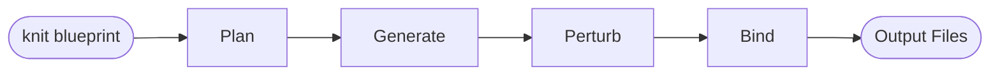
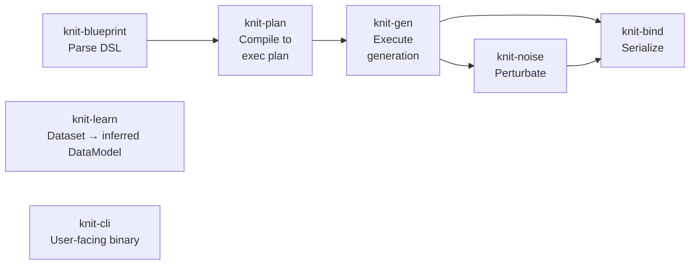
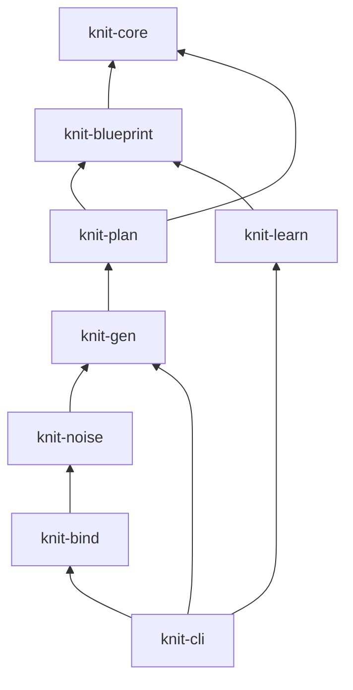
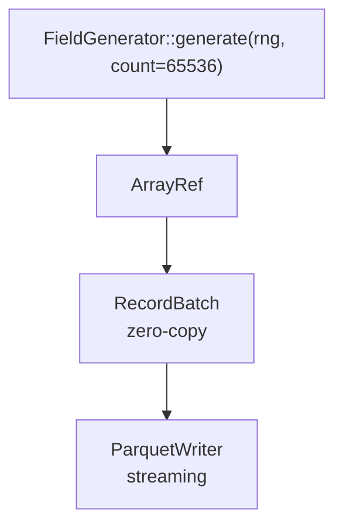
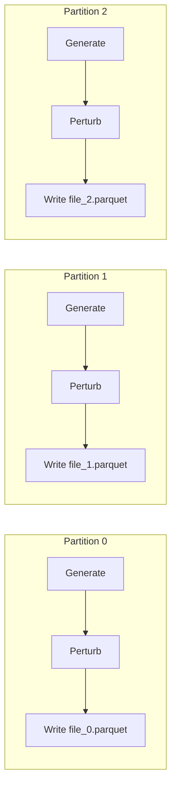

# Knit — Design Document

**Version:** 0.4.0
**Status:** Implemented

A high-performance Rust toolset for generating large synthetic datasets (100GB+ in hours).

## Table of Contents

- [Overview](#overview)
- [Architecture](#architecture)
- [Schema Language](#schema-language)
- [Crate Breakdown](#crate-breakdown)
- [Performance Strategy](#performance-strategy)
- [Extension Mechanism](#extension-mechanism)
- [CLI Interface](#cli-interface)
- [Implementation Phases](#implementation-phases)
- [Dependencies](#dependencies)

---

## Overview

Knit is a pipeline that turns a declarative data model specification into large, realistic
synthetic datasets. The pipeline flows through five stages:



### Design Principles

1. **Reproducibility** — Same seed + same schema = identical output, always. Hierarchical
   deterministic seeding isolated per (entity, field, partition).
2. **Streaming** — Never require the full dataset in memory. Generate, perturb, and write
   in batches.
3. **Columnar-first** — Use Arrow RecordBatch internally for throughput. Convert to
   row-oriented `Value` only at API boundaries.
4. **Statistical-first** — Every generator is ultimately driven by a statistical distribution.
5. **Invariant-aware noise** — Perturbators declare what invariants they break.
6. **AI-friendly** — The schema language is designed for LLMs to read, generate, and modify.

---

## Architecture



### Crate Dependency Graph



---

## Schema Language

### Design Goals for AI-Friendliness

The schema language is designed so that an LLM can reliably generate, read, and modify
specifications. Key principles:

1. **TOML as serialization format** — well-known to LLMs, less ambiguous than YAML,
   more human-readable than JSON. JSON is also accepted for programmatic AI pipelines.
2. **Restricted canonical subset** — one correct way to express each concept. No dotted
   keys, no inline tables (except trivial generator params), deterministic ordering.
3. **Regular structure** — every generator follows the same shape: `type` + `params`.
   Every field has the same set of optional properties. Minimal special cases.
4. **Semantic annotations** — optional `description` and `tags` fields on every element
   for AI to communicate intent (ignored by execution).
5. **Composable via `extends`** — base model + overlay pattern for incremental AI edits.
6. **Machine-validatable** — JSON Schema provided; `knit blueprint validate` gives
   machine-readable errors with line numbers.
7. **Inspectable** — `knit blueprint expand` flattens inheritance and shows the effective
   schema. `knit blueprint normalize` reformats to canonical style.
8. **Version field** — `blueprint_version` for forward compatibility.

### Schema Example

```toml
blueprint_version = "1.0"

[model]
name = "ecommerce"
description = "E-commerce platform with users, orders, and products"
seed = 42
locale = "en_US"

# ── Entities ────────────────────────────────────────────────

[[entities]]
name = "user"
description = "Platform users with tiered subscriptions"
count = 100_000

[[entities.fields]]
name = "id"
type = "uuid"
primary_key = true

[[entities.fields]]
name = "name"
type = "string"
generator = { type = "faker", params = { category = "name" } }

[[entities.fields]]
name = "age"
type = "int"
generator = { type = "distribution", distribution = "normal", params = { mean = 35.0, std_dev = 12.0 }, min = 18, max = 99 }

[[entities.fields]]
name = "income"
type = "float"
description = "Annual income in USD, log-normally distributed"
generator = { type = "distribution", distribution = "log_normal", params = { mu = 10.8, sigma = 0.7 } }

[[entities.fields]]
name = "signup_date"
type = "datetime"
generator = { type = "distribution", distribution = "uniform", params = { min = "2020-01-01", max = "2025-12-31" } }

[[entities.fields]]
name = "tier"
type = "string"
generator = { type = "one_of", params = { choices = [
    { value = "free",       weight = 0.60 },
    { value = "basic",      weight = 0.25 },
    { value = "premium",    weight = 0.10 },
    { value = "enterprise", weight = 0.05 },
] } }

[[entities.fields]]
name = "email"
type = "string"
nullable = { probability = 0.02 }
generator = { type = "faker", params = { category = "email" } }

# ── Orders ──────────────────────────────────────────────────

[[entities]]
name = "order"
description = "Purchase orders linked to users"
count = 500_000

[[entities.fields]]
name = "id"
type = "uuid"
primary_key = true

[[entities.fields]]
name = "user_id"
type = "uuid"

[[entities.fields]]
name = "amount"
type = "float"
generator = { type = "distribution", distribution = "pareto", params = { scale = 10.0, shape = 1.5 } }

[[entities.fields]]
name = "item_count"
type = "int"
generator = { type = "distribution", distribution = "poisson", params = { lambda = 3.2 } }

[[entities.fields]]
name = "status"
type = "string"
generator = { type = "one_of", params = { choices = [
    { value = "completed",  weight = 0.70 },
    { value = "pending",    weight = 0.15 },
    { value = "cancelled",  weight = 0.10 },
    { value = "refunded",   weight = 0.05 },
] } }

# ── Self-referential: Employee ──────────────────────────────

[[entities]]
name = "employee"
description = "Employees with manager hierarchy (self-referential)"
count = 5_000

[[entities.fields]]
name = "id"
type = "int"
generator = { type = "sequence", params = { start = 1, step = 1 } }

[[entities.fields]]
name = "manager_id"
type = "int"
nullable = true

# ── Relationships ───────────────────────────────────────────

[[relationships]]
name = "order_user"
description = "Each order belongs to a user; orders-per-user follows Zipf"
from = "order"
to = "user"
kind = "many_to_one"
from_field = "user_id"
to_field = "id"
cardinality = { distribution = "zipf", params = { n = 100000, exponent = 1.2 } }

[[relationships]]
name = "employee_manager"
from = "employee"
to = "employee"
kind = "many_to_one"
from_field = "manager_id"
to_field = "id"
nullable = true

# ── Noise Profiles ──────────────────────────────────────────

[[noise]]
target = "user.email"
type = "typo"
probability = 0.01

[[noise]]
target = "order.amount"
type = "outlier"
probability = 0.005
params = { multiplier = { distribution = "uniform", min = 10.0, max = 100.0 } }
```

### Generator Types

Every generator follows the same shape: `{ type, params, ... }`.

| Type | Description | Key Params |
|------|-------------|------------|
| `distribution` | Statistical distribution | `distribution`, `params`, `min`, `max` |
| `faker` | Structured realistic data | `category`, `locale` |
| `sequence` | Auto-increment / cycle | `start`, `step` |
| `one_of` | Weighted random choice | `choices` (value + weight) |
| `derived` | Formula from other fields | `expr` |
| `constant` | Fixed value | `value` |
| `composite` | Array/nested generation | `element`, `length` |

### Supported Distributions

| Distribution | Params | Typical Use |
|-------------|--------|-------------|
| `uniform` | `min`, `max` | IDs, dates, evenly spread values |
| `normal` | `mean`, `std_dev` | Ages, heights, natural measurements |
| `log_normal` | `mu`, `sigma` | Income, file sizes, prices |
| `exponential` | `lambda` | Inter-arrival times, durations |
| `poisson` | `lambda` | Event counts, item quantities |
| `zipf` | `n`, `exponent` | Popularity ranking, word frequency |
| `bernoulli` | `p` | Boolean flags, yes/no events |
| `beta` | `alpha`, `beta` | Probabilities, percentages |
| `gamma` | `shape`, `scale` | Wait times, insurance claims |
| `pareto` | `scale`, `shape` | Wealth, city sizes, 80/20 data |

### Schema Composition (`extends`)

For AI-driven workflows where a base model is customized:

```toml
blueprint_version = "1.0"
extends = "base_ecommerce.toml"

[model]
name = "ecommerce_stress_test"
description = "10x scale version with more noise"

# Override: scale up user count
[[entities]]
name = "user"
count = 1_000_000

# Override: add a new field to user
[[entities.fields]]
name = "loyalty_points"
type = "int"
generator = { type = "distribution", distribution = "exponential", params = { lambda = 0.01 } }

# Add new noise
[[noise]]
target = "user.name"
type = "typo"
probability = 0.05
```

**`extends` semantics (fully specified):**
- Single inheritance only (one `extends` path)
- Entities merge by `name` (keyed merge, not append)
- Fields within an entity merge by `name`
- Relationships merge by `name`
- Scalar properties: child overrides parent
- Array properties (e.g., `choices`): child replaces parent entirely
- To remove a parent element: set `remove = true` on the override
- `knit blueprint expand <file>` produces the fully flattened schema

---

## Crate Breakdown

### `knit-core` — Semantic Model

The narrow, stable foundation. Contains **only** the data model types.

```rust
/// Typed value representation (used at API boundaries only;
/// internal generation uses Arrow columnar buffers).
enum Value {
    Null, Bool(bool), Int(i64), Float(f64),
    String(String), DateTime(NaiveDateTime),
    Uuid(Uuid), Bytes(Vec<u8>),
    Array(Vec<Value>), Map(BTreeMap<String, Value>),
}

/// The complete data model parsed from a schema.
struct DataModel {
    name: String,
    description: Option<String>,
    seed: u64,
    locale: String,
    entities: Vec<Entity>,
    relationships: Vec<Relationship>,
    noise_profiles: Vec<NoiseProfile>,
}

struct Entity {
    name: String,
    description: Option<String>,
    tags: Vec<String>,
    count: CountSpec,
    fields: Vec<Field>,
    constraints: Vec<Constraint>,
}

struct Field {
    name: String,
    description: Option<String>,
    data_type: DataType,
    nullable: NullSpec,
    generator: GeneratorSpec,
    primary_key: bool,
    unique: bool,
}

/// Uniform generator representation: type + params.
enum GeneratorSpec {
    Distribution(DistributionSpec),
    Faker { category: String, locale: Option<String> },
    Sequence { start: i64, step: i64 },
    OneOf { choices: Vec<WeightedChoice> },
    Derived { expr: String },
    Constant(Value),
    Composite { element: Box<GeneratorSpec>, length: DistributionSpec },
}

struct DistributionSpec {
    kind: DistributionKind,
    params: BTreeMap<String, f64>,
    min: Option<f64>,
    max: Option<f64>,
}

enum DistributionKind {
    Uniform, Normal, LogNormal, Exponential, Poisson,
    Zipf, Bernoulli, Beta, Gamma, Pareto, Custom,
}

enum NullSpec {
    Never,
    Always,
    Probability(f64),
    Pattern { every_n: usize },
}

enum CountSpec {
    Fixed(u64),
    Range { min: u64, max: u64 },
    Distribution(DistributionSpec),
}

struct Relationship {
    name: String,
    description: Option<String>,
    from_entity: String,
    to_entity: String,
    kind: RelationshipKind,
    from_field: String,
    to_field: String,
    nullable: bool,
    cardinality: Option<DistributionSpec>,
}

enum RelationshipKind { OneToOne, OneToMany, ManyToMany }
```

### `knit-blueprint` — Parser & Validation

- Parses TOML (primary) and JSON (for AI pipelines) into `DataModel`
- Resolves `extends` chains and flattens to expanded model
- Validates:
  - Type consistency (generator output ↔ field type)
  - Referential integrity (relationship endpoints exist)
  - Distribution parameter validity (std_dev > 0, etc.)
  - Cycle detection → classified as deferred (not rejected)
  - Uniqueness feasibility (domain space ≥ count)
- Provides machine-readable errors with element paths

### `knit-plan` — Execution Planner

Compiles `DataModel` into an `ExecutionPlan`:

```rust
struct ExecutionPlan {
    phases: Vec<Phase>,
    rng_tree: RngTree,
    index_strategy: IndexStrategy,
}

struct Phase {
    entities: Vec<EntityPlan>,
    deferred_refs: Vec<DeferredRef>,  // backpatch after phase
}

struct EntityPlan {
    entity: String,
    partitions: Vec<PartitionRange>,
    field_plans: Vec<FieldPlan>,
}
```

**Responsibilities:**
- Dependency graph analysis (via `petgraph`)
- Topological sort for acyclic subgraph
- Two-phase assignment: phase 1 creates records + PKs, phase 2 backpatches
  deferred FKs (handles cycles and self-references)
- Partition planning for parallel generation
- Hierarchical deterministic RNG tree:
  `hash(global_seed, entity_name, field_name, partition_index)` → per-stream seed
- Index strategy selection (in-memory vs spill-to-disk based on estimated sizes)

### `knit-gen` — Generation Engine

Executes the plan. **Columnar-first** for throughput.

```rust
trait FieldGenerator: Send + Sync {
    /// Generate a column of values into an Arrow array builder.
    fn generate(&self, rng: &mut impl Rng, count: usize, ctx: &GenContext) -> ArrayRef;
}

trait KeyStore: Send + Sync {
    fn insert_batch(&mut self, keys: &ArrayRef);
    fn sample(&self, rng: &mut impl Rng) -> Value;
    fn sample_batch(&self, rng: &mut impl Rng, count: usize) -> ArrayRef;
    fn len(&self) -> usize;
}
```

**Key design points:**
- Generates Arrow `RecordBatch` directly (not `Value` per cell)
- Key stores for FK resolution: in-memory `Vec` + random sampling, with
  memory-mapped fallback for very large parent tables
- Partitions within a phase run in parallel via `rayon`
- Each partition gets its own deterministic RNG stream

### `knit-noise` — Perturbation Pipeline

Three invariant-aware stages:

| Stage | Preserves Integrity? | Examples |
|-------|---------------------|----------|
| **Clean** | Yes | Gaussian jitter on numerics, synonym swap |
| **Constrained** | Partially | Null injection (respects NOT NULL), soft duplicates |
| **Breaking** | No (intentional) | FK violations, impossible dates, extreme outliers |

```rust
trait Perturbator: Send + Sync {
    fn breaks(&self) -> InvariantSet;
    fn perturb(&self, batch: &mut RecordBatch, rng: &mut impl Rng, config: &PerturbConfig);
}
```

**Built-in perturbators:**
- `NullInjector` — randomly null out fields
- `GaussianNoise` — add noise to numeric columns
- `TypoInjector` — character-level typos in strings
- `OutlierInjector` — replace values with extremes
- `DuplicateInjector` — duplicate rows (exact or near-duplicate)
- `TemporalSpike` — cluster timestamps around specific points
- `FkViolator` — intentionally break referential integrity

### `knit-bind` — Output Serialization

Separated into **sinks** (columnar dataset serializers) and **templates** (row-oriented
custom formats).

**Sinks:**

| Format | Crate | Strategy |
|--------|-------|----------|
| Parquet | `parquet`/`arrow` | Zero-copy from RecordBatch, configurable compression |
| JSON/JSONL | `serde_json` | Streaming, one object per line or array |
| CSV | `csv` | Streaming rows |
| Arrow IPC | `arrow` | For inter-process analytics pipelines |

**Templating:** MiniJinja for custom formats (SQL INSERTs, XML, log lines, etc.)

```rust
trait Sink: Send {
    fn write_batch(&mut self, batch: &RecordBatch) -> Result<()>;
    fn finish(self) -> Result<()>;
}
```

### `knit-learn` — Schema Extraction

Reads existing datasets and infers a `DataModel`. Statistical approach (no heavy ML
dependencies for v1).

**Pipeline:**
1. **Ingest** — Read CSV/Parquet/JSON via arrow-rs readers
2. **Type inference** — Detect column types from samples
3. **Distribution fitting** — Fit candidate distributions, score by KS-test / AIC
4. **Relationship detection** — FK candidates via value overlap + cardinality analysis
5. **Confidence scoring** — Every inferred element gets a confidence score
6. **Output** — `DataModel` + confidence report (candidates marked for review)

Learned schemas are **candidates**, not authoritative. The CLI displays confidence
scores and prompts for review.

---

## Performance Strategy

**Target: 100GB+ Parquet output in 1–3 hours on commodity hardware (8+ cores, 32GB RAM).**

### Columnar Generation

All generation happens in Arrow columnar buffers, not row-by-row `Value` enums.



Batch size: **64K rows** (tuned to stay in L2 cache for numeric columns).

### Parallel Pipeline



- `rayon` thread pool for partition-level parallelism
- Each partition writes to its own output file (no contention)
- Partitions are independently reproducible (deterministic per-partition seed)

### Key Store Strategy

For FK resolution on large parent tables:

| Parent Size | Strategy |
|-------------|----------|
| < 10M keys | In-memory `Vec<PK>` + random index sampling |
| 10M–100M | Memory-mapped file with fixed-size key slots |
| > 100M | Sampled subset (configurable sample ratio) + spill-to-disk |

### Avoiding Bottlenecks

| Bottleneck | Mitigation |
|-----------|------------|
| Parquet compression CPU | Use `zstd` level 1 (fast), or `lz4` for max throughput |
| String allocation | Arrow `StringBuilder` with pre-allocated capacity |
| FK lookup contention | Each partition gets a read-only view of parent key stores |
| Memory pressure | Streaming pipeline; only 1 batch in flight per partition |
| Disk I/O | Partition files enable parallel writes to NVMe |

### Performance Estimates

Conservative estimates for an 8-core machine with NVMe storage:

| Workload | Raw Data | Parquet (zstd-1) | Estimated Time |
|----------|----------|-------------------|----------------|
| Mostly numeric | 500GB raw | ~100GB | ~30 min |
| Mixed (strings + numeric) | 500GB raw | ~100GB | ~1–2 hours |
| String-heavy + FK-heavy | 500GB raw | ~100GB | ~2–4 hours |

---

## Extension Mechanism

### v1: Compile-Time Registry

```rust
// Users register custom generators via the `inventory` crate:
inventory::submit! {
    GeneratorPlugin::new("custom_address", CustomAddressGenerator::factory)
}
```

Users add custom generators by:
1. Creating a Rust crate depending on `knit-gen`
2. Registering generators via `inventory`
3. Building a custom binary that links their crate

### Future: WASM Plugins

Dynamic extension without recompilation via WASM modules.

---

## CLI Interface

Built with `clap`. All commands support `--help`.

| Command | Description |
|---------|-------------|
| `knit init` | Create a starter schema file (interactive) |
| `knit validate <schema>` | Parse, validate, report errors with line numbers |
| `knit plan <schema>` | Show execution plan (dry run, entity order, partitions) |
| `knit generate <schema> -o <dir>` | Generate dataset |
| `knit learn <input> -o <schema>` | Infer schema from existing data |
| `knit blueprint expand <schema>` | Flatten `extends` chain, print effective schema |
| `knit blueprint normalize <schema>` | Reformat to canonical style |

**Key flags:**
- `--seed <N>` — override global seed
- `--format json|csv|parquet` — output format (default: parquet)
- `--parallel <N>` — thread count (default: num_cpus)
- `--compression zstd|lz4|snappy|none` — Parquet compression
- `--batch-size <N>` — rows per batch (default: 65536)
- `--dry-run` — show plan without generating

---

## Implementation Phases

### Phase 1: Foundation
1. Initialize Cargo workspace with all crate stubs
2. Implement `knit-core` types (Value, DataModel, Entity, Field, GeneratorSpec, etc.)
3. Implement TOML parser in `knit-blueprint` (parse → DataModel)
4. Implement schema validation (types, refs, distribution params, cycles)

### Phase 2: Generation Pipeline
5. Execution planner (dependency graph, phase assignment, RNG tree)
6. Core generation engine (field generators, key stores, two-phase generation)
7. Statistical distribution generators (all distributions listed above)
8. Faker-style generators (names, emails, addresses, dates, etc.)

### Phase 3: Output
9. Parquet, JSON, CSV sinks (streaming, columnar where possible)
10. MiniJinja template rendering for custom formats

### Phase 4: Noise & ML
11. Perturbation pipeline framework + built-in perturbators
12. Dataset ingestion for `knit-learn` (CSV, Parquet, JSON readers)
13. Type/distribution/relationship inference engine

### Phase 5: CLI & Polish
14. CLI with all commands
15. `extends` resolution and schema normalization
16. Integration tests and benchmarks
17. Example schemas and documentation

---

## Dependencies

| Crate | Purpose |
|-------|---------|
| `serde`, `toml`, `serde_json` | Schema serialization (TOML + JSON) |
| `rand` (with `chacha` feature), `rand_distr` | RNG, ChaCha8 PRNG, and statistical distributions |
| `arrow`, `parquet` | Columnar data and Parquet output |
| `csv` | CSV output |
| `minijinja` | Template rendering |
| `clap` | CLI argument parsing |
| `indicatif` | Progress bars |
| `rayon` | Parallel generation |
| `chrono` | Date/time types |
| `uuid` | UUID generation |
| `inventory` | Plugin registry |
| `petgraph` | Dependency graph analysis |
| `statrs` | Statistical functions (knit-learn) |
| `memmap2` | Memory-mapped key stores |
| `thiserror`, `anyhow` | Error handling |
