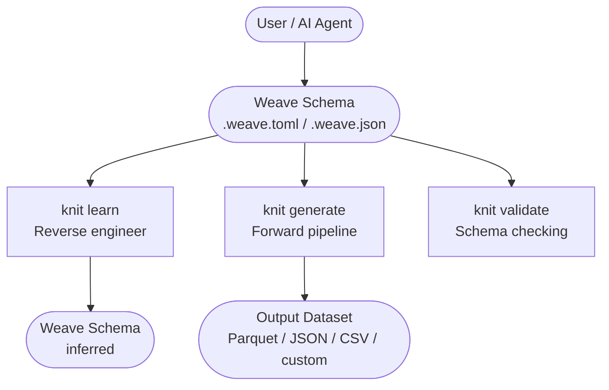
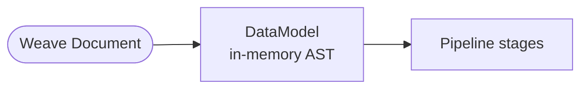
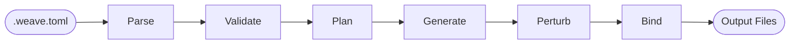
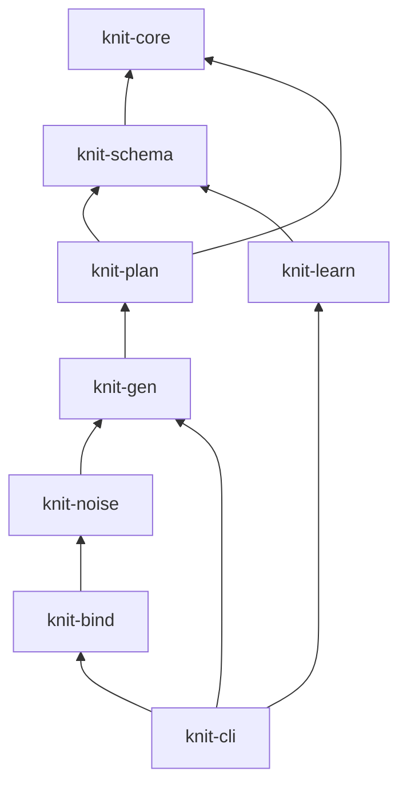
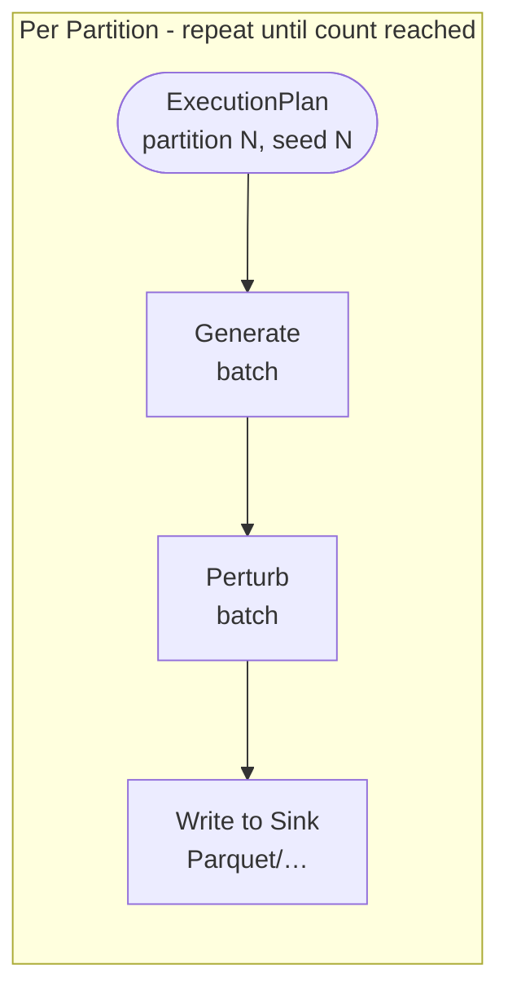
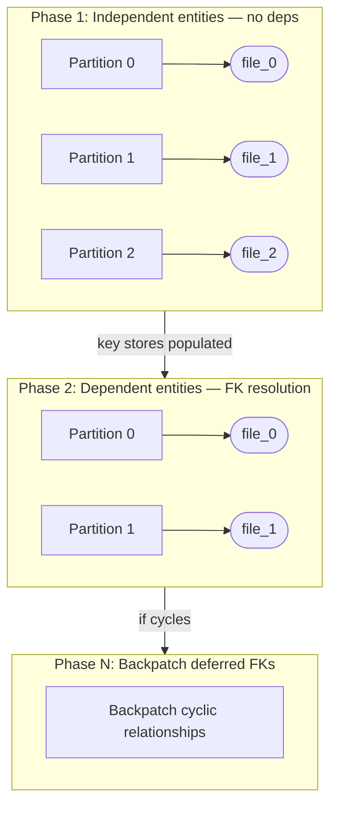
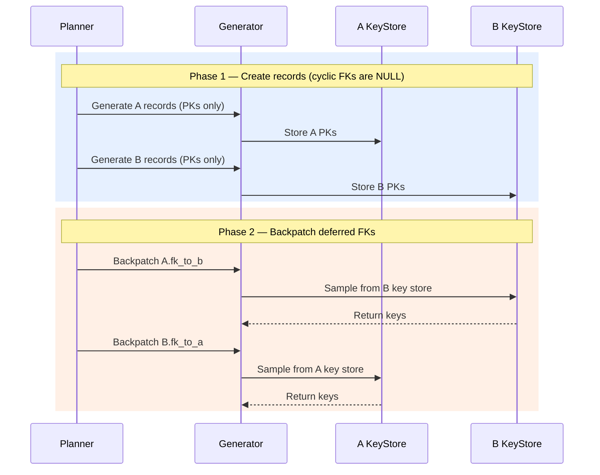
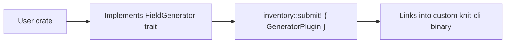

# Knit — Architecture Document

**Version:** 0.1.0
**Status:** Draft

---

## 1. Overview

Knit is a high-performance Rust toolset for generating large synthetic datasets
(100GB+ in hours). It combines a declarative schema language (**Weave**) with a
multi-stage pipeline that compiles, generates, perturbs, and serializes data.



---

## 2. The Weave Language

Weave is the declarative schema language at the center of Knit. A Weave document
describes **what** data looks like — its structure, statistical properties,
relationships, and quality characteristics — without specifying **how** to generate it.

**Specification:** [`docs/weave-spec.md`](weave-spec.md)

### Role in the Architecture



Weave serves as:
- **Input** to the forward pipeline (schema → data)
- **Output** of the reverse pipeline (data → schema)
- **Contract** between the user/AI and the engine
- **Portable artifact** that can be versioned, shared, and composed

### Key Language Capabilities

| Capability | Purpose |
|-----------|---------|
| Entities & fields | Define tables and columns with types |
| Generators | 14 generator types for value production |
| Distributions | 17+ statistical distributions with clamping |
| Temporal types | `date`, `time`, `datetime`, `datetimetz`, `duration` with timezone support |
| Relationships | Foreign keys with cardinality distributions and graph topologies |
| Correlations | Cross-field statistical dependencies (copula, conditional) |
| Time series | Trend, seasonality, AR, spikes for temporal data |
| Noise profiles | Invariant-aware perturbation specifications |
| Composition | `extends`, `includes`, `mixins`, `params` for reuse and AI-driven modification |
| Custom types | Reusable domain type bundles |

---

## 3. Pipeline Architecture

### 3.1 Forward Pipeline (Schema → Data)

The forward pipeline transforms a Weave document into output files through five stages:



| Stage | Input | Output | Crate |
|-------|-------|--------|-------|
| **Parse** | `.weave.toml` / `.weave.json` | `DataModel` (AST) | `knit-schema` |
| **Validate** | `DataModel` | Validated `DataModel` + diagnostics | `knit-schema` |
| **Plan** | Validated `DataModel` | `ExecutionPlan` | `knit-plan` |
| **Generate** | `ExecutionPlan` | `RecordBatch` stream | `knit-gen` |
| **Perturb** | `RecordBatch` stream | Perturbed `RecordBatch` stream | `knit-noise` |
| **Bind** | `RecordBatch` stream | Output files (Parquet, JSON, CSV, etc.) | `knit-bind` |

### 3.2 Reverse Pipeline (Data → Schema)

The reverse pipeline infers a Weave document from an existing dataset:


| Stage | Description | Crate |
|-------|-------------|-------|
| **Ingest** | Read CSV / Parquet / JSON via Arrow readers | `knit-learn` |
| **Infer** | Type detection, distribution fitting, FK discovery | `knit-learn` |
| **Score** | Confidence scoring for every inferred element | `knit-learn` |
| **Emit** | Output a candidate `DataModel` for human/AI review | `knit-learn` |

---

## 4. Crate Map

```
knit/
├── crates/
│   ├── knit-core/       Semantic data model types (Value, DataModel, Entity, Field, …)
│   ├── knit-schema/     Weave parser (TOML + JSON) and validator
│   ├── knit-plan/       Execution planner / compiler
│   ├── knit-gen/        Data generation engine
│   ├── knit-noise/      Perturbation pipeline
│   ├── knit-bind/       Output serialization (sinks + templates)
│   ├── knit-learn/      Schema extraction from existing data
│   └── knit-cli/        CLI binary
├── docs/                Design documents and language spec
├── examples/            Example Weave schemas
└── tests/               Integration tests
```

### Dependency Graph



`knit-core` is the only crate that every other crate depends on. It contains no
engine logic — only the shared type definitions that flow between stages.

---

## 5. Tools

Each crate corresponds to a tool with a specific role in the architecture. Dedicated
design documents will cover each tool in detail; this section provides the high-level
purpose, responsibilities, and key design points.

### 5.1 knit-core — Semantic Model

**Role:** Define the shared vocabulary for the entire toolset.

**Responsibilities:**
- `DataModel` — the in-memory representation of a parsed Weave document
- `Entity`, `Field`, `Relationship`, `Constraint` — structural types
- `GeneratorSpec`, `DistributionSpec` — generation specifications
- `Value` enum — typed value representation (used at API boundaries)
- `NullSpec`, `CountSpec` — behavioral specifications
- Temporal types: `date`, `time`, `datetime`, `datetimetz`, `duration`

**Design principle:** Narrow and stable. No engine traits, no I/O, no external
dependencies beyond `serde` and `chrono`. Changes to `knit-core` ripple across all
crates, so the bar for additions is high.

---

### 5.2 knit-schema — Parser & Validator

**Role:** Transform Weave text into a validated `DataModel`.

**Responsibilities:**
- Parse TOML and JSON into `DataModel`
- Resolve `extends` chains (single inheritance, keyed merge, flattening)
- Resolve `includes` (type/mixin library imports)
- Resolve `params` (compile-time substitution)
- Validate structural, type, referential, and semantic rules
- Report machine-readable errors with element paths and line numbers

**Key design points:**
- Schema normalization (`knit schema normalize`) — rewrite to canonical form
- Schema expansion (`knit schema expand`) — flatten inheritance
- Separate parse → resolve → validate phases for clear error reporting
- JSON Schema generation for external validation (IDE, AI pipelines)

---

### 5.3 knit-plan — Execution Planner

**Role:** Compile a validated `DataModel` into an `ExecutionPlan` that the generation
engine can execute efficiently.

**Responsibilities:**
- Build entity dependency graph from relationships (via `petgraph`)
- Topological sort for acyclic subgraph
- Identify cyclic/deferred relationships → assign two-phase generation
- Partition entities into parallel work units
- Build hierarchical deterministic RNG tree:
  `hash(global_seed, entity, field, partition)` → per-stream seed
- Determine index strategy (in-memory vs spill-to-disk) based on entity sizes
- Compile field-level generator specs into `FieldPlan` execution nodes
- Resolve derived field DAG ordering within each entity

**Key design points:**
- The plan is a **pure data structure** — no I/O, no randomness, fully deterministic
- Same `DataModel` always produces the same `ExecutionPlan`
- Plan can be inspected (`knit plan <schema>`) for debugging before generation

**Key types:**
```
ExecutionPlan
├── phases: [Phase]              # ordered generation phases
│   ├── entity_plans: [EntityPlan]
│   │   ├── partitions: [PartitionRange]
│   │   └── field_plans: [FieldPlan]
│   └── deferred_refs: [DeferredRef]   # backpatch after phase
├── rng_tree: RngTree            # deterministic seed hierarchy
└── index_strategy: IndexStrategy
```

---

### 5.4 knit-gen — Generation Engine

**Role:** Execute the plan to produce Arrow `RecordBatch` streams.

**Responsibilities:**
- Columnar generation using Arrow array builders (not row-by-row `Value`)
- Two-phase generation for cyclic relationships
- Key stores for FK resolution (in-memory + spill-to-disk)
- Statistical distribution sampling (17+ distributions)
- Faker-style structured data generation
- Derived field evaluation (expression interpreter)
- Conditional and composite generators
- Time series generation (trend, seasonality, AR, event streams)
- Graph topology generation (Barabási–Albert, Watts–Strogatz, etc.)
- Correlation enforcement (copula-based joint distributions)
- Parallel partition execution via `rayon`

**Key design points:**
- `FieldGenerator` trait — each generator type implements this to produce `ArrayRef`
- `KeyStore` trait — abstracts PK index for FK resolution (memory or disk-backed)
- 64K rows per batch (tuned to stay in CPU cache for numeric columns)
- Each partition gets its own deterministic RNG stream → reproducible in any thread order
- Streaming: batches are handed to noise/bind immediately, never buffered in full

---

### 5.5 knit-noise — Perturbation Pipeline

**Role:** Inject controlled imperfections into generated data.

**Responsibilities:**
- Three-stage invariant-aware pipeline: **clean → constrained → breaking**
- `Perturbator` trait — each noise type implements this
- Per-field or scoped (conditional) noise application
- Built-in perturbators: null injection, Gaussian noise, typos, outliers,
  duplicates, FK violations, temporal spikes
- Noise operates on `RecordBatch` in-place for efficiency

**Key design points:**
- Perturbators declare what invariants they break (`InvariantSet`)
- Clean stage preserves all constraints; breaking stage intentionally violates them
- Users control which stages run — clean-only for test data, full pipeline for
  robustness testing
- Scoped noise: apply only to records matching a predicate

---

### 5.6 knit-bind — Output Serialization

**Role:** Write `RecordBatch` streams to output files.

**Responsibilities:**
- **Sinks** (columnar, dataset-oriented):
  - Parquet — zero-copy from `RecordBatch`, configurable compression (zstd, lz4, snappy)
  - JSON / JSONL — streaming, one object per line or array-of-objects
  - CSV — streaming rows
  - Arrow IPC — for inter-process analytics pipelines
- **Templates** (row-oriented, custom formats):
  - MiniJinja integration for user-defined templates
  - SQL INSERT statements, XML, log lines, etc.

**Key design points:**
- `Sink` trait — unified interface for all output formats
- Each partition writes to its own file (no write contention)
- Parquet: row groups align with generation batches for streaming writes
- Template rendering converts `RecordBatch` → row iterator → template context

---

### 5.7 knit-learn — Schema Extraction

**Role:** Reverse-engineer a Weave schema from an existing dataset.

**Responsibilities:**
- Ingest existing data via Arrow readers (CSV, Parquet, JSON)
- Infer column types from samples
- Fit candidate statistical distributions per column (KS-test / AIC scoring)
- Detect FK relationships via value overlap + cardinality analysis
- Detect self-referential patterns
- Score every inferred element with a confidence value
- Emit a candidate `DataModel` with review annotations

**Key design points:**
- Statistical approach only (no heavy ML dependencies in v1)
- Output is a **candidate** — confidence scores indicate certainty
- Candidate relationships are marked for human/AI review
- Reproducible: same input data → same inferred schema

---

### 5.8 knit-cli — Command-Line Interface

**Role:** User-facing binary that orchestrates all tools.

**Commands:**

| Command | Tools Used | Description |
|---------|-----------|-------------|
| `knit init` | schema | Create a starter Weave schema (interactive) |
| `knit validate <schema>` | schema | Parse and validate, report errors |
| `knit plan <schema>` | schema, plan | Show execution plan (dry run) |
| `knit generate <schema> -o <dir>` | schema, plan, gen, noise, bind | Full forward pipeline |
| `knit learn <data> -o <schema>` | learn | Reverse pipeline |
| `knit schema expand <file>` | schema | Flatten `extends` chain |
| `knit schema normalize <file>` | schema | Reformat to canonical style |

**Key flags:**

| Flag | Description |
|------|-------------|
| `--seed <N>` | Override global RNG seed |
| `--format parquet\|json\|csv` | Output format (default: parquet) |
| `--compression zstd\|lz4\|snappy\|none` | Parquet compression |
| `--parallel <N>` | Thread count (default: num_cpus) |
| `--batch-size <N>` | Rows per batch (default: 65536) |
| `--param key=value` | Override schema parameters |
| `--dry-run` | Show plan without generating |

**Key design points:**
- Built with `clap` for argument parsing
- Progress bars via `indicatif`
- Structured error output (human-readable + JSON for CI)
- Exit codes: 0 = success, 1 = validation error, 2 = generation error

---

## 6. Data Flow

### 6.1 Batch Lifecycle

A single batch flows through the pipeline without full-dataset buffering:



### 6.2 Parallel Execution

Partitions run concurrently across a `rayon` thread pool. Each partition is independent:



### 6.3 Two-Phase Generation (Cyclic Relationships)

When the dependency graph contains cycles (e.g., A references B, B references A):



The planner detects cycles automatically. Cyclic FK fields must be nullable.

---

## 7. Performance Architecture

**Target:** 100GB+ Parquet output in 1–3 hours on 8+ core, 32GB RAM hardware.

### Design Decisions for Performance

| Decision | Rationale |
|----------|-----------|
| Columnar generation (Arrow) | Avoid per-cell `Value` boxing; vectorized operations |
| 64K-row batches | Fit in L2 cache for numeric columns |
| Rayon parallelism | Partition-level concurrency with work stealing |
| Per-partition output files | No write contention between threads |
| Streaming pipeline | Generate → perturb → write; one batch in flight per partition |
| Deterministic hierarchical RNG | Reproducible regardless of thread scheduling |
| Tiered key stores | In-memory for < 10M keys; memory-mapped for larger |
| Zero-copy Parquet writes | RecordBatch → ParquetWriter without serialization |

### Bottleneck Mitigation

| Bottleneck | Mitigation |
|-----------|------------|
| Parquet compression CPU | `zstd` level 1 or `lz4` for throughput |
| String allocation | Arrow `StringBuilder` with pre-allocated capacity |
| FK lookup contention | Read-only key store views per partition |
| Memory pressure | Streaming; only 1 batch in flight per partition |
| Disk I/O | Parallel writes to separate files on NVMe |

---

## 8. Extension Architecture

### 8.1 v1: Compile-Time Registry

Custom generators, distributions, and perturbators are registered via the `inventory`
crate at compile time:



### 8.2 Future: WASM Plugins

Dynamic extension without recompilation. WASM modules implement a stable ABI and are
loaded at runtime from a plugin directory.

---

## 9. Design Documents Index

| Document | Path | Status |
|----------|------|--------|
| Weave Language Specification | [`docs/weave-spec.md`](weave-spec.md) | Draft |
| Architecture (this document) | [`docs/architecture.md`](architecture.md) | Draft |
| knit-core Design | [`docs/design-core.md`](design-core.md) | Draft |
| knit-schema Design | [`docs/design-schema.md`](design-schema.md) | Draft |
| knit-plan Design | [`docs/design-plan.md`](design-plan.md) | Draft |
| knit-gen Design | [`docs/design-gen.md`](design-gen.md) | Draft |
| knit-noise Design | [`docs/design-noise.md`](design-noise.md) | Draft |
| knit-bind Design | [`docs/design-bind.md`](design-bind.md) | Draft |
| knit-learn Design | [`docs/design-learn.md`](design-learn.md) | Draft |
| knit-cli Design | [`docs/design-cli.md`](design-cli.md) | Draft |
| Development Plan | [`docs/dev-plan.md`](dev-plan.md) | Draft |
