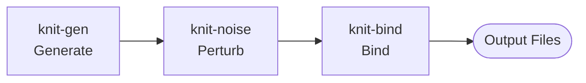
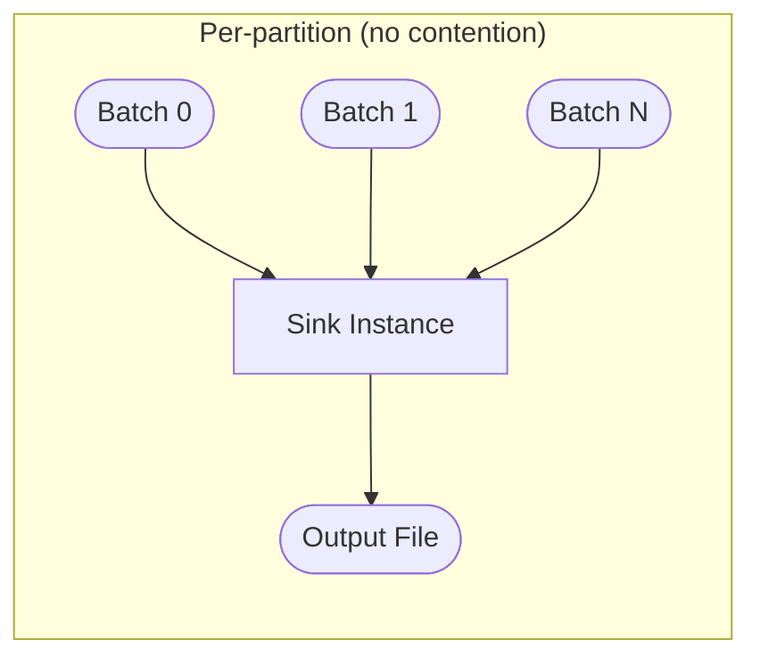
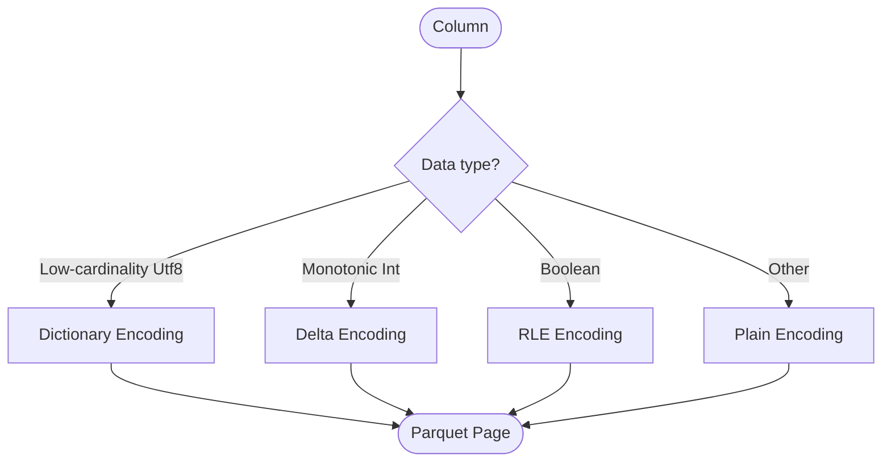
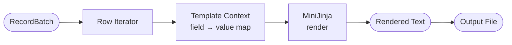
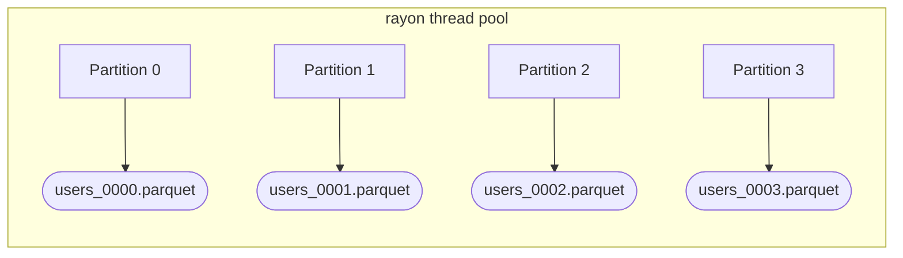

# knit-bind — Design Document

**Version:** 0.1.0
**Status:** Draft
**Crate:** `knit-bind`

---

## 1. Overview

`knit-bind` is the **final stage** of the forward pipeline. It receives a stream of
Arrow `RecordBatch` values — one batch at a time, per partition — and writes them to
output files on disk.



The crate supports two complementary output modes:

| Mode | Orientation | Use Case | Throughput |
|------|-------------|----------|------------|
| **Sink** | Columnar | Parquet, JSON, CSV, Arrow IPC, Avro — structured dataset files | High (zero-copy where possible) |
| **Template** | Row-oriented | SQL INSERTs, XML, log lines, custom delimited — any text format | Moderate (per-row rendering) |

Sinks operate on entire `RecordBatch` values and are designed for maximum throughput.
Templates iterate over rows, expand a MiniJinja template per row, and write the rendered
text — trading throughput for complete format flexibility.

---

## 2. Dependencies

| Dependency | Purpose |
|------------|---------|
| `knit-core` | `DataModel`, `Entity`, `Field`, `Value` — shared type vocabulary |
| `arrow` | `RecordBatch`, `ArrayRef`, `Schema` — columnar data representation |
| `parquet` | `ArrowWriter`, compression codecs — Parquet file writing |
| `apache-avro` | Avro OCF writing with Null/Deflate/Snappy codecs |
| `serde_json` | JSON serialization for `JsonSink` |
| `csv` | CSV writing for `CsvSink` |
| `minijinja` | Template engine for row-oriented custom formats |

All I/O is performed through Rust's `std::io::Write` / `std::fs::File`. No async
runtime is required — the pipeline is synchronous and CPU-bound (I/O is buffered via
`BufWriter`).

---

## 3. Sink Trait

Every output format implements a common trait:

```rust
/// A streaming consumer of RecordBatch values that writes to an output file.
trait Sink: Send {
    /// Write a single batch. Called once per generation batch, in order.
    fn write_batch(&mut self, batch: &RecordBatch) -> Result<()>;

    /// Flush remaining buffers, close the file, and return statistics.
    fn finish(self) -> Result<SinkStats>;
}

/// Summary statistics returned when a sink is finalized.
struct SinkStats {
    rows_written: u64,
    bytes_written: u64,
    files_created: u32,
}
```

### Design Rules

- **One sink per partition.** The pipeline creates a separate `Sink` instance for each
  partition of each entity. Sinks are never shared across threads, so no interior
  locking is needed. The `Send` bound allows the owning thread to be chosen by `rayon`.

- **Streaming, not buffered.** Each call to `write_batch` processes and flushes one
  batch. At most one batch is in memory per partition at any time. This bounds memory
  usage regardless of dataset size.

- **Infallible ordering.** Batches arrive in partition-local order (batch 0, 1, 2, …).
  Sinks may rely on this for header-writing, row-group alignment, and JSON array
  delimiters.



---

## 4. Built-in Sinks

### 4.1 ParquetSink

Writes Arrow `RecordBatch` values to Parquet files via the `arrow-rs` `ArrowWriter`.

**Zero-copy path.** `ArrowWriter::write` accepts `&RecordBatch` directly — no
intermediate serialization step. Column data in Arrow buffers is encoded into Parquet
pages without copying the underlying byte buffers for fixed-width types.

**Configuration:**

| Option | Values | Default |
|--------|--------|---------|
| Compression | `zstd` (level 1–22), `lz4`, `snappy`, `none` | `zstd(1)` |
| Row group size | Align with batch size, or custom row count | 1 batch = 1 row group |
| Dictionary encoding | Auto for low-cardinality strings (≤ 10K distinct) | Enabled |
| Delta encoding | Auto for monotonic integer sequences | Enabled |
| Statistics | Min/max/null-count per column per row group | Enabled |

**Row group alignment.** Each `write_batch` call produces exactly one Parquet row group.
This means row group boundaries correspond 1:1 with generation batches (default 64K
rows). The caller can override this to accumulate multiple batches into a single row
group if larger groups are desired.

**Column encoding selection:**



**Metadata.** The finished Parquet file includes:
- Arrow schema (preserved via key-value metadata)
- Per-row-group statistics (min, max, null count, distinct count)
- Total row count
- Knit version string (`knit.version` metadata key)

---

### 4.2 JsonSink

Writes records as JSON. Supports two modes:

| Mode | Format | Streaming? |
|------|--------|------------|
| **JSONL** | One JSON object per line, no wrapper | Yes — each line is independent |
| **JSON Array** | `[{…}, {…}, …]` with commas and outer brackets | Yes — bracket written on open/close |

**JSONL mode** (default). Each row in a `RecordBatch` is serialized as a single-line
JSON object and written immediately followed by `\n`. No separator management is needed.

**JSON Array mode.** `[` is written when the sink opens. Each row is written as an
object preceded by `,` (except the first). `]` is written in `finish()`.

**Configuration:**

| Option | Values | Default |
|--------|--------|---------|
| Mode | `jsonl`, `array` | `jsonl` |
| Pretty print | `true` / `false` | `false` |
| Null handling | `omit` (skip null fields) / `explicit` (write `null`) | `explicit` |

---

### 4.3 CsvSink

Writes records as CSV (RFC 4180 with extensions).

**Structure.** The header row is written when the sink is created. Each `write_batch`
call appends data rows in streaming fashion.

**Configuration:**

| Option | Values | Default |
|--------|--------|---------|
| Delimiter | Any single byte (`','`, `'\t'`, `'|'`, …) | `,` |
| Quoting | `always`, `necessary`, `never` | `necessary` |
| Null representation | Any string (`""`, `"NULL"`, `"\\N"`, …) | `""` (empty) |
| Date/time format | `strftime`-compatible format string | ISO 8601 |
| Line terminator | `\n` or `\r\n` | `\n` |

---

### 4.4 ArrowIpcSink

Writes `RecordBatch` values in Arrow IPC format for downstream analytics tools that
consume Arrow natively.

| Mode | Description |
|------|-------------|
| **File** | IPC file format (magic bytes + footer). Self-contained, seekable. |
| **Stream** | IPC streaming format. Schema message followed by batch messages. |

**Use case.** Arrow IPC is the preferred output when the consumer is another Arrow-based
tool (DuckDB, Polars, DataFusion). It preserves the exact Arrow schema and avoids any
serialization overhead.

### 4.5 AvroSink

Writes `RecordBatch` values in Apache Avro Object Container Format (OCF). Each Arrow
schema is converted to an Avro record schema at construction time, using the entity
name as the top-level record name.

| Codec | Description |
|-------|-------------|
| **Null** | No compression (default). |
| **Deflate** | Deflate compression for balanced size/speed. |
| **Snappy** | Snappy compression for maximum throughput. |

**Row-by-row conversion.** Each batch is iterated row by row, converting Arrow column
values to `apache_avro::types::Value` records. Nullable Arrow columns map to Avro
union types `["null", type]`.

**Type mapping.** Arrow numeric types map to Avro `int`/`long`/`float`/`double`.
Timestamps are converted to milliseconds (Avro `long`). Lists become Avro arrays.
Binary data maps to Avro `bytes`. Unsupported complex types fall back to string
representation.

**Use case.** Avro is the standard format for Kafka-based data pipelines and Schema
Registry integration. Use `--format avro` when the downstream consumer expects Avro
(Kafka Connect, Confluent Platform, Apache Spark).

---

## 5. Template Engine

Templates provide row-oriented output for formats that have no columnar representation
— SQL INSERT statements, XML documents, log lines, custom delimited text, etc.

### 5.1 MiniJinja Integration

The template engine is built on [MiniJinja](https://github.com/mitsuhiko/minijinja), a
minimal Jinja2-compatible template engine for Rust.

**Why MiniJinja?** See [§10 Design Decisions](#10-design-decisions).

### 5.2 Template Rendering Pipeline



1. **Row iterator.** The `RecordBatch` (columnar) is iterated row-by-row. Each row
   produces a `HashMap<&str, Value>` mapping field names to typed values.

2. **Template context.** The row map is injected into MiniJinja as the template context.
   Additional context variables are available:
   - `_row_index` — zero-based index within the batch
   - `_partition` — partition number
   - `_entity` — entity name
   - `_batch_index` — batch sequence number

3. **Rendering.** MiniJinja expands the template string once per row. The rendered text
   is written to the output file.

### 5.3 Built-in Template Helpers

| Helper | Signature | Description |
|--------|-----------|-------------|
| `format_date` | `format_date(value, fmt)` | Format a date/datetime using `strftime` syntax |
| `format_number` | `format_number(value, decimals)` | Format a number with fixed decimal places |
| `escape_sql` | `escape_sql(value)` | Escape single quotes for SQL string literals |
| `escape_xml` | `escape_xml(value)` | Escape `<`, `>`, `&`, `"`, `'` for XML content |
| `json_encode` | `json_encode(value)` | Serialize a value as a JSON literal |

### 5.4 Template Examples

**SQL INSERT statements:**

```jinja
INSERT INTO {{ _entity }} (id, name, email, created_at)
VALUES ({{ id }}, '{{ name | escape_sql }}', '{{ email | escape_sql }}', '{{ created_at | format_date("%Y-%m-%d %H:%M:%S") }}');
```

**XML documents:**

```jinja
<record>
  <id>{{ id }}</id>
  <name>{{ name | escape_xml }}</name>
  <amount>{{ amount | format_number(2) }}</amount>
</record>
```

**Log lines (Common Log Format):**

```jinja
{{ ip }} - {{ user }} [{{ timestamp | format_date("%d/%b/%Y:%H:%M:%S %z") }}] "{{ method }} {{ path }} HTTP/1.1" {{ status }} {{ bytes }}
```

**Custom pipe-delimited:**

```jinja
{{ id }}|{{ name }}|{{ category }}|{{ price | format_number(2) }}
```

### 5.5 Performance

- **Template compilation is cached.** The template string is compiled once into a
  MiniJinja `Template` object. All rows share the same compiled template — only
  rendering is per-row.

- **Row iteration from columns.** Values are read directly from Arrow arrays by index.
  No intermediate `Vec<Row>` is allocated. Each row's context map is reused across
  iterations (cleared and refilled).

- **Batch granularity.** Template rendering is still called once per `write_batch`. The
  row loop is internal to the template sink, maintaining the same streaming contract as
  columnar sinks.

---

## 6. Output File Management

### 6.1 File Naming

Output files follow a deterministic naming convention:

```
{output_dir}/{entity}_{partition:04d}.{ext}
```

Examples:
```
output/users_0000.parquet
output/users_0001.parquet
output/orders_0000.jsonl
output/orders_0001.jsonl
output/events_0000.csv
```

### 6.2 Output Directory Structure

```
{output_dir}/
├── users_0000.parquet
├── users_0001.parquet
├── users_0002.parquet
├── orders_0000.parquet
├── orders_0001.parquet
├── line_items_0000.parquet
├── line_items_0001.parquet
└── _manifest.json
```

All output files are written to a single flat directory. Entity name and partition index
are encoded in the filename. Subdirectories per entity are not used — this simplifies
glob patterns (`output/*.parquet`) and avoids nested path issues.

### 6.3 File Rotation

File rotation is optional and splits a partition's output across multiple files when a
size or row threshold is reached.

| Trigger | Config Key | Example |
|---------|------------|---------|
| Row count | `max_rows_per_file` | `10_000_000` |
| Byte size | `max_bytes_per_file` | `1_073_741_824` (1 GiB) |

When rotation triggers, the current file is finalized via `finish()` and a new sink is
opened. The file index is appended to the name:

```
users_0000_00.parquet
users_0000_01.parquet
users_0000_02.parquet
```

### 6.4 Manifest File

After all sinks are finalized, `knit-bind` writes a `_manifest.json` file summarizing
the output:

```json
{
  "version": "0.1.0",
  "entities": [
    {
      "name": "users",
      "files": [
        {
          "path": "users_0000.parquet",
          "rows": 500000,
          "bytes": 12345678,
          "checksum": "sha256:abcdef..."
        }
      ],
      "total_rows": 1000000
    }
  ]
}
```

The manifest enables downstream tools to verify completeness, discover files, and
validate checksums without scanning the directory.

---

## 7. Type Mapping

Arrow types are mapped to each output format's native representation:

### 7.1 Core Type Mapping

| Arrow Type | Parquet | JSON | CSV |
|------------|---------|------|-----|
| `Int8`/`Int16`/`Int32`/`Int64` | `INT32`/`INT64` | Number | Unquoted string |
| `UInt8`/`UInt16`/`UInt32`/`UInt64` | `INT32`/`INT64` (unsigned) | Number | Unquoted string |
| `Float32`/`Float64` | `FLOAT`/`DOUBLE` | Number | Unquoted string |
| `Boolean` | `BOOLEAN` | `true`/`false` | `true`/`false` |
| `Utf8`/`LargeUtf8` | `BYTE_ARRAY` (UTF8) | String | Quoted string |
| `Binary`/`LargeBinary` | `BYTE_ARRAY` | Base64 string | Base64 string |

### 7.2 Temporal Type Mapping

| Arrow Type | Parquet | JSON | CSV |
|------------|---------|------|-----|
| `Date32` | `INT32` (DATE) | `"2024-01-15"` | `2024-01-15` |
| `Time64` | `INT64` (TIME_MICROS) | `"14:30:00"` | `14:30:00` |
| `Timestamp` (no tz) | `INT64` (TIMESTAMP_MICROS) | `"2024-01-15T14:30:00"` | `2024-01-15T14:30:00` |
| `Timestamp` (with tz) | `INT64` (TIMESTAMP_MICROS, UTC-adjusted) | `"2024-01-15T14:30:00Z"` | `2024-01-15T14:30:00Z` |
| `Duration` | `INT64` (INTERVAL) | `"PT1H30M"` (ISO 8601 duration) | `PT1H30M` |

### 7.3 Special Types

| Type | Storage | Parquet | JSON | CSV |
|------|---------|---------|------|-----|
| UUID | `FixedSizeBinary(16)` or `Utf8` | `FIXED_LEN_BYTE_ARRAY(16)` or `BYTE_ARRAY` | `"550e8400-..."` | `550e8400-...` |
| Decimal | `Decimal128` | `FIXED_LEN_BYTE_ARRAY` (DECIMAL) | Number | Unquoted string |

### 7.4 Null Handling

| Format | Null Representation |
|--------|---------------------|
| Parquet | Native definition level (zero storage cost) |
| JSON (explicit) | `"field": null` |
| JSON (omit) | Field omitted from object |
| CSV | Configurable null string (default: empty) |
| Arrow IPC | Native validity bitmap |
| Template | `""` (empty string) or configurable via `default` filter |

---

## 8. Performance

### 8.1 Zero-Copy Parquet Writes

The `arrow-rs` `ArrowWriter` accepts `&RecordBatch` directly. For fixed-width types
(integers, floats, timestamps), the Arrow buffer contents are encoded into Parquet pages
without an intermediate copy. Variable-length types (strings, binary) require encoding
but no data duplication.

### 8.2 Streaming Memory Model

At any point in time, each partition holds at most:
- **1 RecordBatch** (being written by the sink)
- **1 output buffer** (BufWriter, typically 64 KiB)

For a 64K-row batch of 20 numeric columns, this is approximately 10 MiB per partition.
With 8 partitions, total bind-stage memory is ~80 MiB — negligible compared to the
generation stage.

### 8.3 Parallel Writes

Each partition writes to a separate file. On NVMe storage, this enables full I/O
parallelism — the OS can issue concurrent writes to different files without contention.



### 8.4 Compression Throughput

| Codec | Ratio (typical) | Encode Speed | Recommended Use |
|-------|-----------------|--------------|-----------------|
| `zstd(1)` | 3–5× | ~400 MB/s | Default — best speed/ratio trade-off |
| `zstd(3)` | 4–6× | ~200 MB/s | Archival or network-constrained output |
| `zstd(22)` | 5–8× | ~10 MB/s | Maximum compression (rarely needed) |
| `lz4` | 2–3× | ~800 MB/s | Maximum throughput, compression secondary |
| `snappy` | 2–3× | ~500 MB/s | Compatibility with legacy Spark/Hadoop |
| `none` | 1× | Wire speed | Debugging or when downstream re-compresses |

### 8.5 String-Heavy Workload Mitigations

String-heavy datasets (e.g., faker-generated names, emails, addresses) are the slowest
path because every value requires variable-length encoding.

Mitigations:
- **Dictionary encoding** for low-cardinality string columns. Parquet stores the
  dictionary once per row group and writes integer indices per row — dramatically
  reducing I/O for columns like `country`, `status`, `category`.
- **Large BufWriter** (256 KiB) for JSON and CSV sinks to amortize syscall overhead when
  writing many small strings.
- **Pre-sized output buffers** in template rendering — the rendered line length is
  estimated from the first batch and used to pre-allocate the `String` buffer.

---

## 9. Testing Strategy

### 9.1 Round-Trip Tests

Write a `RecordBatch` through a sink, read it back with the corresponding Arrow reader,
and compare:

```
RecordBatch → ParquetSink → .parquet → ParquetReader → RecordBatch (compare)
RecordBatch → JsonSink    → .jsonl   → JsonReader    → RecordBatch (compare)
RecordBatch → CsvSink     → .csv     → CsvReader     → RecordBatch (compare)
RecordBatch → IpcSink     → .arrow   → IpcReader     → RecordBatch (compare)
```

Round-trip tests cover every Arrow type in the type mapping table (§7). Null values,
empty strings, and boundary values (e.g., `i64::MAX`) are explicitly tested.

### 9.2 Format Correctness Tests

- **Parquet:** Validate file metadata (row counts, column statistics, schema) using
  `parquet-rs` inspection APIs.
- **JSON:** Parse output with `serde_json` and verify structure (JSONL: one object per
  line; array: valid JSON array).
- **CSV:** Parse output with the `csv` crate reader and verify header, quoting, and
  delimiter behavior.
- **Arrow IPC:** Validate schema preservation and batch count.

### 9.3 Compression Ratio Benchmarks

Benchmark tests (gated behind `#[cfg(feature = "bench")]`) measure compression ratio and
encoding throughput for each codec on representative workloads:
- All-integer batch (best case for Parquet)
- All-string batch (worst case)
- Mixed types (typical)

### 9.4 Template Output Golden Tests

Template rendering is tested against golden files:
1. Define a `RecordBatch` with known values.
2. Render through each example template (SQL, XML, log, delimited).
3. Compare output byte-for-byte against checked-in `.expected` files.
4. `cargo test` fails if output drifts from golden files; update with `UPDATE_GOLDEN=1`.

---

## 10. Design Decisions

| Decision | Choice | Alternatives Considered | Rationale |
|----------|--------|------------------------|-----------|
| Sink trait vs `Write` trait | Custom `Sink` trait | `std::io::Write` | `Write` operates on raw bytes and has no concept of batches, statistics, or finalization. `Sink` provides batch-level semantics, enables format-specific optimizations (e.g., Parquet row groups), and returns `SinkStats` on close. |
| Per-partition files | One file per partition per entity | Single file per entity | Eliminates write contention. Enables parallel I/O on NVMe. Matches Parquet/Hive partitioning conventions. Downstream tools (Spark, DuckDB) handle multi-file datasets natively. |
| MiniJinja over Tera | MiniJinja | Tera, Handlebars, Askama | MiniJinja is the smallest dependency (~50 KiB), has zero `unsafe`, compiles fastest, and supports the Jinja2 syntax that LLMs generate most reliably. Tera pulls in `regex` and `lazy_static`; Handlebars has a larger runtime; Askama requires compile-time templates (incompatible with user-defined templates at runtime). |
| Template helpers as filters | MiniJinja filters | Standalone functions | Jinja2 convention is `{{ value \| filter }}`. Filters compose naturally (`{{ ts \| format_date("%Y") \| escape_xml }}`), and MiniJinja's filter registration API is zero-cost. |
| Flat output directory | Single directory, encoded names | Nested `entity/partition/` dirs | Simpler glob patterns. Avoids cross-platform path separator issues. One `ls` or `Get-ChildItem` shows all output. |
| Manifest file | `_manifest.json` | Separate metadata DB, no manifest | JSON is human-readable, machine-parseable, and requires no extra dependency. The `_` prefix sorts it before data files. A database would add complexity; no manifest would force directory scanning. |
| Row group = batch | 1:1 alignment | Accumulate multiple batches | Simplifies streaming — each `write_batch` is self-contained. Parquet row group overhead is negligible at 64K rows. Avoids buffering multiple batches in memory. |
| Default compression | `zstd(1)` | `snappy`, `lz4`, `none` | `zstd(1)` offers the best ratio at high speed. It is the modern default in the Parquet ecosystem (Arrow-rs, DuckDB, Polars all default to zstd). |
