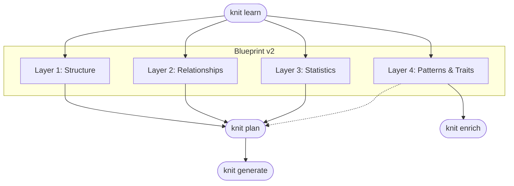
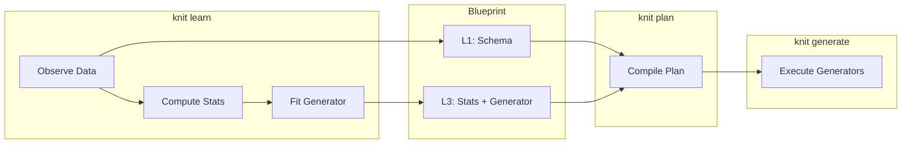
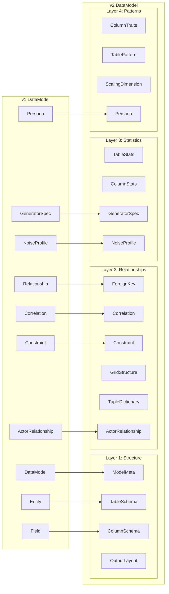
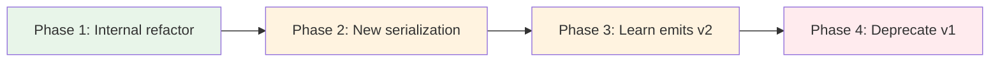
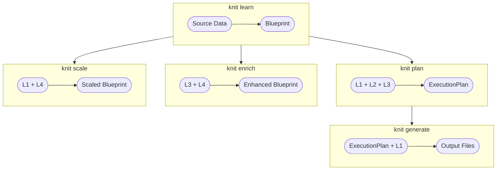

# Blueprint v2 — Layered Architecture Design

**Version:** 0.1.0 (draft)
**Status:** Proposal

---

## Table of Contents

1. [Motivation](#1-motivation)
2. [Design Principles](#2-design-principles)
3. [The Four Layers](#3-the-four-layers)
4. [Layer 1: Structure](#4-layer-1-structure)
5. [Layer 2: Relationships & Correlations](#5-layer-2-relationships--correlations)
6. [Layer 3: Statistics](#6-layer-3-statistics)
7. [Layer 4: Patterns & Traits](#7-layer-4-patterns--traits)
8. [Cross-Cutting: Generators](#8-cross-cutting-generators)
9. [TOML Serialization Format](#9-toml-serialization-format)
10. [Type System Mapping](#10-type-system-mapping)
11. [Migration Path (v1 → v2)](#11-migration-path-v1--v2)
12. [Implementation Plan](#12-implementation-plan)

---

## 1. Motivation

### Current Problems

The v1 `DataModel` struct in `types.rs` grew organically. A single `Entity`
struct mixes structural schema (name, type, nullable), statistical observations
(min/max, percentiles), behavioral traits (trend, cardinality), and generation
logic (generator spec) into one flat list of fields. This creates several
problems:

| Problem | Impact |
|---------|--------|
| **Mixed concerns in `Field`** | A single struct holds schema, statistics, traits, and generator — hard to reason about each independently |
| **Unclear ownership** | `Constraint` lives on `Entity`, but `Correlation` lives on `DataModel` — where should new cross-column rules go? |
| **Difficult extensibility** | Adding a new trait (e.g., `seasonality`) requires touching the `Field` struct, all constructors, all serializers |
| **Learn/generate coupling** | Learn writes `stats` + `traits` + `generator` onto the same `Field`, making it hard to evolve learn independently |
| **No separation of observed vs. prescribed** | Stats (observed from data) and generators (prescribed for generation) share the same namespace with no clear boundary |
| **Flat model scales poorly** | The `DataModel` root has 12 top-level Vec fields with no grouping or hierarchy |

### Goals for v2

1. **Clear layer separation** — each concern in its own conceptual layer
2. **Easy extensibility** — adding new traits, statistics, or patterns doesn't
   touch structural types
3. **Data-driven pipeline** — learn populates layers 1–4, plan reads them,
   generate executes; each layer has a clear role in the pipeline
4. **Backward compatible** — v1 blueprints continue to work via auto-migration
5. **Human readable** — the TOML format should be intuitive for a data engineer
   who has never seen knit before

---

## 2. Design Principles

1. **Observed vs. Prescribed**: Statistics (layer 3) are *observed* facts about
   source data. Generators are *prescribed* instructions for producing data.
   Both live in the statistics layer, but are clearly separated as `stats` vs.
   `generator` subsections.

2. **Layers are additive**: A minimal blueprint needs only layer 1 (structure).
   Layers 2–4 add progressively richer information. A blueprint with just
   structure is valid — knit will use default generators.

3. **No hardcoded domain knowledge**: The blueprint encodes what learn extracted,
   never things like "Seattle is a city." Dictionaries, value lists, and
   patterns all come from data.

4. **Single source of truth**: Each fact appears in exactly one layer. Sort
   order is structural (layer 1). Distribution parameters are statistical
   (layer 3). Trends are traits (layer 4).

5. **Composability**: Layers can be composed from multiple files (the structured
   model directory) or merged into a single file. The in-memory representation
   is the same either way.

---

## 3. The Four Layers



| Layer | Concerns | Populated By | Consumed By |
|-------|----------|-------------|-------------|
| **1. Structure** | Schema, types, files, folders, partitions, column order, sort order, row count | `knit learn` | `knit plan`, `knit generate`, `knit scale` |
| **2. Relationships** | FK, associations, correlations, constraints, dictionaries, copulas | `knit learn` | `knit plan`, `knit generate` |
| **3. Statistics** | Distributions, cardinality, min/max/mean, percentiles, generators | `knit learn` | `knit plan`, `knit generate` |
| **4. Patterns & Traits** | Semantic types, PII, trends, seasonality, clusters, human behavior | `knit learn`, `knit enrich` | `knit enrich`, `knit scale`, future ML |

---

## 4. Layer 1: Structure

### What it owns

Everything about the *shape* of the data — what exists, what type it is, and
how it's physically organized. This is the information a schema definition
language (DDL) would express.

### Contents

```
Structure
├── Model identity (name, description, seed, locale, timezone)
├── Tables[]
│   ├── name, description, tags
│   ├── count (how many rows)
│   ├── sort_by (detected output ordering)
│   ├── output (folder path, format, partitioning)
│   └── Columns[]
│       ├── name, description
│       ├── data_type (string, int64, float64, date, etc.)
│       ├── nullable (null specification)
│       ├── primary_key
│       ├── precision (decimal places)
│       └── nested fields (for object/struct types)
├── Layout (column ordering, companion files)
├── Custom types (reusable type + constraint bundles)
└── Mixins (reusable field groups)
```

### Design decisions

- **Sort order is structural**, not statistical. It describes how the output
  should be ordered, which is a physical property of the file.
- **Row count is structural**. It's "how many rows to produce," which is a
  schema-level decision. The *observed* row count from source data goes in
  `table.stats` (layer 3).
- **Partitioning is structural**. Partition columns, values, and row
  distribution define physical file layout.
- **`NullSpec` stays on the column** because nullability is part of the schema
  contract. The *observed* null rate goes in `column.stats` (layer 3).

### TOML example

```toml
# Layer 1: Structure
[model]
name = "ecommerce"
seed = 42
locale = "en_US"

[[tables]]
name = "orders"
count = 10000

[tables.sort_by]
column = "created_at"
direction = "asc"

[[tables.columns]]
name = "order_id"
type = "int64"
nullable = false
primary_key = true

[[tables.columns]]
name = "customer_id"
type = "int64"
nullable = false

[[tables.columns]]
name = "total"
type = "float64"
nullable = false
precision = 2

[[tables.columns]]
name = "created_at"
type = "datetime"
nullable = false

[[tables.columns]]
name = "status"
type = "string"
nullable = false
```

---

## 5. Layer 2: Relationships & Correlations

### What it owns

Everything about how columns and tables *relate* to each other. This is the
information that constraint languages (FK, CHECK, UNIQUE) and correlation
specifications express.

### Contents

```
Relationships
├── Foreign keys[]
│   ├── from (table.column)
│   ├── to (table.column)
│   ├── kind (one_to_one, many_to_one, many_to_many)
│   ├── cardinality bounds
│   └── selection strategy
├── Correlations[]
│   ├── Matrix correlations (Pearson/Spearman)
│   ├── Copula specifications
│   └── Conditional distributions (per-category stats)
├── Constraints[]
│   ├── Unique (composite key)
│   ├── Check (cross-column boolean expressions)
│   ├── Range (value bounds — observed min/max)
│   └── NotNull
├── Grid structures[]
│   ├── outer_column, inner_column
│   ├── expected cross-product values
│   └── completeness ratio
├── Tuple dictionaries[]
│   ├── columns involved
│   └── dictionary file path
├── Actor relationships[]
│   ├── graph type (scale-free, small-world, etc.)
│   └── edge properties
└── Personas[]
    ├── name, weight
    └── trait overrides
```

### Design decisions

- **Constraints move from `Entity` to Relationships layer**. Constraints are
  fundamentally about *relationships* between values — `A >= B`, `field IN
  range`, `fields UNIQUE together`. They belong with other relational concerns.
- **Correlations stay at model level** (not entity level) because they can
  reference cross-table relationships.
- **Conditional distributions are correlations**, not generators. They express
  "given column A = X, column B follows distribution D" — a relationship
  between two columns.
- **Grid structures are a new relationship type** (added in PR #343). They
  express "columns A and B form a cross-product."
- **Tuple dictionaries are relationships** — they express "these columns always
  appear together as tuples."

### TOML example

```toml
# Layer 2: Relationships
[[foreign_keys]]
name = "orders_to_customers"
from = "orders.customer_id"
to = "customers.customer_id"
kind = "many_to_one"

[[constraints]]
type = "range"
table = "orders"
field = "total"
min = 0.0
max = 99999.99

[[constraints]]
type = "check"
table = "ohlc"
expr = "open <= high && low <= close && low <= open && low <= high"

[[constraints]]
type = "unique"
table = "orders"
fields = ["order_id"]

[[correlations]]
table = "orders"
fields = ["total", "quantity", "unit_price"]
matrix = [
    [1.00, 0.85, 0.72],
    [0.85, 1.00, -0.15],
    [0.72, -0.15, 1.00]
]

[[correlations]]
table = "orders"
type = "conditional_distribution"
dependent = "total"
given = "category"

[[correlations.distributions]]
when = "Electronics"
distribution = "log_normal"
params = { mu = 5.5, sigma = 0.8 }

[[correlations.distributions]]
when = "Books"
distribution = "normal"
params = { mu = 25.0, sigma = 10.0 }

[[grid_structures]]
table = "survey_results"
outer_column = "year"
inner_column = "country"
outer_values = ["2020", "2021", "2022"]
inner_values = ["US", "UK", "DE", "FR"]
completeness = 1.0

[[tuple_dictionaries]]
table = "locations"
columns = ["city", "state", "zip_code"]
dictionary = "dictionaries/city_state_zip.csv"
```

---

## 6. Layer 3: Statistics

### What it owns

Everything *quantitative* about the data — what was observed and what to
produce. This layer has two sub-sections per column:

1. **`stats`** — observed facts (read-only, populated by learn)
2. **`generator`** — prescribed generation logic (editable, used by plan/gen)

### Contents

```
Statistics
├── Table-level stats
│   ├── total_rows, rows_per_actor, rows_per_partition
│   └── table-level aggregates
├── Column-level stats[]
│   ├── distinct_count
│   ├── null_rate
│   ├── min, max, mean, std_dev
│   ├── percentiles (p25, p50, p75, p95, p99)
│   ├── top_values[] (value, frequency)
│   ├── value_entropy
│   └── summary (concise human-readable)
└── Generators[]
    ├── Per-column generator specs
    │   ├── distribution (normal, uniform, log_normal, etc.)
    │   ├── faker (method + args)
    │   ├── sequence (start, step, values)
    │   ├── one_of (weighted choices)
    │   ├── pattern (regex template)
    │   ├── dictionary (file path)
    │   ├── derived (expression)
    │   ├── conditional (branches)
    │   ├── composite (template + sub-generators)
    │   ├── lookup (FK copy)
    │   ├── constant (fixed value)
    │   └── ... extensible
    └── Noise profiles[]
        ├── scope (table/column/global)
        ├── null injection rates
        ├── typo rates
        └── outlier injection
```

### Design decisions

- **Generators live in the Statistics layer**, not Structure. A generator is
  the *executable form* of a statistical profile. `Normal(mean=45, std=12)` is
  a statistical description, not a structural one. When learn detects a normal
  distribution, it records the stats AND sets the generator — both in the same
  layer.

- **Noise profiles are statistical**. They describe "inject 5% nulls" or "add
  1% typos" — quantitative transformations of the data.

- **Stats are metadata-only**. They don't affect generation. They exist for
  documentation, validation, and future AI-assisted refinement.

- **Generators are prescriptive**. They DO affect generation. A human can edit
  the generator without touching stats, or vice versa.

### TOML example (table file)

```toml
# Layer 3: Statistics (within a table file)

[table.stats]
total_rows = 10000
rows_per_partition = { mean = 769, min = 500, max = 1200 }

# ── Column: total ─────────────────────────────────────

[[columns]]
name = "total"

[columns.stats]
distinct_count = 9847
null_rate = 0.0
min = 1.50
max = 4999.99
mean = 125.30
std = 89.45
percentiles = { p25 = 55.0, p50 = 102.0, p75 = 168.0, p95 = 320.0, p99 = 550.0 }

[columns.generator]
type = "distribution"
kind = "log_normal"
params = { mu = 4.5, sigma = 0.8 }

# ── Column: status ────────────────────────────────────

[[columns]]
name = "status"

[columns.stats]
distinct_count = 4
null_rate = 0.0
top_values = [
    { value = "completed", frequency = 0.65 },
    { value = "pending", frequency = 0.20 },
    { value = "cancelled", frequency = 0.10 },
    { value = "refunded", frequency = 0.05 }
]
value_entropy = 1.35

[columns.generator]
type = "one_of"
choices = [
    { value = "completed", weight = 0.65 },
    { value = "pending", weight = 0.20 },
    { value = "cancelled", weight = 0.10 },
    { value = "refunded", weight = 0.05 }
]
```

---

## 7. Layer 4: Patterns & Traits

### What it owns

Qualitative, semantic, and behavioral annotations. These describe *what kind*
of data it is, not the exact values. Traits inform enrichment, scaling, and
future ML-based generation — but are metadata-only for core generation.

### Contents

```
Patterns & Traits
├── Column-level traits[]
│   ├── semantic (email, uuid, phone, name, address, categorical, ...)
│   ├── pii (true/false)
│   ├── cardinality (low, medium, high, unique)
│   ├── trend (stable, increasing, decreasing)
│   ├── distribution_shape (uniform, normal, skewed, long_tail)
│   ├── seasonality (detected period, amplitude)
│   ├── cluster_membership (which cluster this column's values form)
│   └── human_likeness (how "natural" the values appear)
├── Table-level patterns[]
│   ├── temporal_pattern (snapshot, event_stream, slowly_changing)
│   ├── growth_pattern (linear, exponential, logistic)
│   └── sparsity (how many nulls/zeros across the table)
├── Scaling dimensions[]
│   ├── actor_dimension (which column is the actor)
│   ├── time_dimension (which column is the time key)
│   └── custom_dimensions (user-defined scaling axes)
└── Human behavior (for actor entities)
    ├── persona_distribution
    ├── activity patterns
    └── behavioral traits per persona
```

### Design decisions

- **Traits are advisory**, not prescriptive. They don't change what generators
  produce. They inform downstream tools like `knit enrich` (which adds
  realistic variation) and `knit scale` (which knows how to scale actor
  vs. time dimensions).

- **Scaling dimensions move here** from `Entity`. They're annotations about
  *what role* a column plays, not structural schema.

- **Human behavior stays in this layer**. Personas, activity counts, and
  behavioral traits are high-level patterns about how actors behave.

- **Extensibility**: New traits (seasonality, cluster, etc.) can be added to
  `FieldTraits` without touching Structure or Statistics types.

### TOML example

```toml
# Layer 4: Patterns & Traits (within a table file)

[[columns]]
name = "email"

[columns.traits]
semantic = "email"
pii = true
cardinality = "unique"
trend = "stable"

# ── Table-level patterns ──────────────────────────────

[table.patterns]
temporal_pattern = "event_stream"
growth_pattern = "linear"

[table.scaling]
actor_column = "customer_id"
time_column = "created_at"

[table.scaling.custom]
region = "region_code"
```

---

## 8. Cross-Cutting: Generators

Generators deserve special attention because they sit at the intersection of
statistics (what distribution?) and structure (what type?). Here's how they
flow through the pipeline:



### Generator ownership

Generators are authored in **layer 3 (Statistics)** because they express
statistical properties. But they reference **layer 1 (Structure)** for data
types and **layer 2 (Relationships)** for FK lookups and constraints.

The plan compiler reads all three layers to produce an `ExecutionPlan`:

```
Plan Compiler Input:
  ├── L1: Column types, nullable specs, sort order
  ├── L2: FK references, constraints, correlations, grid structures
  └── L3: Generator specs, noise profiles
```

### Where each generator type lives conceptually

| Generator | Layer | Reason |
|-----------|-------|--------|
| `Distribution` | L3 | Pure statistical specification |
| `OneOf` | L3 | Frequency distribution over categorical values |
| `Sequence` | L3 | Value generation with deterministic pattern |
| `Pattern` | L3 | String generation from regex template |
| `Faker` | L3 | Synthetic value generation |
| `Dictionary` | L2+L3 | L2 owns the dictionary relationship, L3 references it |
| `Lookup` | L2 | Copies values from FK relationship |
| `Derived` | L2 | Expression referencing other columns (cross-column) |
| `Conditional` | L2+L3 | L2 defines the condition relationship, L3 defines branch generators |
| `Composite` | L3 | Template composition of sub-generators |
| `Constant` | L3 | Fixed value |
| `TimeSeries` | L4→L3 | Pattern detected in L4, generator encoded in L3 |

---

## 9. TOML Serialization Format

### Single-file format (simple blueprints)

For small datasets (≤ 5 tables), a single `.knit.toml` file works:

```toml
blueprint_version = "2.0"

# ━━━ Layer 1: Structure ━━━━━━━━━━━━━━━━━━━━━━━━━━━━
[model]
name = "iris"
seed = 42

[[tables]]
name = "iris"
count = 150

[[tables.columns]]
name = "sepal_length"
type = "float64"

[[tables.columns]]
name = "species"
type = "string"

# ━━━ Layer 2: Relationships ━━━━━━━━━━━━━━━━━━━━━━━━
[[correlations]]
table = "iris"
fields = ["sepal_length", "sepal_width", "petal_length", "petal_width"]
matrix = [
    [1.00, -0.12, 0.87, 0.82],
    [-0.12, 1.00, -0.43, -0.37],
    [0.87, -0.43, 1.00, 0.96],
    [0.82, -0.37, 0.96, 1.00]
]

# ━━━ Layer 3: Statistics ━━━━━━━━━━━━━━━━━━━━━━━━━━━
[tables.columns.stats]
# ... per column

[tables.columns.generator]
# ... per column

# ━━━ Layer 4: Patterns & Traits ━━━━━━━━━━━━━━━━━━━
[tables.columns.traits]
# ... per column
```

### Multi-file format (structured model)

For large datasets, the structured model directory (already implemented) maps
naturally to layers:

```
my_model/
├── knit.toml              # L1: Model identity + global config
├── layout.toml            # L1: Physical output structure
├── tables/                # L1+L3+L4: Per-table structure + stats + traits
│   ├── orders.toml
│   └── customers.toml
├── relationships.toml     # L2: FK, associations, actor relationships
├── correlations.toml      # L2: Correlations, conditional distributions
├── shared.toml            # L2+L4: Custom types, mixins, personas
├── dictionaries/          # L2: Dictionary files referenced by generators
│   ├── cities.csv
│   └── product_categories.csv
└── companions/            # L1: Non-data companion files
    └── schema.json
```

**The table file combines layers 1, 3, and 4** for that table because:
- It's the natural unit of work (edit one table at a time)
- Splitting stats/traits into separate files would double the file count
- The sections are clearly delimited within the file

---

## 10. Type System Mapping

### Current v1 → Proposed v2



### Proposed Rust types

```rust
/// Root model — the blueprint.
pub struct DataModel {
    // ── Layer 1: Structure ──
    pub meta: ModelMeta,              // name, seed, locale, timezone, version
    pub tables: Vec<Table>,           // table schemas
    pub layout: Option<LayoutModel>,  // physical output structure
    pub custom_types: Vec<CustomType>,
    pub mixins: Vec<Mixin>,
    pub companion_files: Vec<String>,

    // ── Layer 2: Relationships ──
    pub relationships: RelationshipModel,

    // ── Layer 3: Statistics ──
    // (Column-level stats/generators live inside Table → Column)
    pub noise_profiles: Vec<NoiseProfile>,

    // ── Layer 4: Patterns ──
    // (Column-level traits live inside Table → Column)
    pub personas: Vec<Persona>,
    pub params: BTreeMap<String, Value>,
}

/// Layer 2 grouping: all cross-table and cross-column relationships.
pub struct RelationshipModel {
    pub foreign_keys: Vec<Relationship>,
    pub correlations: Vec<Correlation>,
    pub constraints: Vec<Constraint>,  // moved from Entity
    pub grid_structures: Vec<GridStructure>,
    pub tuple_dictionaries: Vec<TupleDictionary>,
    pub actor_relationships: Vec<ActorRelationship>,
}

/// A table within the model.
pub struct Table {
    // ── Layer 1: Structure ──
    pub name: String,
    pub description: Option<String>,
    pub tags: Vec<String>,
    pub count: CountSpec,
    pub columns: Vec<Column>,
    pub sort_by: Option<SortOrder>,
    pub output: Option<OutputLayout>,
    pub topology: Option<TopologySpec>,
    pub actor: bool,
    pub activity_count: Option<ActivityCount>,
    pub mixin_refs: Option<Vec<String>>,

    // ── Layer 3: Statistics (table-level) ──
    pub stats: Option<TableStats>,

    // ── Layer 4: Patterns (table-level) ──
    pub scaling: Option<DimensionAnnotation>,
    pub persona_distribution: Option<String>,
}

/// A column within a table.
pub struct Column {
    // ── Layer 1: Structure ──
    pub name: String,
    pub description: Option<String>,
    pub data_type: DataType,
    pub nullable: NullSpec,
    pub primary_key: Option<bool>,
    pub precision: Option<u8>,
    pub actor_column: bool,
    pub fields: Vec<Column>,  // nested (object types)

    // ── Layer 3: Statistics ──
    pub stats: Option<ColumnStats>,
    pub generator: Option<GeneratorSpec>,

    // ── Layer 4: Patterns & Traits ──
    pub traits: Option<ColumnTraits>,
}
```

### Key changes from v1

| v1 | v2 | Change |
|----|-----|--------|
| `DataModel.correlations` | `RelationshipModel.correlations` | Grouped under relationships |
| `DataModel.actor_relationships` | `RelationshipModel.actor_relationships` | Grouped under relationships |
| `Entity.constraints` | `RelationshipModel.constraints` (with `table` field) | Moved to relationship layer, table-scoped |
| `Field` | `Column` | Renamed for clarity |
| `Entity` | `Table` | Renamed for clarity |
| `FieldTraits` | `ColumnTraits` | Renamed to match `Column` |
| Grid structures (learn-only) | `RelationshipModel.grid_structures` | Promoted to first-class |
| Tuple dicts (learn-only) | `RelationshipModel.tuple_dictionaries` | Promoted to first-class |
| Flat 12-field `DataModel` | Layered `DataModel` with `RelationshipModel` sub-struct | Organized by concern |

---

## 11. Migration Path (v1 → v2)

### Backward compatibility

v1 blueprints must continue to work. The migration strategy:

1. **Detection**: `blueprint_version` field distinguishes formats.
   - `"1.0"` or absent → v1 format
   - `"2.0"` → v2 format

2. **Auto-migration on load**: When loading a v1 blueprint, automatically
   convert to v2 in memory:
   - `Entity` → `Table` (rename)
   - `Field` → `Column` (rename)
   - `entity.constraints` → `relationships.constraints` (with table name added)
   - `model.correlations` → `relationships.correlations`
   - `model.actor_relationships` → `relationships.actor_relationships`
   - `model.relationships` → `relationships.foreign_keys`
   - Everything else maps 1:1

3. **`knit migrate` command**: Explicitly converts a v1 blueprint to v2 format
   on disk. Preserves all information.

4. **Serialization**: Writing always uses v2 format. Reading supports both.

### Migration function

```rust
pub fn migrate_v1_to_v2(v1: v1::DataModel) -> DataModel {
    DataModel {
        meta: ModelMeta {
            name: v1.name,
            description: v1.description,
            seed: v1.seed,
            locale: v1.locale,
            timezone: v1.timezone,
            blueprint_version: "2.0".into(),
        },
        tables: v1.entities.into_iter().map(|e| Table {
            name: e.name,
            columns: e.fields.into_iter().map(migrate_field).collect(),
            // ... map remaining fields
        }).collect(),
        relationships: RelationshipModel {
            foreign_keys: v1.relationships,
            correlations: v1.correlations,
            constraints: flatten_constraints(v1.entities),
            actor_relationships: v1.actor_relationships,
            ..Default::default()
        },
        // ...
    }
}
```

### Phased rollout



| Phase | Description | Breaking? |
|-------|-------------|-----------|
| **Phase 1** | Refactor `types.rs` to use layered structs internally, keep serde compat | No |
| **Phase 2** | Add v2 TOML format with `blueprint_version = "2.0"` | No (reads both) |
| **Phase 3** | `knit learn` emits v2 format by default | No (v1 still readable) |
| **Phase 4** | Deprecate v1 format with warning, eventually remove | Yes (major version) |

---

## 12. Implementation Plan

### Phase 1: Internal Refactor (~3 PRs)

**PR A: Introduce layered sub-structs**
- Add `ModelMeta`, `RelationshipModel` structs
- `DataModel` wraps them internally but keeps flat serde for v1 compat
- Rename `Entity` → `Table`, `Field` → `Column` as type aliases initially
- All existing code continues to compile

**PR B: Move constraints to RelationshipModel**
- `Entity.constraints` → `RelationshipModel.constraints`
- Add `table: String` field to `Constraint`
- Update plan compiler, generate, validate, learn
- v1 serde: deserialize `entity.constraints`, store in `relationships`

**PR C: Promote grid structures and tuple dictionaries**
- `GridStructure` and tuple dictionary become first-class in `RelationshipModel`
- Currently only exist in learn pipeline's `TableAnalysis`
- Serialize to/from `correlations.toml` or `relationships.toml`

### Phase 2: New Serialization (~2 PRs)

**PR D: v2 TOML writer**
- Write v2 format with clear layer sections
- `knit learn --format v2` flag (default remains v1)
- Model directory writer updated for v2

**PR E: v2 TOML reader + migration**
- Parse v2 format
- Auto-detect v1 vs v2 via `blueprint_version`
- `knit migrate` subcommand

### Phase 3: Default to v2 (~1 PR)

**PR F: Learn emits v2 by default**
- `knit learn` outputs v2 format
- `--format v1` flag for backward compat
- Update all example blueprints
- Update documentation

---

## Appendix A: Full Layer Membership Table

| Current Type | Current Location | v2 Layer | v2 Location |
|---|---|---|---|
| `DataModel.name` | Root | L1 | `ModelMeta` |
| `DataModel.seed` | Root | L1 | `ModelMeta` |
| `DataModel.locale` | Root | L1 | `ModelMeta` |
| `DataModel.timezone` | Root | L1 | `ModelMeta` |
| `DataModel.entities` | Root | L1 | `DataModel.tables` |
| `DataModel.relationships` | Root | L2 | `RelationshipModel.foreign_keys` |
| `DataModel.correlations` | Root | L2 | `RelationshipModel.correlations` |
| `DataModel.noise_profiles` | Root | L3 | `DataModel.noise_profiles` |
| `DataModel.personas` | Root | L4 | `DataModel.personas` |
| `DataModel.actor_relationships` | Root | L2 | `RelationshipModel.actor_relationships` |
| `DataModel.custom_types` | Root | L1 | `DataModel.custom_types` |
| `DataModel.mixins` | Root | L1 | `DataModel.mixins` |
| `DataModel.companion_files` | Root | L1 | `DataModel.companion_files` |
| `DataModel.params` | Root | L1 | `DataModel.params` |
| `Entity.name` | Entity | L1 | `Table.name` |
| `Entity.count` | Entity | L1 | `Table.count` |
| `Entity.fields` | Entity | L1 | `Table.columns` |
| `Entity.constraints` | Entity | L2 | `RelationshipModel.constraints` |
| `Entity.topology` | Entity | L1 | `Table.topology` |
| `Entity.actor` | Entity | L1 | `Table.actor` |
| `Entity.persona_distribution` | Entity | L4 | `Table.persona_distribution` |
| `Entity.activity_count` | Entity | L1 | `Table.activity_count` |
| `Entity.output` | Entity | L1 | `Table.output` |
| `Entity.stats` | Entity | L3 | `Table.stats` |
| `Entity.scaling` | Entity | L4 | `Table.scaling` |
| `Entity.sort_by` | Entity | L1 | `Table.sort_by` |
| `Field.name` | Field | L1 | `Column.name` |
| `Field.data_type` | Field | L1 | `Column.data_type` |
| `Field.generator` | Field | L3 | `Column.generator` |
| `Field.nullable` | Field | L1 | `Column.nullable` |
| `Field.primary_key` | Field | L1 | `Column.primary_key` |
| `Field.precision` | Field | L1 | `Column.precision` |
| `Field.actor_column` | Field | L1 | `Column.actor_column` |
| `Field.fields` | Field | L1 | `Column.fields` |
| `Field.stats` | Field | L3 | `Column.stats` |
| `Field.traits` | Field | L4 | `Column.traits` |

## Appendix B: What Each Pipeline Stage Needs



| Stage | Reads | Writes |
|-------|-------|--------|
| `knit learn` | Source data files | All 4 layers |
| `knit plan` | L1 (types, counts), L2 (FK, correlations, constraints), L3 (generators, noise) | `ExecutionPlan` |
| `knit generate` | `ExecutionPlan`, L1 (output layout, sort order) | Output data files |
| `knit enrich` | L3 (stats), L4 (traits) | Updated L3 (better generators) |
| `knit scale` | L1 (structure), L4 (scaling dimensions) | Modified L1 (counts), L3 (generators) |
| `knit validate` | All layers | Diagnostics |

---

## Appendix C: Open Questions

1. **Should `params` be in L1 or a separate top-level section?**
   Currently proposed as `DataModel.params` (top-level). Could be L1 since
   they're model-wide configuration, or could be their own section.

2. **Should noise profiles move to L2?**
   They're quantitative (L3) but they describe transformations relative to
   other columns. Current proposal: keep in L3 because they're parameterized
   numerically (null_rate = 0.05, typo_rate = 0.01).

3. **Should `activity_count` be L1 or L4?**
   It's structural (affects row count) but behaviorally motivated. Current
   proposal: L1 because it directly determines generation output.

4. **Naming: `Table` vs `Entity`?**
   `Table` is clearer for SQL-oriented users but `Entity` is more general
   (supports document/graph models). Current proposal: `Table` in the
   blueprint TOML, with `Entity` as a Rust type alias for compatibility.
