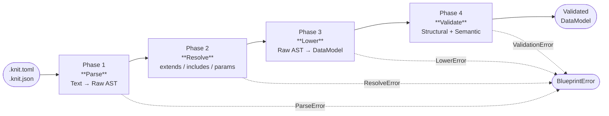
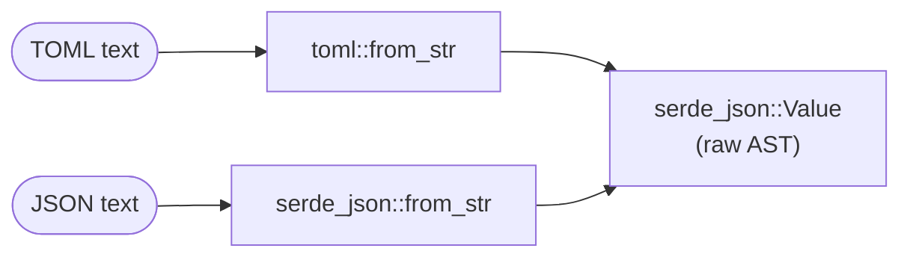
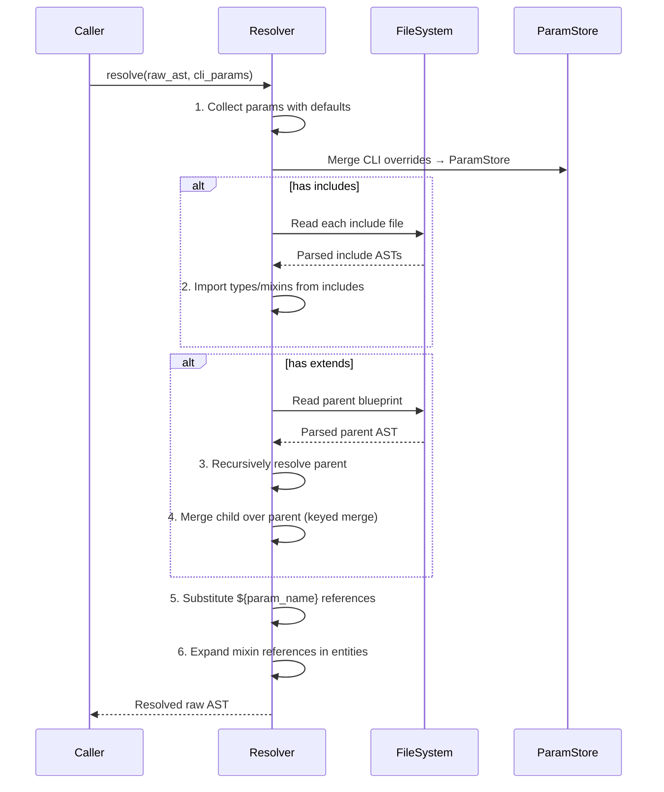
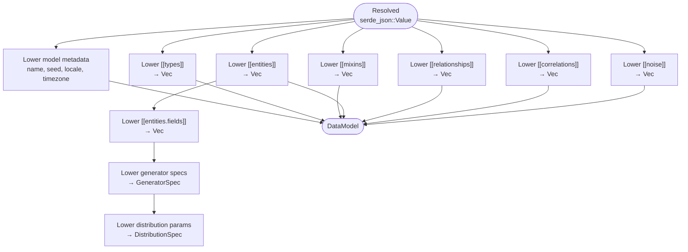

# blueprint module — Design Document

**Version:** 0.4.0
**Status:** Implemented
**Module:** `blueprint module`

---

## Table of Contents

- [1. Overview](#1-overview)
- [2. Dependencies](#2-dependencies)
- [3. Pipeline Architecture](#3-pipeline-architecture)
- [4. Parsing](#4-parsing)
- [5. Resolution Phase](#5-resolution-phase)
- [6. Lowering Phase](#6-lowering-phase)
- [7. Validation Rules](#7-validation-rules)
- [8. Error Reporting](#8-error-reporting)
- [9. Blueprint Operations](#9-blueprint-operations)
- [10. Testing Strategy](#10-testing-strategy)
- [11. Design Decisions](#11-design-decisions)

---

## 1. Overview

`blueprint module` is the bridge between textual Knit documents (`.knit.toml` /
`.knit.json`) and the semantic `DataModel` defined in `core module`. It owns
everything from the first byte of input to the fully validated, ready-to-plan
data model that downstream modules consume.

### Scope Boundary with core module

The responsibility split is deliberate:

| Concern | Owner | Rationale |
|---------|-------|-----------|
| Type definitions (`DataModel`, `Entity`, `Field`, `GeneratorSpec`, …) | `core module` | Shared vocabulary — every module needs these |
| Parsing text → `DataModel` | `blueprint module` | Only this module touches serialization formats |
| `extends` / `includes` / `params` resolution | `blueprint module` | Composition is a blueprint-language concept, invisible to downstream |
| Structural & semantic validation | `blueprint module` | Parse errors and blueprint errors share context (line numbers, paths) |
| Execution planning, generation, output | Other modules | They receive a validated `DataModel` — no raw text, no parse state |

This separation means **parse errors and model errors live in the same error
type** (`BlueprintError`), giving users a single diagnostic surface with element
paths, line numbers, and severity levels. Downstream modules never need to
produce parse-level diagnostics; they can assume the `DataModel` is valid.

### Public API Surface

```rust
// Primary entry points
pub fn parse_toml(input: &str) -> Result<DataModel, Vec<BlueprintError>>;
pub fn parse_json(input: &str) -> Result<DataModel, Vec<BlueprintError>>;
pub fn parse_file(path: &Path) -> Result<DataModel, Vec<BlueprintError>>;

// Blueprint operations
pub fn normalize(model: &DataModel) -> String;       // canonical TOML
pub fn expand(path: &Path) -> Result<DataModel, Vec<BlueprintError>>;  // flatten extends
pub fn generate_json_schema() -> serde_json::Value;  // JSON Schema for IDE

// Selective phases (for tooling)
pub fn parse_only(input: &str) -> Result<RawBlueprint, Vec<BlueprintError>>;
pub fn resolve(raw: RawBlueprint) -> Result<RawBlueprint, Vec<BlueprintError>>;
pub fn lower(raw: RawBlueprint) -> Result<DataModel, Vec<BlueprintError>>;
pub fn validate(model: &DataModel) -> Vec<BlueprintError>;
```

---

## 2. Dependencies

| Crate | Role | Required |
|-------|------|----------|
| `toml` | TOML deserialization (primary format) | Yes |
| `serde` / `serde_json` | JSON deserialization + internal serde derives | Yes |
| `core module` | `DataModel`, `Entity`, `Field`, `GeneratorSpec`, `DistributionSpec`, `Value`, and all shared types | Yes |
| `thiserror` | Structured error types (`BlueprintError`) | Yes |
| `chrono` | Parse temporal literals (`date`, `time`, `datetime`, `duration`) | Yes |
| `jsonschema` | Validate documents against the Knit JSON Schema | Optional |
| `url` | Resolve `includes` paths and relative references | Optional |

`blueprint module` intentionally has **no runtime dependencies on generation or
output modules**. It never executes generators, samples distributions, or writes
files. Its job ends when it hands a validated `DataModel` to `plan module`.

---

## 3. Pipeline Architecture

The blueprint pipeline has four sequential phases. Each phase transforms one
representation into the next, and each phase produces its own category of
errors. The pipeline short-circuits on the first phase that produces fatal
errors.



### Phase Summary

| Phase | Input | Output | Error Category | Recoverable? |
|-------|-------|--------|----------------|--------------|
| **Parse** | Raw text (TOML or JSON) | `serde_json::Value` tree (raw AST) | Syntax errors, encoding errors | No — fatal |
| **Resolve** | Raw AST | Resolved raw AST (all composition flattened) | Missing files, circular extends, unresolved params | No — fatal |
| **Lower** | Resolved raw AST | `DataModel` (core module types) | Unknown keys, invalid enum variants, type parse failures | Partial — collect all |
| **Validate** | `DataModel` | Validated `DataModel` + diagnostics | Structural, type, referential, semantic violations | Partial — collect all |

The Parse and Resolve phases produce **fatal** errors — a syntax error or
missing include file prevents any further processing. The Lower and Validate
phases are **accumulating**: they collect as many errors as possible in a single
pass so the user can fix multiple issues at once.

---

## 4. Parsing

### Format Support

TOML is the primary format for human and AI authoring. JSON is accepted for
programmatic pipelines and AI-generated blueprints. Both formats parse into the
same intermediate representation: a `serde_json::Value` tree.



**Why `serde_json::Value` as the intermediate type?** Both `toml::Value` and
`serde_json::Value` are serde-compatible value trees, but `serde_json::Value`
has better ergonomics for dynamic manipulation (it supports `Map` natively, is
widely used in the Rust ecosystem, and avoids maintaining two parallel code
paths for value inspection). The TOML parser deserializes into
`serde_json::Value` via serde's data model — no information is lost because
Knit's restricted TOML subset avoids features (like datetimes-as-native-types)
that don't round-trip through JSON.

### TOML Restrictions

Knit enforces a **restricted canonical TOML subset** for AI reliability:

- **No dotted keys** — use `[section.subsection]` form
- **No inline tables** except for single-line generator specs (e.g.,
  `generator = { type = "constant", params = { value = 42 } }`)
- **Deterministic key ordering** within sections
- **UTF-8 encoding** required
- No multi-line basic strings for values (only for readability in comments)

These restrictions are not enforced at parse time (TOML's parser accepts valid
TOML), but the `normalize` operation rewrites to canonical form, and blueprint
linting can warn about non-canonical usage.

### Error Recovery Strategy

Parse-phase errors are **fatal** — the pipeline cannot proceed without a
syntactically valid document. However, the parser provides helpful context:

1. **TOML parse errors**: The `toml` crate reports line/column numbers. `blueprint module`
   wraps these with file path context and a hint about common mistakes (e.g.,
   "Did you mean to use `[[entities]]` instead of `[entities]`?").
2. **JSON parse errors**: `serde_json` reports byte offset. `blueprint module` converts
   this to a line/column number for consistent error display.
3. **Format detection**: File extension (`.toml` / `.json`) determines parser. If
   the extension is ambiguous, content sniffing (`{` prefix → JSON, otherwise TOML)
   is used as a fallback.

---

## 5. Resolution Phase

Resolution eliminates all composition constructs (`extends`, `includes`, `params`)
and produces a self-contained raw AST. This phase runs **before** lowering to
typed structures, because composition operates on the raw key-value tree — it
does not need to understand generator semantics or field types.

### Resolution Order



**Order matters:** Includes are processed before extends (imported types must be
available when the extends chain merges), and params are substituted last
(after all structural composition is complete, so overrides apply to the final
merged tree).

### 5.1 `extends` Semantics

`extends` provides **single inheritance** for blueprint composition. A child blueprint
specifies a parent file, and the engine merges the child's declarations over
the parent's.

```toml
# child.knit.toml
extends = "base.knit.toml"

[model]
name = "stress_test"   # overrides parent's model.name

[[entities]]
name = "user"          # merges with parent's "user" entity
count = 1_000_000      # overrides parent's count
```

#### Merge Algorithm

The merge is a **deep, keyed merge** — not a naive object overlay. The
algorithm handles each structural level with specific rules:

```
merge(parent, child) → result:
  for each top-level section:
    if section is a scalar (model.name, model.seed, ...):
      result[key] = child[key] ?? parent[key]        # child wins

    if section is an array-of-tables (entities, relationships, ...):
      for each element in parent:
        if child has element with same `name`:
          if child_element.remove == true:
            skip (element removed)                    # removal
          else:
            result.push(merge_element(parent_el, child_el))  # keyed merge
        else:
          result.push(parent_el)                      # inherited as-is

      for each element in child not matching any parent name:
        result.push(child_el)                         # new element added

    if section is a map (params):
      result = parent_map ∪ child_map                 # child keys override
```

**Element merge rules** (within a matched entity, relationship, etc.):

| Property kind | Merge behavior | Example |
|---------------|---------------|---------|
| **Scalar** | Child overrides parent | `count = 1_000_000` replaces `count = 100_000` |
| **Array** | Child **replaces** parent entirely | `choices = [...]` replaces parent's choices |
| **Nested array-of-tables** | Keyed merge by `name` (recursive) | `entities.fields` merge by field name |
| **Map / object** | Shallow merge (child keys override) | `params = { ... }` |
| **`remove = true`** | Element removed from result | `[[entities]]\nname = "legacy"\nremove = true` |

#### Extends Chain Depth

- Extends chains are resolved recursively: if parent also has `extends`, resolve
  it first. The effective blueprint is the result of folding: `root → … → parent → child`.
- **Circular extends** are detected and reported as a fatal `ResolveError`.
- Maximum chain depth is 16 (configurable). Exceeding this limit produces an error
  suggesting the blueprint hierarchy is too deep.

### 5.2 `includes` Semantics

`includes` imports **types** and **mixins** from external library files. Unlike
`extends`, includes do not merge entities or model metadata — they only bring
type and mixin definitions into scope.

```toml
includes = [
    "lib/common-types.knit.toml",
    "lib/audit-mixins.knit.toml",
]
```

**Import rules:**

- Only `[[types]]` and `[[mixins]]` sections are imported from included files
- Entity definitions, relationships, correlations, and model metadata are **ignored**
- If an included file has its own `includes`, they are resolved transitively
- Name collisions (same type/mixin name from multiple includes) are errors
- Namespace scoping: types/mixins are referenced by their `name` field, not
  qualified by file path. A future version may add namespace prefixes.

### 5.3 `params` Substitution

Parameters are compile-time constants that allow blueprint authors to create
configurable, reusable blueprints.

```toml
[params]
user_count = { type = "int", default = 100_000 }
scale = { type = "float", default = 1.0 }
start_date = { type = "string", default = "2020-01-01" }
```

**Substitution rules:**

1. Collect all `[params]` definitions from the resolved blueprint
2. Merge CLI overrides: `--param user_count=500000` replaces the default
3. Validate types: each param value must match its declared type
4. Walk the entire raw AST and replace `${param_name}` occurrences in string
   values with the resolved param value
5. For non-string contexts (e.g., `count = { expr = "$param.user_count * $param.scale" }`),
   expression references using `$param.` prefix are left for the expression
   evaluator — they are not textually substituted

**Type coercion:** When a param of type `int` appears in a context that expects
a string (e.g., inside a description), it is coerced to its string
representation. When a param of type `string` appears in a numeric context,
substitution fails with a type error.

**Unresolved params:** Any `${param_name}` reference that doesn't match a
declared param is a fatal `ResolveError`. This catches typos early.

---

## 6. Lowering Phase

Lowering transforms the resolved raw AST (`serde_json::Value` tree) into the
typed `DataModel` from `core module`. This is where untyped TOML tables become
`Entity`, `Field`, `GeneratorSpec`, and other semantic types.

### Lowering Pipeline



### Generator Spec Parsing

Every generator in Knit follows a uniform `{ type, params }` shape. The
lowering phase maps this to the `GeneratorSpec` enum:

| TOML `type` | `GeneratorSpec` variant | Key params lowered |
|-------------|------------------------|--------------------|
| `"distribution"` | `Distribution(DistributionSpec)` | `distribution`, `params`, `min`, `max`, `unit` |
| `"faker"` | `Faker { category, locale }` | `category`, `locale` |
| `"sequence"` | `Sequence { start, step, … }` | `start`, `step`, `cycle`, `jitter`, `values` |
| `"one_of"` | `OneOf { choices }` | `choices` (each with `value` + optional `weight`) |
| `"derived"` | `Derived { expr }` | `expr` |
| `"constant"` | `Constant(Value)` | `value` |
| `"composite"` | `Composite { element, length }` | `element` (nested GeneratorSpec), `length` (DistributionSpec) |
| `"conditional"` | `Conditional { on, branches, default }` | `on`, `branches`, `default` |
| `"pattern"` | `Pattern { format, regex, template }` | `format`, `regex`, `template` |
| `"lookup"` | `Lookup { source, column, … }` | `source`, `column`, `format`, `sampling` |
| `"unique"` | `Unique { inner, max_retries }` | `inner` (nested GeneratorSpec), `max_retries` |
| `"uuid"` | `Uuid { version }` | `version` |
| `"relative"` | `Relative { anchor, offset }` | `anchor`, `offset` |
| `"time_series"` | `TimeSeries { baseline, components, … }` | `baseline`, `components`, `min`, `max` |
| `"business_hours"` | `BusinessHours { … }` | `start_hour`, `end_hour`, `days`, `date_range` |

**Implicit generators:** If a field has `type = "uuid"` and no explicit
`generator`, the lowering phase inserts a default `Uuid { version: 4 }`
generator. No other type has an implicit generator.

### Distribution Parameter Lowering

Each distribution kind has specific required and optional parameters. The
lowering phase validates parameter names and types:

| Distribution | Required params | Optional params |
|-------------|----------------|-----------------|
| `uniform` | `min`, `max` | — |
| `normal` | `mean`, `std_dev` | — |
| `log_normal` | `mu`, `sigma` | — |
| `exponential` | `lambda` | — |
| `poisson` | `lambda` | — |
| `zipf` | `n`, `exponent` | — |
| `bernoulli` | `p` | — |
| `beta` | `alpha`, `beta` | — |
| `gamma` | `shape`, `scale` | — |
| `pareto` | `scale`, `shape` | — |
| `geometric` | `p` | — |
| `binomial` | `n`, `p` | — |
| `weibull` | `shape`, `scale` | — |
| `cauchy` | `median`, `scale` | — |
| `chi_squared` | `df` | — |
| `student_t` | `df` | — |
| `dirichlet` | `alpha` (array) | — |
| `multinomial` | `n`, `p` (array) | — |

Unknown distribution names are `LowerError`s (not deferred to validation).

### Temporal Type Parsing

Temporal literals in generator params are parsed during lowering:

- **Date literals**: `"2024-03-15"` → `NaiveDate`
- **Time literals**: `"14:30:00"` → `NaiveTime`
- **Datetime literals**: `"2024-03-15T14:30:00"` → `NaiveDateTime`
- **Datetime with timezone**: `"2024-03-15T14:30:00-05:00"` → normalized to UTC
- **Duration shorthand**: `"30d"`, `"2h30m"`, `"500ms"` → microseconds
- **ISO 8601 duration**: `"P1DT12H"` → microseconds

The parser uses `chrono` for date/time parsing and a custom parser for the
Knit duration shorthand format. Invalid temporal literals produce `LowerError`s
with the expected format hint.

### Unknown Key Detection

The lowering phase tracks which keys it consumes from each table. Any
unconsumed key is reported as a `LowerError` (warning severity) — this catches
typos like `descrption` instead of `description` without blocking the pipeline.

---

## 7. Validation Rules

Validation runs on the fully lowered `DataModel`. It performs checks that require
the complete model context (cross-entity references, type consistency, semantic
constraints). All checks are **accumulating** — the validator collects every
violation before returning.

### Validation Check Table

#### Structural Checks

| Check | Description | Severity |
|-------|-------------|----------|
| `S-001` | `[model]` section present with `name` field | Error |
| `S-002` | Every entity has a unique `name` | Error |
| `S-003` | Every entity has at least one field | Error |
| `S-004` | Every field has a valid `type` (primitive, custom, or `array<T>`) | Error |
| `S-005` | Every field has a `name` unique within its entity | Error |
| `S-006` | Generator `type` is a recognized generator name | Error |
| `S-007` | Distribution `distribution` is a recognized distribution name | Error |
| `S-008` | Required generator params are present | Error |
| `S-009` | No unknown keys in any table (typo detection) | Warning |
| `S-010` | `blueprint_version` is present and supported | Error |
| `S-011` | Enum-valued fields (`kind`, `type`, etc.) use valid variants | Error |
| `S-012` | Entity `count` is positive (or expression resolves to positive) | Error |
| `S-013` | Primary key fields are not nullable | Error |
| `S-014` | At most one primary key per entity (or explicit composite key constraint) | Warning |
| `S-015` | Relationship `kind` is a valid variant (`many_to_one`, `one_to_one`, `many_to_many`) | Error |

#### Type Consistency Checks

| Check | Description | Severity |
|-------|-------------|----------|
| `T-001` | Generator output type is compatible with field `DataType` | Error |
| `T-002` | Distribution params match expected types (numeric for numeric distributions) | Error |
| `T-003` | `one_of` choice values match field type | Error |
| `T-004` | `constant` value matches field type | Error |
| `T-005` | `derived` expression return type matches field type | Error |
| `T-006` | `conditional` branch generators all produce the field's type | Error |
| `T-007` | `composite` element generator matches array element type | Error |
| `T-008` | Custom type `base` references a valid primitive type | Error |
| `T-009` | Temporal generator params use valid temporal literals for the field's temporal type | Error |
| `T-010` | `min`/`max` clamp values match the generator's output type | Error |

#### Referential Integrity Checks

| Check | Description | Severity |
|-------|-------------|----------|
| `R-001` | Relationship `from` entity exists | Error |
| `R-002` | Relationship `to` entity exists | Error |
| `R-003` | Relationship `from_field` exists on the `from` entity | Error |
| `R-004` | Relationship `to_field` exists on the `to` entity | Error |
| `R-005` | FK field type matches PK field type | Error |
| `R-006` | `to_field` is a primary key or has `unique = true` | Warning |
| `R-007` | Relationship `name` is unique across all relationships | Error |
| `R-008` | `one_to_one` FK field has `unique = true` or uniqueness is implied | Warning |
| `R-009` | Correlation `entity` references an existing entity | Error |
| `R-010` | Correlation `fields` reference existing fields within the entity | Error |
| `R-011` | Noise `target` (`entity.field`) references an existing entity and field | Error |
| `R-012` | Mixin references in entities (`mixins = [...]`) resolve to defined mixins | Error |
| `R-013` | Custom type references (`type = "money"`) resolve to defined types | Error |

#### Semantic Checks

| Check | Description | Severity |
|-------|-------------|----------|
| `M-001` | `normal` distribution: `std_dev > 0` | Error |
| `M-002` | `bernoulli` distribution: `p` in `[0, 1]` | Error |
| `M-003` | `beta` distribution: `alpha > 0` and `beta > 0` | Error |
| `M-004` | `gamma` distribution: `shape > 0` and `scale > 0` | Error |
| `M-005` | `poisson` distribution: `lambda > 0` | Error |
| `M-006` | `zipf` distribution: `exponent > 0` and `n ≥ 1` | Error |
| `M-007` | `pareto` distribution: `scale > 0` and `shape > 0` | Error |
| `M-008` | `uniform` distribution: `min < max` | Error |
| `M-009` | `geometric` / `binomial`: `p` in `(0, 1]` | Error |
| `M-010` | `weibull` distribution: `shape > 0` and `scale > 0` | Error |
| `M-011` | `one_of` weights are all non-negative, at least one is positive | Error |
| `M-012` | `unique` field: domain size ≥ entity count (feasibility check) | Warning |
| `M-013` | Correlation `coefficient` in `[-1, 1]` | Error |
| `M-014` | Correlation matrix is symmetric and positive semi-definite | Error |
| `M-015` | Nullable probability in `[0, 1]` | Error |
| `M-016` | Self-referential relationship: `nullable = true` on FK field | Error |
| `M-017` | Cyclic relationships: all FK fields in the cycle are nullable | Error |
| `M-018` | Cycle classification: cycles are **deferred** (two-phase generation), not rejected | Info |
| `M-019` | `min` ≤ `max` for generator clamp bounds | Error |
| `M-020` | `sequence` with finite values + `cycle = false`: enough values for entity count | Warning |
| `M-021` | Time series `period` > 0 for seasonality components | Error |
| `M-022` | `business_hours`: `start_hour < end_hour`, valid day names | Error |

#### Expression Checks

| Check | Description | Severity |
|-------|-------------|----------|
| `E-001` | `derived` expression parses successfully | Error |
| `E-002` | All field references in expressions exist within the same entity | Error |
| `E-003` | No cycles in the derived field DAG (within an entity) | Error |
| `E-004` | `conditional` `on` field is defined before the conditional field | Error |
| `E-005` | Expression functions are recognized (`case`, `concat`, `round`, etc.) | Error |
| `E-006` | Expression function arity matches expected signature | Error |
| `E-007` | `$param.` references resolve to defined parameters | Error |

---

## 8. Error Reporting

### BlueprintError Type

All errors across all phases are represented as `BlueprintError`:

```rust
pub struct BlueprintError {
    /// Unique error code (e.g., "S-001", "T-003", "R-005")
    pub code: String,

    /// Error category
    pub phase: ErrorPhase,

    /// Severity level
    pub severity: Severity,

    /// Human-readable message
    pub message: String,

    /// Path to the element that caused the error
    /// e.g., "entities[user].fields[email].generator"
    pub element_path: Option<String>,

    /// Source location (line and column in the original text)
    pub location: Option<SourceLocation>,

    /// Optional suggestion for how to fix the error
    pub hint: Option<String>,
}

pub enum ErrorPhase { Parse, Resolve, Lower, Validate }
pub enum Severity { Error, Warning, Info }

pub struct SourceLocation {
    pub file: PathBuf,
    pub line: usize,
    pub column: usize,
}
```

### Element Paths

Element paths use dot-separated notation with bracket indexing for named
elements within arrays:

```
model.name
entities[user]
entities[user].fields[email]
entities[user].fields[email].generator.params.category
relationships[order_user].from_field
correlations[0].fields
noise[1].params.multiplier
```

### Human-Readable Output

```
error[S-008]: Missing required parameter 'std_dev' for normal distribution
  --> ecommerce.knit.toml:42:5
   |
42 |     generator = { type = "distribution", distribution = "normal", params = { mean = 35.0 } }
   |     ^^^^^^^^^ required parameter 'std_dev' not found in params
   |
   = hint: Add 'std_dev = <value>' to the params table. Example: params = { mean = 35.0, std_dev = 12.0 }

error[R-005]: FK field type mismatch in relationship 'order_user'
  --> ecommerce.knit.toml:78:1
   |
78 | [[relationships]]
   | ^^^^^^^^^^^^^^^^^ order.user_id (int) does not match user.id (uuid)
   |
   = hint: Change order.user_id to type = "uuid" to match the referenced primary key

warning[M-012]: Uniqueness may be infeasible for field 'user.email'
  --> ecommerce.knit.toml:35:5
   |
35 |     unique = true
   |     ^^^^^^^^^^^^^ domain of faker(internet.email) may not produce 1,000,000 unique values
   |
   = hint: Consider using the 'unique' wrapper generator with max_retries, or reduce entity count
```

### Machine-Readable JSON Output

For CI integration and AI pipelines, errors are emitted as JSON when
`--output json` is specified:

```json
{
  "errors": [
    {
      "code": "S-008",
      "phase": "validate",
      "severity": "error",
      "message": "Missing required parameter 'std_dev' for normal distribution",
      "element_path": "entities[user].fields[age].generator",
      "location": {
        "file": "ecommerce.knit.toml",
        "line": 42,
        "column": 5
      },
      "hint": "Add 'std_dev = <value>' to the params table"
    }
  ],
  "warnings": 1,
  "errors_count": 2,
  "valid": false
}
```

### Severity Semantics

| Level | Meaning | Blocks pipeline? |
|-------|---------|-----------------|
| **Error** | Blueprint is invalid; cannot proceed to planning/generation | Yes |
| **Warning** | Blueprint is technically valid but may produce unexpected results | No |
| **Info** | Informational diagnostic (e.g., cycle classification, implicit defaults) | No |

---

## 9. Blueprint Operations

Beyond parsing and validation, `blueprint module` provides three operations for
blueprint tooling.

### 9.1 `normalize` — Canonical Form Rewrite

`knit blueprint normalize <file>` reads a knit blueprint and rewrites it to the
canonical TOML form. This ensures consistent formatting across blueprints,
simplifies diffs, and produces output that is maximally AI-friendly.

**Normalization rules:**

| Rule | Before | After |
|------|--------|-------|
| Key ordering | Random key order | `name`, `description`, `type`, `generator`, … (defined canonical order) |
| Whitespace | Inconsistent | Single blank line between sections, no trailing whitespace |
| Inline tables | Multi-key inline tables | Inline only for single-line generator specs; expand otherwise |
| Array-of-tables | Mixed `[[entities]]` and inline | Always `[[entities]]` array-of-tables form |
| Comments | Preserved | Preserved in their relative position |
| String quoting | Mixed quote styles | Double quotes for all strings |
| Number formatting | `100000` | `100_000` (underscore separators for readability) |
| Boolean | `True`, `TRUE` | `true` (lowercase) |

**Idempotency:** `normalize(normalize(x)) == normalize(x)`. Running normalize
twice always produces the same output.

### 9.2 `expand` — Flatten Extends Chain

`knit blueprint expand <file>` resolves the full `extends` chain and `includes`
imports, then emits a standalone blueprint with no external references.

**Use cases:**

- **Debugging**: See the effective blueprint after inheritance
- **Archiving**: Produce a self-contained blueprint for reproducibility
- **AI pipelines**: Feed the expanded blueprint to an LLM that doesn't need to
  resolve file references

**Behavior:**

1. Run the full Resolution phase (extends + includes + params with defaults)
2. Remove `extends` and `includes` keys from output
3. Inline all mixin fields into their consuming entities
4. Inline custom type definitions into fields that use them (optional, controlled
   by `--inline-types` flag)
5. Emit as canonical TOML (via `normalize`)

### 9.3 JSON Schema Generation

`blueprint module` can generate a JSON Schema document that describes the Knit
blueprint language. This blueprint is used for:

- **IDE validation**: VS Code, JetBrains, and other editors can validate
  `.knit.toml` / `.knit.json` files in real time
- **AI pipeline pre-checks**: Validate AI-generated blueprints before running the
  full `knit validate` pipeline (faster feedback loop)
- **Documentation**: Auto-generate documentation from the blueprint

The JSON Schema is generated from the `core module` type definitions using
serde reflection, with manual annotations for:
- Enum variant descriptions
- Pattern constraints (e.g., entity names must match `[a-z_][a-z0-9_]*`)
- Required vs optional fields
- Default values
- Cross-field constraints (expressed as `if/then` in JSON Schema)

```rust
pub fn generate_json_schema() -> serde_json::Value;
```

The generated blueprint targets **JSON Schema Draft 2020-12** for maximum
editor/tooling compatibility.

---

## 10. Testing Strategy

### Test Categories

| Category | What is tested | Approach |
|----------|---------------|----------|
| **Parse round-trip** | TOML → DataModel → TOML produces equivalent output | Property-based + hand-written |
| **JSON parity** | TOML and JSON inputs produce identical DataModels | Mirror test suite |
| **Extends merge** | Parent/child merge produces expected result | Hand-written with specific merge scenarios |
| **Includes import** | Types/mixins imported correctly, name collisions detected | Hand-written |
| **Params substitution** | `${param}` replaced, type coercion works, CLI overrides apply | Hand-written |
| **Lowering** | Each generator type, distribution, temporal literal lowers correctly | One test per generator × type combination |
| **Validation errors** | Each validation rule triggers on its specific violation | One test per check code (S-001, T-001, …) |
| **Validation happy path** | Valid blueprints pass without errors or warnings | Golden file tests |
| **Golden files** | `normalize` and `expand` produce exact expected output | Snapshot testing with `.expected` files |
| **Error messages** | Error output matches expected format (human + JSON) | Snapshot testing |
| **Edge cases** | Empty blueprint, minimal blueprint, deeply nested extends, max params | Hand-written |

### Test File Organization

```
tests/
├── fixtures/
│   ├── valid/                    # Valid blueprints (should parse + validate cleanly)
│   │   ├── minimal.knit.toml
│   │   ├── ecommerce.knit.toml
│   │   ├── temporal.knit.toml
│   │   └── all-generators.knit.toml
│   ├── invalid/                  # Invalid blueprints (one violation each)
│   │   ├── missing-model.knit.toml          # → S-001
│   │   ├── duplicate-entity.knit.toml       # → S-002
│   │   ├── type-mismatch.knit.toml          # → T-001
│   │   └── fk-type-mismatch.knit.toml       # → R-005
│   ├── extends/                  # Extends merge test pairs
│   │   ├── base.knit.toml
│   │   ├── override-count.knit.toml
│   │   ├── add-field.knit.toml
│   │   ├── remove-entity.knit.toml
│   │   └── deep-chain/
│   │       ├── grandparent.knit.toml
│   │       ├── parent.knit.toml
│   │       └── child.knit.toml
│   ├── includes/                 # Include import tests
│   │   ├── types-lib.knit.toml
│   │   ├── mixins-lib.knit.toml
│   │   └── consumer.knit.toml
│   └── golden/                   # Expected output for normalize/expand
│       ├── ecommerce.normalized.toml
│       └── override-count.expanded.toml
├── parse_tests.rs
├── resolve_tests.rs
├── lower_tests.rs
├── validate_tests.rs
├── normalize_tests.rs
└── expand_tests.rs
```

### Parse Round-Trip Property

For any valid TOML input `T`:

```
parse(normalize(T)) == parse(T)
```

This ensures that normalization does not change semantics. The test generates
random valid blueprints (via a blueprint fuzzer) and verifies this property.

### Extends Merge Test Matrix

Key merge scenarios that must be covered:

| Scenario | Parent | Child | Expected |
|----------|--------|-------|----------|
| Scalar override | `count = 100` | `count = 500` | `count = 500` |
| Field addition | `fields = [a, b]` | `fields = [c]` | `fields = [a, b, c]` |
| Field override | `field.a.type = "int"` | `field.a.type = "float"` | `field.a.type = "float"` |
| Entity removal | entity "legacy" exists | `remove = true` on "legacy" | "legacy" absent |
| Array replacement | `choices = [x, y]` | `choices = [a, b, c]` | `choices = [a, b, c]` |
| Deep chain (3 levels) | grandparent → parent → child | — | Correct fold order |
| Circular extends | A extends B extends A | — | Error |
| Missing parent file | `extends = "nonexistent.toml"` | — | Error |

---

## 11. Design Decisions

### DD-1: Separate Resolve Phase (not inline during lowering)

**Decision:** Resolution (extends/includes/params) is a distinct phase that
operates on the raw `serde_json::Value` tree, before lowering to typed structures.

**Rationale:**
- Composition operates on the **syntactic** tree, not the **semantic** model.
  Merging entities by name, overlaying scalars, and removing elements are tree
  operations that don't need type information.
- Lowering a partially-merged tree would require the lowering code to understand
  merge semantics, tangling two concerns.
- A clean resolve phase makes `expand` trivial: run resolve, serialize the
  result — no need to lower and re-serialize.
- Error messages are clearer: "cannot resolve extends target" is a resolve error,
  not a lowering error.

**Tradeoff:** Param substitution in expressions (`$param.name`) requires a
second pass or deferred resolution, since expressions are opaque strings in the
raw AST.

### DD-2: serde_json::Value as Intermediate Representation

**Decision:** Both TOML and JSON parse into `serde_json::Value`, not into a
custom AST type.

**Rationale:**
- Avoids maintaining two parallel code paths (one for TOML values, one for
  JSON values). The `toml` crate can deserialize into `serde_json::Value` via
  serde's data model.
- `serde_json::Value` has excellent ecosystem support: pattern matching,
  pointer syntax (`/entities/0/fields`), and merge utilities.
- Knit's restricted TOML subset avoids TOML-specific features (native datetime
  types, mixed arrays) that would be lossy through JSON's value model.

**Tradeoff:** Line number tracking is lost after deserialization. Source
locations are recovered via a parallel span-tracking pass on the original text
(see DD-5).

### DD-3: No Custom Parser (use serde ecosystem)

**Decision:** Use `toml` and `serde_json` crates for parsing, not a custom
TOML/JSON parser.

**Rationale:**
- The `toml` crate is well-tested, spec-compliant, and actively maintained.
  Building a custom parser would duplicate effort with no benefit.
- Knit's restrictions (no dotted keys, limited inline tables) are enforced
  at the **normalize/lint** level, not the parser level. Accepting valid TOML
  and warning about non-canonical forms is friendlier than rejecting at parse.
- Custom parsers would be needed only for error recovery or incremental parsing
  (IDE use case). These can be added later as an alternative code path without
  changing the pipeline architecture.

**Tradeoff:** Limited error recovery. A single TOML syntax error prevents
parsing the rest of the file. Mitigation: provide good hints in error messages.

### DD-4: Accumulating Validation (not fail-fast)

**Decision:** The Lower and Validate phases collect all errors in a single pass,
rather than stopping at the first error.

**Rationale:**
- Users (especially AI pipelines) benefit from seeing all problems at once.
  Fixing one error only to discover the next on re-run is a poor experience.
- The cost is minimal: validation checks are independent and stateless. There
  is no risk of cascading false positives from earlier errors.
- CI pipelines can parse the full error list and prioritize fixes.

**Tradeoff:** Some errors may be redundant (e.g., a missing entity triggers
both S-002 and R-001). Error deduplication and prioritization logic adds
complexity.

### DD-5: Source Location Recovery via Span Map

**Decision:** Build a span map from the original text (line/column for each key)
in a separate pass, then attach source locations to errors during lowering and
validation.

**Rationale:**
- The `toml` crate's `Deserializer` can report spans for keys and values via
  `toml::Spanned<T>`. By deserializing into `Spanned` wrappers during the
  initial parse, we capture source locations without a second parse.
- For JSON, `serde_json` doesn't natively track spans. A lightweight line-index
  (byte offset → line/column) is built from the source text and used to map
  error positions.

**Tradeoff:** Span tracking adds memory overhead (one span per key/value). For
very large blueprints this is negligible (blueprints are typically < 1MB).

### DD-6: Cycles Deferred, Not Rejected

**Decision:** Cyclic entity relationships are **classified** during validation
(as `Info` diagnostics) and handled by the planner via two-phase generation.
They are not rejected as errors.

**Rationale:**
- Real-world data models often contain cycles (employee → manager, order →
  return → order). Rejecting cycles would make Knit less expressive.
- The constraint is that cyclic FK fields must be `nullable` (so phase 1 can
  leave them NULL and phase 2 can backpatch). This is validated as M-017.
- The blueprint module's job is to detect and classify; the plan module's job is to
  schedule generation phases.

**Tradeoff:** The blueprint module must perform cycle detection (DFS on the
relationship graph) even though it doesn't act on cycles. This is a lightweight
operation on typical blueprints (< 100 entities).

### DD-7: Normalize is Idempotent and Semantics-Preserving

**Decision:** `normalize` rewrites form only (key order, whitespace, quoting)
and never changes semantics. It is idempotent.

**Rationale:**
- Normalize is used in CI to enforce style consistency. Non-idempotent
  normalization would cause infinite churn.
- Semantics preservation means `parse(normalize(x)) == parse(x)` always holds.
  Users can normalize freely without fear of changing behavior.
- Comments are preserved in their relative positions (between the keys they
  annotate). This is critical for human-authored blueprints.

**Tradeoff:** Comment preservation in TOML is difficult since the `toml` crate
discards comments during parsing. Implementation requires either a
comment-preserving TOML parser (e.g., `toml_edit`) or a two-pass approach
(parse for semantics, regex-match for comments).
