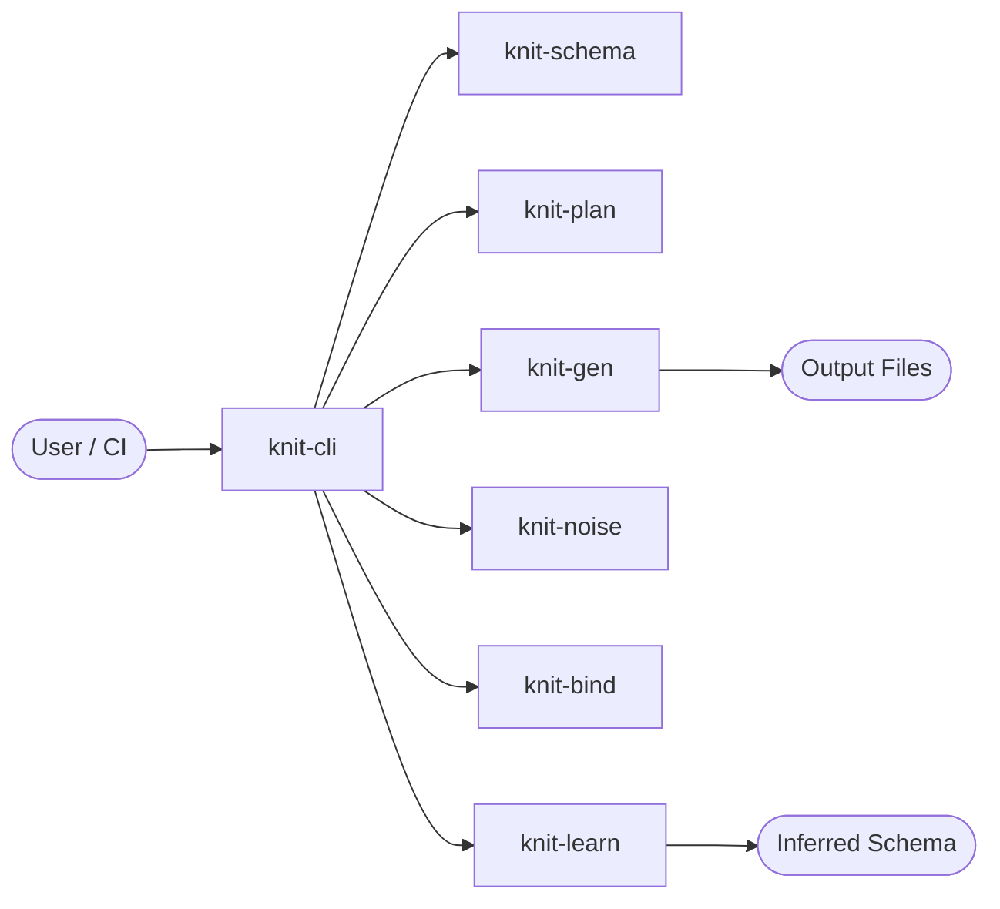
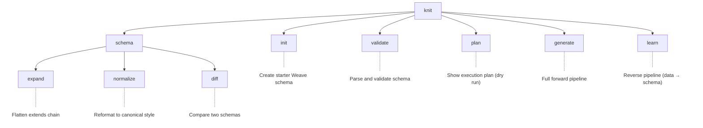
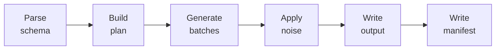
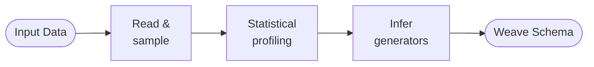
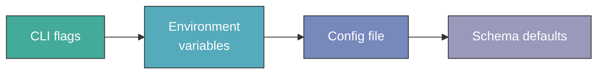
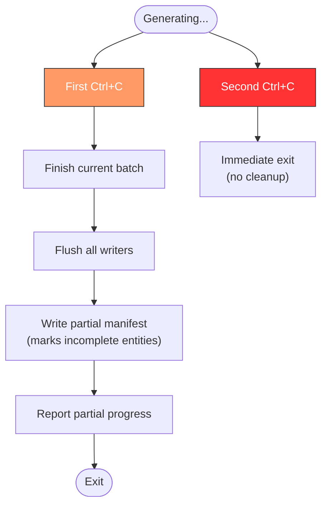

# knit-cli — Design Document

**Version:** 0.1.0
**Status:** Draft

---

## Table of Contents

- [1. Overview](#1-overview)
- [2. Dependencies](#2-dependencies)
- [3. Command Architecture](#3-command-architecture)
- [4. Command Details](#4-command-details)
  - [4.9 `knit scale`](#49-knit-scale-schema--o-dir)
  - [4.10 `knit tokenize`](#410-knit-tokenize-input--o-dir)
  - [4.11 `knit enrich`](#411-knit-enrich-model---ref-sample)
  - [4.12 `knit model`](#412-knit-model-subcommand)
- [5. Global Flags](#5-global-flags)
- [6. Progress Reporting](#6-progress-reporting)
- [7. Error Handling](#7-error-handling)
- [8. Configuration](#8-configuration)
- [9. Graceful Shutdown](#9-graceful-shutdown)
- [10. Testing Strategy](#10-testing-strategy)
- [11. Design Decisions](#11-design-decisions)

---

## 1. Overview

`knit-cli` is the single binary entry point for all Knit operations. It
orchestrates the full pipeline — from schema authoring through validation,
planning, generation, and learning — while providing consistent progress
reporting, error handling, and configuration across every command.



**Responsibilities:**

- Parse CLI arguments and dispatch to the appropriate pipeline stage
- Wire together crate APIs into cohesive workflows
- Present human-readable (default) or machine-readable (`--json`) output
- Report progress via terminal progress bars or JSON events
- Handle signals for graceful shutdown
- Layer configuration from flags, environment, config files, and schema defaults

---

## 2. Dependencies

### Internal Crates

| Crate | Role |
|-------|------|
| `knit-core` | Shared types (`DataModel`, `Value`, `DataType`, etc.) |
| `knit-schema` | Parse and validate Weave schemas |
| `knit-plan` | Compile `DataModel` into `ExecutionPlan` |
| `knit-gen` | Execute plan, produce Arrow batches |
| `knit-noise` | Apply perturbation pipeline |
| `knit-bind` | Serialize batches to output formats |
| `knit-learn` | Reverse pipeline (data → inferred schema) |

### External Crates

| Crate | Purpose |
|-------|---------|
| `clap` (derive) | CLI argument parsing and help generation |
| `indicatif` | Terminal progress bars and spinners |
| `tracing` | Structured, span-based instrumentation |
| `tracing-subscriber` | Log output formatting and filtering |
| `serde_json` | JSON output for `--json` mode |
| `ctrlc` | Cross-platform Ctrl+C signal handling |
| `anyhow` | Ergonomic error propagation |
| `dialoguer` | Interactive prompts (used by `knit init`) |
| `comfy-table` | Terminal table formatting for plan output |
| `num_cpus` | Default thread count detection |

---

## 3. Command Architecture



**Usage summary:**

```
knit init                           Create starter Weave schema (interactive wizard)
knit validate <schema>              Parse and validate, report errors
knit plan <schema>                  Show execution plan (dry run)
knit generate <schema> -o <dir>     Full forward pipeline
knit learn <data> -o <schema>       Reverse pipeline (data → inferred schema)
knit schema expand <file>           Flatten extends chain
knit schema normalize <file>        Reformat to canonical style
knit schema diff <a> <b>            Compare two schemas
```

---

## 4. Command Details

### 4.1 `knit init`

Scaffolds a new `schema.weave.toml` starter schema with documentation comments.

The data model schema language is the single source of truth for all data
definitions. The `init` command creates a minimal, well-commented schema file
that demonstrates available generator types and relationship patterns, which
the user then edits to define their specific data model.

**Usage:**

```bash
knit init                    # creates schema.weave.toml in cwd
knit init -o my_schema.toml  # custom output path
```

**Details:**

- **Scaffold content** — A valid schema with one example entity showing common
  generator types (sequence, pattern, distribution, temporal) plus commented
  examples of foreign keys and relationships.
- **Self-documenting** — The generated file lists all available generator types
  and configuration options as comments.
- **Output** — Writes a `schema.weave.toml` file to the current directory (or path
  specified with `-o`). Refuses to overwrite existing files.

---

### 4.2 `knit validate <schema>`

Parses and validates a Weave schema, reporting all errors.

**Pipeline stages used:** Parse → Resolve extends → Validate

**Output modes:**

| Mode | Flag | Description |
|------|------|-------------|
| Human-readable | *(default)* | Colored, contextual error messages with file path and line numbers |
| JSON | `--json` | Machine-readable array of diagnostic objects |

**Severity levels:**

| Level | Meaning | Example |
|-------|---------|---------|
| `error` | Schema is invalid, cannot generate | Missing referenced entity in relationship |
| `warning` | Schema is valid but may produce surprising results | Uniqueness on field with small domain |
| `info` | Suggestion for improvement | Missing `description` on entity |

**Exit codes:**

| Code | Meaning |
|------|---------|
| `0` | Schema is valid (no errors; warnings/info allowed) |
| `1` | One or more validation errors |

**JSON output structure:**

```json
{
  "valid": false,
  "diagnostics": [
    {
      "severity": "error",
      "code": "E001",
      "message": "Relationship 'order_user' references unknown entity 'usr'",
      "path": "relationships[0].to",
      "file": "schema.weave.toml",
      "line": 42,
      "suggestion": "Did you mean 'user'?"
    }
  ]
}
```

---

### 4.3 `knit plan <schema>`

Shows the execution plan without generating data (dry run).

**Pipeline stages used:** Parse → Resolve → Validate → Plan

**Display content:**

- **Phase breakdown** — Which entities are generated in each phase, topological
  ordering, and deferred FK backpatch assignments.
- **Partition counts** — Number of partitions per entity based on `--parallel`
  and `--batch-size`.
- **Estimated sizes** — Projected row counts and approximate byte sizes per
  entity and total.
- **Generator assignments** — Which `FieldGenerator` implementation handles each
  field.
- **RNG tree** — Seed derivation hierarchy showing how the global seed fans out
  to per-entity, per-field, per-partition streams.

**Output formats:**

| Format | Flag | Description |
|--------|------|-------------|
| Table | *(default)* | Formatted terminal table via `comfy-table` |
| JSON | `--json` | Full plan structure for programmatic consumption |

---

### 4.4 `knit generate <schema> -o <dir>`

Full forward pipeline: schema → data files.

**Pipeline stages used:** Parse → Plan → Generate → Noise → Bind



**Runtime behavior:**

- **Progress bars** — One `indicatif` progress bar per entity showing
  `rows generated / total rows`. Multi-progress layout for parallel entities.
- **ETA estimation** — Based on exponential moving average of throughput
  (rows/sec) measured over the last 10 batches.
- **Streaming stats** — Live display of rows/sec and bytes/sec, updated per
  batch.
- **Graceful shutdown** — On Ctrl+C: finish the current batch, flush all
  writers, write partial manifest, report partial progress. (See
  [§9 Graceful Shutdown](#9-graceful-shutdown).)
- **Completion summary** — Total rows generated, total bytes written, elapsed
  wall-clock time, and aggregate throughput.

**Output directory structure:**

```
<output-dir>/
├── user/
│   ├── part-00000.parquet
│   ├── part-00001.parquet
│   └── ...
├── order/
│   └── part-00000.parquet
└── _manifest.json
```

---

### 4.5 `knit learn <data> -o <schema>`

Reverse pipeline: read existing data and infer a Weave schema.

**Pipeline stages used:** Read data → Profile → Infer generators → Output schema



**Features:**

- **Progress bar** — Shows profiling progress (files scanned / total).
- **Confidence report** — Each inferred generator is annotated with a confidence
  score (0.0–1.0). Low-confidence decisions are highlighted in the output.
- **Interactive review mode** (`--review`) — Presents each low-confidence
  decision for user confirmation:
  ```
  Field "user.income":
    Inferred: log_normal(mu=10.8, sigma=0.7)  [confidence: 0.62]
    Alternatives: normal(mean=52000, std_dev=28000), gamma(shape=2.1, scale=25000)
    Accept? [Y/n/pick]
  ```
- **Supported input formats** — Parquet, CSV, JSON (auto-detected from file
  extension or `--format` flag).

---

### 4.6 `knit schema expand <file>`

Reads a schema with `extends` chains and outputs the fully flattened,
standalone schema.

**Behavior:**

- Resolves all `extends` references recursively.
- Applies merge semantics: entities/fields/relationships merge by `name`;
  `remove = true` entries are excluded.
- Outputs to stdout by default, or to a file with `-o <file>`.
- Preserves `description` and `tags` annotations from the final merged result.

---

### 4.7 `knit schema normalize <file>`

Reads a schema and outputs it in canonical form.

**Canonical rules:**

- Deterministic key ordering (model → entities → relationships → noise)
- Consistent whitespace and indentation
- Inline tables only for trivial generator params
- No dotted keys
- Sorted entity fields by declaration order

Useful for diffing schemas and ensuring AI-generated schemas conform to the
expected style.

---

### 4.8 `knit schema diff <a> <b>`

Compares two Weave schemas and shows differences.

**Output categories:**

| Change | Description |
|--------|-------------|
| Added | Entity, field, relationship, or noise profile present only in `<b>` |
| Removed | Present only in `<a>` |
| Changed | Present in both but with different properties |

**Output modes:**

- **Human-readable** *(default)* — Colored diff with `+`/`-`/`~` markers
- **JSON** (`--json`) — Structured diff object for programmatic consumption

### 4.9 `knit scale <schema> -o <dir>`

Scales a learned dataset along multiple independent dimensions (people, time,
custom categorical fields). See [design-scale.md](design-scale.md) for full design.

**Key flags:**

| Flag | Description |
|------|-------------|
| `--analyze` | Show discovered scaling dimensions without generating |
| `--actors <N>` | Scale actor/people entity count |
| `--time <SPEC>` | Extend time range (`52w`, `6m`, date range) |
| `--dim <NAME=N>` | Scale a custom categorical dimension |
| `--dry-run` | Show planned counts without generating |

### 4.10 `knit tokenize <input> -o <dir>`

Replaces sensitive string content with opaque tokens while preserving dataset
structure, relationships, and statistical properties. Enables safe sharing of
datasets for troubleshooting. See [design-tokenize.md](design-tokenize.md) for full design.

**Modes:**

| Mode | Description |
|------|-------------|
| *(default)* | Tokenize the dataset, emit token dictionary |
| `--restore` | Restore tokenized data using dictionary |
| `--verify <original>` | Verify structural equivalence |

**Key flags:**

| Flag | Description |
|------|-------------|
| `--dictionary <PATH>` | Token dictionary location (default: `<output>/.knit-tokens.json`) |
| `--tokenize-numbers` | Also obfuscate numeric values |
| `--tokenize-dates` | Also obfuscate date/timestamp values |
| `--seed <N>` | Deterministic token generation |

### 4.11 `knit enrich <model> --ref <sample>`

Enriches a base model with statistical knowledge extracted from reference samples
that may have a different schema. Performs cross-schema column mapping, extracts
distribution parameters and correlations, and merges them into the model.
See [design-enrich.md](design-enrich.md) for full design.

**Key flags:**

| Flag | Description |
|------|-------------|
| `--ref <PATH>` | Reference sample path (repeatable) |
| `--min-confidence <F>` | Minimum mapping confidence threshold (default: 0.7) |
| `--interactive` | Confirm each column mapping interactively |
| `--dry-run` | Preview mappings without modifying model |
| `--entity <NAME>` | Only enrich specific entity |

---

### 4.12 `knit model <subcommand>`

Manage and convert structured knit models. See [design-model.md](design-model.md)
for the structured model format design.

**Subcommands:**

| Subcommand | Description |
|-----------|-------------|
| `convert <SCHEMA> -o <DIR>` | Convert flat `.weave.toml` to structured model directory |
| `flatten <DIR> -o <FILE>` | Convert structured model directory back to flat file |
| `info <MODEL>` | Display model summary (tables, columns, relationships, companions) |

**Logging:** All commands support structured logging and decision reports.
See [design-logging.md](design-logging.md) for the logging design.

---

## 5. Global Flags

| Flag | Type | Default | Description |
|------|------|---------|-------------|
| `--seed <N>` | `u64` | Schema's `model.seed` | Override global RNG seed |
| `--format parquet\|json\|csv\|arrow` | `enum` | `parquet` | Output file format |
| `--compression zstd\|lz4\|snappy\|none` | `enum` | `zstd` | Parquet compression codec |
| `--parallel <N>` | `usize` | `num_cpus` | Thread count for generation |
| `--batch-size <N>` | `usize` | `65536` | Rows per batch |
| `--param key=value` | `String` | — | Override schema parameters (repeatable) |
| `--dry-run` | `bool` | `false` | Show plan without generating |
| `--json` | `bool` | `false` | JSON output for CI/scripting |
| `--quiet` | `bool` | `false` | Suppress all non-error output |
| `--verbose` | `bool` | `false` | Extra diagnostic output |
| `--log-level` | `enum` | `warn` | `trace\|debug\|info\|warn\|error` |

**Precedence:** `--quiet` and `--verbose` are mutually exclusive. `--log-level`
takes precedence over both if specified.

---

## 6. Progress Reporting

### Terminal Mode (default)

Uses `indicatif` multi-progress bars during generation:

```
Generating...
  user    ████████████████████░░░░░░░░░░░░  65,536 / 100,000   65%  ETA 2s   32,768 rows/sec
  order   ██████████░░░░░░░░░░░░░░░░░░░░░░ 160,000 / 500,000  32%  ETA 8s   41,200 rows/sec
```

**ETA calculation:** Exponential moving average of per-batch throughput over the
last 10 batches, projected against remaining rows.

**Completion summary:**

```
✓ Generation complete
  Entities:   3
  Total rows: 605,000
  Total size: 847.2 MB
  Elapsed:    12.4s
  Throughput: 48,790 rows/sec (68.3 MB/sec)
```

### JSON Mode (`--json`)

Emits newline-delimited JSON progress events to stdout:

```json
{"event":"progress","entity":"user","generated":65536,"total":100000,"rows_per_sec":32768}
{"event":"progress","entity":"order","generated":160000,"total":500000,"rows_per_sec":41200}
{"event":"complete","entities":3,"total_rows":605000,"total_bytes":888668160,"elapsed_sec":12.4}
```

---

## 7. Error Handling

### Exit Codes

| Code | Meaning | When |
|------|---------|------|
| `0` | Success | Command completed normally |
| `1` | Validation error | Schema failed validation |
| `2` | Generation error | Runtime failure during generation |
| `3` | I/O error | File not found, permission denied, disk full |

### Human-Readable Errors

Errors include full context — file path, line number, and field path — to help
users locate and fix problems quickly:

```
error[E001]: unknown entity reference
  --> schema.weave.toml:42:6
   |
42 | to = "usr"
   |      ^^^^^ relationship 'order_user' references entity 'usr'
   |
   = help: did you mean 'user'?
```

### JSON Errors (`--json`)

```json
{
  "error": {
    "code": "E001",
    "message": "unknown entity reference",
    "file": "schema.weave.toml",
    "line": 42,
    "path": "relationships[0].to",
    "suggestion": "Did you mean 'user'?"
  }
}
```

### Suggestion Engine

Common mistakes are matched to helpful fix suggestions:

| Mistake | Suggestion |
|---------|------------|
| Unknown entity name in relationship | Fuzzy match against known entity names |
| Invalid distribution parameter (e.g., `std_dev = -1`) | Show valid range |
| Missing required field (`count` on entity) | Show field with example value |
| Circular extends chain | List the cycle path |
| Duplicate entity/field names | Show location of first definition |

---

## 8. Configuration

### Precedence Order



**Higher priority on the left.** CLI flags override everything; schema defaults
are the fallback.

### Config File

Knit looks for configuration in this order:

1. `knit.toml` in the current working directory
2. `~/.config/knit/config.toml`

```toml
# knit.toml — project-level defaults
[defaults]
format = "parquet"
compression = "zstd"
parallel = 8
batch_size = 65536
log_level = "info"

[generate]
output_dir = "./data"
```

### Environment Variables

| Variable | Maps to |
|----------|---------|
| `KNIT_SEED` | `--seed` |
| `KNIT_PARALLEL` | `--parallel` |
| `KNIT_FORMAT` | `--format` |
| `KNIT_COMPRESSION` | `--compression` |
| `KNIT_BATCH_SIZE` | `--batch-size` |
| `KNIT_LOG_LEVEL` | `--log-level` |
| `KNIT_CONFIG` | Path to config file (overrides default search) |

---

## 9. Graceful Shutdown



**Implementation:**

- `ctrlc` crate registers a handler that sets an `AtomicBool` flag on first
  signal.
- Generation loops check the flag between batches and break cleanly.
- Second signal triggers `std::process::exit(130)` immediately (standard Unix
  convention for SIGINT).
- The partial manifest includes:
  - Which entities completed fully
  - Which entities are partial (with row count written)
  - The seed and configuration used (for resumption)

---

## 10. Testing Strategy

### Integration Tests

| Category | Description |
|----------|-------------|
| **End-to-end generation** | Run `knit generate` on example schemas in `tests/fixtures/`, verify output files exist with correct row counts |
| **Validation error messages** | Feed invalid schemas, assert expected error codes and messages |
| **CLI flag parsing** | Verify all flag combinations are accepted and correctly override defaults |
| **Exit codes** | Assert correct exit code for each error category |
| **Signal handling** | Send SIGINT during generation, verify partial manifest is written |
| **Config file loading** | Test precedence: flag > env > config file > schema default |
| **JSON output mode** | Verify `--json` produces parseable JSON for all commands |

### Snapshot Tests

Output formatting tests use `insta` (or similar) for snapshot testing:

- `knit plan` table output
- `knit validate` error messages
- `knit schema diff` output
- `knit schema normalize` canonical formatting

### Determinism Tests

- Same seed + same schema → byte-identical output across runs
- `--seed` override produces different (but deterministic) output

---

## 11. Design Decisions

| Decision | Choice | Rationale |
|----------|--------|-----------|
| CLI framework | `clap` (derive) | Industry standard for Rust CLIs. Derive macros reduce boilerplate. Built-in help, completions, and error messages. |
| Single binary | One `knit` binary with subcommands | Simpler installation and distribution. No PATH management for multiple binaries. Consistent UX. |
| Progress bars | `indicatif` | De facto standard for Rust terminal progress. Multi-bar support for parallel entity generation. |
| Structured logging | `tracing` + `tracing-subscriber` | Span-based instrumentation integrates with async and parallel code. Structured fields enable JSON log output. |
| Exit code scheme | 0/1/2/3 | Distinguish between validation, generation, and I/O errors so CI pipelines can branch on failure type. |
| Default batch size | 65,536 rows | Balances Arrow vectorization efficiency (wants large batches) against memory usage and progress granularity. |
| Default format | Parquet | Columnar format matches Arrow internals (zero-copy write path). Supports compression. Industry standard for analytics. |
| Default compression | zstd | Best compression ratio at reasonable speed. Widely supported by query engines. |
| Config precedence | flag > env > file > schema | Standard layering used by tools like `git`, `cargo`, and `docker`. Users expect CLI flags to win. |
| Interactive prompts | `dialoguer` | Lightweight, terminal-native prompt library. Supports selections, confirmations, and multi-select. |
| Graceful shutdown | `ctrlc` + `AtomicBool` | Cooperative cancellation is safer than hard-kill. Ensures partial output is valid. Two-Ctrl+C escape hatch for stuck processes. |
