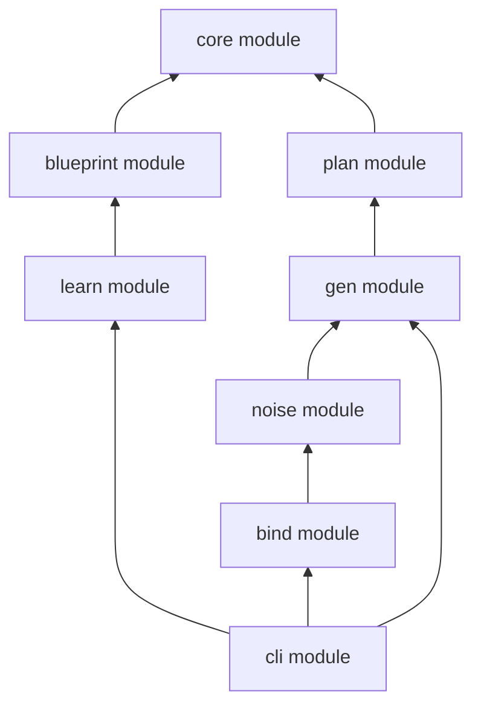
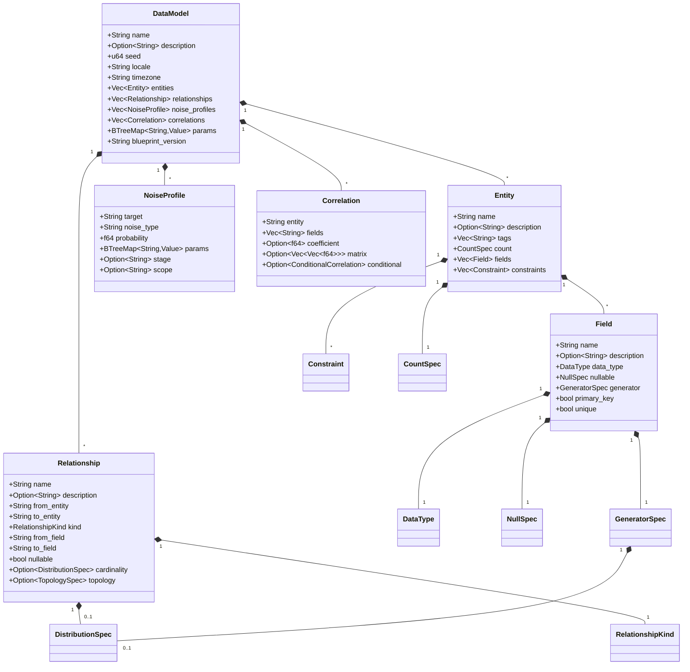

# core module — Design Document

**Version:** 0.1.0
**Status:** Draft
**Module:** `core module`

---

## 1. Overview

### Purpose

`core module` is the **semantic model** module — the narrow, stable foundation that every
other module in the single crate depends on. It defines the in-memory representation
of a parsed Weave document: the types that flow between parsing, planning, generation,
perturbation, and serialization stages.



### Design Philosophy

**Narrow and stable.** Every addition to `core module` ripples across all downstream
modules. The bar for new types or fields is deliberately high.

| Principle | Implication |
|-----------|-------------|
| **Data only** | Pure data structures. No engine traits, no I/O, no behavior beyond `Display`/`Default`. |
| **Minimal surface** | Only types that ≥2 modules need. Single-module types belong in that module. |
| **Stable contracts** | Field additions are non-breaking (serde `default`); field removals or type changes are breaking. |
| **No runtime cost** | No allocators, no threads, no async. `Clone` + `Send` + `Sync` everywhere. |

### What Belongs Here vs. Elsewhere

| Belongs in `core module` | Belongs elsewhere |
|-------------------------|-------------------|
| `DataModel`, `Entity`, `Field` | Parser logic → `blueprint module` |
| `GeneratorSpec`, `DistributionSpec` | `FieldGenerator` trait → `gen module` |
| `Value` enum | Arrow `RecordBatch` operations → `gen module` |
| `Relationship`, `Constraint` | `ExecutionPlan` → `plan module` |
| `NullSpec`, `CountSpec` | `Perturbator` trait → `noise module` |
| `NoiseProfile` | `Sink` trait → `bind module` |
| `ModelError` (validation) | Parse errors (`BlueprintError`) → `blueprint module` |

---

## 2. Dependencies

```toml
[dependencies]
serde = { version = "1", features = ["derive"] }
chrono = { version = "0.4", features = ["serde"] }
uuid = { version = "1", features = ["v4", "v7", "serde"] }
```

**Three dependencies. That's it.**

| Dependency | Why |
|-----------|-----|
| `serde` | Every model type must round-trip through TOML and JSON. Derive macros keep boilerplate near zero. |
| `chrono` | Temporal types (`NaiveDate`, `NaiveTime`, `NaiveDateTime`, `DateTime<Tz>`, `Duration`) are first-class in Weave. Reimplementing them would be a liability. |
| `uuid` | UUID is a dedicated `DataType` and `Value` variant. The `uuid` crate provides parsing, formatting, and v4/v7 generation. |

### Why Minimal Dependencies Matter

`core module` sits at the root of the dependency graph. Every dependency added here is
transitively inherited by every module in the single crate. This means:

- **Compile time** — Adding a crate like `regex` here adds it to every module build.
- **Security surface** — Every dependency is an attack vector. Core should be auditable
  by reading a few hundred lines.
- **MSRV pressure** — Upstream MSRV bumps in core deps force project-wide toolchain
  upgrades.
- **Reproducibility** — Fewer moving parts means fewer surprising breakages on
  `cargo update`.

If a type needs functionality from a heavier dependency (e.g., `arrow`, `petgraph`), that
logic belongs in the module that uses it, not in `core module`.

---

## 3. Type Hierarchy



---

## 4. Core Types

### 4.1 `DataModel`

The top-level container — the in-memory representation of a complete Weave document.

```rust
/// A complete data model parsed from a knit blueprint.
///
/// This is the single artifact that flows from `blueprint module` (parsing)
/// through `plan module` (compilation) and into the generation engine.
/// It is fully self-contained: no file paths, no I/O handles, no
/// references to external state.
#[derive(Debug, Clone, PartialEq, Serialize, Deserialize)]
pub struct DataModel {
    /// Human-readable name for this dataset (e.g., "ecommerce").
    pub name: String,

    /// Optional prose description. Ignored by the engine; useful for
    /// AI agents and human readers.
    #[serde(default, skip_serializing_if = "Option::is_none")]
    pub description: Option<String>,

    /// Global RNG seed. Same seed + same blueprint = identical output.
    #[serde(default = "default_seed")]
    pub seed: u64,

    /// BCP 47 locale for faker generators (e.g., "en_US").
    #[serde(default = "default_locale")]
    pub locale: String,

    /// IANA timezone for temporal generators (e.g., "UTC").
    #[serde(default = "default_timezone")]
    pub timezone: String,

    /// Ordered list of entity definitions.
    #[serde(default)]
    pub entities: Vec<Entity>,

    /// Inter-entity relationships (foreign keys).
    #[serde(default)]
    pub relationships: Vec<Relationship>,

    /// Post-generation noise/perturbation profiles.
    #[serde(default)]
    pub noise_profiles: Vec<NoiseProfile>,

    /// Cross-field correlation specifications.
    #[serde(default)]
    pub correlations: Vec<Correlation>,

    /// User-supplied parameters for blueprint templating.
    #[serde(default)]
    pub params: BTreeMap<String, Value>,

    /// knit blueprint version string (e.g., "1.0").
    #[serde(default = "default_blueprint_version")]
    pub blueprint_version: String,
}
```

### 4.2 `Entity`

```rust
/// A logical table or collection within the dataset.
///
/// Each entity produces one output table (or file partition set).
/// Entities are identified by `name`, which must be unique within
/// the model.
#[derive(Debug, Clone, PartialEq, Serialize, Deserialize)]
pub struct Entity {
    /// Unique name within the model (e.g., "user", "order").
    pub name: String,

    /// Optional prose description.
    #[serde(default, skip_serializing_if = "Option::is_none")]
    pub description: Option<String>,

    /// Freeform tags for filtering and documentation.
    #[serde(default)]
    pub tags: Vec<String>,

    /// How many rows to generate.
    pub count: CountSpec,

    /// Ordered list of field definitions.
    #[serde(default)]
    pub fields: Vec<Field>,

    /// Intra-entity constraints (unique composites, check expressions).
    #[serde(default)]
    pub constraints: Vec<Constraint>,
}
```

### 4.3 `Field`

```rust
/// A named column within an entity.
///
/// Fields are identified by `name`, unique within their parent entity.
/// The combination of `data_type` and `generator` fully specifies how
/// values are produced.
#[derive(Debug, Clone, PartialEq, Serialize, Deserialize)]
pub struct Field {
    /// Column name (e.g., "email", "created_at").
    pub name: String,

    /// Optional prose description.
    #[serde(default, skip_serializing_if = "Option::is_none")]
    pub description: Option<String>,

    /// The logical data type of this field.
    #[serde(rename = "type")]
    pub data_type: DataType,

    /// Null generation strategy. Defaults to `Never`.
    #[serde(default)]
    pub nullable: NullSpec,

    /// How values are produced. Defaults to type-appropriate default.
    #[serde(default)]
    pub generator: GeneratorSpec,

    /// Whether this field is the entity's primary key.
    #[serde(default)]
    pub primary_key: bool,

    /// Whether all generated values must be unique.
    #[serde(default)]
    pub unique: bool,
}
```

### 4.4 `DataType`

```rust
/// Logical data types supported by Weave.
///
/// These map to Arrow types during generation and to language-native
/// types during output binding. The enum is intentionally flat — no
/// parameterized generics — to keep serde tagging simple.
#[derive(Debug, Clone, Copy, PartialEq, Eq, Hash, Serialize, Deserialize)]
#[serde(rename_all = "snake_case")]
pub enum DataType {
    Bool,
    Int,
    Float,
    String,
    Uuid,
    Date,
    Time,
    Datetime,
    /// Datetime with timezone (IANA tz identifier stored alongside).
    Datetimetz,
    Duration,
    Bytes,
    /// Homogeneous array (element type inferred from generator).
    Array,
    /// String-keyed map (value type inferred from generator).
    Map,
}
```

### 4.5 `Value`

```rust
/// A typed runtime value.
///
/// `Value` is the **API-boundary** type — used in blueprint params,
/// constant generators, noise profile params, and test assertions.
/// It is NOT used for bulk generation (that uses Arrow columnar
/// buffers). Think of `Value` as "one cell" and `ArrayRef` as
/// "one column."
///
/// The variant set mirrors `DataType` but carries actual data.
#[derive(Debug, Clone, PartialEq, Serialize, Deserialize)]
#[serde(untagged)]
pub enum Value {
    Null,
    Bool(bool),
    Int(i64),
    Float(f64),
    String(String),
    DateTime(NaiveDateTime),
    DateTimeTz(DateTime<Tz>),
    Date(NaiveDate),
    Time(NaiveTime),
    Duration(chrono::Duration),
    Uuid(Uuid),
    Bytes(Vec<u8>),
    Array(Vec<Value>),
    Map(BTreeMap<String, Value>),
}
```

### 4.6 `GeneratorSpec`

```rust
/// Specification for how a field's values are generated.
///
/// Each variant corresponds to one of the 14 generator types in the
/// Weave language. The engine maps each `GeneratorSpec` to a concrete
/// `FieldGenerator` implementation at plan time.
///
/// This is an enum (not trait objects) because:
/// - Specs are pure data — no behavior, no vtables.
/// - Exhaustive matching catches missing generator support at compile time.
/// - Serde tagged enums map directly to TOML `{ type = "..." }` syntax.
#[derive(Debug, Clone, PartialEq, Serialize, Deserialize)]
#[serde(tag = "type", rename_all = "snake_case")]
pub enum GeneratorSpec {
    /// Sample from a statistical distribution.
    Distribution(DistributionSpec),

    /// Generate realistic structured data (names, emails, addresses).
    Faker {
        category: String,
        #[serde(default, skip_serializing_if = "Option::is_none")]
        locale: Option<String>,
    },

    /// Auto-incrementing or cycling sequence.
    Sequence {
        #[serde(default = "default_seq_start")]
        start: i64,
        #[serde(default = "default_seq_step")]
        step: i64,
    },

    /// Weighted random selection from a fixed set.
    OneOf {
        choices: Vec<WeightedChoice>,
    },

    /// Generate strings matching a format pattern or regex.
    Pattern {
        #[serde(default, skip_serializing_if = "Option::is_none")]
        format: Option<String>,
        #[serde(default, skip_serializing_if = "Option::is_none")]
        regex: Option<String>,
        #[serde(default, skip_serializing_if = "Option::is_none")]
        template: Option<String>,
    },

    /// Compute value from other fields via an expression.
    Derived {
        expr: String,
    },

    /// Choose generator based on another field's value.
    Conditional {
        on: String,
        branches: Vec<ConditionalBranch>,
        default: Box<GeneratorSpec>,
    },

    /// Generate arrays with configurable element generator and length.
    Composite {
        element: Box<GeneratorSpec>,
        length: DistributionSpec,
        #[serde(default)]
        unique_elements: bool,
    },

    /// Sample values from an external data file.
    Lookup {
        source: String,
        column: String,
        #[serde(default = "default_lookup_format")]
        format: String,
        #[serde(default = "default_lookup_sampling")]
        sampling: String,
        #[serde(default, skip_serializing_if = "Option::is_none")]
        weight_column: Option<String>,
    },

    /// Fixed value for every row.
    Constant(Value),

    /// Random UUID (v4 or v7).
    Uuid {
        #[serde(default = "default_uuid_version")]
        version: u8,
    },

    /// Wrap an inner generator to enforce uniqueness with retry.
    Unique {
        inner: Box<GeneratorSpec>,
        #[serde(default = "default_max_retries")]
        max_retries: u64,
    },

    /// Generate datetimes relative to another field.
    Relative {
        anchor: String,
        offset: Box<DistributionSpec>,
    },

    /// Generate datetimes constrained to business hours.
    BusinessHours {
        start_hour: u8,
        end_hour: u8,
        #[serde(default = "default_business_days")]
        days: Vec<String>,
        date_range: DateRange,
        #[serde(default, skip_serializing_if = "Option::is_none")]
        exclude_dates: Option<Vec<String>>,
        #[serde(default, skip_serializing_if = "Option::is_none")]
        timezone_field: Option<String>,
    },
}
```

### 4.7 `DistributionSpec`

```rust
/// Specification for a statistical probability distribution.
///
/// Used by `GeneratorSpec::Distribution`, `CountSpec::Distribution`,
/// and `Relationship::cardinality`. The `params` map is distribution-
/// specific (e.g., `mean`/`std_dev` for Normal).
#[derive(Debug, Clone, PartialEq, Serialize, Deserialize)]
pub struct DistributionSpec {
    /// Which distribution family to sample from.
    #[serde(rename = "distribution")]
    pub kind: DistributionKind,

    /// Distribution-specific parameters.
    #[serde(default)]
    pub params: BTreeMap<String, f64>,

    /// Optional lower clamp. Values below this are resampled.
    #[serde(default, skip_serializing_if = "Option::is_none")]
    pub min: Option<f64>,

    /// Optional upper clamp. Values above this are resampled.
    #[serde(default, skip_serializing_if = "Option::is_none")]
    pub max: Option<f64>,
}
```

### 4.8 `DistributionKind`

```rust
/// Supported statistical distribution families.
///
/// Each variant maps to a concrete sampler in `gen module`. The `Custom`
/// variant is a forward-compatibility escape hatch for plugin-provided
/// distributions.
#[derive(Debug, Clone, Copy, PartialEq, Eq, Hash, Serialize, Deserialize)]
#[serde(rename_all = "snake_case")]
pub enum DistributionKind {
    Uniform,
    Normal,
    LogNormal,
    Exponential,
    Poisson,
    Zipf,
    Bernoulli,
    Beta,
    Gamma,
    Pareto,
    Weibull,
    Cauchy,
    ChiSquared,
    StudentT,
    Triangular,
    Geometric,
    Custom,
}
```

### 4.9 `NullSpec`

```rust
/// Controls whether and how nulls are injected into a field.
///
/// `NullSpec` is orthogonal to the generator — it wraps the output
/// and replaces some values with null after generation.
#[derive(Debug, Clone, PartialEq, Serialize, Deserialize)]
#[serde(rename_all = "snake_case")]
pub enum NullSpec {
    /// No nulls ever. The default for all fields.
    Never,
    /// Every value is null (useful for placeholder fields).
    Always,
    /// Each value is independently null with the given probability.
    Probability(f64),
    /// Deterministic null pattern: every Nth row is null.
    Pattern { every_n: usize },
}

impl Default for NullSpec {
    fn default() -> Self { NullSpec::Never }
}
```

### 4.10 `CountSpec`

```rust
/// How many rows to generate for an entity.
///
/// `Fixed` is the common case. `Range` and `Distribution` are for
/// blueprints where the exact count is intentionally variable (e.g.,
/// parameterized stress tests).
#[derive(Debug, Clone, PartialEq, Serialize, Deserialize)]
#[serde(untagged)]
pub enum CountSpec {
    /// Exactly N rows.
    Fixed(u64),
    /// Random count in [min, max].
    Range { min: u64, max: u64 },
    /// Count drawn from a distribution (rounded to nearest integer).
    Distribution(DistributionSpec),
}
```

### 4.11 `Relationship`

```rust
/// A foreign-key link between two entities (or self-referential).
///
/// Relationships control how entities reference each other. The
/// `cardinality` distribution governs how many child records
/// reference each parent (e.g., Zipf for "popular items get more
/// orders").
#[derive(Debug, Clone, PartialEq, Serialize, Deserialize)]
pub struct Relationship {
    /// Unique name for this relationship (e.g., "order_user").
    pub name: String,

    /// Optional prose description.
    #[serde(default, skip_serializing_if = "Option::is_none")]
    pub description: Option<String>,

    /// Source entity name (the "many" side in many-to-one).
    #[serde(rename = "from")]
    pub from_entity: String,

    /// Target entity name (the "one" side in many-to-one).
    #[serde(rename = "to")]
    pub to_entity: String,

    /// Cardinality type of the relationship.
    pub kind: RelationshipKind,

    /// Field in the source entity that holds the foreign key.
    pub from_field: String,

    /// Field in the target entity that is referenced (usually the PK).
    pub to_field: String,

    /// Whether the FK field can be null (for optional relationships).
    #[serde(default)]
    pub nullable: bool,

    /// Distribution governing how many children reference each parent.
    #[serde(default, skip_serializing_if = "Option::is_none")]
    pub cardinality: Option<DistributionSpec>,

    /// Optional graph topology specification for network/graph relationships.
    #[serde(default, skip_serializing_if = "Option::is_none")]
    pub topology: Option<TopologySpec>,
}
```

### 4.12 `RelationshipKind`

```rust
/// Cardinality type for a relationship.
#[derive(Debug, Clone, Copy, PartialEq, Eq, Hash, Serialize, Deserialize)]
#[serde(rename_all = "snake_case")]
pub enum RelationshipKind {
    OneToOne,
    OneToMany,
    ManyToOne,
    ManyToMany,
}
```

### 4.13 `NoiseProfile`

```rust
/// A post-generation perturbation specification.
///
/// Noise profiles are applied after generation, before output binding.
/// They inject controlled imperfections (typos, outliers, null injection,
/// FK violations) into the generated data.
#[derive(Debug, Clone, PartialEq, Serialize, Deserialize)]
pub struct NoiseProfile {
    /// Dot-separated target (e.g., "user.email" or "order.amount").
    pub target: String,

    /// Perturbation type identifier (e.g., "typo", "outlier", "null").
    #[serde(rename = "type")]
    pub noise_type: String,

    /// Probability that each row is perturbed (0.0 – 1.0).
    pub probability: f64,

    /// Type-specific parameters (e.g., `{ multiplier: { ... } }`).
    #[serde(default)]
    pub params: BTreeMap<String, Value>,

    /// Pipeline stage: "clean", "constrained", or "breaking".
    #[serde(default, skip_serializing_if = "Option::is_none")]
    pub stage: Option<String>,

    /// Optional predicate to scope noise to matching rows.
    #[serde(default, skip_serializing_if = "Option::is_none")]
    pub scope: Option<String>,
}
```

### 4.14 `Constraint`

```rust
/// An intra-entity constraint (unique composite, check expression).
#[derive(Debug, Clone, PartialEq, Serialize, Deserialize)]
pub struct Constraint {
    /// Constraint type (e.g., "unique", "check").
    #[serde(rename = "type")]
    pub constraint_type: String,

    /// Fields involved in the constraint.
    #[serde(default)]
    pub fields: Vec<String>,

    /// Optional check expression (for "check" type constraints).
    #[serde(default, skip_serializing_if = "Option::is_none")]
    pub expression: Option<String>,
}
```

### 4.15 `WeightedChoice`

```rust
/// A value with an associated selection weight for `OneOf` generators.
#[derive(Debug, Clone, PartialEq, Serialize, Deserialize)]
pub struct WeightedChoice {
    /// The value to emit when this choice is selected.
    pub value: Value,

    /// Relative weight (does not need to sum to 1.0).
    #[serde(default = "default_weight")]
    pub weight: f64,
}
```

### 4.16 `Correlation`

```rust
/// Cross-field correlation specification.
///
/// Correlations enforce statistical dependencies between fields
/// that go beyond independent marginal distributions. Supports
/// pair-wise Pearson coefficients, full correlation matrices,
/// and conditional distributions.
#[derive(Debug, Clone, PartialEq, Serialize, Deserialize)]
pub struct Correlation {
    /// The entity these fields belong to.
    pub entity: String,

    /// The fields to correlate.
    pub fields: Vec<String>,

    /// Pearson correlation for two-field case (-1.0 to 1.0).
    #[serde(default, skip_serializing_if = "Option::is_none")]
    pub coefficient: Option<f64>,

    /// Full correlation matrix for multi-field case.
    #[serde(default, skip_serializing_if = "Option::is_none")]
    pub matrix: Option<Vec<Vec<f64>>>,

    /// Conditional distribution specification.
    #[serde(default, skip_serializing_if = "Option::is_none")]
    pub conditional: Option<ConditionalCorrelation>,

    /// Implementation method: "copula", "rank", or "rejection".
    #[serde(default = "default_correlation_method")]
    pub method: String,
}

/// Conditional distribution within a correlation.
#[derive(Debug, Clone, PartialEq, Serialize, Deserialize)]
pub struct ConditionalCorrelation {
    /// The dependent field whose distribution varies.
    pub dependent: String,
    /// The field that conditions the distribution.
    pub given: String,
    /// Per-value distribution overrides.
    pub distributions: Vec<ConditionalBranch>,
}
```

### Supporting Types

```rust
/// A branch in a conditional generator or conditional correlation.
#[derive(Debug, Clone, PartialEq, Serialize, Deserialize)]
pub struct ConditionalBranch {
    pub when: Value,
    pub then: GeneratorSpec,
}

/// Graph topology specification for network-structured relationships.
#[derive(Debug, Clone, PartialEq, Serialize, Deserialize)]
pub struct TopologySpec {
    /// Topology model (e.g., "barabasi_albert", "watts_strogatz").
    pub model: String,
    /// Model-specific parameters.
    #[serde(default)]
    pub params: BTreeMap<String, f64>,
}

/// Date range for temporal generators.
#[derive(Debug, Clone, PartialEq, Serialize, Deserialize)]
pub struct DateRange {
    pub min: String,
    pub max: String,
}
```

---

## 5. Serde Strategy

All `core module` types must round-trip through both TOML (primary, user-facing) and JSON
(programmatic AI pipelines). The serde strategy is designed for the Weave language's
"one correct way" philosophy.

### Tag Conventions

| Type | Serde Representation | Rationale |
|------|---------------------|-----------|
| `GeneratorSpec` | `#[serde(tag = "type")]` — internally tagged | Maps to TOML `{ type = "distribution", ... }`. Readable, grep-friendly. |
| `DataType` | `#[serde(rename_all = "snake_case")]` — unit enum | Maps to TOML `type = "datetime"`. Lowercase, no ambiguity. |
| `DistributionKind` | `#[serde(rename_all = "snake_case")]` — unit enum | Maps to TOML `distribution = "log_normal"`. |
| `RelationshipKind` | `#[serde(rename_all = "snake_case")]` — unit enum | Maps to TOML `kind = "many_to_one"`. |
| `NullSpec` | `#[serde(rename_all = "snake_case")]` — externally tagged | `true` → `Always`, `false` → `Never`, `{ probability = 0.05 }` → `Probability`. |
| `CountSpec` | `#[serde(untagged)]` | `100000` → `Fixed`, `{ min = 50000, max = 150000 }` → `Range`. Untagged because the TOML surface is overloaded. |
| `Value` | `#[serde(untagged)]` | Must deserialize from bare TOML/JSON literals without a type tag. |

### Flattening Rules

- **`DistributionSpec` inside `GeneratorSpec::Distribution`**: The distribution fields
  are flattened into the generator object. In TOML:
  `{ type = "distribution", distribution = "normal", params = { mean = 35.0 }, min = 18 }`.
- **`Field.data_type`**: Renamed to `type` via `#[serde(rename = "type")]` to match
  the Weave language surface.
- **Optional fields**: All `Option<T>` fields use `#[serde(skip_serializing_if = "Option::is_none")]`
  to keep serialized output clean.
- **Defaults**: All `Vec<T>` and `BTreeMap<K,V>` fields use `#[serde(default)]` so
  that omitting them in the blueprint produces an empty collection, not a parse error.

### JSON Compatibility

JSON uses identical structure. No JSON-specific serde attributes. The same
`Serialize`/`Deserialize` impls work for both `serde_json` and `toml` crates (used
by `blueprint module`, not by `core module` directly — core has no parser dependency).

---

## 6. Trait Implementations

Every public type in `core module` derives or implements these standard traits:

| Trait | Derived / Manual | Notes |
|-------|-----------------|-------|
| `Debug` | Derived | Required for error messages and logging across all modules. |
| `Clone` | Derived | `DataModel` is cloned when the planner takes ownership. All types are owned, no lifetimes. |
| `PartialEq` | Derived | Needed for test assertions (`assert_eq!`) and serde round-trip validation. |
| `Serialize` | Derived | Via `serde`. Every type must serialize to TOML/JSON. |
| `Deserialize` | Derived | Via `serde`. Every type must deserialize from TOML/JSON. |
| `Default` | Selective | `NullSpec` defaults to `Never`. `GeneratorSpec` has no blanket `Default` — the appropriate default depends on `DataType` and is resolved by `blueprint module`. |
| `Display` | Manual | Implemented on `DataType`, `DistributionKind`, `RelationshipKind`, `Value`, and `NullSpec` for human-readable output in CLI messages and error diagnostics. |
| `Send + Sync` | Auto | All types are `Send + Sync` because they contain no `Rc`, `Cell`, or raw pointers. This is essential for `rayon` parallelism in `gen module`. |

### Why No Engine Traits Here

Traits like `FieldGenerator`, `Perturbator`, and `Sink` are **behavioral contracts**
that depend on heavy crates (`arrow`, `rand`, `rayon`). Placing them in `core module`
would:

1. Pull those dependencies into every module in the single crate.
2. Couple the spec types to execution concerns — a `GeneratorSpec` describes *what*
   to generate, not *how* to generate it.
3. Make `core module` a moving target: engine trait evolution would force version bumps
   on the foundation module.

Engine traits live in their respective modules (`gen module`, `noise module`, `bind module`).

---

## 7. Error Types

```rust
/// Validation errors for the semantic model.
///
/// `ModelError` covers structural and semantic errors that can be
/// detected by inspecting a `DataModel` without parsing context.
/// Parse errors (syntax, line numbers, file paths) belong in
/// `blueprint module::BlueprintError`.
#[derive(Debug, Clone, PartialEq)]
pub enum ModelError {
    /// A required field is missing (e.g., entity with no name).
    MissingField {
        path: String,
        field: String,
    },

    /// A referenced entity or field does not exist.
    InvalidReference {
        path: String,
        target: String,
        message: String,
    },

    /// A distribution parameter is out of valid range.
    InvalidDistributionParam {
        distribution: DistributionKind,
        param: String,
        value: f64,
        message: String,
    },

    /// A probability value is outside [0.0, 1.0].
    InvalidProbability {
        path: String,
        value: f64,
    },

    /// Duplicate names within the same scope.
    DuplicateName {
        scope: String,
        name: String,
    },

    /// A correlation matrix is not valid (not symmetric, not PSD,
    /// wrong dimensions).
    InvalidCorrelationMatrix {
        entity: String,
        message: String,
    },

    /// A count spec is invalid (e.g., min > max in Range).
    InvalidCount {
        entity: String,
        message: String,
    },

    /// Generic validation error with a path and message.
    Other {
        path: String,
        message: String,
    },
}

impl std::fmt::Display for ModelError {
    fn fmt(&self, f: &mut std::fmt::Formatter<'_>) -> std::fmt::Result {
        match self {
            ModelError::MissingField { path, field } =>
                write!(f, "{path}: missing required field '{field}'"),
            ModelError::InvalidReference { path, target, message } =>
                write!(f, "{path}: invalid reference to '{target}': {message}"),
            ModelError::InvalidDistributionParam { distribution, param, value, message } =>
                write!(f, "{distribution:?}.{param} = {value}: {message}"),
            ModelError::InvalidProbability { path, value } =>
                write!(f, "{path}: probability {value} outside [0.0, 1.0]"),
            ModelError::DuplicateName { scope, name } =>
                write!(f, "{scope}: duplicate name '{name}'"),
            ModelError::InvalidCorrelationMatrix { entity, message } =>
                write!(f, "correlations[{entity}]: {message}"),
            ModelError::InvalidCount { entity, message } =>
                write!(f, "{entity}.count: {message}"),
            ModelError::Other { path, message } =>
                write!(f, "{path}: {message}"),
        }
    }
}

impl std::error::Error for ModelError {}
```

### Error Boundary

| Error Kind | Owner Crate | Example |
|------------|-------------|---------|
| Model validation (semantic) | `core module` (`ModelError`) | "entity 'order' references unknown entity 'usr'" |
| Parse errors (syntax) | `blueprint module` (`BlueprintError`) | "line 42: expected string, found integer" |
| Plan errors (infeasibility) | `plan module` (`PlanError`) | "cycle detected: order → user → order" |
| Generation errors (runtime) | `gen module` (`GenError`) | "unique constraint exhausted after 1000 retries" |

---

## 8. Versioning & Stability

### SemVer Guarantees

`core module` follows Rust/Cargo SemVer strictly. Because it is the foundation module,
the version policy is more conservative than downstream modules.

| Change | SemVer Impact | Example |
|--------|--------------|---------|
| Add optional field with `#[serde(default)]` | **Patch** | Adding `Entity.metadata: Option<Map>` |
| Add enum variant | **Minor** | Adding `DataType::Json` |
| Rename field | **Major** | Renaming `Entity.name` → `Entity.id` |
| Remove field | **Major** | Removing `Field.unique` |
| Change field type | **Major** | Changing `seed: u64` → `seed: u128` |
| Add new struct | **Minor** | Adding `TimeSeriesSpec` |
| Remove struct | **Major** | Removing `Constraint` |

### Deprecation Policy

1. Deprecated items are marked with `#[deprecated(since = "x.y.z", note = "...")]`.
2. Deprecated items remain for at least **one minor version** before removal.
3. Removal happens only in a **major version** bump.

### What Constitutes a Breaking Change

Any change that causes downstream code to **fail to compile** or **fail to deserialize
previously valid input** is breaking. Specifically:

- Removing or renaming a public type, field, variant, or method.
- Changing the serde representation of any type (tag strategy, field names, rename rules).
- Tightening validation that previously accepted input (e.g., rejecting a
  `DistributionKind` that was previously `Custom`).
- Changing `Default` implementations to produce different values.

---

## 9. Design Decisions

| # | Decision | Rationale | Alternatives Considered |
|---|----------|-----------|------------------------|
| 1 | **`Value` enum exists alongside Arrow** | `Value` is needed at API boundaries (blueprint params, constants, test assertions) where constructing an Arrow array for a single cell is wasteful. Arrow is used for bulk generation. Two representations serve different granularity needs. | Single `Value`-only approach (too slow for generation); Arrow-only (awkward for single-value contexts). |
| 2 | **`GeneratorSpec` is an enum, not trait objects** | Generator specs are pure data (serialized in blueprints). Exhaustive matching ensures compile-time coverage when adding new generators. Trait objects would require a registry and lose serde ergonomics. | `Box<dyn GeneratorSpec>` with `typetag` — adds runtime overhead and dynamic dispatch for what is a static, bounded set. |
| 3 | **`BTreeMap` over `HashMap`** | Deterministic iteration order is essential for reproducibility. Same blueprint → same serialized output, always. `HashMap` randomizes iteration, causing diffs in round-tripped blueprints. | `IndexMap` — adds a dependency for marginal benefit over `BTreeMap`. |
| 4 | **No engine traits in core** | Engine traits (`FieldGenerator`, `Perturbator`, `Sink`) depend on `arrow`, `rand`, `rayon`. Putting them here would bloat the dependency tree for all modules, including `blueprint module` and `learn module` which never execute generation. | Lightweight trait-only module — adds extra module-boundary complexity for minimal benefit since traits are only consumed by one or two modules each. |
| 5 | **`DistributionKind::Custom` variant** | Forward-compatibility for plugin-provided distributions. Without it, adding a distribution requires a `core module` release. With it, plugins can use `Custom` and a string identifier in `params`. | Open-ended string type — loses exhaustive matching benefits for the 17 built-in distributions. |
| 6 | **`NullSpec` as a separate enum** | Null behavior is orthogonal to generation. Combining it into `GeneratorSpec` would duplicate null logic across 14 generator variants. Separating it allows a single null-wrapping pass after generation. | `nullable: bool` — too limited; real data has varied null patterns (5% probability, every-Nth-row, etc.). |
| 7 | **`CountSpec::Distribution`** | Some blueprints need variable entity sizes (e.g., parameterized stress tests where count follows a distribution). Fixed-only would limit expressiveness. | Always-fixed count — simpler but insufficient for advanced use cases. |
| 8 | **Temporal types use `chrono`** | `chrono` is the de facto Rust datetime library with comprehensive timezone support, serde integration, and arithmetic. Rolling our own temporal types would be error-prone and poorly tested. | `time` crate — viable but less ecosystem adoption; mixing both causes conversion overhead. |
| 9 | **`uuid` as a dedicated `DataType`** | UUIDs are extremely common as primary keys in synthetic datasets. A dedicated type (vs. `String` + validation) enables optimized columnar generation and correct Arrow `FixedSizeBinary(16)` mapping. | Treat as `String` with a pattern generator — loses type safety and Arrow optimization. |
| 10 | **Serde `rename_all = "snake_case"` on enums** | Matches TOML/JSON conventions and the Weave language surface. `ManyToOne` serializes as `"many_to_one"`, which is what users write in blueprints. | PascalCase (Rust default) — requires mental translation when reading blueprints. |

---

## 10. Testing Strategy

### Unit Tests

All unit tests live in `core module/src/` as `#[cfg(test)] mod tests` blocks, colocated
with the types they test.

#### Serde Round-Trip Tests

Every public type must pass a serialize → deserialize → assert-eq round-trip for both
JSON and TOML representations. This catches accidental serde attribute changes.

```rust
#[test]
fn data_model_json_round_trip() {
    let model = DataModel { /* ... populate all fields ... */ };
    let json = serde_json::to_string(&model).unwrap();
    let deserialized: DataModel = serde_json::from_str(&json).unwrap();
    assert_eq!(model, deserialized);
}

#[test]
fn generator_spec_toml_round_trip() {
    let specs = vec![
        GeneratorSpec::Distribution(DistributionSpec { /* ... */ }),
        GeneratorSpec::Faker { category: "name".into(), locale: None },
        GeneratorSpec::Sequence { start: 1, step: 1 },
        // ... all 14 variants
    ];
    for spec in specs {
        let toml = toml::to_string(&spec).unwrap();
        let deserialized: GeneratorSpec = toml::from_str(&toml).unwrap();
        assert_eq!(spec, deserialized);
    }
}
```

#### Display Formatting Tests

```rust
#[test]
fn data_type_display() {
    assert_eq!(DataType::Datetimetz.to_string(), "datetimetz");
    assert_eq!(DataType::Int.to_string(), "int");
}

#[test]
fn value_display() {
    assert_eq!(Value::Int(42).to_string(), "42");
    assert_eq!(Value::Null.to_string(), "null");
    assert_eq!(Value::String("hello".into()).to_string(), "\"hello\"");
}
```

#### Default Value Tests

```rust
#[test]
fn null_spec_defaults_to_never() {
    assert_eq!(NullSpec::default(), NullSpec::Never);
}

#[test]
fn missing_optional_fields_use_defaults() {
    let json = r#"{"name":"test","count":100,"fields":[]}"#;
    let entity: Entity = serde_json::from_str(json).unwrap();
    assert_eq!(entity.tags, Vec::<String>::new());
    assert_eq!(entity.constraints, Vec::<Constraint>::new());
    assert!(entity.description.is_none());
}
```

#### ModelError Display Tests

```rust
#[test]
fn model_error_messages_are_readable() {
    let err = ModelError::DuplicateName {
        scope: "model.entities".into(),
        name: "user".into(),
    };
    assert_eq!(err.to_string(), "model.entities: duplicate name 'user'");
}
```

### What Is NOT Tested Here

| Concern | Tested In |
|---------|-----------|
| TOML/JSON parsing from files | `blueprint module` |
| Validation rules (referential integrity, distribution params) | `blueprint module` |
| Arrow type mapping | `gen module` |
| Serde compatibility with actual Weave `.toml` files | `blueprint module` integration tests |

---

*This document covers `core module` only. See [`architecture.md`](architecture.md) for
the full system design and [`knit-spec.md`](knit-spec.md) for the blueprint language
specification.*
