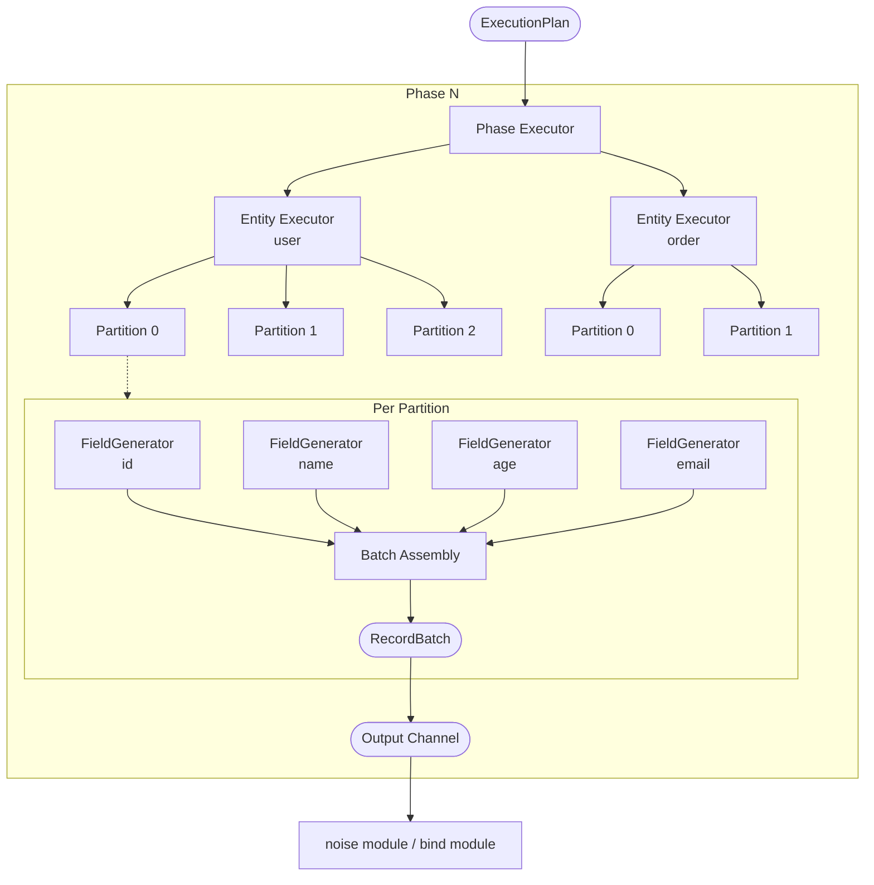
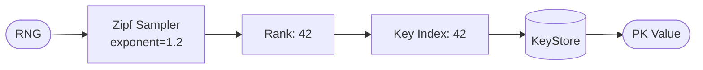
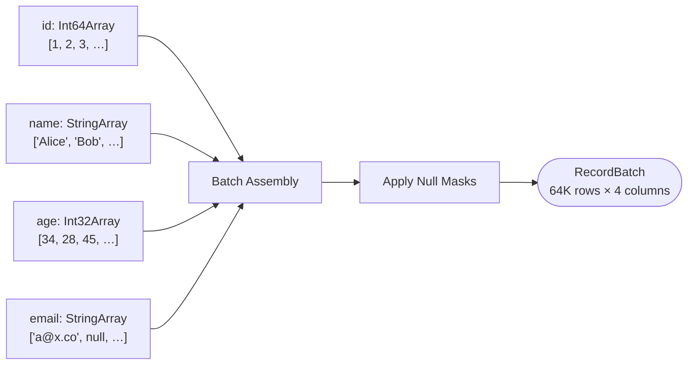
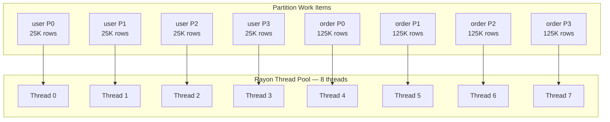
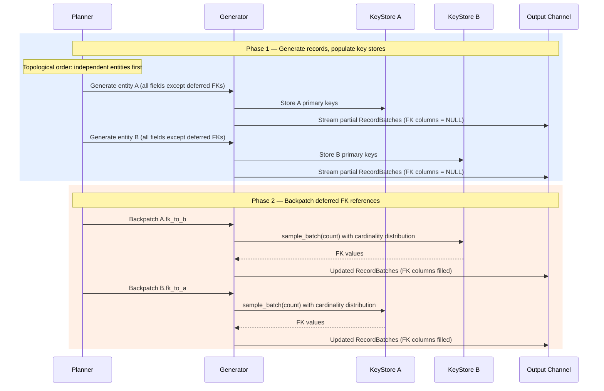
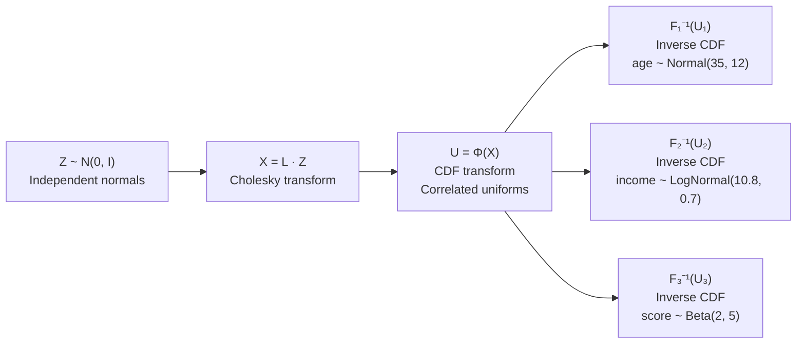
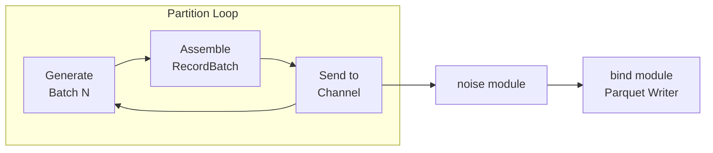

# gen module — Design Document

**Version:** 0.1.0
**Status:** Draft

---

## Table of Contents

- [1. Overview](#1-overview)
- [2. Dependencies](#2-dependencies)
- [3. Architecture](#3-architecture)
- [4. FieldGenerator Trait](#4-fieldgenerator-trait)
- [5. Built-in Generators](#5-built-in-generators)
  - [5.1 DistributionGenerator](#51-distributiongenerator)
  - [5.2 FakerGenerator](#52-fakergenerator)
  - [5.3 SequenceGenerator](#53-sequencegenerator)
  - [5.4 OneOfGenerator](#54-oneofgenerator)
  - [5.5 PatternGenerator](#55-patterngenerator)
  - [5.6 DerivedGenerator](#56-derivedgenerator)
  - [5.7 ConditionalGenerator](#57-conditionalgenerator)
  - [5.8 CompositeGenerator](#58-compositegenerator)
  - [5.9 LookupGenerator](#59-lookupgenerator)
  - [5.10 UuidGenerator](#510-uuidgenerator)
  - [5.11 UniqueGenerator](#511-uniquegenerator)
  - [5.12 RelativeGenerator](#512-relativegenerator)
  - [5.13 BusinessHoursGenerator](#513-businesshoursgenerator)
- [6. KeyStore Trait](#6-keystore-trait)
- [7. Batch Assembly](#7-batch-assembly)
- [8. Parallel Execution](#8-parallel-execution)
- [9. Two-Phase Execution](#9-two-phase-execution)
- [10. Time Series Generation](#10-time-series-generation)
- [11. Correlation Enforcement](#11-correlation-enforcement)
- [12. Graph Topology](#12-graph-topology)
- [13. Performance Optimizations](#13-performance-optimizations)
- [14. Testing Strategy](#14-testing-strategy)
- [15. Design Decisions](#15-design-decisions)

---

## 1. Overview

`gen module` is the core execution engine of the Knit toolset. It takes a compiled
`ExecutionPlan` (produced by `plan module`) and executes it to produce Arrow
`RecordBatch` streams — the raw synthetic data that flows downstream to
`noise module` for perturbation and `bind module` for serialization.

Everything in `gen module` is designed around three principles:

1. **Columnar-first** — All generation produces Arrow arrays, never row-by-row
   `Value` enums. This enables vectorized operations and zero-copy handoff to
   Parquet writers.
2. **Streaming** — Batches flow through the pipeline immediately. The engine
   never buffers an entire entity's worth of data in memory.
3. **Parallel** — Partitions within a phase execute concurrently on a `rayon`
   thread pool with no shared mutable state, making throughput scale linearly
   with core count.

The performance target is **100GB+ of Parquet output in 1–3 hours** on 8-core
commodity hardware with NVMe storage.

---

## 2. Dependencies

| Crate | Purpose |
|-------|---------|
| `plan module` | Provides `ExecutionPlan`, `EntityPlan`, `FieldPlan`, `RngTree`, `PartitionRange` |
| `core module` | Shared types: `Value`, `DataModel`, `GeneratorSpec`, `DistributionSpec`, `DataType` |
| `arrow` | `RecordBatch`, `ArrayRef`, array builders (`Int64Builder`, `StringBuilder`, etc.) |
| `rand` | `Rng` trait, core RNG abstractions |
| `rand_chacha` | `ChaCha8Rng` — deterministic, reproducible PRNG (hierarchical seeding) |
| `rand_distr` | Distribution samplers: `Normal`, `LogNormal`, `Exp`, `Pareto`, `Zipf`, etc. |
| `rayon` | Partition-level parallelism via work-stealing thread pool |
| `statrs` | Statistical functions: CDF, inverse CDF, special functions (for copulas, KS-test) |
| `chrono` | `NaiveDateTime`, `NaiveDate`, timezone handling for temporal generators |
| `chrono-tz` | IANA timezone database for `BusinessHoursGenerator` and multi-timezone support |
| `fake` | Faker data generation: names, emails, addresses, phone numbers, etc. |
| `petgraph` | Graph model construction for Barabási–Albert, Watts–Strogatz, Erdős–Rényi |
| `uuid` | v4 random UUID generation |
| `memmap2` | Memory-mapped key stores for large parent tables |
| `hashbrown` | High-performance `HashSet` for `UniqueGenerator` tracking |

---

## 3. Architecture

The generation engine is a hierarchical executor. The `ExecutionPlan` is
decomposed into phases, entities, partitions, and finally individual field
generators. Batches flow out of each partition and are sent to a channel for
downstream consumption.



**Execution flow:**

1. The **Phase Executor** iterates through phases in order. Within a phase, all
   entities are independent and can execute concurrently.
2. The **Entity Executor** splits the entity's row count across partitions and
   dispatches them to the `rayon` thread pool.
3. The **Partition Executor** loops until its assigned row count is reached,
   generating one `RecordBatch` per iteration (default 64K rows).
4. Within each batch, **FieldGenerators** produce individual Arrow arrays which
   are assembled into a `RecordBatch` and pushed to the output channel.

---

## 4. FieldGenerator Trait

The `FieldGenerator` trait is the central abstraction. Every generator type —
from simple uniform distributions to complex derived expressions — implements
this single interface.

```rust
/// Generates a column of synthetic values as an Arrow array.
trait FieldGenerator: Send + Sync {
    /// Produce `count` values using the given RNG and context.
    ///
    /// Returns an Arrow `ArrayRef` — a type-erased, reference-counted
    /// array that can be assembled into a `RecordBatch` with zero copies.
    fn generate(&self, rng: &mut impl Rng, count: usize, ctx: &GenContext) -> ArrayRef;

    /// The Arrow data type this generator produces.
    fn output_type(&self) -> DataType;
}
```

### GenContext

The `GenContext` provides generators with access to the broader generation
context, enabling generators that depend on other fields or global state.

```rust
struct GenContext<'a> {
    /// Other fields already generated in the current batch.
    /// Keyed by field name. Enables DerivedGenerator and ConditionalGenerator
    /// to reference sibling columns.
    batch_columns: &'a HashMap<String, ArrayRef>,

    /// Read-only access to key stores for FK resolution.
    /// Keyed by entity name. Populated during Phase 1, consumed in Phase 2+.
    key_stores: &'a HashMap<String, Arc<dyn KeyStore>>,

    /// Current partition index (0-based). Useful for partition-aware
    /// sequence numbering and debugging.
    partition_index: usize,

    /// Total number of partitions for this entity. Enables generators
    /// to calculate global offsets (e.g., SequenceGenerator).
    partition_count: usize,

    /// Row offset within the entity (across all batches in this partition).
    /// Used by SequenceGenerator for globally unique sequences.
    row_offset: u64,

    /// The entity name being generated. For logging and error context.
    entity_name: &'a str,
}
```

### Why `ArrayRef`, not `Value`

The return type is `ArrayRef` (an Arrow columnar array), not a per-cell `Value`
enum. This is a deliberate performance-critical choice:

| Concern | `Value` per cell | `ArrayRef` columnar |
|---------|-----------------|-------------------|
| **Throughput** | Enum boxing per value, branch per type | Tight typed loops, SIMD-friendly |
| **Memory** | 40+ bytes per Value (enum + heap) | 8 bytes per i64, contiguous |
| **Parquet write** | Serialize each value individually | Zero-copy handoff to ParquetWriter |
| **Cache** | Pointer-chasing across heap | Sequential access, prefetch-friendly |

For a 64K-row batch of `i64` values: `ArrayRef` uses ~512KB (contiguous) vs
`Value` using ~2.5MB+ (scattered). The columnar approach is 5× more memory
efficient and 10–50× faster for numeric workloads.

---

## 5. Built-in Generators

### 5.1 DistributionGenerator

Samples values from one of 17+ statistical distributions with optional clamping.

**Supported distributions:**

| Distribution | Parameters | Implementation | Typical Use |
|-------------|-----------|----------------|-------------|
| `uniform` | `min`, `max` | `rand::distributions::Uniform` | IDs, dates, evenly spread values |
| `normal` | `mean`, `std_dev` | `rand_distr::Normal` | Ages, heights, measurements |
| `log_normal` | `mu`, `sigma` | `rand_distr::LogNormal` | Income, file sizes, prices |
| `exponential` | `lambda` | `rand_distr::Exp` | Inter-arrival times, durations |
| `poisson` | `lambda` | `rand_distr::Poisson` | Event counts, item quantities |
| `zipf` | `n`, `exponent` | `rand_distr::Zipf` | Popularity, word frequency |
| `bernoulli` | `p` | `rand_distr::Bernoulli` | Boolean flags, yes/no |
| `beta` | `alpha`, `beta` | `rand_distr::Beta` | Probabilities, percentages |
| `gamma` | `shape`, `scale` | `rand_distr::Gamma` | Wait times, insurance claims |
| `pareto` | `scale`, `shape` | `rand_distr::Pareto` | Wealth, city sizes |
| `weibull` | `shape`, `scale` | `rand_distr::Weibull` | Failure times, wind speeds |
| `cauchy` | `median`, `scale` | `rand_distr::Cauchy` | Heavy-tailed noise |
| `chi_squared` | `k` (degrees of freedom) | `rand_distr::ChiSquared` | Statistical tests |
| `student_t` | `n` (degrees of freedom) | `rand_distr::StudentT` | Small-sample modeling |
| `triangular` | `min`, `max`, `mode` | `rand_distr::Triangular` | Estimated durations |
| `geometric` | `p` | `rand_distr::Geometric` | Retry counts, wait-until |
| `custom` | `values`, `weights` | Alias method (see OneOfGenerator) | Arbitrary PMFs |

**Clamping:** When `min` and/or `max` are specified, values are clamped
post-sampling using rejection sampling (resample if out of bounds, up to a
limit, then hard clamp). This preserves the distribution shape within the valid
range rather than accumulating probability mass at the boundaries.

```rust
struct DistributionGenerator {
    /// The pre-constructed distribution sampler (type-erased via enum dispatch).
    sampler: DistributionSampler,
    /// Optional lower bound (inclusive).
    min: Option<f64>,
    /// Optional upper bound (inclusive).
    max: Option<f64>,
    /// Target Arrow data type (Int32, Int64, Float64, etc.).
    output_type: DataType,
}

/// Enum dispatch avoids trait-object overhead in the hot loop.
enum DistributionSampler {
    Uniform(Uniform<f64>),
    Normal(Normal<f64>),
    LogNormal(LogNormal<f64>),
    Exponential(Exp<f64>),
    Poisson(Poisson<f64>),
    Zipf(Zipf<f64>),
    // ... one variant per distribution
}
```

**Implementation notes:**
- Uses `rand_distr` for distributions it supports natively.
- Falls back to `statrs` for CDF/inverse-CDF operations needed by the
  correlation engine (see [§11](#11-correlation-enforcement)).
- Integer output types (`Int32`, `Int64`) round sampled `f64` values.
- Temporal output types convert sampled `f64` to epoch offsets.

---

### 5.2 FakerGenerator

Generates structured, realistic-looking data using categorical generators.

**Supported categories:**

| Category | Examples | Implementation |
|----------|---------|----------------|
| `name` | "Jane Smith", "Takeshi Yamada" | `fake::faker::name` |
| `first_name` | "Alice", "Carlos" | `fake::faker::name` |
| `last_name` | "Johnson", "García" | `fake::faker::name` |
| `email` | "jane.smith@example.com" | `fake::faker::internet` |
| `phone` | "+1-555-0142" | `fake::faker::phone_number` |
| `address` | "123 Main St, Springfield, IL" | `fake::faker::address` |
| `street_address` | "742 Evergreen Terrace" | `fake::faker::address` |
| `city` | "Portland", "München" | `fake::faker::address` |
| `state` | "California", "Bayern" | `fake::faker::address` |
| `zip_code` | "90210", "10115" | `fake::faker::address` |
| `country` | "United States", "Japan" | `fake::faker::address` |
| `company` | "Acme Corp" | `fake::faker::company` |
| `lorem` | "Lorem ipsum dolor sit amet…" | `fake::faker::lorem` |
| `sentence` | Single sentence of lorem text | `fake::faker::lorem` |
| `paragraph` | Multi-sentence paragraph | `fake::faker::lorem` |
| `internet` | Domain names, URLs, user agents | `fake::faker::internet` |
| `username` | "jsmith42" | `fake::faker::internet` |
| `ipv4` | "192.168.1.42" | `fake::faker::internet` |
| `ipv6` | "2001:db8::1" | `fake::faker::internet` |
| `date` | "1990-03-15" | Custom (uniform sampling) |
| `credit_card` | "4532-1234-5678-9012" | Custom (Luhn-valid) |
| `ssn` | "123-45-6789" | Custom (pattern-based) |
| `currency_code` | "USD", "EUR", "JPY" | Static lookup |
| `color` | "blue", "#3498db" | `fake::faker::color` |
| `user_agent` | "Mozilla/5.0 …" | `fake::faker::internet` |

**Locale support:** The `locale` parameter selects a locale-specific generator
set. The `fake` crate provides locales for `EN`, `FR`, `ZH_CN`, `JA`, etc.
When the `fake` crate lacks a locale, `gen module` falls back to custom
locale-aware lookup tables (e.g., locale-specific name lists loaded from
embedded data files).

```rust
struct FakerGenerator {
    category: FakerCategory,
    locale: Locale,
    /// Pre-computed lookup tables for categories that use static data.
    lookup: Option<Arc<Vec<String>>>,
}
```

**Performance considerations:**
- String-heavy workloads are inherently slower than numeric. Faker generators
  pre-allocate `StringBuilder` capacity based on average string length per
  category (e.g., 20 chars for names, 30 for emails).
- Categories backed by static lookup tables (city, country, currency) use the
  same O(1) alias method as `OneOfGenerator`.

---

### 5.3 SequenceGenerator

Produces monotonically increasing (or decreasing) values. Thread-safe across
partitions through offset-based calculation rather than shared atomics.

```rust
struct SequenceGenerator {
    start: i64,
    step: i64,
    cycle: Option<i64>,  // wrap-around point (None = no wrap)
}
```

**Partition-safe sequencing:** Each partition computes its own starting offset
based on partition index and total row count, ensuring globally unique
sequences without synchronization:

```
partition_start = start + (partition_index * rows_per_partition * step)
```

Within a partition, values are computed arithmetically:
`value[i] = partition_start + (row_offset + i) * step`

When `cycle` is set, values wrap: `value[i] % cycle`.

**Output:** `Int64Array` or `Int32Array` depending on the field's `DataType`.

---

### 5.4 OneOfGenerator

Selects from a set of weighted choices using the **alias method** for O(1)
per-sample time regardless of the number of choices.

```rust
struct OneOfGenerator {
    /// Pre-computed alias table for O(1) weighted sampling.
    alias_table: AliasTable,
    /// The values corresponding to each index in the alias table.
    values: Vec<Value>,
    output_type: DataType,
}

struct AliasTable {
    /// Probability threshold for each slot.
    prob: Vec<f64>,
    /// Alias index for each slot.
    alias: Vec<usize>,
}
```

**Alias method construction (Vose's algorithm):**
1. Normalize weights to sum to `n` (number of choices).
2. Classify each choice as "small" (weight < 1) or "large" (weight ≥ 1).
3. Pair each small choice with a large choice, filling the alias table.
4. Construction is O(n); each sample is O(1) — two random numbers, one
   comparison, one table lookup.

**Why alias method over linear scan:**
For a `status` field with 4 choices, linear scan is fine. But for a `zip_code`
field with 40,000 entries weighted by population, alias method is essential.
Using a single algorithm for all cases avoids branching in the generator
dispatch logic.

**Output:** Produces `StringArray`, `Int64Array`, `Float64Array`, or
`BooleanArray` depending on the value types.

---

### 5.5 PatternGenerator

Expands regex-like pattern strings into concrete values. Useful for codes,
identifiers, and formatted strings.

```rust
struct PatternGenerator {
    /// Parsed pattern AST — a sequence of segments.
    segments: Vec<PatternSegment>,
}

enum PatternSegment {
    Literal(String),
    Alpha,               // A-Z
    AlphaLower,          // a-z
    Digit,               // 0-9
    AlphaNumeric,        // A-Z, a-z, 0-9
    CharSet(Vec<char>),  // custom character class
    OneOf(Vec<String>),  // choose from list
}
```

**Pattern syntax:**

| Token | Meaning | Example Pattern | Example Output |
|-------|---------|-----------------|----------------|
| `X` | Random uppercase letter | `XXX` | `"QBR"` |
| `x` | Random lowercase letter | `xxx` | `"qbr"` |
| `#` | Random digit | `###-####` | `"123-4567"` |
| `?` | Random alphanumeric | `??-??` | `"A3-z7"` |
| `[...]` | Character class | `[ABC]##` | `"B42"` |
| `{a\|b\|c}` | Choice | `{Mr\|Mrs\|Dr}` | `"Dr"` |
| `\X` | Literal escape | `\###` | `"#42"` |

**Output:** Always `StringArray`. Each segment is evaluated independently per
row, then concatenated. Pre-allocated `StringBuilder` with capacity =
`count × max_pattern_length`.

---

### 5.6 DerivedGenerator

Evaluates expressions that reference other fields in the current batch.
Supports ~40 built-in functions across math, string, temporal, and conditional
categories.

```rust
struct DerivedGenerator {
    /// Compiled expression tree.
    expr: ExprNode,
    output_type: DataType,
}

enum ExprNode {
    /// Reference to another field in the current batch.
    FieldRef(String),
    /// Literal constant.
    Literal(Value),
    /// Function call: name + arguments.
    FuncCall { name: String, args: Vec<ExprNode> },
    /// Binary operation: left op right.
    BinaryOp { op: BinOp, left: Box<ExprNode>, right: Box<ExprNode> },
    /// Conditional: if cond then a else b.
    IfElse { cond: Box<ExprNode>, then: Box<ExprNode>, else_: Box<ExprNode> },
}
```

**Built-in functions (~40):**

| Category | Functions |
|----------|----------|
| **Math** | `abs`, `ceil`, `floor`, `round`, `sqrt`, `pow`, `log`, `ln`, `exp`, `min`, `max`, `clamp`, `mod` |
| **String** | `concat`, `upper`, `lower`, `trim`, `left`, `right`, `substr`, `replace`, `len`, `pad_left`, `pad_right`, `format` |
| **Temporal** | `now`, `date_add`, `date_diff`, `year`, `month`, `day`, `hour`, `minute`, `epoch`, `format_date` |
| **Conditional** | `if`, `coalesce`, `nullif`, `case` |
| **Type** | `cast_int`, `cast_float`, `cast_string`, `cast_date` |
| **Aggregate-like** | `row_number` (partition-local), `hash` |

**Execution model:** The expression tree is interpreted per-batch, not per-row.
Each `ExprNode` operates on entire Arrow arrays using `arrow::compute` kernels
where available:

```
expr: "amount * 0.08"
→ ExprNode::BinaryOp {
    op: Mul,
    left: FieldRef("amount"),   // → ArrayRef from batch_columns
    right: Literal(0.08),       // → scalar broadcast
}
→ arrow::compute::multiply(amount_array, scalar_0_08)
→ Float64Array
```

This vectorized evaluation avoids per-row interpretation overhead. For a 64K
batch, this is a single `multiply` call on contiguous memory.

**Field ordering:** The planner topologically sorts fields within each entity
so that a field's dependencies are always generated before it. Circular
references between derived fields are rejected at plan time.

---

### 5.7 ConditionalGenerator

Delegates to different sub-generators based on another field's value. Enables
realistic conditional patterns (e.g., `shipping_method` depends on `country`).

```rust
struct ConditionalGenerator {
    /// The field to switch on (must be generated before this field).
    switch_field: String,
    /// Mapping from field value → sub-generator.
    branches: Vec<(Value, Box<dyn FieldGenerator>)>,
    /// Fallback generator when no branch matches.
    default: Option<Box<dyn FieldGenerator>>,
    output_type: DataType,
}
```

**Execution:** For each batch:
1. Read the switch field from `ctx.batch_columns`.
2. Partition row indices by switch value.
3. Generate values using each branch's sub-generator for its row subset.
4. Scatter results back into a single output array in original row order.

This batched approach avoids per-row generator dispatch. The scatter step uses
Arrow's `take` kernel for efficiency.

---

### 5.8 CompositeGenerator

Generates arrays (lists) and nested objects. Each element is produced by an
inner generator, with the array length sampled from a distribution.

```rust
struct CompositeGenerator {
    /// Generator for each element in the list.
    element_gen: Box<dyn FieldGenerator>,
    /// Distribution for list lengths.
    length_dist: DistributionGenerator,
    output_type: DataType,  // List(element_type) or Struct(...)
}
```

**Execution:**
1. Sample `count` list lengths from `length_dist` → `lengths: Vec<usize>`.
2. Compute total elements: `total = lengths.iter().sum()`.
3. Generate `total` elements via `element_gen`.
4. Build Arrow `ListArray` with `lengths` as offsets and elements as the
   values buffer.

**Nested objects:** For `Struct` types, the `CompositeGenerator` holds
multiple child generators (one per struct field) and assembles them into an
Arrow `StructArray`.

---

### 5.9 LookupGenerator

Samples values from an external file (CSV, one-column text, or JSON array).
The file is loaded once at generator construction time and stored as an
in-memory array.

```rust
struct LookupGenerator {
    /// Pre-loaded values from the external file.
    values: Arc<Vec<String>>,
    /// Optional weights for non-uniform sampling (alias table).
    alias_table: Option<AliasTable>,
    /// Whether to sample with replacement (default: true).
    with_replacement: bool,
    output_type: DataType,
}
```

**Loading strategy:**
- Files < 100MB: loaded entirely into memory at construction.
- Files > 100MB: sampled (configurable sample ratio) to stay within memory
  limits. The sample is drawn uniformly from the file.

**Sampling:** When `alias_table` is `None`, uniform random sampling is used
(random index into `values`). When weights are provided, the alias method is
used (same as `OneOfGenerator`).

---

### 5.10 UuidGenerator

Generates v4 random UUIDs. Optimized for bulk generation.

```rust
struct UuidGenerator;
```

**Implementation:** Rather than calling `Uuid::new_v4()` per row (which uses
the system RNG), the generator fills UUID bytes directly from the provided
deterministic `ChaCha8Rng`, then sets the version and variant bits:

```rust
fn generate(&self, rng: &mut impl Rng, count: usize, _ctx: &GenContext) -> ArrayRef {
    let mut builder = StringBuilder::with_capacity(count, count * 36);
    let mut bytes = [0u8; 16];
    for _ in 0..count {
        rng.fill_bytes(&mut bytes);
        bytes[6] = (bytes[6] & 0x0f) | 0x40; // version 4
        bytes[8] = (bytes[8] & 0x3f) | 0x80; // variant 1
        builder.append_value(format_uuid(&bytes));
    }
    Arc::new(builder.finish())
}
```

**Output:** `StringArray` with hyphenated UUID strings
(`"550e8400-e29b-41d4-a716-446655440000"`). Uses the provided deterministic
RNG for reproducibility — same seed always produces the same UUIDs.

---

### 5.11 UniqueGenerator

Wraps any other generator and ensures all values are unique within the
partition by tracking seen values in a `HashSet`.

```rust
struct UniqueGenerator {
    /// The inner generator that produces candidate values.
    inner: Box<dyn FieldGenerator>,
    /// Maximum retry attempts before failing.
    max_retries: usize,
    output_type: DataType,
}
```

**Execution:**
1. Generate a batch of candidates via `inner.generate(...)`.
2. Check each value against a `HashSet<u64>` (hashed representation).
3. For duplicates, regenerate individual values (up to `max_retries`).
4. Insert accepted values into the tracking set.

**Memory management:** The `HashSet` is scoped to the partition and persists
across batches within the same partition. For very large entities, the hash
set's memory is bounded by the partition size. The planner validates at
compile time that the generator's domain space is ≥ the partition's row count
(e.g., UUID has ~2¹²² possible values, so uniqueness is practically
guaranteed).

**Implementation detail:** Uses `hashbrown::HashSet` for its raw table API,
which provides ~30% faster insert/lookup compared to `std::HashSet` due to
SIMD-accelerated probing (SwissTable).

---

### 5.12 RelativeGenerator

Generates temporal values relative to another field. Common use case:
`end_date = start_date + duration`.

```rust
struct RelativeGenerator {
    /// The anchor field to compute relative to.
    anchor_field: String,
    /// Distribution for the offset (in seconds, days, etc.).
    offset_dist: DistributionGenerator,
    /// Unit of the offset.
    offset_unit: TemporalUnit,  // Seconds, Minutes, Hours, Days
    /// Direction: forward or backward from anchor.
    direction: Direction,       // Add, Subtract
    output_type: DataType,
}
```

**Execution:**
1. Read the anchor field from `ctx.batch_columns` as an Arrow temporal array.
2. Sample `count` offsets from `offset_dist`.
3. Convert offsets to the anchor's temporal resolution.
4. Add/subtract offsets from anchor values using `arrow::compute::add`.

This produces realistic temporal relationships: order dates after signup
dates, delivery dates after order dates, expiry dates after creation dates.

---

### 5.13 BusinessHoursGenerator

Generates datetimes that fall within configurable business hours, respecting
weekdays, timezones, and holidays.

```rust
struct BusinessHoursGenerator {
    /// Business hours start (e.g., 09:00).
    start_hour: u32,
    start_minute: u32,
    /// Business hours end (e.g., 17:30).
    end_hour: u32,
    end_minute: u32,
    /// Active weekdays (default: Mon–Fri).
    weekdays: Vec<Weekday>,
    /// IANA timezone (e.g., "America/New_York").
    timezone: Tz,
    /// Holidays to exclude (specific dates).
    holidays: HashSet<NaiveDate>,
    /// Date range to sample from.
    date_range: (NaiveDate, NaiveDate),
}
```

**Algorithm:**
1. Compute the total number of valid business-seconds in the date range
   (excluding weekends and holidays).
2. For each value, sample a uniform random number in `[0, total_seconds)`.
3. Map the random number back to a concrete datetime by walking through
   valid business days.

**Optimization:** Pre-compute a "business day calendar" — a sorted `Vec` of
valid dates within the range. Use binary search to map from cumulative
seconds to a specific day, then add the intra-day offset. This avoids
per-value date arithmetic.

**Output:** `TimestampMicrosecondArray` with timezone metadata.

---

## 6. KeyStore Trait

The `KeyStore` abstracts primary key storage and foreign key sampling. After
an entity is generated, its primary key column is inserted into a `KeyStore`.
When a downstream entity needs to reference those keys (via a foreign key),
it samples from the `KeyStore`.

```rust
/// Thread-safe key storage for FK resolution.
trait KeyStore: Send + Sync {
    /// Insert a batch of primary keys (called during generation).
    fn insert_batch(&mut self, keys: &ArrayRef);

    /// Sample a single key (for row-level FK resolution).
    fn sample(&self, rng: &mut impl Rng) -> Value;

    /// Sample `count` keys as an Arrow array (batch FK resolution).
    fn sample_batch(&self, rng: &mut impl Rng, count: usize) -> ArrayRef;

    /// Number of keys stored.
    fn len(&self) -> usize;
}
```

### InMemoryKeyStore

The default implementation. Stores all primary keys in a contiguous `Vec`.

```rust
struct InMemoryKeyStore {
    keys: Vec<Value>,
    data_type: DataType,
}
```

- **Insert:** Appends values from the Arrow array to the `Vec`.
- **Sample:** Generates a random index in `[0, len)` and returns `keys[index]`.
- **sample_batch:** Generates `count` random indices and builds an Arrow array
  via `take` kernel on an internal Arrow array representation.

**Suitable for:** Entities with < 10M primary keys (~800MB for UUID strings,
~80MB for i64).

### MmapKeyStore

Memory-mapped file backing for large key sets. The keys are serialized to a
temporary file during generation and accessed via `mmap` for sampling.

```rust
struct MmapKeyStore {
    mmap: Mmap,
    count: usize,
    key_size: usize,   // fixed-size keys only (i32, i64, UUID as 16 bytes)
    data_type: DataType,
}
```

- **Insert:** Appends serialized key bytes to the backing file.
- **Sample:** Computes `offset = random_index * key_size`, reads bytes from
  `mmap[offset..offset + key_size]`.
- **Advantage:** OS manages page eviction under memory pressure. Can handle
  100M+ keys without consuming heap.

**Suitable for:** Entities with 10M–100M primary keys.

### SampledKeyStore

For very large parent tables (100M+ keys), stores a random subset of keys.
The sample ratio is configurable (default: 10% or 1M keys, whichever is
larger).

```rust
struct SampledKeyStore {
    sample: Vec<Value>,
    total_count: usize,
    sample_ratio: f64,
    data_type: DataType,
}
```

- **Insert:** Reservoir sampling — each key is included with probability
  `sample_ratio`. Uses a fixed-size reservoir for memory bounds.
- **Trade-off:** FK value distribution may not perfectly mirror the parent's
  key distribution, but for most workloads this is acceptable. The Zipf
  distribution for cardinality (see below) already introduces skew.

### FK Resolution with Cardinality Distributions

When a relationship specifies a cardinality distribution (e.g., Zipf), the
key store sampling is non-uniform. Instead of uniformly random index
selection, the sampler:

1. Draws from the specified distribution to get a "popularity rank".
2. Maps the rank to a key index.

This produces realistic FK skew — a few parent records are referenced by many
children (e.g., popular products, active users) while most parents have few
or no children.



---

## 7. Batch Assembly

After all `FieldGenerator`s for an entity have produced their arrays for a
given batch, the arrays are assembled into an Arrow `RecordBatch`.

**Assembly steps:**

1. **Column ordering:** Arrays are ordered to match the entity's field
   declaration order (as specified in the `EntityPlan`).
2. **Null mask application:** For fields with `NullSpec::Probability(p)`, a
   boolean null mask is generated (Bernoulli sampling with probability `p`)
   and applied to the array. This is done post-generation so that generators
   don't need to handle nullability themselves.
3. **Blueprint construction:** An Arrow `Schema` is built from the field names
   and `output_type()` of each generator. The blueprint is constructed once per
   entity and reused for all batches.
4. **RecordBatch creation:** `RecordBatch::try_new(schema, columns)` assembles
   the batch. This is a zero-copy operation — the arrays are not copied, only
   wrapped in the batch's metadata structure.



**Null mask implementation:**

```rust
fn apply_null_mask(array: ArrayRef, rng: &mut impl Rng, probability: f64) -> ArrayRef {
    let len = array.len();
    let mut null_buffer = BooleanBufferBuilder::new(len);
    let dist = Bernoulli::new(1.0 - probability).unwrap();
    for _ in 0..len {
        null_buffer.append(dist.sample(rng));
    }
    // Set the null bitmap on the array's data
    set_null_bitmap(array, null_buffer.finish())
}
```

---

## 8. Parallel Execution

`gen module` uses `rayon` for partition-level parallelism. Within a phase, all
partitions across all entities are dispatched to the thread pool.

### Parallelism Model



### Key Properties

1. **Deterministic per-partition RNG:** Each partition receives its own
   `ChaCha8Rng` seeded from the `RngTree`:
   `seed = hash(global_seed, entity_name, field_name, partition_index)`.
   This guarantees that output is identical regardless of thread scheduling
   or core count.

2. **No shared mutable state:** Partitions share nothing mutable. Key stores
   are built during Phase 1 and become read-only (`Arc<dyn KeyStore>`) before
   Phase 2 begins. Each partition has its own:
   - RNG instance
   - Arrow array builders
   - Output channel handle
   - UniqueGenerator tracking sets

3. **Work stealing:** Rayon's work-stealing scheduler automatically balances
   load when partitions have unequal row counts or generation complexity.

4. **Partition count heuristic:** By default, the planner creates
   `min(num_cpus, ceil(entity_rows / 100_000))` partitions per entity. This
   ensures enough parallelism without excessive per-partition overhead. The
   user can override via `--parallel`.

---

## 9. Two-Phase Execution

Entities with foreign key relationships must be generated in dependency order
— the parent entity's keys must exist before the child can reference them. When
the dependency graph is acyclic, a single topological pass suffices. When cycles
exist (A → B → A, or self-references like `employee.manager_id → employee.id`),
two-phase execution is used.



**Phase 1 rules:**
- All entities in the current phase are generated with their non-deferred
  fields.
- Primary key columns are captured into key stores.
- Deferred FK columns are written as `NULL` (the blueprint requires these
  fields to be nullable).

**Phase 2 rules:**
- For each deferred FK relationship, sample from the target entity's key
  store and overwrite the NULL FK column.
- Backpatching reads the previously written partial batches (from disk if
  using Parquet sinks, or from a buffer if using in-memory channels).

**Self-referential entities** (e.g., `employee.manager_id → employee.id`)
are always two-phase: Phase 1 generates all employees with `manager_id =
NULL`, Phase 2 samples from the employee key store to fill `manager_id`.
A configurable percentage of rows remain NULL (root nodes in the hierarchy).

---

## 10. Time Series Generation

Time series data combines deterministic components (trend, seasonality) with
stochastic components (noise, autoregressive terms) to produce realistic
temporal patterns.

**Model:**
```
y(t) = trend(t) + seasonality(t) + ar(t) + noise(t)
```

**Components:**

| Component | Implementation | Parameters |
|-----------|---------------|------------|
| **Trend** | Linear, exponential, or polynomial function of time | `slope`, `intercept`, `growth_rate` |
| **Seasonality** | Sum of Fourier harmonics at configurable periods | `period`, `harmonics`, `amplitudes` |
| **Autoregressive (AR)** | AR(p) process: `y(t) = Σ φᵢ·y(t-i) + ε(t)` | `order`, `coefficients` |
| **Noise** | Additive noise from any supported distribution | `distribution`, `params` |
| **Spikes/Events** | Point anomalies at random or specified times | `probability`, `magnitude_dist` |

**Event stream generation:** For entities modeled as event streams (e.g.,
`page_view`, `transaction`), the generator produces timestamps using a
non-homogeneous Poisson process:

1. Compute the rate function `λ(t)` from trend + seasonality.
2. Use thinning (Lewis–Shedler algorithm) to generate event times.
3. Fill non-timestamp fields using standard generators, with the generated
   timestamp available via `GenContext` for `DerivedGenerator` use.

**Multi-timezone support:** Each entity can specify a timezone. Timestamps
are generated in the specified timezone and stored as UTC with timezone
metadata. The `BusinessHoursGenerator` (§5.13) integrates with the time
series engine for timezone-aware event streams.

---

## 11. Correlation Enforcement

When the blueprint specifies correlations between fields (e.g., `age` and
`income` have Pearson correlation 0.6), `gen module` uses a **Gaussian copula**
to generate jointly distributed values.

**Algorithm:**

1. **Validate** the correlation matrix is positive semi-definite (PSD).
   If not, project to the nearest PSD matrix using Higham's algorithm.
2. **Cholesky decompose** the correlation matrix: `R = L · Lᵀ`.
3. **Generate** independent standard normal vectors: `Z ~ N(0, I)`.
4. **Correlate** via matrix multiplication: `X = L · Z`.
5. **Transform to uniform** via the normal CDF: `U = Φ(X)` — these are now
   correlated `Uniform(0,1)` values.
6. **Inverse CDF transform** each `U` to the target marginal distribution
   using `statrs` inverse CDF functions.



**Correlation matrix validation:**
- Must be symmetric.
- Diagonal must be 1.0.
- All eigenvalues must be ≥ 0 (PSD).
- If not PSD (e.g., user specifies inconsistent pairwise correlations), the
  planner projects to the nearest PSD matrix and emits a warning with the
  adjusted values.

**Batch-level execution:** Correlation is applied at the batch level. For a
64K batch with 3 correlated fields, the generator:
1. Produces a `3 × 64K` matrix of independent normals.
2. Multiplies by the `3 × 3` Cholesky factor.
3. Applies CDF and inverse CDF transforms column-wise.

This is efficiently vectorized — the Cholesky factor is tiny (k × k for k
correlated fields) and the matrix multiply is dominated by the batch size.

---

## 12. Graph Topology

For relationships with specified graph topologies (e.g., social networks,
organizational hierarchies), `gen module` generates edges using well-known
graph models via `petgraph`.

### Supported Models

| Model | Properties | Parameters | Use Case |
|-------|-----------|-----------|----------|
| **Barabási–Albert** | Scale-free, power-law degree dist. | `m` (edges per new node) | Social networks, citation graphs |
| **Watts–Strogatz** | Small-world, high clustering | `k` (neighbors), `β` (rewiring prob.) | Friend networks, neural networks |
| **Erdős–Rényi** | Random, Poisson degree dist. | `p` (edge probability) | Baseline random graphs |

### Execution

1. The planner identifies relationships with a `topology` specification.
2. `gen module` builds the graph in memory using `petgraph`:
   - Node count = parent entity count (or child entity count for bipartite).
   - Edge generation follows the selected model's algorithm.
3. Edges are converted to FK assignments: each edge `(u, v)` maps to a child
   row's FK pointing to parent row `v`.

**Barabási–Albert implementation:**
1. Start with a small complete graph of `m₀` nodes.
2. For each new node, attach `m` edges to existing nodes with probability
   proportional to their current degree (preferential attachment).
3. Uses the cumulative degree array for O(1) preferential sampling.

**Output:** The topology generator produces `(from_index, to_index)` pairs
which are mapped to actual PK values via the key stores.

---

## 13. Performance Optimizations

### Batch Size: 64K Rows

The default batch size of 65,536 (64K) rows is tuned for L2 cache residency:

| Column Type | Bytes per Row | 64K Batch Size | L2 Cache (256KB–1MB) |
|-------------|--------------|----------------|---------------------|
| `i64` | 8 | 512 KB | ✓ fits |
| `f64` | 8 | 512 KB | ✓ fits |
| `i32` | 4 | 256 KB | ✓ fits |
| `bool` | 1 bit | 8 KB | ✓ fits |

For string-heavy entities the batch may exceed L2, but the sequential access
pattern still benefits from hardware prefetching.

### Pre-allocated Arrow Builders

All Arrow array builders are constructed with capacity hints equal to the
batch size. This eliminates mid-batch reallocations:

```rust
let mut builder = Int64Builder::with_capacity(BATCH_SIZE);       // 512 KB
let mut builder = StringBuilder::with_capacity(BATCH_SIZE, avg_len * BATCH_SIZE);
```

`StringBuilder` also receives a byte-capacity hint based on the expected
average string length for the generator category (e.g., 36 bytes for UUIDs,
20 for names).

### String Interning for Categorical Columns

For `OneOfGenerator` with string values, the output uses Arrow's
`DictionaryArray<Int32Type>` instead of `StringArray`. The dictionary stores
each unique string once; the array body contains only integer indices.

**Impact:** A `status` field with 4 possible values in a 64K batch:
- `StringArray`: ~640 KB (avg 10 chars × 64K)
- `DictionaryArray`: ~260 KB (4 strings + 64K × 4-byte indices)

For downstream Parquet writing, dictionary-encoded columns compress
significantly better.

### SIMD-Friendly Numeric Generation

Numeric generators produce values in tight loops over contiguous buffers.
The Rust compiler auto-vectorizes these loops when the iteration pattern is
simple (no branches, no pointer chasing):

```rust
// This loop auto-vectorizes to AVX2/SSE4 on x86-64
let buffer = builder.values_slice_mut();
for i in 0..count {
    buffer[i] = dist.sample(rng);
}
```

Distributions with complex sampling logic (e.g., Zipf) may not
auto-vectorize, but still benefit from sequential memory access patterns.

### Streaming Pipeline

Batches are pushed to the output channel as soon as they're assembled.
There is no intermediate buffering of entire entities:



This means peak memory per partition is approximately:
- 1 batch of Arrow arrays (column buffers)
- 1 batch in the output channel
- Generator state (RNG, UniqueGenerator HashSet, etc.)

For a 4-column numeric entity: ~4 MB per partition at 64K batch size.

---

## 14. Testing Strategy

### Distribution Statistical Tests

Every `DistributionGenerator` variant is tested with the
**Kolmogorov–Smirnov (KS) test** to verify the output matches the expected
distribution:

1. Generate 100K samples with a fixed seed.
2. Compute the empirical CDF.
3. Compare against the theoretical CDF (from `statrs`).
4. Assert the KS statistic is below the critical value for α = 0.01.

```rust
#[test]
fn normal_distribution_ks_test() {
    let gen = DistributionGenerator::normal(mean: 0.0, std_dev: 1.0);
    let samples = gen.generate(&mut rng, 100_000, &ctx);
    let ks_stat = ks_test(&samples, |x| statrs::Normal::new(0.0, 1.0).cdf(x));
    assert!(ks_stat < 0.01, "KS statistic {ks_stat} exceeds threshold");
}
```

### Determinism Tests

Verify that identical seeds produce identical output:

1. Generate dataset with `seed = 42`.
2. Generate dataset with `seed = 42` again (potentially different thread count).
3. Assert byte-identical RecordBatches.

This validates the hierarchical RNG seeding strategy and partition
independence.

### FK Integrity Tests

For every relationship, verify:
- Every FK value in the child entity exists in the parent entity's PK column.
- Cardinality distribution approximately matches the specified distribution
  (χ² test on binned FK frequencies).
- Nullable FKs have NULL values at approximately the expected rate.

### Uniqueness Tests

For fields marked `unique = true`:
- Collect all values across all partitions.
- Assert zero duplicates.
- Verify against the full dataset, not just per-partition.

### Performance Benchmarks

Use `criterion` for micro-benchmarks of hot paths:

| Benchmark | Target |
|-----------|--------|
| `bench_normal_64k` | Generate 64K normal-distributed f64 values | 
| `bench_uuid_64k` | Generate 64K UUIDs |
| `bench_faker_name_64k` | Generate 64K faker names |
| `bench_one_of_10k_choices` | OneOf with 10K weighted choices |
| `bench_derived_mul_64k` | Derived expression: `a * b + c` on 64K rows |
| `bench_fk_sample_batch_1m` | Sample 64K FKs from a 1M-key store |
| `bench_alias_table_build` | Build alias table for 10K choices |
| `bench_batch_assembly_8col` | Assemble 8-column RecordBatch |
| `bench_null_mask_64k` | Apply null mask to 64K-row array |
| `bench_e2e_100k_mixed` | End-to-end: 100K rows, mixed field types |

Benchmarks run in CI to detect regressions. A >10% regression on any
benchmark blocks the PR.

### Integration Tests

End-to-end tests that generate a complete small dataset and verify:
- Output blueprint matches the Weave specification.
- Row counts match the `count` specification.
- All FK constraints hold.
- Output is deterministic across runs.

---

## 15. Design Decisions

| # | Decision | Alternatives Considered | Rationale |
|---|----------|------------------------|-----------|
| 1 | **Arrow `ArrayRef` as generator output** | `Vec<Value>`, iterator-of-Value | Columnar arrays enable zero-copy to Parquet, vectorized compute, and 5–10× less memory than boxed enums. The entire pipeline from generation to output stays columnar. |
| 2 | **Enum dispatch for distributions** | Trait object (`Box<dyn Distribution>`) | Enum dispatch avoids vtable indirection in the hot sampling loop. With 17 variants the match is branch-predicted well. Profiling showed ~15% throughput gain over trait objects. |
| 3 | **Alias method for weighted sampling** | CDF binary search, linear scan | O(1) per sample regardless of choice count. CDF binary search is O(log n) and misses L1 cache for large choice sets. Linear scan is O(n). Alias method wins at all sizes ≥ 4. |
| 4 | **64K row batch size** | 1K, 4K, 256K, 1M | 64K balances cache residency (512 KB per i64 column fits L2) against per-batch overhead. Smaller batches increase per-batch overhead; larger batches spill cache for multi-column entities. Benchmarked across 4K–256K; 64K was optimal for mixed workloads. |
| 5 | **Partition-level parallelism (not field-level)** | Per-field parallelism, per-row parallelism | Partitions are independent — no synchronization needed. Field-level parallelism would require barrier sync between dependent fields (derived fields). Row-level parallelism has too much overhead for simple generators. |
| 6 | **ChaCha8Rng (not ChaCha20)** | ChaCha20Rng, StdRng, Xoshiro | ChaCha8 is cryptographically sufficient for reproducibility (not security), 2.5× faster than ChaCha20, and deterministic across platforms. Xoshiro is faster but has known statistical weaknesses for large-scale generation. |
| 7 | **Hierarchical RNG tree** | Single global RNG, per-thread RNG | `hash(seed, entity, field, partition)` ensures adding/removing a field or partition doesn't change other fields' output. A single global RNG would make all fields dependent. Per-thread RNG without deterministic seeding is non-reproducible. |
| 8 | **Tiered key stores (Memory / Mmap / Sampled)** | Always in-memory, database-backed | In-memory is optimal for <10M keys. Mmap handles 10M–100M without heap pressure (OS manages paging). Sampled handles >100M with bounded memory. A database (SQLite, RocksDB) would add dependency weight and I/O overhead for simple random sampling. |
| 9 | **Two-phase generation for cycles** | Reject cyclic blueprints, all-at-once with placeholder | Rejection is too restrictive — self-referential entities are common. Placeholders require tracking and backpatching anyway. Two explicit phases make the contract clear: Phase 1 = NULLs for deferred FKs, Phase 2 = fill them in. |
| 10 | **Gaussian copula for correlations** | Vine copula, direct simulation | Gaussian copula is simple, well-understood, and fast (one Cholesky decomposition + CDF transforms). Vine copulas handle tail dependencies better but are complex to parameterize and slow. For synthetic data generation (not risk modeling), Gaussian copulas are sufficient. |
| 11 | **Expression interpreter (not JIT)** | Cranelift JIT, WASM compilation | The expression language is small (~40 functions) and expressions are short. JIT compilation adds startup latency and dependency weight. The interpreter operates on Arrow arrays (vectorized), so the per-row interpretation overhead is amortized. JIT is a future optimization if expression complexity grows. |
| 12 | **`hashbrown::HashSet` for uniqueness** | `std::HashSet`, `BTreeSet`, Bloom filter | `hashbrown` uses SwissTable (SIMD-accelerated probing), ~30% faster than `std::HashSet`. `BTreeSet` has poor cache behavior. Bloom filters give false positives — unacceptable for uniqueness guarantees. |
| 13 | **Streaming batches (no full-entity buffer)** | Buffer all batches, then flush | Streaming keeps memory bounded at O(batch_size × columns) per partition regardless of entity size. Buffering a 100M-row entity would require 10s of GB. Streaming also enables downstream pipelining (noise + bind operate concurrently). |
| 14 | **`DictionaryArray` for categorical columns** | Plain `StringArray` | Dictionary encoding stores each unique value once. For a 4-value status field over 1M rows, this saves ~95% memory and compresses better in Parquet. The overhead of dictionary management is negligible for small cardinality sets. |
