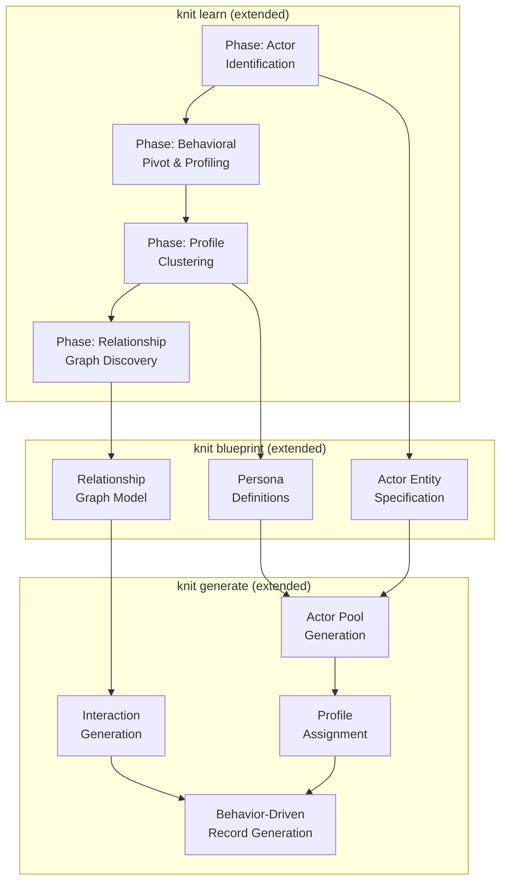

# Human Behavioral Modeling — Design Document

**Version:** 0.1.0
**Status:** Draft
**Modules:** `learn module`, `core module`, `plan module`, `gen module`

---

## Table of Contents

- [1. Overview](#1-overview)
- [2. Problem Statement](#2-problem-statement)
- [3. Architecture](#3-architecture)
- [4. Phase 1: Actor Identification (Learn)](#4-phase-1-actor-identification-learn)
- [5. Phase 1b: Actor Identity Resolution (Learn)](#5-phase-1b-actor-identity-resolution-learn)
- [6. Phase 2: Behavioral Profiling (Learn)](#6-phase-2-behavioral-profiling-learn)
- [7. Phase 3: Relationship Discovery (Learn)](#7-phase-3-relationship-discovery-learn)
- [8. Phase 4: Blueprint Modeling (Core/Blueprint)](#8-phase-4-blueprint-modeling-coreblueprint)
- [9. Phase 5: Profile-Driven Generation (Gen)](#9-phase-5-profile-driven-generation-gen)
- [10. Phase 6: Relationship-Driven Generation (Gen)](#10-phase-6-relationship-driven-generation-gen)
- [11. Data Model Extensions](#11-data-model-extensions)
- [12. CLI Integration](#12-cli-integration)
- [13. Testing Strategy](#13-testing-strategy)
- [14. Design Decisions](#14-design-decisions)

---

## 1. Overview

Human behavioral modeling adds the ability for Knit to learn and reproduce
**human-like patterns** in synthetic data. Rather than treating each column
independently, this feature identifies "actor" columns (people who perform
actions over time), profiles their individual and collective behaviors, discovers
inter-actor relationships, and generates synthetic datasets that preserve these
behavioral properties.

### Key Capabilities

| Capability | Description |
|-----------|-------------|
| **Actor identification** | Detect which columns represent human actors (users, employees, customers) |
| **Behavioral profiling** | Analyze per-actor temporal patterns, activity distributions, and traits |
| **Profile clustering** | Group actors into behavioral archetypes (personas) |
| **Relationship discovery** | Identify actor-to-actor connections (manager-report, sender-receiver) |
| **Profile-driven generation** | Generate synthetic actors with realistic persona distributions |
| **Interaction modeling** | Reproduce how related actors interact in the generated data |

### Motivating Example

Given an email dataset:
```
sender_id | receiver_id | timestamp | subject | has_attachment
USR001    | USR002      | 2024-01-15 09:30 | Re: Q4 Review | false
USR002    | USR001      | 2024-01-15 10:15 | Re: Q4 Review | true
USR003    | USR001      | 2024-01-15 14:00 | Lunch?        | false
```

Knit should learn:
1. `sender_id` and `receiver_id` are actor columns
2. USR001 is active in mornings, USR003 prefers afternoons
3. USR001↔USR002 have a bidirectional relationship (likely peers/collaborators)
4. USR003→USR001 is unidirectional (likely subordinate or casual contact)
5. Generate synthetic actors with similar activity timing distributions and relationship graphs

---

## 2. Problem Statement

Current `knit learn` treats each column independently:
- A `user_id` column gets a cardinality count and a `one_of` or `sequence` generator
- Timestamps get distribution fitting but not per-user temporal analysis
- No concept of "the same person appears multiple times with consistent behavior"
- No understanding of which actors interact and how

This produces data that is **statistically correct at the column level** but
**behaviorally unrealistic at the entity level**:
- All synthetic "users" behave identically (same activity patterns)
- No consistent per-user preferences or habits
- Relationships between actors are random (no social structure)
- Interaction patterns don't reflect real org charts or social graphs

---

## 3. Architecture



---

## 4. Phase 1: Actor Identification (Learn)

### 4.1 Heuristic Detection (Name-Based)

Score columns by name patterns that suggest human actors:

| Pattern | Score | Examples |
|---------|-------|----------|
| `*_id` with `user/person/employee/customer/member/agent/author/owner` prefix | 0.95 | `user_id`, `customer_id`, `employee_id` |
| `*_by` suffix | 0.85 | `created_by`, `assigned_by`, `approved_by` |
| `*_name` with person context | 0.70 | `user_name`, `author_name` |
| Column named `sender`, `receiver`, `from`, `to` (in messaging context) | 0.80 | `sender`, `recipient` |

### 4.2 Statistical Detection (Data-Driven)

When name heuristics are inconclusive, analyze column data for human-like properties:

**Temporal spread criterion:**
- Human actors generate data over time spans (days, weeks, months)
- Non-human IDs (like transaction_id) appear exactly once
- Score: `repeat_rate × temporal_span_score`

**Activity distribution criterion:**
- Human activity follows non-uniform temporal patterns (circadian rhythms, weekday bias)
- Calculate per-value temporal entropy vs uniform distribution
- High entropy difference = likely human

**Burstiness criterion:**
- Human behavior is bursty (clusters of activity followed by inactivity)
- Calculate inter-event time coefficient of variation per unique value
- CV > 1.0 suggests bursty/human behavior

**Composite scoring:**
```rust
struct ActorScore {
    column: String,
    name_score: f64,       // 0.0-1.0 from heuristic patterns
    repeat_score: f64,     // fraction of values appearing > 1 time
    temporal_span: f64,    // normalized time span of activity
    burstiness: f64,       // CV of inter-event times
    entropy_diff: f64,     // deviation from uniform temporal distribution
    composite: f64,        // weighted combination
}
```

**Threshold:** `composite >= 0.6` → classify as actor column.

### 4.3 Multi-Actor Entities

An entity may have multiple actor columns (e.g., `sender_id` and `receiver_id` in
an email table). Each is identified independently. The relationship between them
is analyzed in Phase 3.

---

## 5. Phase 1b: Actor Identity Resolution (Learn)

After detecting actor columns, resolve identities across entities and columns.

### 5.1 Cross-Entity Actor Unification

The same real-world actor may appear in multiple entities or columns:
- `emails.sender_id` and `emails.receiver_id` share the same actor namespace
- `orders.customer_id` and `support_tickets.user_id` may reference the same people
  (if linked by FK relationships)

**Resolution rules:**
1. Actor columns within the same entity that reference the same FK target entity
   → same actor namespace
2. Actor columns in different entities linked by FK to a common actor entity
   → same actor namespace
3. Columns with no linkage → separate actor namespaces (independent populations)

### 5.2 Canonical Actor Registry

Build a registry mapping each actor namespace to its population:

```rust
struct ActorRegistry {
    /// Named actor populations (e.g., "users", "employees")
    namespaces: HashMap<String, ActorNamespace>,
}

struct ActorNamespace {
    /// Name of the actor namespace (derived from entity name or FK target)
    name: String,
    /// All columns that reference this namespace
    columns: Vec<(String, String)>,  // (entity_name, field_name)
    /// Unique actor IDs observed
    actor_ids: HashSet<String>,
    /// Source entity (if actors have their own entity table)
    source_entity: Option<String>,
}
```

### 5.3 Ambiguity Handling

When cross-entity linkage is unclear:
- Warn the user that actor populations could not be unified
- Fall back to per-column actor populations
- CLI `--actor-column` override can explicitly group columns into namespaces

---

## 6. Phase 2: Behavioral Profiling (Learn)

Once actor columns are identified and resolved, profile per-actor behavior
using **streaming aggregation** to support large datasets.

### 6.0 Scalable Aggregation Strategy

To handle the target scale (100K+ actors, 10M+ records) without materializing
a full actor×feature pivot in memory:

**Streaming per-actor accumulators:**
- Hash-grouped accumulators keyed by actor ID
- Each accumulator maintains bounded-memory sketches:
  - Hourly/daily histogram counters (fixed 24 + 7 slots)
  - Welford online mean/variance for numeric features
  - Top-K (k=20) for categorical field preferences via Count-Min Sketch
  - Running count + min/max timestamp for temporal span

**Memory budget:** `O(num_actors × feature_size)` where feature_size is bounded
(~500 bytes per actor for typical blueprints). For 100K actors ≈ 50MB.

**Incremental compatibility:** Actor accumulators serialize into the state file.
New data chunks update existing accumulators. Persona clustering runs only at
finalization.

### 6.1 Per-Actor Feature Extraction

For each unique actor value, compute a feature vector:

```rust
struct ActorProfile {
    actor_id: String,
    // Temporal features
    active_hours: [f64; 24],     // hourly activity distribution
    active_days: [f64; 7],       // day-of-week distribution
    session_duration_mean: f64,   // average session length
    inter_session_gap_mean: f64,  // average time between sessions
    activity_count: u64,          // total number of records
    active_span_days: f64,        // first to last activity in days

    // Behavioral features (per non-actor column)
    field_preferences: HashMap<String, FieldPreference>,

    // Relationship features (populated in Phase 3)
    connections: Vec<ActorConnection>,
}

struct FieldPreference {
    /// For categorical fields: probability distribution over categories
    category_dist: Option<Vec<(String, f64)>>,
    /// For numeric fields: personal mean and std deviation
    numeric_mean: Option<f64>,
    numeric_std: Option<f64>,
    /// For text fields: average length, formality score
    text_length_mean: Option<f64>,
}
```

### 5.2 Profile Clustering (Persona Discovery)

Group actors into personas using unsupervised clustering:

**Algorithm: K-means with automatic K selection**
1. Normalize feature vectors
2. Run K-means for K = 2..√N (where N = number of unique actors)
3. Select K using silhouette score + elbow method
4. Each cluster becomes a **persona**

**Alternative for small datasets (< 50 actors):**
Use hierarchical clustering with Ward's method, cut at the dendrogram level
that maximizes inter-cluster distance while keeping minimum cluster size ≥ 3.

### 5.3 Persona Definition

Each persona captures the centroid and variance of its cluster:

```rust
struct Persona {
    name: String,                  // auto-generated: "early_bird", "power_user", etc.
    weight: f64,                   // fraction of actors in this persona
    // Temporal traits
    peak_hours: Vec<u8>,           // most active hours
    active_days_pattern: String,   // "weekday_heavy", "uniform", "weekend_heavy"
    activity_rate: DistributionSpec, // records per day distribution

    // Behavioral traits
    field_traits: HashMap<String, GeneratorSpec>,

    // Variance within persona
    trait_variance: f64,           // how much individuals differ from centroid
}
```

---

## 6. Phase 3: Relationship Discovery (Learn)

### 6.1 Actor-to-Actor Graph Construction

For entities with multiple actor columns (or FK-linked actor entities), build a
directed graph:

```
sender_id → receiver_id  (edge for each record)
```

### 6.2 Relationship Metrics

For each directed edge (A → B):

| Metric | Description |
|--------|-------------|
| **Frequency** | Number of interactions A→B |
| **Reciprocity** | Ratio of B→A / A→B interactions |
| **Temporal regularity** | How predictable are A→B interaction times |
| **Exclusivity** | What fraction of A's interactions go to B |

### 6.3 Relationship Classification

Classify edges into relationship types:

| Type | Criteria |
|------|----------|
| **Hierarchical** | Low reciprocity, high exclusivity from subordinate side |
| **Peer** | High reciprocity (~1.0), moderate frequency |
| **Broadcast** | One actor sends to many, low reciprocity |
| **Hub** | One actor receives from many (authority figure) |

### 6.4 Graph Structure Analysis

Beyond pairwise relationships, analyze graph-level properties:

- **Degree distribution** — power-law vs. normal (indicates org structure vs. flat)
- **Clustering coefficient** — how much actors form tight groups (teams)
- **Community detection** — identify sub-groups (departments, teams) using Louvain/modularity
- **Hierarchy depth** — longest path in directed acyclic sub-graphs

These properties become parameters for the relationship model in the blueprint.

---

## 7. Phase 4: Blueprint Modeling (Core/Blueprint)

### 7.1 New Weave Language Constructs

```toml
# Persona definitions
[[personas]]
name = "power_user"
weight = 0.15
traits.peak_hours = [9, 10, 11, 14, 15, 16]
traits.active_days = "weekday_heavy"
traits.activity_rate = { kind = "normal", params = { mean = 25.0, std_dev = 8.0 } }
traits.email_length = { kind = "normal", params = { mean = 150.0, std_dev = 50.0 } }

[[personas]]
name = "casual_user"
weight = 0.60
traits.peak_hours = [10, 11, 14]
traits.active_days = "uniform"
traits.activity_rate = { kind = "normal", params = { mean = 5.0, std_dev = 3.0 } }
traits.email_length = { kind = "normal", params = { mean = 50.0, std_dev = 20.0 } }

# Actor entity with persona assignment
[[entities]]
name = "users"
count = 1000
actor = true
persona_distribution = "personas"  # references [[personas]] section

[[entities.fields]]
name = "id"
data_type = "uuid"
primary_key = true

# Behavioral entity driven by actor personas
[[entities]]
name = "emails"
count = 50000  # approximate total; actual count derived from actor activity rates
activity_count = { actor_field = "sender_id", trait = "activity_rate" }  # per-actor dynamic count

[[entities.fields]]
name = "sender_id"
data_type = "uuid"
actor_column = true
generator = { type = "actor_ref", entity = "users" }

[[entities.fields]]
name = "receiver_id"
data_type = "uuid"
actor_column = true
generator = { type = "relationship_ref", relationship = "email_network" }

[[entities.fields]]
name = "timestamp"
data_type = "timestamp"
generator = { type = "actor_temporal", trait = "peak_hours" }

# Actor relationship graph model
[[actor_relationships]]
name = "email_network"
from_entity = "users"
to_entity = "users"
graph_type = "scale_free"        # power-law degree distribution
params.avg_degree = 8.0
params.reciprocity = 0.4
params.clustering = 0.3
community_count = { kind = "uniform", params = { min = 3, max = 8 } }
hierarchy_depth = 3
```

### 7.2 Core Type Extensions

```rust
/// Persona definition for actor behavioral modeling.
#[derive(Debug, Clone, Serialize, Deserialize)]
pub struct Persona {
    pub name: String,
    pub weight: f64,
    pub traits: BTreeMap<String, Value>,
}

/// Actor relationship graph specification.
#[derive(Debug, Clone, Serialize, Deserialize)]
pub struct ActorRelationship {
    pub name: String,
    pub from_entity: String,
    pub to_entity: String,
    pub graph_type: GraphType,
    pub params: BTreeMap<String, f64>,
    pub community_count: Option<CountSpec>,
    pub hierarchy_depth: Option<u32>,
}

#[derive(Debug, Clone, Serialize, Deserialize)]
pub enum GraphType {
    ScaleFree,      // Barabási–Albert model
    SmallWorld,     // Watts–Strogatz model
    Hierarchical,   // Tree-like with lateral connections
    ErdosRenyi,    // Random graph (baseline)
    Custom,         // User-defined degree sequence
}
```

### 7.3 New Generator Types

| Generator | Purpose |
|-----------|---------|
| `actor_ref` | Reference an actor entity, weighted by persona's activity rate |
| `actor_temporal` | Generate timestamps following the actor's temporal traits |
| `relationship_ref` | Select target actor based on relationship graph topology |
| `persona_field` | Generate field value based on the current actor's persona traits |

---

## 8. Phase 5: Profile-Driven Generation (Gen)

### 8.1 Actor Pool Generation

1. Generate the actor entity (e.g., 1000 users)
2. Assign each actor a persona according to `persona_distribution` weights
3. For each actor, sample individual trait parameters from the persona's
   distribution (centroid ± variance)

### 8.2 Activity Count Determination

For behavioral entities with `activity_count` specification:
1. Generate the actor pool first (Phase 8.1)
2. For each actor, sample their personal activity count from their persona's
   `activity_rate` trait (distribution)
3. Total entity rows = sum of all actors' individual counts
4. The `count` field serves as an approximate upper bound for plan estimation;
   actual rows are determined by the sum of per-actor activity rates
5. **Planner flow:** actor pool → activity materialization → partition plan

This avoids overloading `CountSpec` — the existing `count` field remains for
plan estimation and progress reporting, while `activity_count` drives the
actual per-actor record generation.

### 8.3 Per-Record Generation

For each record in a behavioral entity:
1. Select the acting actor (sender) proportional to their activity count
2. Look up the actor's personalized traits
3. Generate timestamp using actor's `peak_hours` and `active_days` patterns
4. Generate other fields using persona-driven field traits
5. For relationship fields (receiver), use the graph topology (Phase 6)

### 8.4 Temporal Consistency

Ensure generated timestamps for each actor:
- Follow their personal circadian pattern
- Maintain realistic inter-event gaps (no two emails at the same millisecond)
- Respect temporal ordering within sessions
- Include realistic "offline" periods

---

## 9. Phase 6: Relationship-Driven Generation (Gen)

### 9.1 Graph Generation

Before generating behavioral records, pre-generate the actor relationship graph:

1. Create N actor nodes
2. Apply the specified `graph_type` algorithm:
   - **Scale-free:** Barabási–Albert preferential attachment
   - **Small-world:** Watts–Strogatz rewiring
   - **Hierarchical:** Generate tree, then add lateral edges
3. Assign edge weights based on frequency distribution from learned data
4. Partition nodes into communities

### 9.2 Interaction Generation

When generating a `relationship_ref` field (e.g., `receiver_id`):
1. Look up the current actor's (sender's) connections in the pre-built graph
2. Select a target weighted by edge weight (higher weight = more frequent interaction)
3. Apply reciprocity constraints (if A→B happened, B→A becomes more likely next time)
4. Ensure community structure is preserved (intra-community edges >> inter-community)

### 9.3 Interaction Pattern Reproduction

Beyond just selecting who communicates with whom, reproduce **how** they interact:
- Threads/conversations: consecutive exchanges between the same pair
- Response time distribution: how long B takes to respond to A
- Topic consistency: related records between a pair share content features

---

## 10. Data Model Extensions

### 10.1 Changes to `DataModel`

```rust
pub struct DataModel {
    // ... existing fields ...
    pub personas: Vec<Persona>,
    pub actor_relationships: Vec<ActorRelationship>,
}
```

### 10.2 Changes to `Entity`

```rust
pub struct Entity {
    // ... existing fields ...
    pub actor: bool,
    pub persona_distribution: Option<String>,  // references a persona set
}
```

### 10.3 Changes to `Field`

```rust
pub struct Field {
    // ... existing fields ...
    pub actor_column: Option<bool>,  // marks this field as an actor reference
}
```

---

## 11. CLI Integration

### 11.1 Learn Command Extensions

```bash
# Learn with human behavior analysis enabled
knit learn data/ --actors --output blueprint.knit.toml

# Specify actor columns explicitly (skip auto-detection)
knit learn data/ --actor-column sender_id --actor-column receiver_id

# Control persona count
knit learn data/ --actors --personas 5
```

### 11.2 Generate Command

No new flags needed — if the blueprint contains persona/actor definitions,
the generator automatically uses profile-driven generation.

### 11.3 Inspect Command Extensions

```bash
# Show discovered personas and actor statistics
knit inspect state.json --actors

# Output:
# Actors: 3 columns detected (sender_id, receiver_id, approver_id)
# Personas: 4 clusters (power_user: 15%, regular: 60%, casual: 20%, bot: 5%)
# Relationships: 1 graph (email_network: 342 edges, reciprocity=0.41)
```

---

## 12. Testing Strategy

### 12.1 Unit Tests

| Component | Test |
|-----------|------|
| Actor identification | Name-pattern scoring, statistical scoring on known datasets |
| Profile extraction | Feature computation on synthetic actors with known patterns |
| Clustering | Persona discovery on datasets with planted clusters |
| Graph analysis | Relationship classification on known graph structures |
| Profile generation | Actor pool respects persona weight distribution |
| Temporal generation | Generated timestamps match persona patterns |
| Graph generation | Generated graph matches target topology metrics |

### 12.2 Integration Tests

| Test | Verification |
|------|-------------|
| Round-trip: learn → generate → learn | Re-learned personas match original |
| Relationship preservation | Generated graph has similar degree distribution |
| Temporal fidelity | Per-actor temporal patterns preserved |
| Scalability | 100K actors, 10M records generates in reasonable time |

### 12.3 Example Datasets

Example datasets that exercise human behavioral modeling:
- `examples/email_traffic.knit.toml` — messaging with sender/receiver personas
- `examples/hr_org.knit.toml` — hierarchical org with manager relationships and activity-driven tasks
- `examples/ecommerce_behavioral.knit.toml` — customer behavioral segments with persona-driven purchasing
- `examples/social_platform.knit.toml` — social network with graphs, actor_temporal patterns, and burst sessions

---

## 13. Design Decisions

### 13.1 Statistical vs. ML Approach

**Decision:** Use statistical methods (clustering, graph algorithms) rather than
deep learning.

**Rationale:**
- Keeps dependency tree light (no PyTorch/TensorFlow)
- Interpretable results (users can understand and modify personas)
- Sufficient for the behavioral patterns we're targeting
- Fast training time on moderate datasets
- Consistent with learn module's existing philosophy

### 13.2 Persona Granularity

**Decision:** Personas are per-blueprint, not per-entity.

**Rationale:**
- A "power user" should behave consistently across all entities they appear in
- Simplifies the model (one persona set vs. per-entity persona sets)
- Reflects reality: people have consistent behavioral styles

### 13.3 Graph Generation Algorithm Selection

**Decision:** Support multiple graph models (scale-free, small-world, hierarchical),
selected based on learned graph properties.

**Rationale:**
- Different domains produce different graph structures
  - Social networks → scale-free
  - Organizational → hierarchical
  - Physical proximity → small-world
- Auto-selection based on learned metrics (degree distribution fit test)

### 13.4 Backward Compatibility

**Decision:** All new blueprint fields are optional. Existing blueprints continue to work
without modification.

**Rationale:**
- No breaking changes to existing users
- Human behavioral modeling is an opt-in enhancement
- Blueprints without personas generate data the same way as before

### 13.5 Incremental Learning Compatibility

**Decision:** Actor/persona state is stored in the incremental learning state file.

**Rationale:**
- Large datasets need incremental processing (PR #116 design)
- Actor profiles accumulate across chunks (actor seen in chunk 1 and chunk 5)
- Persona clustering runs at finalization (needs all actors' profiles)
- Relationship graphs can be incrementally updated as new edges appear
