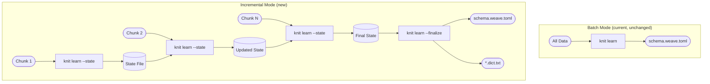
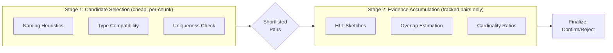
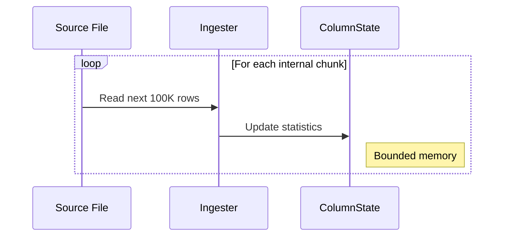
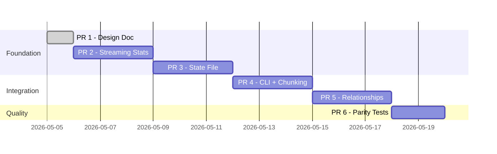

# Incremental Learning — Design Document

**Version:** 0.1.0
**Status:** Draft
**Crate:** `knit-learn` (with CLI integration in `knit-cli`)

---

## Table of Contents

- [1. Motivation](#1-motivation)
- [2. Architecture Overview](#2-architecture-overview)
- [3. CLI Interface](#3-cli-interface)
- [4. State File Format](#4-state-file-format)
- [5. Streaming Statistics](#5-streaming-statistics)
- [6. Feature Fidelity Matrix](#6-feature-fidelity-matrix)
- [7. Incremental Relationship Detection](#7-incremental-relationship-detection)
- [8. Incremental Correlation Detection](#8-incremental-correlation-detection)
- [9. Dictionary Extraction](#9-dictionary-extraction)
- [10. Schema Drift & Type Evolution](#10-schema-drift--type-evolution)
- [11. Determinism](#11-determinism)
- [12. Ingestion Semantics](#12-ingestion-semantics)
- [12b. Concurrency & Atomicity](#12b-concurrency--atomicity)
- [12c. Memory Estimation](#12c-memory-estimation)
- [13. State Versioning & Migration](#13-state-versioning--migration)
- [14. Testing Strategy](#14-testing-strategy)
- [15. Implementation Plan](#15-implementation-plan)

---

## 1. Motivation

The current `knit learn` command loads all source data into memory as Arrow
`RecordBatch`es before profiling. This works well for datasets up to a few
million rows, but fails for:

- **Large datasets** (100M+ rows): Cannot fit in memory
- **Streaming data**: Data arrives in chunks over time
- **Distributed datasets**: Data spread across many files/partitions
- **Iterative refinement**: User adds more data to improve schema quality

Incremental learning solves these problems by processing data in bounded-memory
chunks and persisting sufficient statistics in a **state file** that accumulates
evidence across multiple invocations.

---

## 2. Architecture Overview



### Key Principles

| Principle | Description |
|-----------|-------------|
| **Bounded memory** | Each chunk is processed with O(chunk_size) memory; state grows sub-linearly with total data |
| **Append-only semantics** | Chunks are assumed non-overlapping; re-processing a chunk double-counts |
| **State is source of truth** | Output schema is always re-derivable from state via `--finalize` |
| **Backward compatible** | `knit learn` without `--state` works exactly as today (batch mode) |
| **Deterministic** | Same chunks in same order produce identical state (seeded RNG for sampling) |
| **Quality-transparent** | Fidelity differences vs batch mode are documented and tested |

---

## 3. CLI Interface

### Update Mode (process new data)

```bash
# First chunk — creates state file
knit learn data/chunk1.csv --state learned.state

# Subsequent chunks — merges into existing state
knit learn data/chunk2.csv --state learned.state
knit learn data/chunk3.csv --state learned.state

# Process a directory of files as one chunk
knit learn data/jan/ --state learned.state
```

### Finalize Mode (emit schema from state)

```bash
# Generate schema from accumulated state
knit learn --finalize --state learned.state -o schema.weave.toml

# Can finalize with additional data in one pass
knit learn data/last_chunk.csv --state learned.state -o schema.weave.toml
```

### Behavior Rules

| Flags | Behavior |
|-------|----------|
| No `--state` | Batch mode (current behavior, unchanged) |
| `--state` without `-o` | Update state only, no schema output |
| `--state` with `-o` | Update state AND emit schema (finalize) |
| `--finalize --state` without source | Emit schema from existing state only |

### New CLI Arguments

```
--state <PATH>       Path to state file (creates if absent, updates if exists)
--finalize           Emit schema from state without processing new data
--chunk-size <N>     Max rows per internal processing chunk (default: 100,000)
--strict             Error on duplicate source paths (default: warn)
```

---

## 4. State File Format

### Container Format

The state file uses **MessagePack** (or bincode) for compact binary
serialization with a versioned header. This avoids the size/performance issues
of JSON for sketch-heavy state.

```
┌─────────────────────────────────────┐
│ Magic bytes: "KNIT" (4 bytes)       │
│ Format version: u16                 │
│ Algorithm version: u16              │
│ Payload (MessagePack/bincode)       │
└─────────────────────────────────────┘
```

### Top-Level Structure

```rust
/// Persistent state for incremental learning.
pub struct LearnState {
    /// Format version for migration support.
    pub version: u16,
    /// Deterministic seed for reproducible sampling.
    pub seed: u64,
    /// Per-table states, keyed by entity name.
    pub tables: BTreeMap<String, TableState>,
    /// Relationship evidence between table pairs.
    pub relationship_candidates: Vec<RelationshipEvidence>,
    /// Chunks processed (for diagnostics, not dedup).
    pub chunks_processed: u64,
    /// Total rows processed across all chunks.
    pub total_rows: u64,
}
```

### Per-Table State

```rust
pub struct TableState {
    /// Entity name.
    pub name: String,
    /// Total rows observed for this table.
    pub row_count: u64,
    /// Per-column statistical states.
    pub columns: Vec<ColumnState>,
}
```

### Per-Column State

```rust
pub struct ColumnState {
    /// Column name.
    pub name: String,
    /// Arrow data type observed (may widen over time).
    pub data_type: DataType,
    /// Basic counts.
    pub count: u64,
    pub null_count: u64,
    /// Numeric streaming stats (Welford's algorithm).
    pub numeric: Option<NumericState>,
    /// String column state.
    pub string: Option<StringState>,
    /// Temporal column state.
    pub temporal: Option<TemporalState>,
    /// Reservoir sample of raw values (for distribution fitting).
    pub reservoir: ReservoirSample,
    /// Top-K value frequencies (Space-Saving algorithm).
    pub top_k: TopKTracker,
}
```

---

## 5. Streaming Statistics

### Numeric Columns

| Statistic | Algorithm | Precision |
|-----------|-----------|-----------|
| Count, null count | Exact counter | Exact |
| Min, max | Running min/max | Exact |
| Mean, variance | Welford's online algorithm | Exact (given ordering) |
| Percentiles (p25, p50, p75, p95, p99) | t-digest (δ=100) | Bounded rank error (δ-dependent) |
| Histogram | Adaptive histogram (max 200 bins) | Approximate |
| Integer detection | Track `all_integer` flag | Exact |
| Decimal places | Track max observed | Exact |

```rust
pub struct NumericState {
    pub min: f64,
    pub max: f64,
    /// Welford's: running mean.
    pub mean: f64,
    /// Welford's: running M2 (sum of squared differences from mean).
    pub m2: f64,
    /// T-digest for quantile estimation.
    pub tdigest: TDigest,
    /// Whether all values are integer-valued.
    pub all_integer: bool,
    /// Max decimal places observed.
    pub max_decimal_places: u8,
}
```

> Note: Sum is derivable as `mean * count` when needed for state merging.
> Welford's algorithm is preferred over sum/sum_squares for numerical
> stability with large datasets.

### String Columns

| Statistic | Algorithm | Precision |
|-----------|-----------|-----------|
| Cardinality | HyperLogLog (p=14, ~0.8% error) | Approximate |
| Top-K values | Space-Saving (K=1000) | Approximate (guaranteed for freq > N/K) |
| Length stats | Running min/max/mean/variance | Exact |
| Pattern samples | Reservoir sample (size=500) | Representative |
| Dictionary values | Bounded set (max 10,000) | Exact up to cap |

```rust
pub struct StringState {
    /// HyperLogLog sketch for cardinality estimation.
    pub hll: HyperLogLog,
    /// String length statistics.
    pub min_length: usize,
    pub max_length: usize,
    pub length_mean: f64,
    pub length_m2: f64,
    /// Pattern detection sample (reservoir).
    pub pattern_sample: ReservoirSample,
    /// Dictionary accumulator (bounded unique values).
    pub dictionary_values: BoundedSet,
}
```

### Temporal Columns

| Statistic | Algorithm | Precision |
|-----------|-----------|-----------|
| Min, max timestamp | Running min/max | Exact |
| Interval histogram | Fixed 100-bin histogram over observed range | Approximate |
| Day-of-week distribution | 7-element counter | Exact |
| Hour-of-day distribution | 24-element counter | Exact |
| Has time component | Track flag | Exact |

```rust
pub struct TemporalState {
    pub min_epoch_secs: f64,
    pub max_epoch_secs: f64,
    /// Day-of-week counts [Mon..Sun].
    pub dow_counts: [u64; 7],
    /// Hour-of-day counts [0..23].
    pub hour_counts: [u64; 24],
    /// Whether any value has non-zero time component.
    pub has_time_component: bool,
    /// Inter-arrival time statistics for frequency detection.
    pub delta_stats: Option<NumericState>,
}
```

### Reservoir Sampling

Used for distribution fitting at finalize time and pattern inference:

```rust
pub struct ReservoirSample {
    /// Maximum sample size.
    pub capacity: usize,
    /// Current sample.
    pub items: Vec<String>,
    /// Total items seen (for reservoir math).
    pub total_seen: u64,
    /// Deterministic RNG state.
    pub rng_state: u64,
}
```

The reservoir sample preserves a fixed-size uniform random subset of all
values observed across all chunks. At finalize time, distribution fitting
and KS-tests run against this sample.

---

## 6. Feature Fidelity Matrix

This table defines how each learn feature behaves in incremental mode vs
batch mode:

| Feature | Batch Mode | Incremental Mode | Fidelity |
|---------|-----------|-----------------|----------|
| **Type inference** | Full data | Reservoir sample (500 values) | ≈ Exact (high-cardinality types converge quickly) |
| **Distribution fitting (KS/AIC)** | Full data | Reservoir sample (10,000 values) | Approximate (bounded error with 10K samples) |
| **Percentiles** | Exact (sort-based) | T-digest (δ=100) | Bounded rank error (tight at extremes, looser at median) |
| **Categorical detection** | Exact distinct count | HyperLogLog + Top-K | ~0.8% cardinality error; exact for top-1000 |
| **Temporal pattern detection** | Full delta series | Counter-based (DOW/hour) + delta stats | Frequency/seasonality preserved; complex patterns may degrade |
| **Relationship detection** | Full value overlap | Two-stage: naming heuristic → HLL intersection | May miss weak FK relationships; false positive rate bounded |
| **Correlation detection** | Full Spearman/Cramér's V | Running Pearson + reservoir Spearman at finalize | Pearson exact; Spearman approximate |
| **Dictionary extraction** | Full unique set | Bounded set (10K cap) | Exact up to cap; sample beyond |
| **Precision (decimal places)** | Full scan | Running max | Exact |
| **Null rate** | Exact | Exact (ratio of counters) | Exact |

### Guarantees

- **Exact features** produce identical results regardless of chunking
- **Approximate features** have documented error bounds
- **Degraded features** are flagged in the output schema with confidence
  adjustments

---

## 7. Incremental Relationship Detection

Relationship detection in batch mode compares value sets across tables.
In incremental mode, this requires cross-chunk evidence accumulation.

### Two-Stage Approach



**Stage 1** (runs every chunk, O(columns)):
- Column name matching (e.g., `user_id` → `users.id`)
- Type compatibility (both integer, both UUID, etc.)
- Uniqueness heuristic (one side has high cardinality ratio)
- **Max tracked pairs**: 500 (prevents quadratic blowup)

**Stage 2** (only for shortlisted pairs):
- Maintain HyperLogLog per candidate column
- Estimate **coverage ratio** via HLL: `|FK ∩ PK| / |FK|` (what fraction of FK values exist in PK)
- Track cardinality ratio evolution

Note: Coverage (not Jaccard) is the correct metric for FK detection. A FK column
with 1K values referencing a PK with 1M values has coverage ≈ 1.0 (perfect FK) but
Jaccard ≈ 0.001 (would be incorrectly rejected).

**At finalize**: Apply the same thresholds as batch mode to accumulated
evidence.

### Evidence Structure

```rust
pub struct RelationshipEvidence {
    /// Source (FK) table and column.
    pub from_table: String,
    pub from_column: String,
    /// Target (PK) table and column.
    pub to_table: String,
    pub to_column: String,
    /// HLL sketch for FK column values.
    pub from_hll: HyperLogLog,
    /// HLL sketch for PK column values.
    pub to_hll: HyperLogLog,
    /// Estimated FK coverage ratio: |FK ∩ PK| / |FK| (updated each chunk).
    pub coverage_estimate: f64,
    /// Naming heuristic confidence.
    pub naming_score: f64,
}
```

---

## 8. Incremental Correlation Detection

### Numeric–Numeric Correlations

Pearson correlation can be computed exactly from streaming statistics
(Welford's algorithm extended to two variables):

```rust
pub struct PairwiseNumericState {
    pub col_a: String,
    pub col_b: String,
    pub count: u64,
    pub mean_a: f64,
    pub mean_b: f64,
    pub m2_a: f64,
    pub m2_b: f64,
    /// Running co-moment for Pearson correlation.
    pub co_moment: f64,
}
```

Pearson r = co_moment / sqrt(m2_a * m2_b)

### Numeric–Categorical & Categorical–Categorical

These require per-group statistics. The state tracks:
- Per-category numeric summaries (mean, variance, count) for ANOVA-like tests
- Per-category-pair co-occurrence counts for Cramér's V

### Candidate Pruning

To avoid O(columns²) state:
- Only track correlations for columns within the same table
- Limit to top 20 columns per table (configurable via `--max-corr-columns`)
- Selection criteria: prefer columns with high variance (numeric) or moderate
  cardinality (categorical, 3–100 distinct values) — these are most likely to
  have meaningful correlations
- Skip correlation tracking for PK/FK columns (handled by relationships)

> **Rationale for default cap of 20**: With 20 columns, pairwise state is
> 190 pairs × ~200 bytes ≈ 38 KB per table — negligible. At 50 columns it
> grows to 1225 pairs (still manageable but diminishing returns for
> correlation quality). The default balances memory with coverage.

---

## 9. Dictionary Extraction

In incremental mode, dictionary extraction uses the `BoundedSet` in
`StringState` to accumulate unique values across chunks:

- Values are added up to the 10,000 cap
- Once full, new values are ignored (first-seen bias, acceptable for
  vocabulary extraction)
- At finalize, dictionary files are written from the bounded set
- Expansion strategy detection uses the same heuristics as batch mode

### Combinatorial Detection

The finalize step examines the accumulated dictionary values for
multi-word structure, same as batch mode.

---

## 10. Schema Drift & Type Evolution

When processing multiple chunks, column types may evolve:

| Scenario | Handling |
|----------|----------|
| Column absent in some chunks | Treat as nullable; track `chunks_present` count |
| Int → Float (values become fractional) | Widen to Float; recompute stats as float |
| New column appears | Add with null_rate based on missing chunks |
| String type changes (e.g., dates in one chunk, text in another) | Keep broader type; flag low confidence |
| Nullability changes | Always promote to nullable if any nulls seen |

### Widening Rules

```rust
fn widen_type(existing: &DataType, new: &DataType) -> DataType {
    match (existing, new) {
        (Int32, Int64) | (Int64, Int32) => Int64,
        (Int32, Float64) | (Int64, Float64) => Float64,
        (Float64, Int32) | (Float64, Int64) => Float64,
        (a, b) if a == b => a.clone(),
        _ => String, // fallback to string for incompatible types
    }
}
```

---

## 11. Determinism

All probabilistic components use deterministic seeding:

- **Reservoir sampling**: Seeded from `LearnState.seed + column_index`
- **HyperLogLog**: Deterministic hash function (not random)
- **T-digest**: Merge order is deterministic (sorted centroids)

The same data processed in the same chunk order always produces the same
state and output schema. Different chunk orderings may produce slightly
different reservoir samples, but the error is bounded.

---

## 12. Ingestion Semantics

### Chunk Contract

Chunks are processed under **append-only, non-overlapping** semantics:

- Each chunk's rows are counted exactly once
- Re-processing a chunk **will** double-count (no automatic dedup)
- The state file records source paths of processed chunks
- **Duplicate source warning**: If a source path matches a previously processed
  chunk, the CLI emits a warning (and errors in `--strict` mode)
- Users are responsible for feeding non-overlapping data

### Chunk Identity Tracking

The state file records metadata about processed chunks:

```rust
pub struct ChunkRecord {
    /// Source file path (used for duplicate detection).
    pub source: String,
    /// Number of rows in this chunk.
    pub row_count: u64,
    /// Timestamp when processed.
    pub processed_at: u64,
}
```

Duplicate detection uses the canonical source path. When a duplicate is
detected:
- Default: warn and continue (allows intentional reprocessing)
- `--strict` mode: error and abort

### Internal Chunking

Even within a single invocation, the learn command processes data in
fixed-size internal chunks (default: 100,000 rows) to bound memory:



---

## 12b. Concurrency & Atomicity

### File Safety

The state file is not designed for concurrent access by multiple processes.
The following safeguards ensure data integrity:

1. **Atomic writes**: State is written to a temporary file (`<path>.tmp`),
   then atomically renamed over the target. This prevents corruption from
   interrupted writes.

2. **Advisory file lock**: Before reading or writing state, the CLI acquires
   an advisory lock (`<path>.lock`). If the lock is held, the CLI waits
   (with timeout) or errors.

3. **Documented limitation**: Concurrent access to the same state file from
   multiple processes is not supported. Users should serialize chunk processing
   (e.g., sequential shell commands or a pipeline orchestrator).

### Error Recovery

If the process crashes mid-update:
- The original state file remains intact (atomic rename not yet executed)
- The `.tmp` file may exist and should be cleaned up on next run
- No state corruption is possible

---

## 12c. Memory Estimation

### Per-Column Memory Budget

| Component | Size (approximate) |
|-----------|-------------------|
| NumericState (Welford + min/max) | 64 bytes |
| T-digest (δ=100, ~200 centroids) | 3.2 KB |
| HyperLogLog (p=14, 16K registers) | 16 KB |
| ReservoirSample (10K strings, avg 20 chars) | 200 KB |
| TopKTracker (1000 entries, avg 20 chars) | 40 KB |
| StringState (length stats + pattern sample) | 15 KB |
| TemporalState (counters + delta stats) | 1 KB |

**Total per column**: ~275 KB (string) or ~4 KB (pure numeric)

### Scaling Examples

| Dataset | Columns | Memory (in-process) | State File Size |
|---------|---------|--------------------|-----------------| 
| Small (5 tables, 20 cols) | 20 | ~5 MB | ~2 MB |
| Medium (20 tables, 100 cols) | 100 | ~27 MB | ~12 MB |
| Wide (5 tables, 500 cols) | 500 | ~135 MB | ~60 MB |

### Relationship Evidence

- 500 tracked pairs × 2 HLLs × 16 KB = ~16 MB
- Total relationship state: ~16 MB (independent of column count)

### Correlation State

- 20 columns/table × 190 pairs × 200 bytes × 20 tables = ~760 KB
- Negligible relative to column state

### Chunk Processing Memory

During chunk processing, memory usage is:
- Internal chunk (100K rows × avg row size) + column state updates
- For 100K rows × 100 columns × 8 bytes avg = ~80 MB transient
- Released after each internal chunk

**Total peak memory** ≈ column state + relationship state + one chunk buffer
≈ 50–200 MB for typical datasets (regardless of total dataset size)

---

## 13. State Versioning & Migration

### Version Scheme

```
Format version (u16): Wire format (serialization layout)
Algorithm version (u16): Statistical algorithm parameters
```

| Scenario | Behavior |
|----------|----------|
| Same format + algorithm | Load and continue |
| Same format, newer algorithm | Warn; load but note reduced quality |
| Older format | Attempt migration if possible; error if not |
| Newer format | Error with "please upgrade knit" |

### Fingerprinting

The state stores a schema fingerprint (hash of column names + types) to
detect incompatible schema changes between chunks.

---

## 14. Testing Strategy

### Unit Tests

- Welford's algorithm: correctness vs numpy for various sequences
- Reservoir sampling: uniformity test over 10K runs
- HyperLogLog: cardinality estimation within error bounds
- T-digest: percentile accuracy vs exact sort
- State serialization round-trip
- Type widening rules

### Integration Tests

- **Parity tests**: Process dataset in batch mode vs N chunks of 1/N size;
  compare output schemas with tolerances:
  - Type inference: must match exactly
  - Distribution choice: must match (parameters within 5%)
  - Null rate: must match exactly
  - Cardinality: within 2% of exact
  - Relationships: same set detected (P/R = 1.0)
  - Correlations: same set detected (threshold tolerance)
- **Large file test**: Process 10M row file in 100K chunks without OOM
- **Schema drift test**: Chunks with evolving types produce valid output
- **Determinism test**: Same chunks, same order → identical state

### Regression Tests

- Existing batch-mode tests continue to pass unchanged
- E2E: learn in chunks → generate → learn again → compare schemas

---

## 15. Implementation Plan

### PR 1: Design Document (this document)

Add this design document to `docs/`.

### PR 2: Streaming Statistics Foundation

Create the core streaming statistics types in `knit-learn`:

- `NumericState` with Welford's algorithm
- `ReservoirSample` with deterministic seeding
- `TopKTracker` (Space-Saving algorithm)
- `TDigest` implementation (or integrate existing crate)
- `HyperLogLog` (or integrate existing crate)
- Serialization with `serde` + MessagePack
- Comprehensive unit tests

**Dependencies:** None (pure data structures)

### PR 3: State File & Column State

Build the `LearnState` / `TableState` / `ColumnState` container:

- State file read/write with magic header + versioning
- `ColumnState` merging: update from an Arrow column chunk
- `TableState` merging: handle new/missing columns
- Type widening logic
- Schema fingerprinting
- Unit tests for merge operations

**Dependencies:** PR 2

### PR 4: CLI Integration & Chunked Ingestion

Wire incremental mode into the CLI:

- `--state` flag, `--finalize` flag, `--strict` flag
- Internal chunked ingestion (process N rows at a time)
- Update-only mode (state but no schema output)
- Finalize mode (schema from state without new data)
- Combined mode (update + finalize in one pass)
- **Finalize logic**: type inference from reservoir samples, distribution
  fitting from reservoir samples (reuse existing `fit_distribution` on sample),
  schema assembly from state-derived `ColumnAnalysis`/`TableAnalysis`
- Atomic state file writes + advisory locking
- Duplicate source path warning
- Batch mode unchanged (no `--state`)
- Integration tests

> **Note:** Finalize reuses existing batch-mode analysis functions
> (`fit_distribution`, `infer_type`, `assemble_data_model`) by constructing
> the same `ColumnAnalysis`/`TableAnalysis` inputs from accumulated state.
> No new fitting algorithms are needed — the state provides sufficient inputs
> (reservoir samples for fitting, counters for profiling).

**Dependencies:** PR 3

### PR 5: Incremental Relationship & Correlation Detection

Add cross-chunk evidence accumulation:

- Two-stage relationship detection with HLL sketches
- Candidate pruning (naming + type + max 500 pairs)
- Running Pearson correlation for numeric pairs
- Per-category stats for mixed correlations
- Finalize-time decision making
- Integration tests with multi-chunk datasets

**Dependencies:** PR 4

### PR 6: Parity Testing & Polish

- Batch vs incremental parity test suite
- Large-file stress test
- Schema drift tests
- Determinism regression tests
- Documentation updates to `docs/guide/learn.md`
- CLI help text updates

**Dependencies:** PR 5



---

## Appendix: Crate Dependencies

The incremental learning feature adds these dependencies to `knit-learn`:

| Crate | Purpose | Alternative |
|-------|---------|-------------|
| `rmp-serde` | MessagePack serialization | `bincode` |
| `hyperloglogplus` | HyperLogLog cardinality estimation | Implement in-house |
| `tdigest` | Quantile estimation sketch | Implement in-house |

If external crates add too much weight, the simpler algorithms
(HyperLogLog, t-digest) can be implemented directly — they are
well-documented and compact (~200 lines each).
