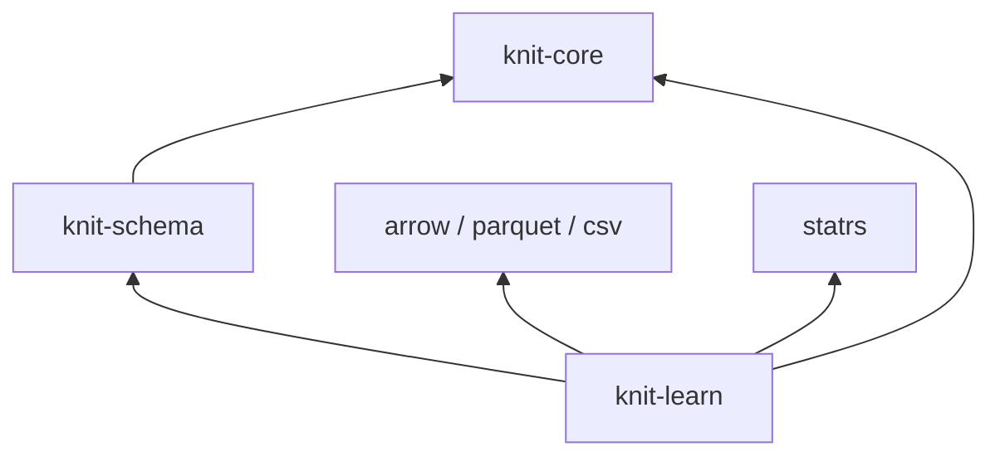
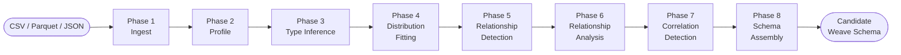
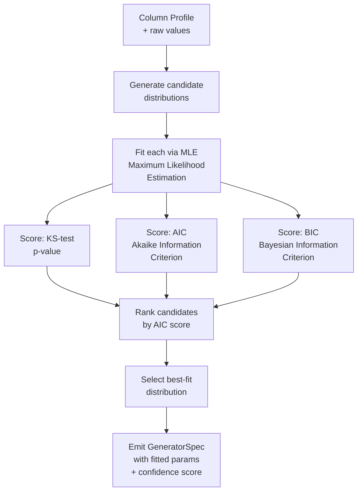
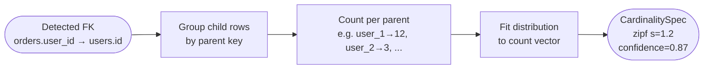
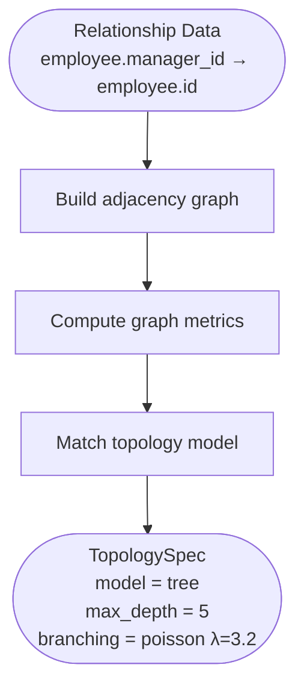
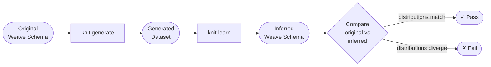

# knit-learn — Design Document

**Version:** 0.1.0
**Status:** Draft
**Crate:** `knit-learn`

---

## Table of Contents

- [1. Overview](#1-overview)
- [2. Dependencies](#2-dependencies)
- [3. Pipeline Architecture](#3-pipeline-architecture)
- [4. Ingestion](#4-ingestion)
- [5. Column Profiling](#5-column-profiling)
- [6. Type Inference](#6-type-inference)
- [7. Distribution Fitting](#7-distribution-fitting)
- [8. Relationship Detection](#8-relationship-detection)
- [9. Relationship Analysis](#9-relationship-analysis)
- [10. Cross-Entity Correlation Detection](#10-cross-entity-correlation-detection)
- [11. Confidence Scoring Model](#11-confidence-scoring-model)
- [12. Output Format](#12-output-format)
- [13. Testing Strategy](#13-testing-strategy)
- [14. Design Decisions](#14-design-decisions)

---

## 1. Overview

knit-learn is the **reverse pipeline** of the Knit toolset. Where the forward pipeline
(`knit-schema` → `knit-plan` → `knit-gen` → `knit-bind`) turns a Weave schema into
synthetic data, knit-learn does the opposite: it reads an existing dataset and infers a
Weave schema (`DataModel`) that can reproduce data with similar statistical properties.

### Approach

knit-learn uses **statistical methods only** (v1). There are no heavy ML dependencies —
distribution fitting, hypothesis testing, and heuristic scoring are sufficient to produce
high-quality schema candidates for tabular data.

### Candidate Output

The output of knit-learn is always a **candidate** schema. Every inferred element carries
a confidence score between 0.0 and 1.0. The schema is intended for human or AI review,
not blind adoption. Low-confidence elements are flagged, and alternative interpretations
are preserved so reviewers can make informed decisions.

### Use Cases

| Use Case | Description |
|----------|-------------|
| **Bootstrap from production data** | Point knit-learn at a database export or data lake sample to get a starting Weave schema, then refine manually or with an AI agent. |
| **Compare synthetic vs real** | Generate data from a schema, then run knit-learn on both real and synthetic datasets to compare inferred distributions and catch drift. |
| **Migrate from other tools** | Import data produced by another synthetic data tool and extract a Weave schema instead of rewriting specifications by hand. |

---

## 2. Dependencies

| Dependency | Purpose |
|------------|---------|
| `knit-core` | Shared types: `DataModel`, `Entity`, `Field`, `GeneratorSpec`, `DistributionSpec`, `Value` |
| `knit-schema` | Serialize the inferred `DataModel` to `.weave.toml` / `.weave.json` |
| `arrow` | In-memory columnar format (`RecordBatch`, `ArrayRef`) for all internal processing |
| `parquet` | Read Parquet input files via `arrow`'s Parquet reader |
| `csv` | Read CSV input files via `arrow`'s CSV reader with type sniffing |
| `statrs` | Statistical functions: distribution fitting, KS-test, MLE parameter estimation |
| `serde` / `serde_json` | JSON/JSONL ingestion and annotation serialization |

knit-learn depends on `knit-schema` (not `knit-plan` or `knit-gen`) — it only needs to
build and serialize a `DataModel`, never to execute one.



---

## 3. Pipeline Architecture

knit-learn processes data through an **eight-phase pipeline**. Each phase is a pure
transformation with well-defined inputs and outputs.



| Phase | Input | Output | Description |
|-------|-------|--------|-------------|
| **1. Ingest** | Raw files (CSV, Parquet, JSON) | `RecordBatch` stream | Read data via Arrow readers, apply sampling for large files |
| **2. Profile** | `RecordBatch` stream | `ColumnProfile` per column | Compute statistics: count, null rate, cardinality, min/max, mean, std_dev, percentiles, value frequencies |
| **3. Type Inference** | `ColumnProfile` | `InferredType` per column | Detect semantic types from data patterns: int vs float, date formats, UUID, categorical vs continuous |
| **4. Distribution Fitting** | `ColumnProfile` + `InferredType` | `FittedDistribution` per column | Fit candidate distributions, score by KS-test / AIC / BIC, select best fit |
| **5. Relationship Detection** | All `ColumnProfile`s | `CandidateRelationship` list | FK candidates via value overlap, cardinality analysis, and naming conventions |
| **6. Relationship Analysis** | `CandidateRelationship`s + data | `AnalyzedRelationship` list | Cardinality distribution fitting, temporal ordering, graph topology inference on confirmed relationships |
| **7. Correlation Detection** | All columns + relationships | `CandidateCorrelation` list | Cross-entity and intra-entity field correlations, conditional distributions |
| **8. Schema Assembly** | All inferred elements | `DataModel` with confidence annotations | Build the final Weave schema, attach confidence scores, emit |

---

## 4. Ingestion

### Supported Formats

| Format | Reader | Notes |
|--------|--------|-------|
| **CSV** | `arrow::csv::Reader` | Type sniffing from first N rows; configurable delimiter, quote char, header detection |
| **Parquet** | `parquet::arrow::ParquetRecordBatchReader` | Schema comes from Parquet metadata — types are already known |
| **JSON / JSONL** | `arrow::json::Reader` | Each line or top-level array element becomes a row; nested objects are flattened |

### Sampling Strategy

For large files, reading every row is unnecessary and slow. knit-learn supports
configurable sampling:

| Parameter | Default | Description |
|-----------|---------|-------------|
| `sample_size` | 100,000 rows | Maximum number of rows to read per entity |
| `sample_method` | `auto` | `full` (read all), `head` (first N), `reservoir` (uniform random), `stratified` (preserve distribution of a key column) |

- **Parquet** files support efficient row-group-level sampling without reading the
  entire file.
- **CSV** files use reservoir sampling to get a uniform random sample in a single pass.
- When `sample_size` ≥ total rows, the full dataset is used automatically.

### Multi-File Ingestion

A directory of files is treated as a single logical entity:

```
data/
├── users.csv          → entity "users"
├── orders/
│   ├── part-0.parquet → entity "orders" (concatenated)
│   └── part-1.parquet
└── products.json      → entity "products"
```

File-to-entity mapping:
- A single file → one entity, named after the file (without extension)
- A directory of same-format files → one entity, named after the directory
- Mixed formats in one directory → one entity per format group

---

## 5. Column Profiling

Every column in every ingested entity is profiled. The profiler computes a comprehensive
set of statistics that feed into type inference and distribution fitting.

### Statistics Computed

**Basic (all columns):**

| Statistic | Description |
|-----------|-------------|
| `count` | Total number of values (including nulls) |
| `null_count` | Number of null / missing values |
| `null_rate` | `null_count / count` |
| `distinct_count` | Number of unique non-null values (exact or HyperLogLog estimate) |
| `cardinality_ratio` | `distinct_count / (count - null_count)` — 1.0 = all unique, 0.0 = all identical |

**Numeric columns (int, float):**

| Statistic | Description |
|-----------|-------------|
| `min` | Minimum value |
| `max` | Maximum value |
| `mean` | Arithmetic mean |
| `median` | 50th percentile |
| `std_dev` | Standard deviation |
| `skewness` | Third standardized moment (symmetry) |
| `kurtosis` | Fourth standardized moment (tail weight) |
| `percentiles` | p1, p5, p25, p50, p75, p95, p99 |

**String columns:**

| Statistic | Description |
|-----------|-------------|
| `min_length` | Shortest string length |
| `max_length` | Longest string length |
| `avg_length` | Average string length |
| `pattern_matches` | Detection counts for: email, phone, UUID, date, URL, IP address |

**Temporal columns (date, datetime, time):**

| Statistic | Description |
|-----------|-------------|
| `min` | Earliest timestamp |
| `max` | Latest timestamp |
| `granularity` | Detected resolution: second, minute, hour, day |
| `business_hours_pct` | Percentage of values falling within 09:00–17:00 local time |
| `timezone` | Detected timezone (from offset patterns or explicit tz info) |

### Profile Output Structure

```rust
pub struct ColumnProfile {
    pub name: String,
    pub arrow_type: DataType,

    // Basic
    pub count: u64,
    pub null_count: u64,
    pub null_rate: f64,
    pub distinct_count: u64,
    pub cardinality_ratio: f64,

    // Numeric (None if non-numeric)
    pub numeric: Option<NumericProfile>,

    // String (None if non-string)
    pub string: Option<StringProfile>,

    // Temporal (None if non-temporal)
    pub temporal: Option<TemporalProfile>,

    // Top-K frequent values (for categorical detection)
    pub top_values: Vec<(Value, u64)>,
}

pub struct NumericProfile {
    pub min: f64,
    pub max: f64,
    pub mean: f64,
    pub median: f64,
    pub std_dev: f64,
    pub skewness: f64,
    pub kurtosis: f64,
    pub percentiles: Percentiles,
}

pub struct Percentiles {
    pub p1: f64,
    pub p5: f64,
    pub p25: f64,
    pub p50: f64,
    pub p75: f64,
    pub p95: f64,
    pub p99: f64,
}

pub struct StringProfile {
    pub min_length: usize,
    pub max_length: usize,
    pub avg_length: f64,
    pub pattern_matches: PatternMatches,
}

pub struct PatternMatches {
    pub email: u64,
    pub phone: u64,
    pub uuid: u64,
    pub date: u64,
    pub url: u64,
    pub ip_address: u64,
}

pub struct TemporalProfile {
    pub min: chrono::NaiveDateTime,
    pub max: chrono::NaiveDateTime,
    pub granularity: Granularity,
    pub business_hours_pct: f64,
    pub timezone: Option<String>,
}

pub enum Granularity {
    Second,
    Minute,
    Hour,
    Day,
}
```

---

## 6. Type Inference

Type inference determines the semantic type of each column based on its profile and raw
data patterns. Each decision carries a confidence score.

### Inference Rules

| Inferred Type | Detection Rule | Confidence Basis |
|---------------|---------------|------------------|
| **Integer** | All non-null values parse as integers (no decimal point) | Parse success rate |
| **Float** | Any value contains a decimal point; all parse as float | Parse success rate |
| **Boolean** | All values ∈ {true, false, yes, no, 0, 1, t, f, y, n} (case-insensitive) | Match rate against known boolean literals |
| **Date / DateTime** | Values match known date/time patterns (ISO 8601, US, EU, custom) | Pattern match rate × format consistency |
| **UUID** | Values match UUID regex `[0-9a-f]{8}-[0-9a-f]{4}-...` | Regex match rate |
| **Categorical** | `cardinality_ratio < threshold` (default: 0.05) | Distance below threshold |
| **Continuous numeric** | Numeric + high cardinality ratio | Cardinality ratio |
| **Free-text string** | String + high cardinality + no pattern matches | Residual (lowest priority) |

### Date/Time Format Detection

knit-learn attempts to parse each string value against a prioritized list of date/time
formats:

| Priority | Format | Example |
|----------|--------|---------|
| 1 | ISO 8601 | `2024-03-15T10:30:00Z` |
| 2 | ISO 8601 date only | `2024-03-15` |
| 3 | US date | `03/15/2024`, `3/15/2024` |
| 4 | EU date | `15/03/2024`, `15.03.2024` |
| 5 | US datetime | `03/15/2024 10:30 AM` |
| 6 | Epoch seconds | `1710500000` (heuristic: 10-digit integer in plausible range) |
| 7 | Custom patterns | User-configurable additional patterns |

The winning format is the one that parses the highest percentage of non-null values.
Ambiguous dates (e.g., `03/04/2024` — March 4 or April 3?) are flagged with reduced
confidence.

### Confidence Scoring for Type Decisions

```
type_confidence = parse_success_rate × format_consistency_bonus
```

- `parse_success_rate`: fraction of non-null values that successfully parse as the
  candidate type (1.0 = all values parse)
- `format_consistency_bonus`: 1.0 if a single format matches all values; reduced
  proportionally if multiple formats are needed

Example:
- Column where 100% of values parse as UUID → confidence 1.0
- Column where 98% parse as ISO date, 2% parse as US date → confidence ~0.96
- Column where 60% parse as integer, 40% as float → inferred as float, confidence 0.60

---

## 7. Distribution Fitting

For each numeric or temporal column, knit-learn fits candidate statistical distributions
and selects the best fit. For categorical columns, value frequencies are converted
directly into a `one_of` generator.

### Candidate Distributions

| Distribution | Parameters | Typical Data |
|-------------|------------|--------------|
| `uniform` | `min`, `max` | IDs, evenly spread values |
| `normal` | `mean`, `std_dev` | Ages, heights, measurements |
| `log_normal` | `mu`, `sigma` | Income, file sizes, prices |
| `exponential` | `lambda` | Wait times, inter-arrival times |
| `poisson` | `lambda` | Event counts, quantities |
| `zipf` | `n`, `exponent` | Popularity rankings, word frequencies |
| `beta` | `alpha`, `beta` | Probabilities, percentages (0–1 range) |
| `gamma` | `shape`, `scale` | Insurance claims, dwell times |
| `pareto` | `scale`, `shape` | Wealth, city sizes, 80/20 data |

### Fitting Process



### Fitting Method

**MLE (Maximum Likelihood Estimation)** is used to estimate parameters for each
candidate distribution. For each candidate:

1. Estimate parameters via MLE (using `statrs` or closed-form solutions)
2. Compute the **Kolmogorov-Smirnov test** statistic and p-value against the fitted
   distribution
3. Compute **AIC** = 2k − 2 ln(L̂), where k = number of parameters, L̂ = maximum
   likelihood
4. Compute **BIC** = k ln(n) − 2 ln(L̂), where n = sample size

### Selection

The candidate with the **lowest AIC score** is selected as the best fit. When multiple
candidates have AIC scores within Δ < 2, all are reported as alternatives with their
respective scores.

### Categorical Columns

Categorical columns (detected by low `cardinality_ratio`) bypass distribution fitting.
Instead, value frequencies are directly converted into a `one_of` generator:

```toml
generator = { type = "one_of", params = { choices = [
    { value = "active",   weight = 0.72 },
    { value = "inactive", weight = 0.18 },
    { value = "pending",  weight = 0.10 },
] } }
```

### Output

Each fitted column produces a `GeneratorSpec`:

```rust
pub struct FittedDistribution {
    pub best: GeneratorSpec,        // Best-fit distribution with parameters
    pub confidence: f64,            // KS-test p-value (higher = better fit)
    pub aic: f64,                   // AIC score of best fit
    pub bic: f64,                   // BIC score of best fit
    pub alternatives: Vec<Alternative>, // Other candidates within ΔAIC < 2
}

pub struct Alternative {
    pub spec: GeneratorSpec,
    pub confidence: f64,
    pub aic: f64,
    pub delta_aic: f64,
}
```

---

## 8. Relationship Detection

knit-learn attempts to detect foreign key relationships between entities using a
combination of heuristics. No single heuristic is authoritative — confidence is derived
from the agreement of multiple signals.

### FK Heuristics

**1. Column Name Matching**

Naming conventions are a strong signal for FK relationships:

| Pattern | Interpretation |
|---------|---------------|
| `user_id` in entity `orders` | FK candidate → `users.id` |
| `parent_id` in entity `categories` | Self-referential FK candidate → `categories.id` |
| `created_by` in entity `posts` | FK candidate → `users.id` (by convention) |

The matcher strips common suffixes (`_id`, `_key`, `_fk`) and attempts to match the
remaining stem against entity names (singular/plural).

**2. Value Overlap Ratio**

For each FK candidate pair (A.col → B.col):

```
overlap_ratio = |values(A.col) ∩ values(B.col)| / |values(A.col)|
```

An `overlap_ratio` close to 1.0 strongly suggests a FK relationship (all values in the
child column exist in the parent column).

**3. Cardinality Analysis**

| Child Cardinality | Parent Cardinality | Implied Relationship |
|-------------------|--------------------|---------------------|
| Low (many duplicates) | High (mostly unique) | `many_to_one` (typical FK) |
| High (mostly unique) | High (mostly unique) | `one_to_one` |
| Low | Low | `many_to_many` (junction table candidate) |

### Self-Referential Detection

A column is a self-referential FK candidate when:
- Its name matches common self-ref patterns (`parent_id`, `manager_id`, `reply_to_id`)
- Its values are a subset of the same entity's primary key values
- The column is nullable (root nodes have no parent)

### Composite Key Detection

When no single column produces a high overlap ratio but a combination of columns does,
knit-learn tests pairs and triples of columns as composite FK candidates. This is
limited to columns with compatible types and reasonable cardinality.

### Confidence Scoring

Relationship confidence is a weighted combination of heuristic signals:

```
relationship_confidence =
    0.4 × overlap_score +
    0.3 × naming_score +
    0.2 × cardinality_score +
    0.1 × type_compatibility_score
```

| Component | Scoring |
|-----------|---------|
| `overlap_score` | `overlap_ratio` directly (0.0–1.0) |
| `naming_score` | 1.0 if exact `{entity}_id` match; 0.5 for stem match; 0.0 if no match |
| `cardinality_score` | 1.0 if parent is unique and child has duplicates; scaled down otherwise |
| `type_compatibility_score` | 1.0 if types match exactly; 0.5 for compatible types (int↔bigint); 0.0 for incompatible |

### Relationship Kind Inference

| Inferred Kind | Condition |
|--------------|-----------|
| `one_to_one` | Parent unique, child unique, overlap ≥ 0.9 |
| `one_to_many` | Parent unique, child has duplicates |
| `many_to_one` | Child has duplicates, parent unique (same as above, different perspective) |
| `many_to_many` | Neither side is unique, likely a junction table |

---

## 9. Relationship Analysis

Once candidate relationships are detected (Phase 5), knit-learn performs **deep
analysis** on confirmed relationships to extract the statistical and structural
properties needed to reproduce realistic inter-entity data.

### 9.1 Cardinality Distribution Fitting

For each detected relationship, knit-learn measures the actual cardinality distribution
— how many child records exist per parent record — and fits a statistical distribution.



**Process:**
1. Join child entity on FK column, group by parent PK
2. Compute the count of child records per parent → produces a count vector
3. Fit candidate distributions to the count vector (Zipf, Poisson, Geometric, Uniform, Log-Normal)
4. Select best fit by AIC, record parameters and confidence

**Output:**

```rust
struct CardinalityAnalysis {
    relationship_name: String,
    count_distribution: FittedDistribution,  // e.g., Zipf { s: 1.2, n: 100000 }
    min_count: u64,
    max_count: u64,
    mean_count: f64,
    zero_count_fraction: f64,  // fraction of parents with no children
    confidence: f64,
}
```

This maps directly to the `cardinality` field on Weave `[[relationships]]`:

```toml
[[relationships]]
name = "order_user"
from = "order"
to = "user"
kind = "many_to_one"
from_field = "user_id"
to_field = "id"
cardinality = { distribution = "zipf", params = { n = 100000, exponent = 1.2 } }
```

### 9.2 Temporal Ordering Analysis

When related entities both have temporal fields (datetime, timestamp), knit-learn
analyzes the **temporal relationship** between them.

**Detected patterns:**

| Pattern | Example | Schema Output |
|---------|---------|---------------|
| **Causal ordering** | `order.created_at` always after `user.signup_date` | `temporal_constraint = { after = "user.signup_date" }` |
| **Delay distribution** | Time between user signup and first order follows log-normal | `delay = { distribution = "log_normal", params = { mu = 3.5, sigma = 1.2 }, unit = "days" }` |
| **Temporal clustering** | Orders cluster around end-of-month | `temporal_pattern = { type = "periodic", period = "month", peak_position = 0.9 }` |
| **Recency bias** | Recent users have more orders | `temporal_bias = { type = "recency", decay = 0.05 }` |

**Process:**
1. For each parent-child pair with timestamps, compute `child.timestamp - parent.timestamp`
2. Filter out negative deltas (may indicate data quality issues — report as anomalies)
3. Fit a distribution to the positive delta vector
4. Detect periodicity via autocorrelation analysis
5. Detect recency/seasonality patterns via time-bucketed aggregation

### 9.3 Graph Topology Inference

For relationships that form graph structures (especially self-referential ones like
employee→manager or category→parent_category), knit-learn analyzes the graph properties.



**Computed metrics:**

| Metric | Description | Use |
|--------|-------------|-----|
| **Degree distribution** | In-degree and out-degree histograms | Determines if power-law (Barabási–Albert) or uniform (Erdős–Rényi) |
| **Depth distribution** | Distance from root(s) to each node | Determines tree depth for hierarchical structures |
| **Branching factor** | Children per non-leaf node | Fitted as distribution (e.g., Poisson) for tree generation |
| **Clustering coefficient** | Local clustering around nodes | Distinguishes small-world (Watts–Strogatz) from random |
| **Connected components** | Number and size of components | Detects forests (multiple trees) vs single connected graph |
| **Cycle detection** | Presence and length of cycles | Determines if DAG (tree) or cyclic graph |
| **Diameter** | Longest shortest path | Characterizes graph compactness |

**Topology model matching:**

| Observed Properties | Inferred Model | Weave Output |
|--------------------|--------------| --------------|
| No cycles, single root, bounded depth | `tree` | `topology = { model = "tree", max_depth = 5, branching = { distribution = "poisson", params = { lambda = 3.2 } } }` |
| No cycles, multiple roots | `forest` | `topology = { model = "forest", tree_count = 12, ... }` |
| Power-law degree distribution | `barabasi_albert` | `topology = { model = "barabasi_albert", m = 3 }` |
| High clustering + short paths | `watts_strogatz` | `topology = { model = "watts_strogatz", k = 6, beta = 0.3 }` |
| Uniform degree distribution | `erdos_renyi` | `topology = { model = "erdos_renyi", p = 0.02 }` |

**Output type:**

```rust
struct TopologyAnalysis {
    relationship_name: String,
    model: TopologyModel,
    params: BTreeMap<String, f64>,
    metrics: GraphMetrics,
    confidence: f64,
}

struct GraphMetrics {
    node_count: usize,
    edge_count: usize,
    connected_components: usize,
    max_depth: Option<usize>,
    avg_degree: f64,
    clustering_coefficient: f64,
    has_cycles: bool,
    degree_distribution: FittedDistribution,
    branching_distribution: Option<FittedDistribution>,
}
```

### 9.4 Junction Table Detection

For `many_to_many` relationships, knit-learn identifies junction (bridge) tables and
extracts their structure:

1. A table with exactly 2 FK columns and few (or no) additional data columns → junction table
2. Record the cardinality on both sides (how many B's per A, how many A's per B)
3. Detect any attributes on the junction (e.g., `enrollment.grade` on a student↔course junction)
4. Fit cardinality distributions for both directions

### 9.5 Relationship Confidence Enhancement

After deep analysis, the relationship confidence from Phase 5 is **updated** with
analysis results:

```
enhanced_confidence =
    0.5 × base_confidence +
    0.2 × cardinality_fit_confidence +
    0.15 × temporal_consistency_score +
    0.15 × topology_plausibility_score
```

Relationships where deep analysis produces strong, consistent results get boosted
confidence. Relationships with anomalous cardinality or inconsistent temporal ordering
get reduced confidence.

---

## 10. Cross-Entity Correlation Detection

Beyond FK relationships, knit-learn detects **statistical correlations** between fields
within and across entities. These correlations are essential for producing realistic
synthetic data — without them, generated data has implausible combinations
(e.g., age 18 with 40 years of work experience).

### 10.1 Intra-Entity Correlations

For each pair of numeric/ordinal columns within an entity, compute:

| Method | Applicable Types | Measures |
|--------|-----------------|----------|
| **Pearson correlation** | Numeric × Numeric | Linear relationship strength |
| **Spearman rank correlation** | Numeric × Ordinal | Monotonic relationship |
| **Cramér's V** | Categorical × Categorical | Association strength |
| **Point-biserial** | Boolean × Numeric | Binary-continuous association |

**Filtering:**
- Only report correlations with |r| ≥ 0.3 (configurable threshold)
- Test significance (p-value < 0.05) to filter spurious correlations from small samples
- Group strongly correlated fields into **correlation clusters**

**Output:**

```toml
# Inferred correlation in Weave schema
[[entities]]
name = "employee"

[entities.correlations]
# Pairwise correlation
[[entities.correlations.pairwise]]
fields = ["age", "years_experience"]
coefficient = 0.82
_confidence = 0.95

# Correlation matrix for cluster
[[entities.correlations.matrix]]
fields = ["age", "years_experience", "salary", "level"]
values = [
    [1.0,  0.82, 0.71, 0.68],
    [0.82, 1.0,  0.85, 0.79],
    [0.71, 0.85, 1.0,  0.91],
    [0.68, 0.79, 0.91, 1.0],
]
_confidence = 0.88
```

### 10.2 Cross-Entity Correlations

When a FK relationship exists between entities, knit-learn analyzes whether child
field values depend on parent field values.


**Examples detected:**

| Parent Field | Child Field | Detected Pattern | Schema Output |
|-------------|-------------|-----------------|---------------|
| `user.tier = "enterprise"` | `order.amount` | Higher mean for enterprise users | Conditional distribution: enterprise → log_normal(μ=8.5), free → log_normal(μ=5.2) |
| `user.country` | `order.currency` | Deterministic mapping | Derived: `currency = lookup(user.country, currency_map)` |
| `product.category` | `review.rating` | Category affects rating distribution | Conditional: electronics → normal(4.2, 0.8), clothing → normal(3.8, 1.1) |
| `user.age` | `order.item_count` | Weak positive correlation | Correlation: coefficient = 0.25 |

**Process:**
1. Join child entity with parent entity on FK
2. For each (parent_field, child_field) pair, compute correlation
3. For categorical parent fields: group child values by parent category, test if distributions differ significantly (KS-test between groups)
4. For numeric parent fields: compute Pearson/Spearman correlation
5. When significant differences found, fit conditional distributions (per-group)
6. Output as `conditional` generator specs in the Weave schema

**Output types:**

```rust
struct CrossEntityCorrelation {
    parent_entity: String,
    parent_field: String,
    child_entity: String,
    child_field: String,
    relationship: String,  // FK relationship name
    correlation_type: CorrelationType,
    strength: f64,
    conditional_distributions: Option<Vec<ConditionalDistribution>>,
    confidence: f64,
}

enum CorrelationType {
    Linear { pearson_r: f64 },
    Monotonic { spearman_rho: f64 },
    Categorical { cramers_v: f64 },
    Conditional,  // parent category determines child distribution
}

struct ConditionalDistribution {
    condition: String,           // e.g., "tier = 'enterprise'"
    distribution: FittedDistribution,
    sample_size: usize,
}
```

### 10.3 Temporal Correlations

Detect time-dependent relationships:

| Pattern | Detection Method | Schema Output |
|---------|-----------------|---------------|
| **Seasonal variation** | FFT / autocorrelation on time-bucketed aggregates | `time_series.seasonality` |
| **Trend** | Linear regression on time-bucketed means | `time_series.trend` |
| **Event co-occurrence** | Temporal proximity clustering between entities | `temporal_correlation` |
| **Business hours pattern** | Hour-of-day distribution analysis | `generator = { type = "business_hours" }` |

### 10.4 Correlation Confidence

Correlation confidence combines statistical significance with effect size:

```
correlation_confidence =
    significance_factor × effect_size_factor × sample_size_factor
```

Where:
- `significance_factor` = 1.0 if p-value < 0.01, scaled down to 0.0 at p-value = 0.10
- `effect_size_factor` = min(1.0, |r| / 0.3) — stronger correlations get higher confidence
- `sample_size_factor` = min(1.0, n / 1000) — larger samples increase confidence

---

## 11. Confidence Scoring Model

Every inferred element in the output schema carries a confidence score. This is the
primary mechanism for communicating uncertainty to the reviewer.

### Per-Element Confidence

| Score Range | Meaning | Action |
|-------------|---------|--------|
| **0.9 – 1.0** | High confidence — strong statistical evidence | Auto-accept (if enabled) |
| **0.7 – 0.9** | Moderate confidence — likely correct but review recommended | Review recommended |
| **0.5 – 0.7** | Low confidence — multiple plausible interpretations | Review required |
| **0.0 – 0.5** | Guess — insufficient evidence for reliable inference | Low-confidence warning |

### Confidence by Element Type

**Type confidence:**
```
type_confidence = parse_success_rate × format_consistency
```
Based on the fraction of values that successfully parse as the inferred type.

**Distribution confidence:**
```
distribution_confidence = ks_test_pvalue
```
Based on the Kolmogorov-Smirnov test p-value. A p-value > 0.05 means we cannot reject
the hypothesis that the data follows the fitted distribution.

**Relationship confidence:**
```
relationship_confidence = weighted_heuristic_score
```
Based on the weighted combination of overlap ratio, naming heuristic, cardinality
analysis, and type compatibility (see [Section 8](#8-relationship-detection)).

**Relationship analysis confidence:**
```
relationship_analysis_confidence = enhanced_confidence
```
Based on the enhanced confidence from Phase 6 deep analysis (see [Section 9](#9-relationship-analysis)).

**Correlation confidence:**
```
correlation_confidence = significance × effect_size × sample_size
```
Based on statistical significance, effect size, and sample size (see [Section 10](#10-cross-entity-correlation-detection)).

### Overall Schema Confidence

The overall schema confidence is the **geometric mean** of all element confidences:

```
schema_confidence = (∏ element_confidence_i) ^ (1/n)
```

This ensures that a single low-confidence element pulls down the overall score
(geometric mean is sensitive to low outliers), encouraging the reviewer to address
weak inferences.

### Thresholds

| Threshold | Default | Behavior |
|-----------|---------|----------|
| `auto_accept` | 0.90 | Elements above this threshold are marked as accepted |
| `review_required` | 0.70 | Elements between `review_required` and `auto_accept` are flagged for review |
| `low_confidence` | 0.50 | Elements below this threshold trigger a warning |

Thresholds are configurable via CLI flags or configuration file.

---

## 12. Output Format

knit-learn emits a standard Weave schema with additional annotation fields that
communicate inference metadata to reviewers.

### Annotated Weave Schema

Inferred elements include metadata fields (prefixed with `_`) alongside standard
Weave fields:

```toml
weave_version = "0.1"

[model]
name = "inferred_ecommerce"
description = "Inferred from dataset: ./data/ecommerce/"
_schema_confidence = 0.82
_source = "./data/ecommerce/"
_sample_size = 100000
_inferred_at = "2025-01-15T10:30:00Z"

[[entities]]
name = "users"
count = 250000
_row_count_actual = 247832

[[entities.fields]]
name = "age"
type = "int"
_type_confidence = 0.98
generator = { type = "distribution", distribution = "normal", params = { mean = 34.7, std_dev = 11.9 }, min = 18, max = 94 }
_distribution_confidence = 0.87
_alternatives = [
    { distribution = "log_normal", params = { mu = 3.52, sigma = 0.33 }, aic = 15230.1, delta_aic = 1.8 },
]
_profile = "count=247832 null_rate=0.00 mean=34.7 std_dev=11.9 skewness=0.31"

[[entities.fields]]
name = "tier"
type = "string"
_type_confidence = 1.0
generator = { type = "one_of", params = { choices = [
    { value = "free",       weight = 0.61 },
    { value = "basic",      weight = 0.24 },
    { value = "premium",    weight = 0.10 },
    { value = "enterprise", weight = 0.05 },
] } }
_distribution_confidence = 1.0

[[relationships]]
name = "orders_users"
from = "orders"
to = "users"
kind = "many_to_one"
from_field = "user_id"
to_field = "id"
_confidence = 0.94
_overlap_ratio = 0.99
_naming_match = true
```

### Annotation Fields

| Field | Level | Description |
|-------|-------|-------------|
| `_schema_confidence` | model | Overall schema confidence (geometric mean) |
| `_source` | model | Path to the source dataset |
| `_sample_size` | model | Number of rows sampled per entity |
| `_inferred_at` | model | Timestamp of inference run |
| `_row_count_actual` | entity | Actual row count in the source data |
| `_type_confidence` | field | Confidence in the inferred type |
| `_distribution_confidence` | field | Confidence in the fitted distribution |
| `_alternatives` | field | Alternative distributions within ΔAIC < 2 |
| `_profile` | field | Summary statistics as a compact string |
| `_confidence` | relationship | Confidence in the FK relationship |
| `_overlap_ratio` | relationship | Value overlap ratio for FK pair |
| `_naming_match` | relationship | Whether column name matched FK naming convention |

### Human-Readable Review Report

In addition to the annotated schema, knit-learn can emit a **review report** (Markdown)
summarizing the inference results:

```
## Schema Inference Report

**Source:** ./data/ecommerce/
**Entities:** 3 (users, orders, products)
**Overall Confidence:** 0.82

### Review Required (7 items)

| Entity | Field | Issue | Confidence |
|--------|-------|-------|------------|
| orders | amount | Distribution fit: pareto vs log_normal (ΔAIC=1.2) | 0.71 |
| orders | created_at | Ambiguous date format (US vs EU) | 0.65 |
| ...    | ...   | ...   | ...        |

### Low Confidence Warnings (2 items)

| Entity | Field | Issue | Confidence |
|--------|-------|-------|------------|
| products | metadata | Could not determine type (mixed JSON) | 0.30 |
| ...      | ...      | ...                                   | ...  |
```

---

## 13. Testing Strategy

### Round-Trip Tests

The strongest validation for knit-learn is the **round-trip test**: generate data from
a known schema, run knit-learn on the generated data, and compare the inferred schema
against the original.



**Comparison criteria:**
- Inferred types match original types
- Fitted distribution matches original distribution (same family)
- Fitted parameters are within tolerance of original parameters
- Detected relationships match original relationships

### Distribution Recovery Tests

For each supported distribution:
1. Generate 100K samples from known parameters
2. Run the distribution fitter
3. Assert the correct distribution family is selected
4. Assert fitted parameters are within 5% of true parameters

### FK Detection Accuracy Tests

- Create datasets with known FK relationships
- Verify knit-learn detects them with high confidence
- Create datasets with columns that look like FKs but aren't (same type, partial
  overlap) — verify confidence is appropriately low

### Relationship Analysis Tests

- **Cardinality recovery:** Generate data with known cardinality distributions (e.g., Zipf
  s=1.2), run knit-learn, assert the fitted distribution family and parameters are within
  tolerance
- **Temporal ordering:** Generate parent-child pairs with known delay distributions, verify
  knit-learn recovers the delay distribution and detects causal ordering
- **Graph topology:** Generate tree structures (known depth, branching factor), verify
  knit-learn identifies tree topology and recovers branching distribution
- **Junction table:** Create many-to-many relationships via junction tables, verify
  detection and bilateral cardinality fitting

### Correlation Detection Tests

- **Intra-entity:** Generate columns with known Pearson correlations (via Cholesky), verify
  detected correlation coefficients are within tolerance (±0.05 for n ≥ 10K)
- **Cross-entity conditional:** Generate child distributions that depend on parent category,
  verify conditional distributions are detected and fitted correctly
- **False positive filtering:** Generate independent columns with similar value ranges,
  verify no spurious correlations are reported above threshold
- **Temporal patterns:** Generate data with known seasonality/trend, verify detection

### Edge Cases

| Case | Expected Behavior |
|------|-------------------|
| Empty column (all nulls) | Type = unknown, confidence = 0.0 |
| Single distinct value | Type inferred, distribution = constant, confidence = 1.0 |
| All values identical and non-null | Distribution = constant, confidence = 1.0 |
| Mixed types in column (CSV) | Infer most common type, reduce confidence proportionally |
| Very high cardinality string | Free-text, no distribution fitting |
| Column with 50% nulls | Profile reflects null rate; type inferred from non-null values |
| Tiny dataset (< 100 rows) | Low sample-size warning; reduced distribution confidence |

---

## 14. Design Decisions

| Decision | Choice | Rationale |
|----------|--------|-----------|
| **Statistical, not ML** | Use MLE, KS-test, heuristic scoring — no neural networks or gradient-based fitting | Keeps the dependency tree small, builds fast, runs deterministically, and is sufficient for tabular distribution matching in v1. ML-based inference can be added later behind the same trait interface. |
| **Confidence scores on everything** | Every inferred element carries a 0.0–1.0 confidence score | The output is a candidate for review, not an authoritative schema. Confidence scores let reviewers (human or AI) focus on uncertain elements and auto-accept strong inferences. |
| **Sample, don't full-scan** | Default to 100K-row samples instead of reading entire files | Profiling and fitting scale with sample size. 100K rows is sufficient for stable distribution estimates while keeping inference fast on multi-GB files. Full scan is available as an opt-in. |
| **Arrow as internal format** | All ingested data is converted to Arrow `RecordBatch` immediately | Consistent columnar representation regardless of input format. Enables efficient vectorized statistics. Same format used by the forward pipeline (`knit-gen`). |
| **AIC for distribution selection** | Use AIC (not BIC or KS alone) as the primary selection criterion | AIC balances goodness-of-fit against model complexity. BIC penalizes parameters more heavily (better for very large samples) and is reported alongside. KS p-value is used for confidence, not selection. |
| **Multi-heuristic FK detection** | Combine naming, overlap, cardinality, and type heuristics with weighted scoring | No single heuristic is reliable alone. Name matching catches conventions; overlap catches data relationships; cardinality catches directionality. The weighted combination is robust to missing signals. |
| **Annotations via `_` prefix** | Inference metadata uses underscore-prefixed fields (`_confidence`, `_alternatives`) | Clearly separates inference metadata from the Weave schema specification. `_`-prefixed fields are ignored by the forward pipeline and can be stripped for production use. |
| **Geometric mean for overall confidence** | Aggregate element confidences via geometric mean, not arithmetic mean | Geometric mean is sensitive to low outliers — one bad inference pulls the overall score down. This encourages reviewers to address every weak element rather than being masked by many strong ones. |
| **Deep relationship analysis as separate phase** | Phases 5 (detection) and 6 (analysis) are distinct | Detection is cheap (heuristic scoring); analysis is expensive (joins, graph construction, distribution fitting). Separating them lets users skip deep analysis when only FK structure is needed, and lets us gate analysis on detection confidence (only analyze relationships above a threshold). |
| **Graph topology model matching** | Match observed graph metrics to known topology models (BA, WS, ER, tree) | These models cover the vast majority of real-world relational structures. Model parameters map directly to Weave `topology` configuration, enabling faithful reproduction. Custom graph structures can always be specified manually. |
| **Cross-entity correlation via FK joins** | Only detect cross-entity correlations when a FK relationship exists | Without a FK, joining entities is ambiguous (which row pairs?). FK provides the natural join key. Correlations between unrelated entities are meaningless for generation and would produce false positives. |
