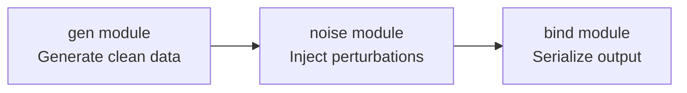
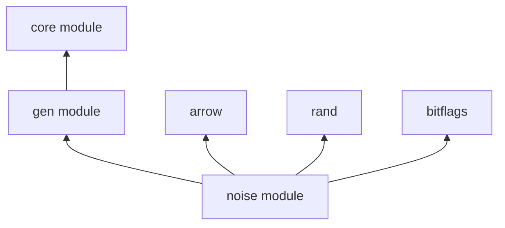
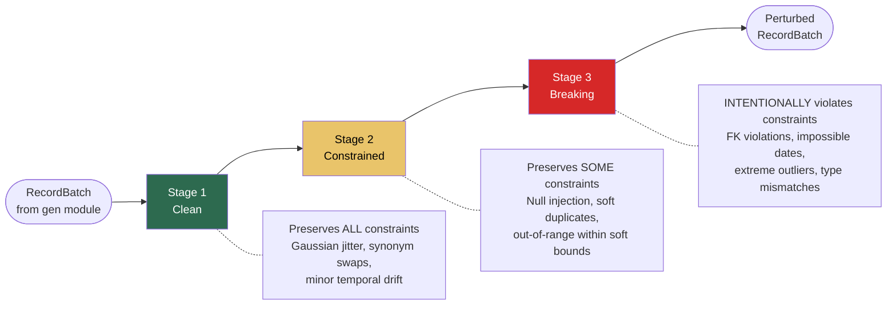
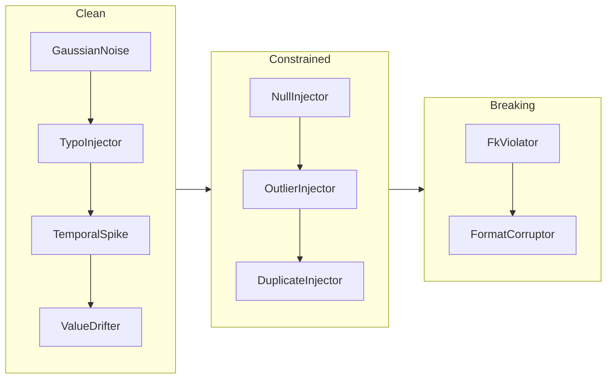
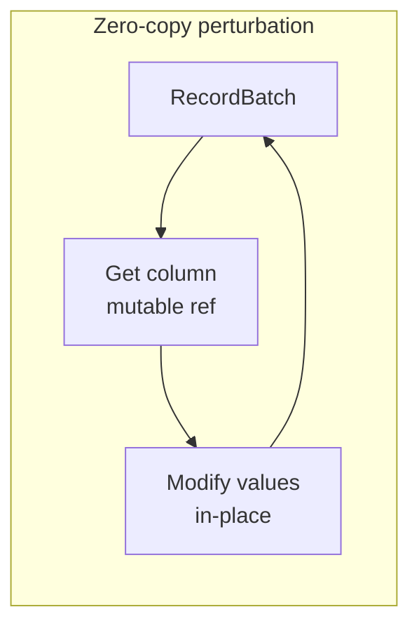

# noise module — Detailed Design Document

**Version:** 0.4.0
**Status:** Implemented
**Module:** `noise module`

---

## 1. Overview

Real-world data is messy. Production datasets contain typos, nulls in unexpected places,
outlier values, broken references, temporal clusters, and gradual drift. Synthetic data
that lacks these imperfections is immediately distinguishable from the real thing, making
it unsuitable for robustness testing, anomaly detection training, or realistic
load simulation.

**noise module** makes synthetic data realistic by injecting controlled noise, anomalies,
and outliers into generated data. It sits between the generation stage (`gen module`) and
the serialization stage (`bind module`) in the Knit forward pipeline:



The core innovation is a **three-stage invariant-aware pipeline**. Each perturbation
declares which data invariants it preserves or violates, and the engine groups
perturbations into three ordered stages — *clean*, *constrained*, and *breaking* — so
users can dial the level of chaos from "slightly imperfect" to "adversarially broken."

All operations modify Arrow `RecordBatch` data **in-place** to avoid allocation overhead
at dataset scale.

---

## 2. Dependencies

| Crate | Purpose |
|-------|---------|
| `core module` | Shared types (`Value`, `DataType`, `DataModel`, `NoiseProfile`) |
| `gen module` | Provides the `RecordBatch` output that noise module modifies |
| `arrow` | Columnar data representation (`RecordBatch`, `ArrayRef`, null bitmasks) |
| `rand` | Deterministic RNG (`StdRng`, `SeedableRng`, distribution sampling) |
| `bitflags` | `InvariantSet` flag type |



---

## 3. Three-Stage Pipeline

### 3.1 Pipeline Diagram



### 3.2 Stage Definitions

#### Stage 1 — Clean

The clean stage introduces realistic imperfections while preserving **all** blueprint
constraints: types remain valid, uniqueness holds, foreign keys resolve, NOT NULL
columns stay populated, and values remain within declared ranges.

**Examples:**
- **Gaussian jitter on numerics** — add small noise to `float`/`int` columns (e.g.,
  ±0.5% of value) without exceeding declared `min`/`max` bounds.
- **Synonym swaps on strings** — replace words with synonyms ("quick" → "fast") in
  text fields, preserving format and length constraints.
- **Minor temporal drift** — shift timestamps by small random offsets (seconds to
  minutes) while maintaining temporal ordering within the entity.

#### Stage 2 — Constrained

The constrained stage relaxes **some** constraints — typically soft or statistical ones —
while preserving structural integrity (types, FK references, primary keys).

**Examples:**
- **Null injection** — set values to null with a configured probability. Respects
  NOT NULL annotations on fields that are explicitly marked non-nullable; only injects
  nulls where the blueprint allows it (or where the user has explicitly opted in).
- **Soft duplicates** — insert near-duplicate rows with slight variations in non-key
  fields. Primary key uniqueness is preserved; other uniqueness constraints may be
  violated.
- **Out-of-range values within soft bounds** — produce values that fall outside the
  declared `min`/`max` by a configurable margin, but remain within the domain of the
  data type (e.g., a negative age but still an `i32`).

#### Stage 3 — Breaking

The breaking stage **intentionally** violates constraints to produce adversarial data
for robustness testing, error-handling validation, and anomaly detection training.

**Examples:**
- **FK violations** — write foreign key values that reference non-existent parent
  records.
- **Impossible dates** — produce dates like `2024-02-30` or timestamps with
  nonsensical timezone offsets.
- **Extreme outliers** — replace values with numbers orders of magnitude beyond
  normal range (e.g., an order amount of $9,999,999,999).
- **Type mismatches** — inject string values into numeric columns (for weakly-typed
  output formats like JSON/CSV).

### 3.3 User Control

Users control which stages run via the knit blueprint and CLI flags:

| Use Case | Stages | Rationale |
|----------|--------|-----------|
| Unit test fixtures | Clean only | Data must pass all application validation |
| Integration testing | Clean + Constrained | Test null handling and edge cases |
| Robustness / chaos testing | All three | Verify error handling under adversarial input |
| ML anomaly detection training | Clean + Breaking | Need labeled "normal" vs "anomalous" data |

When a stage is disabled, its perturbators are simply skipped. The pipeline order is
always clean → constrained → breaking; this ensures that clean perturbations are applied
to well-formed data, and breaking perturbations have the final say.

---

## 4. Perturbator Trait

Every noise operation implements the `Perturbator` trait:

```rust
trait Perturbator: Send + Sync {
    /// Human-readable name for logging and diagnostics.
    fn name(&self) -> &str;

    /// Which invariants this perturbator may violate.
    fn breaks(&self) -> InvariantSet;

    /// Column data types this perturbator can operate on.
    fn applicable_types(&self) -> &[DataType];

    /// Apply the perturbation to a specific column of the batch, in-place.
    fn perturb(
        &self,
        batch: &mut RecordBatch,
        column: usize,
        rng: &mut impl Rng,
        config: &PerturbConfig,
    );
}
```

### 4.1 InvariantSet

`InvariantSet` is a `bitflags` type that encodes which data invariants a perturbator
may violate. The pipeline uses this to assign perturbators to stages.

```rust
bitflags! {
    struct InvariantSet: u32 {
        const NOT_NULL        = 0b0000_0001;
        const UNIQUE          = 0b0000_0010;
        const FK_INTEGRITY    = 0b0000_0100;
        const TYPE_SAFETY     = 0b0000_1000;
        const RANGE           = 0b0001_0000;
        const TEMPORAL_ORDER  = 0b0010_0000;
    }
}
```

| Flag | Meaning |
|------|---------|
| `NOT_NULL` | May set non-nullable fields to null |
| `UNIQUE` | May produce duplicate values in unique columns |
| `FK_INTEGRITY` | May write FK values with no matching parent |
| `TYPE_SAFETY` | May produce values of the wrong type |
| `RANGE` | May produce values outside declared min/max |
| `TEMPORAL_ORDER` | May violate temporal ordering constraints |

**Stage assignment rule:** a perturbator whose `breaks()` returns an empty set is
*clean*. A perturbator that breaks only soft invariants (`NOT_NULL`, `RANGE`,
`TEMPORAL_ORDER`) is *constrained*. A perturbator that breaks hard invariants
(`FK_INTEGRITY`, `TYPE_SAFETY`, `UNIQUE`) is *breaking*.

### 4.2 PerturbConfig

Runtime configuration passed to each perturbator invocation:

```rust
struct PerturbConfig {
    /// Per-record probability of applying the perturbation (0.0–1.0).
    probability: f64,

    /// Perturbator-specific key-value parameters.
    params: HashMap<String, ParamValue>,

    /// Optional predicate restricting which records are eligible.
    scope: Option<ScopePredicate>,
}
```

---

## 5. Built-in Perturbators

### 5.1 NullInjector

Randomly sets field values to null.

| Property | Value |
|----------|-------|
| **Stage** | Clean (when field is `nullable = true`) / Constrained (when overriding NOT NULL) |
| **Breaks** | `NOT_NULL` (in constrained mode) |
| **Applicable types** | All types |

**Configuration:**

| Param | Type | Default | Description |
|-------|------|---------|-------------|
| `probability` | `f64` | 0.01 | Per-record probability of nulling the value |

**Behavior:** In the clean stage, NullInjector only targets fields where
`nullable = true` in the blueprint. In the constrained stage, it may null any field
regardless of the nullable annotation. The null is applied by flipping the
corresponding bit in the Arrow null bitmask — no data copy required.

### 5.2 GaussianNoise

Adds Gaussian (normal) noise to numeric columns.

| Property | Value |
|----------|-------|
| **Stage** | Clean |
| **Breaks** | _(empty — preserves all invariants)_ |
| **Applicable types** | `Int8`–`Int64`, `UInt8`–`UInt64`, `Float32`, `Float64` |

**Configuration:**

| Param | Type | Default | Description |
|-------|------|---------|-------------|
| `probability` | `f64` | 1.0 | Per-record probability of adding noise |
| `std_dev` | `f64` | — | Absolute standard deviation of the noise |
| `relative` | `f64` | — | Std dev as a fraction of the original value (e.g., 0.05 = 5%) |

Exactly one of `std_dev` or `relative` must be provided. When `relative` is used, the
noise standard deviation is `value * relative` per record. Values are clamped to the
field's declared `min`/`max` after perturbation to preserve range invariants.

### 5.3 TypoInjector

Injects character-level typos into string columns.

| Property | Value |
|----------|-------|
| **Stage** | Clean |
| **Breaks** | _(empty)_ |
| **Applicable types** | `Utf8`, `LargeUtf8` |

**Configuration:**

| Param | Type | Default | Description |
|-------|------|---------|-------------|
| `probability` | `f64` | 0.01 | Per-record probability of introducing at least one typo |
| `error_rate` | `f64` | 0.05 | Per-character probability of an error (given the record is selected) |

**Error types** (chosen uniformly at random per character):
- **Swap** — transpose two adjacent characters (`"hello"` → `"hlelo"`)
- **Insert** — insert a random character from the same Unicode block
- **Delete** — remove a character
- **Substitute** — replace a character with a nearby key (keyboard distance model)

### 5.4 OutlierInjector

Replaces values with statistical extremes.

| Property | Value |
|----------|-------|
| **Stage** | Constrained / Breaking (depending on multiplier magnitude) |
| **Breaks** | `RANGE` |
| **Applicable types** | `Int8`–`Int64`, `UInt8`–`UInt64`, `Float32`, `Float64` |

**Configuration:**

| Param | Type | Default | Description |
|-------|------|---------|-------------|
| `probability` | `f64` | 0.005 | Per-record probability |
| `multiplier` | distribution spec | `uniform(5.0, 50.0)` | Multiplier sampled from a distribution, applied to the column's standard deviation |
| `direction` | `"high"` / `"low"` / `"both"` | `"both"` | Which tail(s) to inject outliers into |

**Behavior:** For each selected record, sample a multiplier *m* from the configured
distribution. Compute `outlier = mean ± m * std_dev` (direction determines sign). The
column's mean and standard deviation are computed once per batch for efficiency.

### 5.5 DuplicateInjector

Duplicates rows — either exactly or as near-duplicates with slight modifications.

| Property | Value |
|----------|-------|
| **Stage** | Constrained |
| **Breaks** | `UNIQUE` |
| **Applicable types** | _(operates on entire rows, not individual columns)_ |

**Configuration:**

| Param | Type | Default | Description |
|-------|------|---------|-------------|
| `probability` | `f64` | 0.005 | Per-record probability of being duplicated |
| `count` | distribution spec | `constant(1)` | Number of duplicates per selected record |
| `near_duplicate` | `bool` | `false` | If true, apply small random perturbations to non-key fields |

**Behavior:** Selected rows are appended to the batch. In near-duplicate mode,
non-primary-key fields receive small perturbations (GaussianNoise for numerics,
TypoInjector for strings) to simulate realistic duplicates (e.g., a user submitting
a form twice with slightly different data).

### 5.6 TemporalSpike

Clusters timestamps around specific points to simulate event bursts (e.g., a flash sale,
an outage, a viral post).

| Property | Value |
|----------|-------|
| **Stage** | Clean |
| **Breaks** | _(empty)_ |
| **Applicable types** | `Date32`, `Date64`, `Timestamp(*)` |

**Configuration:**

| Param | Type | Default | Description |
|-------|------|---------|-------------|
| `probability` | `f64` | 0.02 | Fraction of records to pull toward the center |
| `center` | `datetime` | — | Center point of the spike |
| `spread` | `duration` | — | Standard deviation of the Gaussian spread around center |

**Behavior:** Selected records have their timestamp replaced with a value sampled from
`Normal(center, spread)`. The resulting timestamps are clamped to the field's declared
range to preserve clean-stage semantics.

### 5.7 FkViolator

Intentionally writes foreign key values that do not exist in the parent entity.

| Property | Value |
|----------|-------|
| **Stage** | Breaking |
| **Breaks** | `FK_INTEGRITY` |
| **Applicable types** | Matches the FK column's data type |

**Configuration:**

| Param | Type | Default | Description |
|-------|------|---------|-------------|
| `probability` | `f64` | 0.005 | Per-record probability |
| `strategy` | `"random"` / `"null"` / `"out_of_range"` | `"random"` | How to generate invalid FK values |

**Strategies:**
- **random** — generate a random value of the correct type that does not appear in
  the parent column (e.g., a random UUID not in the `user.id` column).
- **null** — set the FK to null (even if the column is NOT NULL).
- **out_of_range** — use a value outside the parent column's observed range (e.g.,
  a negative ID when all parent IDs are positive).

### 5.8 ValueDrifter

Gradually shifts numeric values over time to simulate data drift — a common problem in
production ML pipelines where input distributions change slowly.

| Property | Value |
|----------|-------|
| **Stage** | Clean |
| **Breaks** | _(empty — drift stays within range bounds)_ |
| **Applicable types** | `Int8`–`Int64`, `Float32`, `Float64` |

**Configuration:**

| Param | Type | Default | Description |
|-------|------|---------|-------------|
| `probability` | `f64` | 1.0 | Fraction of records affected |
| `drift_rate` | `f64` | — | Amount of drift per unit time |
| `direction` | `"up"` / `"down"` / `"oscillate"` | `"up"` | Direction of drift |

**Behavior:** Drift is applied as a function of record position within the batch
(or timestamp value if a temporal column is available). The offset is
`drift_rate * position_fraction * direction_sign`. Values are clamped to declared
bounds to preserve range invariants.

### 5.9 FormatCorruptor

Corrupts string values that follow a known format pattern.

| Property | Value |
|----------|-------|
| **Stage** | Breaking |
| **Breaks** | `TYPE_SAFETY` |
| **Applicable types** | `Utf8`, `LargeUtf8` |

**Configuration:**

| Param | Type | Default | Description |
|-------|------|---------|-------------|
| `probability` | `f64` | 0.01 | Per-record probability |

**Corruption types** (selected based on detected format):
- **Date strings** — produce invalid dates (`"2024-13-45"`, `"not-a-date"`)
- **Email addresses** — remove `@`, duplicate domain, add spaces (`"user@@..com"`)
- **Phone numbers** — wrong digit count, invalid country codes
- **URLs** — malformed schemes, missing TLD (`"htp://example"`)
- **UUIDs** — wrong length, invalid hex characters

### 5.10 MissingField

Omits fields entirely from document-oriented output (JSON/JSONL) to simulate
semi-structured data where some records lack optional keys.

Unlike other perturbators, `MissingField` is **not** an Arrow `RecordBatch`
transform — it operates at the serialization layer. Arrow's fixed blueprint cannot
represent per-row field absence, so the JSON sink itself decides omission using
a deterministic per-row RNG.

| Property | Value |
|----------|-------|
| **Stage** | Serialization (not a `Perturbator`) |
| **Breaks** | Field presence (document formats only) |
| **Applicable types** | All — any column can be omitted |

**Configuration:**

| Param | Type | Default | Description |
|-------|------|---------|-------------|
| `missing_field_rate` | `f64` | 0.0 | Per-row probability of omitting each targeted field |
| `fields` | `Vec<String>` | — | Which columns to target (required) |

**Behavior:** For each row and each targeted field, a ChaCha8 RNG seeded from
`(profile_seed + field_index)` decides whether to include the field. The seed
incorporates `rows_written` for batch-size independence.

**Format-specific:**
- **JSON/JSONL** — field key is omitted from the output object
- **CSV/Parquet/Avro** — warning emitted; field appears as normal (these formats
  have fixed column blueprints and cannot represent missing fields)

---

## 6. Scoped Noise

Perturbations can be restricted to a subset of records using a **scope predicate**. This
allows targeted noise injection — for example, adding outliers only to refunded orders or
injecting typos only into addresses from a specific region.

```toml
[[noise]]
target = "order.amount"
type = "outlier"
probability = 0.01
scope = { where = "status == 'refunded'" }
params = { multiplier = { distribution = "uniform", params = { min = 5.0, max = 50.0 } } }
```

### Predicate Evaluation

Scope predicates are evaluated against `RecordBatch` columns:

```mermaid
flowchart LR
    pred[Parse predicate\n"status == 'refunded'"] --> mask[Evaluate against\nRecordBatch columns]
    mask --> bitmask[Boolean bitmask\nof eligible rows]
    bitmask --> apply[Perturbator runs\nonly on true rows]
```

1. **Parse** — the `where` expression is parsed into a simple AST supporting `==`, `!=`,
   `<`, `>`, `<=`, `>=`, `IN`, `AND`, `OR`, `NOT`.
2. **Evaluate** — the AST is evaluated column-by-column against the `RecordBatch`,
   producing a boolean `BooleanArray` mask.
3. **Apply** — the perturbator receives the mask and only modifies rows where the mask
   is `true`. The probability roll is applied *after* scope filtering.

**Scope + probability interaction:** if `probability = 0.01` and the scope matches 10%
of rows, then ~0.1% of total rows are perturbed (the two filters multiply).

---

## 7. Noise Composition

Multiple perturbators can be applied to the same batch. The composition model defines
ordering and probability interaction.

### Application Order

Perturbators are always applied in stage order:



Within a stage, perturbators are applied in declaration order from the knit blueprint.

### Probability Stacking

When multiple perturbators target the same column, their probabilities are **independent**.
A record may be affected by zero, one, or many perturbators. The probability that a
record is affected by at least one perturbator is:

```
P(any) = 1 − ∏(1 − pᵢ)
```

This means stacking 10 perturbators each at `p = 0.01` yields ~9.6% of records affected
by at least one, not 10%. The independent model avoids surprising interactions and makes
reasoning about noise levels straightforward.

---

## 8. Configuration

### knit blueprint Mapping

Noise profiles declared in the knit blueprint map directly to perturbator instances:

```toml
[[noise]]
target = "user.email"       # entity.field to perturb
type = "typo"               # perturbator type name
probability = 0.01          # per-record probability
stage = "clean"             # pipeline stage
scope = { where = "..." }   # optional scope predicate
params = { error_rate = 0.05 }  # perturbator-specific params
```

### NoiseProfile Structure

The parsed in-memory representation:

```rust
struct NoiseProfile {
    /// Target in "entity.field" format.
    target: FieldRef,

    /// Perturbator type name (e.g., "typo", "gaussian", "null_inject").
    perturbator_type: String,

    /// Per-record probability of perturbation.
    probability: f64,

    /// Perturbator-specific parameters.
    params: HashMap<String, ParamValue>,

    /// Pipeline stage override. If omitted, inferred from InvariantSet.
    stage: Option<Stage>,

    /// Optional scope predicate.
    scope: Option<ScopePredicate>,
}

enum Stage {
    Clean,
    Constrained,
    Breaking,
}
```

### Resolution

When the pipeline starts, each `NoiseProfile` is resolved to a `(Perturbator, PerturbConfig)` pair:

1. **Lookup** — find the perturbator implementation by `perturbator_type`.
2. **Validate** — check that the target column's `DataType` is in `applicable_types()`.
3. **Stage assignment** — use the explicit `stage` if provided; otherwise infer from `breaks()`.
4. **Config** — build `PerturbConfig` from `probability`, `params`, and `scope`.

---

## 9. Performance

### In-Place RecordBatch Modification

noise module modifies `RecordBatch` arrays **in-place** rather than allocating new arrays.
This eliminates the allocation and copy overhead that would otherwise dominate at dataset
scale (100GB+).



### Vectorized Null Mask Operations

`NullInjector` operates entirely on Arrow's null bitmask — a compact bit-per-row
representation. Setting a value to null requires flipping a single bit, not touching the
data buffer at all. For a column of 1M rows, the null mask is only 125 KB.

### Batch-Level Random Decisions

Instead of calling `rng.gen::<f64>() < probability` per row, perturbators generate a
**probability vector** for the entire batch in one pass:

```rust
// Generate probability decisions for all rows at once
let decisions: Vec<bool> = (0..batch.num_rows())
    .map(|_| rng.gen::<f64>() < config.probability)
    .collect();

// Apply only to selected rows
for (i, apply) in decisions.iter().enumerate() {
    if *apply {
        perturb_row(batch, column, i);
    }
}
```

This pattern is CPU-cache-friendly and enables future SIMD optimization of the
probability vector generation.

---

## 10. Testing Strategy

### Statistical Tests

Perturbators are stochastic, so tests verify **statistical properties** over large samples:

- **Null rate accuracy** — apply `NullInjector` with `probability = 0.05` to 100K rows;
  assert actual null rate is within `0.05 ± 0.01` (binomial confidence interval).
- **Gaussian noise distribution** — apply `GaussianNoise` with known `std_dev`; verify
  the noise values pass a Kolmogorov-Smirnov test against the expected normal distribution.
- **Outlier magnitude** — apply `OutlierInjector`; verify outlier values exceed
  `mean + 3 * std_dev` of the original column.

### Invariant Preservation Tests

The most critical tests verify that **clean-stage perturbators never break constraints**:

- Apply every clean perturbator to a batch with NOT NULL, UNIQUE, FK, and RANGE
  constraints. Assert all constraints still hold after perturbation.
- Apply constrained perturbators and verify that only the declared invariants are
  violated (e.g., `NullInjector` may break NOT_NULL but must preserve FK_INTEGRITY).
- Fuzz test: run random combinations of clean perturbators with random configs on
  random batches; assert no constraint violations.

### FK Violation Tests

Verify that the breaking stage produces the expected invalid data:

- Apply `FkViolator` with `strategy = "random"`; assert the generated FK values do
  **not** exist in the parent column.
- Apply `FkViolator` with `strategy = "null"`; assert FK values are null.
- Apply `FkViolator` with `strategy = "out_of_range"`; assert FK values are outside
  the parent column's min/max range.

---

## 11. Design Decisions

| # | Decision | Alternatives Considered | Rationale |
|---|----------|------------------------|-----------|
| 1 | **Three invariant stages** (clean / constrained / breaking) | Binary clean/dirty; per-perturbator toggle; continuous "chaos level" slider | Three stages map naturally to real use cases (test fixtures, integration tests, chaos testing). A continuous slider would require every perturbator to scale its behavior smoothly, which is complex and hard to reason about. |
| 2 | **In-place RecordBatch modification** | Copy-on-write; return new batch; delta log | At 100GB+ scale, copying batches doubles memory and kills throughput. In-place modification is the only viable option. The trade-off (destructive, harder to debug) is mitigated by deterministic seeding — re-running with the same seed reproduces the exact same perturbation. |
| 3 | **Bitflags for InvariantSet** | Enum set; trait-based invariant checking; runtime string tags | Bitflags are zero-cost, composable (`a | b`), and trivially comparable (`a & b == empty`). Stage assignment becomes a single bitmask test. Enum sets add allocation; trait-based checking adds vtable overhead on a hot path. |
| 4 | **Perturbator trait with `perturb(&mut RecordBatch)`** | Visitor pattern over columns; expression-based DSL; row-level callback | Direct batch mutation gives perturbators full control over Arrow internals (bitmask ops, buffer access) for maximum performance. Row-level callbacks would prevent vectorization. |
| 5 | **Independent probability stacking** | Sequential conditional probability; combined probability budget; priority ordering | Independent probabilities are intuitive: each perturbator's `probability` means exactly what it says regardless of other perturbators. Conditional models create confusing interactions where adding a perturbator changes the effective rate of existing ones. |
| 6 | **Scope predicates on RecordBatch** | Pre-filter rows into separate batches; post-filter with undo; SQL WHERE clause engine | Evaluating predicates as boolean masks on columnar data is natural in Arrow and avoids splitting/reassembling batches. The predicate language is deliberately simple (no subqueries, no joins) to keep evaluation fast. |
| 7 | **Stage order always clean → constrained → breaking** | User-configurable order; parallel stages; reverse order | Fixed ordering ensures clean perturbations see well-formed data and breaking perturbations get the final say. Allowing arbitrary order would create hard-to-debug interactions (e.g., a clean perturbator "fixing" a break). |
