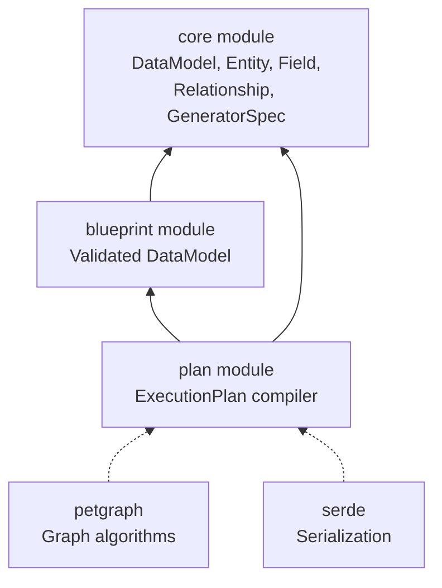
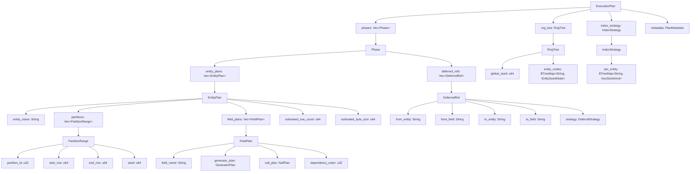
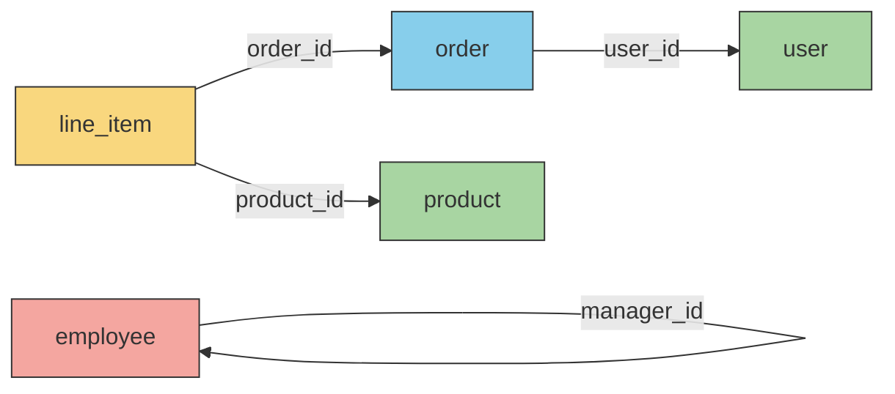
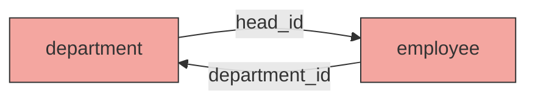
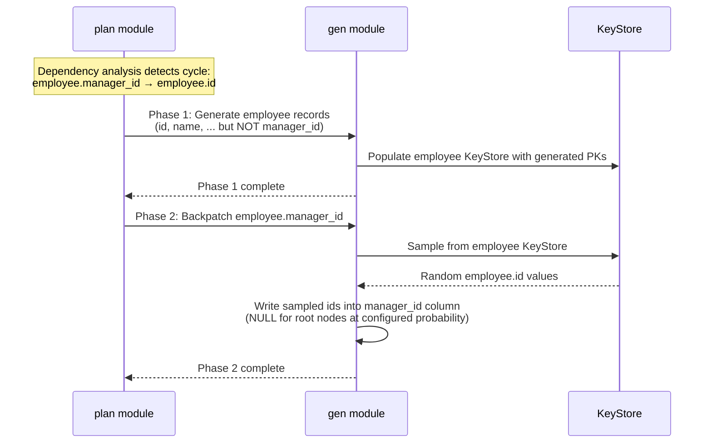
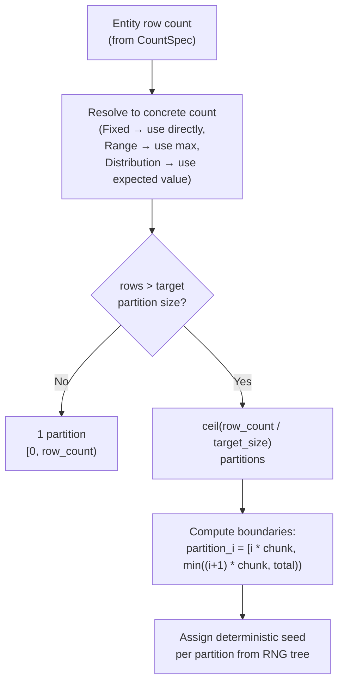
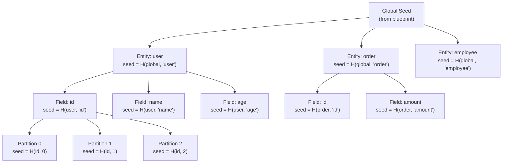
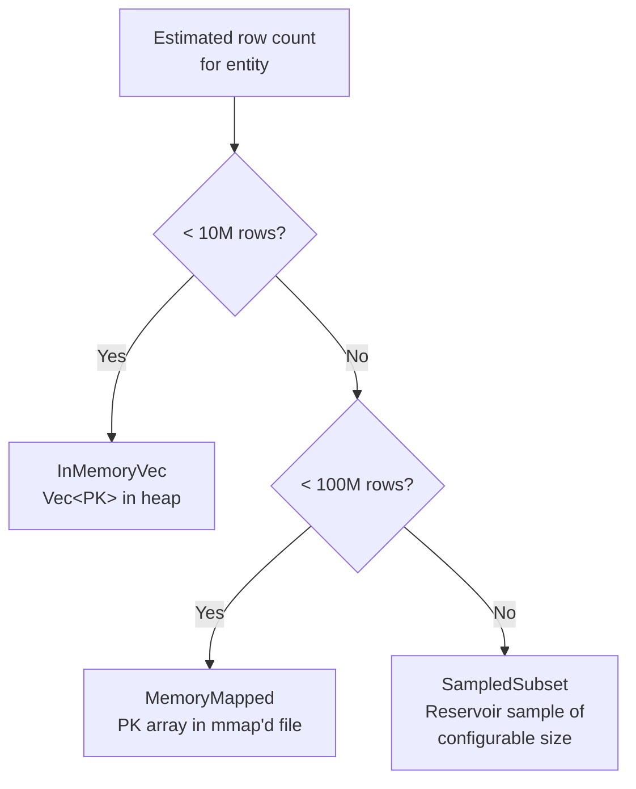
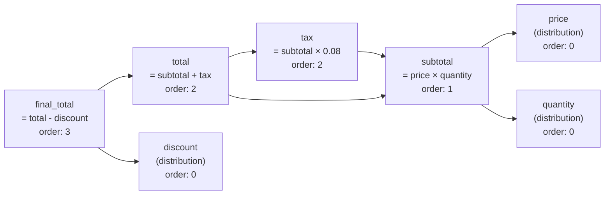

# plan module — Detailed Design Document

**Version:** 0.4.0
**Status:** Implemented
**Project:** Knit — High-Performance Synthetic Data Generation Toolset

---

## Table of Contents

- [1. Overview](#1-overview)
- [2. Dependencies](#2-dependencies)
- [3. ExecutionPlan Type Hierarchy](#3-executionplan-type-hierarchy)
- [4. Dependency Graph Analysis](#4-dependency-graph-analysis)
- [5. Two-Phase Generation Planning](#5-two-phase-generation-planning)
- [6. Partition Planning](#6-partition-planning)
- [7. RNG Tree Construction](#7-rng-tree-construction)
- [8. Index Strategy Selection](#8-index-strategy-selection)
- [9. Derived Field Ordering](#9-derived-field-ordering)
- [10. Plan Inspection](#10-plan-inspection)
- [11. Testing Strategy](#11-testing-strategy)
- [12. Design Decisions](#12-design-decisions)

---

## 1. Overview

**plan module** is the bridge between blueprint and execution. It takes a validated `DataModel`
(produced by `blueprint module` from a Knit document) and compiles it into an `ExecutionPlan`
— a complete, self-contained instruction set that tells the generation engine (`gen module`)
exactly what to do, in what order, and with what parameters.


### Why a Separate Planning Phase?

The planning phase exists as a distinct stage for three reasons:

1. **Inspectability.** The `ExecutionPlan` is a concrete data structure that can be
   serialized, printed, and examined before any data is generated. The `knit plan <blueprint>`
   command lets users see exactly how the engine will interpret their blueprint — phase
   ordering, partition counts, generator assignments, seed allocations — without
   producing a single row. This makes debugging and blueprint tuning dramatically easier.

2. **Testability.** Because the plan is a pure function of the `DataModel`, it can be
   tested in isolation with simple input/output assertions. No file system, no
   randomness, no threading. The planning logic is the most complex algorithmic
   component in Knit (dependency analysis, cycle detection, partition sizing, seed
   derivation), and it benefits enormously from being testable without infrastructure.

3. **Separation of concerns.** The planner reasons about *what* to generate and *in
   what order*. The engine reasons about *how* to generate it efficiently (columnar
   builders, Arrow arrays, rayon parallelism). This separation means the planner can
   be improved (better partitioning heuristics, smarter index strategies) without
   touching the engine, and vice versa.

### Purity Guarantee

The `ExecutionPlan` is a **pure data structure**:

- **No I/O.** The planner reads nothing from the file system and writes nothing. All
  information comes from the `DataModel`.
- **No randomness.** The planner does not sample random numbers. It *computes* seeds
  deterministically but does not consume them.
- **Deterministic.** The same `DataModel` always produces the same `ExecutionPlan`,
  regardless of platform, thread count, or time of day.

---

## 2. Dependencies

| Module / Dependency | Role in plan module |
|-------|-------------------|
| **core module** | Provides the `DataModel`, `Entity`, `Field`, `Relationship`, `GeneratorSpec`, `DistributionSpec`, `CountSpec`, `NullSpec`, and `Value` types that the planner consumes as input. |
| **blueprint module** | Provides the validated `DataModel` — plan module does not parse Knit documents directly, it receives the already-parsed and validated model. The blueprint module also surfaces relationship and constraint metadata that the planner depends on. |
| **petgraph** | Used to build and analyze directed dependency graphs. Provides topological sorting (`toposort`), strongly connected component detection (Tarjan's algorithm via `tarjan_scc`), and general graph traversal utilities. |
| **serde** | The `ExecutionPlan` and all sub-types derive `Serialize`/`Deserialize` for plan inspection, caching, and JSON/TOML output. |



---

## 3. ExecutionPlan Type Hierarchy

### Structure Diagram



### Rust Type Definitions

```rust
/// The complete execution plan — everything the engine needs to generate a dataset.
#[derive(Debug, Clone, Serialize, Deserialize)]
pub struct ExecutionPlan {
    /// Ordered generation phases. Phase 0 runs first, then phase 1, etc.
    /// Entities within a phase can run in parallel.
    pub phases: Vec<Phase>,

    /// Hierarchical deterministic seed structure.
    pub rng_tree: RngTree,

    /// Per-entity key store sizing decisions.
    pub index_strategy: IndexStrategy,

    /// Informational metadata for inspection and debugging.
    pub metadata: PlanMetadata,
}

/// A generation phase. All entity plans within a phase are independent
/// and can execute in parallel. Deferred refs are resolved after all
/// entity plans in the phase complete.
#[derive(Debug, Clone, Serialize, Deserialize)]
pub struct Phase {
    pub entity_plans: Vec<EntityPlan>,
    pub deferred_refs: Vec<DeferredRef>,
}

/// Plan for generating a single entity's data.
#[derive(Debug, Clone, Serialize, Deserialize)]
pub struct EntityPlan {
    pub entity_name: String,
    pub partitions: Vec<PartitionRange>,
    pub field_plans: Vec<FieldPlan>,
    pub estimated_row_count: u64,
    pub estimated_byte_size: u64,
}

/// A contiguous range of rows assigned to one partition.
/// Each partition is generated by a single thread with its own RNG.
#[derive(Debug, Clone, Serialize, Deserialize)]
pub struct PartitionRange {
    pub partition_id: u32,
    pub start_row: u64,
    pub end_row: u64,
    pub seed: u64,
}

/// Plan for generating a single field within an entity.
#[derive(Debug, Clone, Serialize, Deserialize)]
pub struct FieldPlan {
    pub field_name: String,
    pub generator_plan: GeneratorPlan,
    pub null_plan: NullPlan,
    /// Execution order within the entity. Fields with lower values are
    /// generated first. Independent fields share the same order value.
    pub dependency_order: u32,
}

/// A compiled generator — all parameters fully resolved, ready for execution.
/// This is the plan-time counterpart of the blueprint-level GeneratorSpec.
#[derive(Debug, Clone, Serialize, Deserialize)]
pub enum GeneratorPlan {
    /// Statistical distribution with resolved, validated parameters.
    Distribution {
        kind: DistributionKind,
        params: BTreeMap<String, f64>,
        clamp_min: Option<f64>,
        clamp_max: Option<f64>,
    },
    /// Faker-style structured data with resolved locale chain.
    Faker {
        category: String,
        locale: String,
    },
    /// Auto-increment or cyclic sequence. start/step are resolved
    /// per-partition to avoid collisions.
    Sequence {
        start: i64,
        step: i64,
    },
    /// Weighted random choice with pre-computed cumulative weights.
    OneOf {
        choices: Vec<WeightedChoice>,
        cumulative_weights: Vec<f64>,
    },
    /// Derived field: expression string + resolved dependency indices.
    Derived {
        expr: String,
        depends_on: Vec<String>,
    },
    /// Constant value.
    Constant(Value),
    /// Composite/array generator with element strategy and length distribution.
    Composite {
        element: Box<GeneratorPlan>,
        length: Box<GeneratorPlan>,
    },
    /// Foreign key lookup — resolved target entity and field.
    ForeignKey {
        target_entity: String,
        target_field: String,
        key_store_kind: KeyStoreKind,
    },
}

/// How to handle nulls for a field.
#[derive(Debug, Clone, Serialize, Deserialize)]
pub enum NullPlan {
    Never,
    Always,
    Probability(f64),
    Pattern { every_n: usize },
}

/// A deferred foreign key reference that must be backpatched after
/// the initial generation phase.
#[derive(Debug, Clone, Serialize, Deserialize)]
pub struct DeferredRef {
    pub from_entity: String,
    pub from_field: String,
    pub to_entity: String,
    pub to_field: String,
    pub strategy: DeferralStrategy,
}

/// How to resolve a deferred reference.
#[derive(Debug, Clone, Serialize, Deserialize)]
pub enum DeferralStrategy {
    /// Sample uniformly from the target entity's key store.
    UniformSample,
    /// Sample according to a cardinality distribution.
    DistributionSample(DistributionKind, BTreeMap<String, f64>),
    /// Self-referential: sample from own key store (e.g., manager_id → id).
    SelfReference { nullable_root_probability: f64 },
}

/// Hierarchical deterministic seed tree.
#[derive(Debug, Clone, Serialize, Deserialize)]
pub struct RngTree {
    pub global_seed: u64,
    pub entity_nodes: BTreeMap<String, EntitySeedNode>,
}

#[derive(Debug, Clone, Serialize, Deserialize)]
pub struct EntitySeedNode {
    pub entity_seed: u64,
    pub field_seeds: BTreeMap<String, FieldSeedNode>,
}

#[derive(Debug, Clone, Serialize, Deserialize)]
pub struct FieldSeedNode {
    pub field_seed: u64,
    pub partition_seeds: Vec<u64>,
}

/// Per-entity index strategy decisions.
#[derive(Debug, Clone, Serialize, Deserialize)]
pub struct IndexStrategy {
    pub per_entity: BTreeMap<String, KeyStoreKind>,
}

#[derive(Debug, Clone, Serialize, Deserialize)]
pub enum KeyStoreKind {
    /// In-memory Vec<PK> — fast, used for entities < 10M rows.
    InMemoryVec,
    /// Memory-mapped file — for 10M–100M rows.
    MemoryMapped,
    /// Sampled subset — for > 100M rows. Stores a representative sample.
    SampledSubset { sample_size: usize },
}

/// Informational metadata about the plan.
#[derive(Debug, Clone, Serialize, Deserialize)]
pub struct PlanMetadata {
    pub blueprint_name: String,
    pub total_entities: usize,
    pub total_phases: usize,
    pub total_partitions: usize,
    pub estimated_total_rows: u64,
    pub estimated_total_bytes: u64,
    pub has_cycles: bool,
    pub deferred_ref_count: usize,
}
```

---

## 4. Dependency Graph Analysis

### Purpose

Entities in a knit blueprint are connected by relationships (foreign keys). Before
generating data, the planner must determine a valid generation order: parent entities
(those referenced by foreign keys) must be generated before child entities (those
holding the foreign keys), so that the FK values can be sampled from the parent's
key store.

### Algorithm

1. **Build the dependency graph.** Create a directed graph where each node is an entity
   and each edge `A → B` means "entity A has a foreign key pointing to entity B" (A
   depends on B). The graph is built using `petgraph::DiGraph`.

2. **Detect strongly connected components (SCCs).** Apply Tarjan's SCC algorithm
   (`petgraph::algo::tarjan_scc`). An SCC of size > 1 indicates a dependency cycle
   (e.g., `employee.manager_id → employee.id`, or `A → B → C → A`). An SCC of size 1
   with a self-edge indicates a self-referential entity.

3. **Condensation.** Collapse each SCC into a single super-node, producing a DAG (the
   condensation graph). This DAG is guaranteed to be acyclic.

4. **Topological sort.** Sort the condensation DAG topologically
   (`petgraph::algo::toposort`). This gives the phase ordering: entities whose
   super-node appears earlier in the sort are generated in earlier phases.

5. **Phase assignment.** Entities in the same SCC are assigned to the same phase. Their
   cyclic FK fields are marked as deferred and will be backpatched in a subsequent step.

### Example

Consider a blueprint with four entities:

- `user` — no outgoing FKs
- `order` — FK to `user`
- `line_item` — FK to `order` and FK to `product`
- `product` — no outgoing FKs
- `employee` — self-referential FK (`manager_id → id`)



**SCC analysis:**
- `{user}` — singleton, no self-edge → acyclic
- `{product}` — singleton, no self-edge → acyclic
- `{order}` — singleton, no self-edge → acyclic
- `{line_item}` — singleton, no self-edge → acyclic
- `{employee}` — singleton **with self-edge** → cyclic (self-referential)

**Topological sort of condensation DAG:**
1. `user`, `product` (no dependencies — can run in parallel)
2. `order` (depends on `user`)
3. `line_item` (depends on `order` and `product`)
4. `employee` (self-referential — gets two-phase treatment)

**Resulting phases:**

| Phase | Entities | Deferred Refs |
|-------|----------|---------------|
| 0 | `user`, `product` | — |
| 1 | `order` | — |
| 2 | `line_item` | — |
| 3 | `employee` (PKs + non-FK fields) | `employee.manager_id → employee.id` |

### Cycle Detection with Mutual References

For mutually referential entities (e.g., `department.head_id → employee.id` and
`employee.department_id → department.id`), Tarjan's algorithm detects the SCC
`{department, employee}`. Both entities are placed in the same phase, and one
direction of the FK (chosen by heuristic: the FK on the entity with fewer rows)
is deferred:



The planner selects `department.head_id` as the deferred ref (assuming `department`
has fewer rows than `employee`), allowing `employee.department_id` to be generated
normally by sampling from `department`'s key store after phase 1 creates all
department PKs.

---

## 5. Two-Phase Generation Planning

### The Problem

Cyclic and self-referential relationships create a chicken-and-egg problem: you can't
generate FK values pointing to a key store that doesn't exist yet.

### The Solution

The planner assigns entities involved in cycles a **two-phase** treatment:

- **Phase 1 (Create):** Generate all records with primary keys and all non-deferred
  fields. FK fields that participate in cycles are left as NULL placeholders.
- **Phase 2 (Backpatch):** After the key stores are populated from Phase 1, go back
  and fill in the deferred FK fields by sampling from the now-available key stores.

### Self-Referential Entities

A self-referential entity (e.g., `employee.manager_id → employee.id`) is the most
common cycle case. The planner handles it as follows:

1. Phase 1 generates all `employee` records with `id` (PK), `name`, and other
   non-FK fields. `manager_id` is left NULL.
2. The `employee` key store is populated with all generated `id` values.
3. Phase 2 backpatches `manager_id` by sampling from the `employee` key store.
4. Root nodes (employees with no manager) are created by leaving `manager_id` as
   NULL with a configurable probability (default: 5-10% of records, derived from
   the relationship's `nullable` spec).

### Sequence Diagram



### Multi-Entity Cycles

For mutual references (e.g., `department ↔ employee`), the planner:

1. Phase 1: Generate both `department` and `employee` records with PKs and
   non-deferred fields. Populate both key stores.
2. Phase 2: Backpatch the deferred FK (`department.head_id`) by sampling from
   `employee`'s key store.

The non-deferred direction (`employee.department_id → department.id`) is generated
normally in Phase 1, since `department` records (and their key store) are created
in the same phase before `employee`'s FK field is populated.

Within a phase, entity plan ordering ensures that an entity's dependencies within
the same phase are generated first when possible. The deferred ref is the one that
*cannot* be satisfied within the phase's own ordering.

---

## 6. Partition Planning

### Purpose

Partition planning divides each entity's row space into contiguous, non-overlapping
ranges (partitions) that can be generated independently and in parallel. Partitions
are the unit of parallelism in `gen module`.

### Partitioning Algorithm



### Sizing Heuristics

| Entity Row Count | Default Partition Size | Partitions | Rationale |
|------------------|----------------------|------------|-----------|
| < 1M | Entire entity | 1 | Overhead of partitioning exceeds benefit |
| 1M – 10M | 1M rows | 1–10 | Good balance of parallelism and overhead |
| 10M – 1B | 1M rows | 10–1000 | Saturates typical core counts |
| > 1B | 1M rows (configurable) | 1000+ | Cap at available cores × 4 for queue depth |

The target partition size (default: 1,048,576 = 2²⁰ rows) is configurable via the
blueprint's `model.partition_size` field or the `--partition-size` CLI flag.

### Reproducibility Invariant

**Partition boundaries are determined solely by the entity's row count and the target
partition size.** They do not depend on the number of available threads, the machine's
core count, or any runtime parameter. This ensures that the same blueprint produces the
same partition boundaries on any machine, which is essential for reproducibility:

- Same partition boundaries → same per-partition seeds → same generated data.
- Thread count affects only *concurrency* (how many partitions run simultaneously),
  never *correctness* (what data is produced).

### Partition Boundary Calculation

```
target_size = 1_048_576  // default, configurable
row_count   = entity.count.resolve()

if row_count <= target_size {
    partitions = [PartitionRange { id: 0, start: 0, end: row_count, seed: ... }]
} else {
    num_partitions = ceil(row_count / target_size)
    chunk_size     = ceil(row_count / num_partitions)  // evenly distributed

    partitions = (0..num_partitions).map(|i| PartitionRange {
        id:    i,
        start: i * chunk_size,
        end:   min((i + 1) * chunk_size, row_count),
        seed:  rng_tree.partition_seed(entity_name, i),
    })
}
```

---

## 7. RNG Tree Construction

### Motivation

Knit's reproducibility guarantee requires that every random value in the dataset is
determined by the global seed and the location of that value (entity, field, partition,
row). Crucially, the seeding must be **isolated**: adding a field to one entity must
not change the generated values for any other entity or field.

A flat seeding scheme (e.g., a single RNG advanced sequentially) would fail this
requirement — any structural change to the blueprint would shift the RNG state and
change all downstream values. The hierarchical RNG tree solves this.

### Tree Structure



### Seed Derivation

Each seed in the tree is derived from its parent using a keyed hash function:

```
entity_seed    = H(global_seed, entity_name)
field_seed     = H(entity_seed, field_name)
partition_seed = H(field_seed,  partition_index)
```

Where `H` is a deterministic keyed hash function. Two candidates:

| Function | Properties | Trade-off |
|----------|-----------|-----------|
| **HMAC-SHA256** | Cryptographic strength, widely available | Slightly slower (~200ns per derivation), more bytes than needed |
| **SipHash-2-4** | Fast (< 10ns), 64-bit output, built into Rust stdlib | Not cryptographic, but sufficient for seed derivation (we need distribution, not security) |

**Recommendation:** Use **SipHash-2-4** (via `std::collections::hash_map::DefaultHasher`
or the `siphasher` crate) for seed derivation. The hash does not need to be
cryptographic — it only needs to produce well-distributed, deterministic 64-bit seeds.
SipHash is ~20× faster than HMAC-SHA256 and produces the exact bit width we need.

### Leaf Instantiation

Each leaf of the RNG tree (a partition seed) is used to instantiate a **ChaCha8Rng**
(from `rand` with the `chacha` feature):

```rust
let partition_rng = ChaCha8Rng::seed_from_u64(partition_seed);
```

ChaCha8 is chosen for its combination of statistical quality (passes BigCrush),
speed (~1.2 GB/s), and reproducibility across platforms (no platform-dependent
behavior, unlike some SIMD-accelerated generators).

### Isolation Property

The hierarchical structure guarantees isolation:

- **Adding a field** to `user` (e.g., `user.loyalty_points`) creates a new branch
  in the tree. The seeds for `order`, `employee`, and all other entities are unchanged.
- **Adding an entity** creates a new top-level branch. No existing entity seeds change.
- **Changing partition count** (e.g., by changing `user.count`) changes partition seeds
  for `user` only. All other entities are unaffected.
- **Removing a field** removes a branch. No sibling or cousin seeds change.

This property is critical for blueprint evolution: users can iterate on their Knit
document without invalidating previously validated subsets of the generated data.

---

## 8. Index Strategy Selection

### Purpose

When generating FK values, the engine must sample from the parent entity's primary
key store. The `IndexStrategy` tells the engine how to store and access these keys,
balancing memory usage against access speed.

### Decision Logic



### Strategy Details

#### InMemoryVec (< 10M rows)

- Store all primary keys in a `Vec<Value>` (or typed `Vec<i64>`, `Vec<Uuid>`, etc.).
- Random sampling is O(1): generate a random index, return `keys[index]`.
- Memory: ~80 bytes per UUID key × 10M = ~800MB. Acceptable for modern machines.
- This is the default for the vast majority of entities.

#### MemoryMapped (10M – 100M rows)

- Write primary keys to a temporary file as a flat array of fixed-size values.
- Memory-map the file for random access.
- Sampling is still O(1) but may incur page faults. The OS manages caching.
- Avoids holding multi-GB key stores in the heap, leaving memory for Arrow buffers.
- File is cleaned up when the key store is dropped.

#### SampledSubset (> 100M rows)

- Maintain a reservoir sample (e.g., 1M keys) using Algorithm R or Algorithm L.
- FK values are sampled from the reservoir, not the full key store.
- Introduces a slight statistical deviation: the FK distribution is limited to the
  sample's representativeness. For uniform FK distributions this is negligible.
- For non-uniform cardinality distributions (e.g., Zipf), the reservoir is weighted
  to preserve the distribution shape.
- `sample_size` is configurable (default: 1,048,576).

### Thresholds

The 10M and 100M thresholds are derived from practical memory constraints:

| Threshold | PK Type = i64 (8 bytes) | PK Type = UUID (16 bytes) |
|-----------|------------------------|--------------------------|
| 10M | ~80 MB | ~160 MB |
| 100M | ~800 MB | ~1.6 GB |

These thresholds are configurable via `model.index_thresholds` in the blueprint.

---

## 9. Derived Field Ordering

### The Problem

Within a single entity, some fields depend on other fields. A `derived` field with
expression `price * quantity` depends on both `price` and `quantity` — those fields
must be generated before the derived field can be evaluated.

### Algorithm

1. **Build a per-entity field dependency DAG.** For each entity, create a directed
   graph where each node is a field and each edge `A → B` means "field A depends on
   field B" (A must be generated after B). Edges are extracted from `Derived { expr }`
   generators by parsing the expression for field references.

2. **Topological sort.** Sort the field DAG topologically. Fields with no dependencies
   get `dependency_order = 0`. Fields that depend only on order-0 fields get
   `dependency_order = 1`, and so on.

3. **Cycle detection.** If the field DAG contains a cycle (e.g., `a = f(b)` and
   `b = f(a)`), the planner emits a compile error. Unlike entity-level cycles (which
   are handled with two-phase generation), field-level cycles within a single entity
   are not solvable and indicate a blueprint error.

### Example



**Resulting `dependency_order` values:**

| Field | Order | Rationale |
|-------|-------|-----------|
| `price` | 0 | Independent generator |
| `quantity` | 0 | Independent generator |
| `discount` | 0 | Independent generator |
| `subtotal` | 1 | Depends on order-0 fields |
| `tax` | 2 | Depends on `subtotal` (order 1) |
| `total` | 2 | Depends on `subtotal` (1) and `tax` (2) → max + 1... but `tax` is order 2, so `total` must be ≥ 2. Since `total` depends on `tax`, `total` is order 3. |
| `final_total` | 3 | Depends on `total` (order 3) |

*(Note: the actual order values are computed as the longest path from a source node
in the DAG, ensuring all dependencies are satisfied.)*

### Error Reporting

When a cycle is detected in the field DAG, the planner reports:

```
error[E301]: cyclic field dependency in entity "invoice"
  ┌─ blueprint.knit.toml
  │
  │  field "a" depends on "b" (via derived expression)
  │  field "b" depends on "a" (via derived expression)
  │
  = help: break the cycle by making one field non-derived
```

---

## 10. Plan Inspection

The `knit plan <blueprint>` CLI command compiles a Knit document into an `ExecutionPlan`
and prints a human-readable summary. This is the primary debugging tool for blueprint
authors.

### Output Format

```
$ knit plan ecommerce.knit.toml

Execution Plan for "ecommerce"
══════════════════════════════════════════════════════════════

Metadata
  Entities:       5
  Phases:         4
  Total rows:     605,000
  Est. size:      ~48.2 MB
  Has cycles:     yes (1 deferred ref)

Phase 0 ─────────────────────────────────────────────────────
  Entity: user (100,000 rows, 1 partition, ~8.1 MB)
    Fields:
      id          uuid        sequence(1, 1)          order: 0
      name        string      faker(name, en_US)      order: 0
      age         int         normal(μ=35, σ=12)      order: 0
      income      float       log_normal(μ=10.8, σ=0.7) order: 0
      signup_date datetime    uniform(2020..2025)     order: 0
      tier        string      one_of(4 choices)       order: 0
      email       string      faker(email) null=2%    order: 0
    Index: InMemoryVec (100K keys, ~1.6 MB)

  Entity: product (no FKs, generated in parallel with user)
    ...

Phase 1 ─────────────────────────────────────────────────────
  Entity: order (500,000 rows, 1 partition, ~28.4 MB)
    Fields:
      id          uuid        sequence(1, 1)          order: 0
      user_id     uuid        fk → user.id            order: 0
      amount      float       pareto(scale=10, shape=1.5) order: 0
      item_count  int         poisson(λ=3.2)          order: 0
      status      string      one_of(4 choices)       order: 0
    Index: InMemoryVec (500K keys, ~8 MB)

Phase 2 ─────────────────────────────────────────────────────
  Entity: line_item (depends on order, product)
    ...

Phase 3 ─────────────────────────────────────────────────────
  Entity: employee (5,000 rows, 1 partition, ~0.2 MB)
    Fields:
      id          int         sequence(1, 1)          order: 0
      manager_id  int         ** DEFERRED **          order: —
    Index: InMemoryVec (5K keys, ~40 KB)
  Deferred:
    employee.manager_id → employee.id (self-ref, null_root=10%)

RNG Tree ────────────────────────────────────────────────────
  Global seed: 42
  ├── user      seed: 0xa3f1...  (7 fields × 1 partition = 7 leaves)
  ├── product   seed: 0x7c20...  (...)
  ├── order     seed: 0xd8e4...  (5 fields × 1 partition = 5 leaves)
  ├── line_item seed: 0x12bf...  (...)
  └── employee  seed: 0x91a0...  (2 fields × 1 partition = 2 leaves)
```

### Machine-Readable Output

With `--format json` or `--format toml`, the command outputs the full serialized
`ExecutionPlan` structure for programmatic consumption:

```bash
knit plan ecommerce.knit.toml --format json > plan.json
```

This enables:
- **Diffing** two plans to see the effect of blueprint changes.
- **CI validation** — assert that plan properties (partition count, phase count) match
  expectations.
- **AI pipelines** — an LLM can read the plan JSON and suggest blueprint optimizations.

---

## 11. Testing Strategy

### Determinism Tests

The most critical property of the planner: identical inputs always produce identical
outputs.

```rust
#[test]
fn same_model_produces_same_plan() {
    let model = load_test_model("ecommerce.knit.toml");
    let plan_a = compile_plan(&model);
    let plan_b = compile_plan(&model);
    assert_eq!(plan_a, plan_b);
}

#[test]
fn plan_is_platform_independent() {
    let model = load_test_model("ecommerce.knit.toml");
    let plan = compile_plan(&model);
    let snapshot = include_str!("snapshots/ecommerce_plan.json");
    assert_eq!(serde_json::to_string_pretty(&plan).unwrap(), snapshot);
}
```

### Cycle Detection Tests

```rust
#[test]
fn self_referential_entity_detected() {
    let model = model_with_self_ref("employee", "manager_id", "id");
    let plan = compile_plan(&model);
    assert_eq!(plan.phases.len(), 2); // phase 0: create, phase 1: backpatch
    assert_eq!(plan.phases[0].deferred_refs.len(), 0);
    assert_eq!(plan.phases[1].deferred_refs.len(), 1);
    assert_eq!(plan.phases[1].deferred_refs[0].from_field, "manager_id");
}

#[test]
fn mutual_reference_cycle_detected() {
    let model = model_with_mutual_refs("department", "employee");
    let plan = compile_plan(&model);
    assert!(plan.metadata.has_cycles);
    assert!(plan.metadata.deferred_ref_count >= 1);
}

#[test]
fn acyclic_graph_has_no_deferred_refs() {
    let model = model_with_chain("a -> b -> c");
    let plan = compile_plan(&model);
    let total_deferred: usize = plan.phases.iter()
        .map(|p| p.deferred_refs.len())
        .sum();
    assert_eq!(total_deferred, 0);
}
```

### Partition Boundary Tests

```rust
#[test]
fn partition_boundaries_are_contiguous() {
    let plan = plan_for_entity_with_count(5_000_000);
    let entity = &plan.phases[0].entity_plans[0];
    for window in entity.partitions.windows(2) {
        assert_eq!(window[0].end_row, window[1].start_row);
    }
    assert_eq!(entity.partitions.first().unwrap().start_row, 0);
    assert_eq!(entity.partitions.last().unwrap().end_row, 5_000_000);
}

#[test]
fn partition_count_independent_of_thread_count() {
    let model = load_test_model("large.knit.toml");
    // Partition planning is pure — no thread count input
    let plan = compile_plan(&model);
    let partitions = &plan.phases[0].entity_plans[0].partitions;
    assert_eq!(partitions.len(), 5); // 5M rows / 1M target = 5 partitions
}
```

### RNG Tree Isolation Tests

```rust
#[test]
fn adding_field_does_not_change_other_seeds() {
    let model_v1 = model_with_fields("user", &["id", "name"]);
    let model_v2 = model_with_fields("user", &["id", "name", "age"]);

    let tree_v1 = build_rng_tree(&model_v1);
    let tree_v2 = build_rng_tree(&model_v2);

    // user.id and user.name seeds unchanged
    assert_eq!(
        tree_v1.entity_nodes["user"].field_seeds["id"],
        tree_v2.entity_nodes["user"].field_seeds["id"],
    );
    assert_eq!(
        tree_v1.entity_nodes["user"].field_seeds["name"],
        tree_v2.entity_nodes["user"].field_seeds["name"],
    );
}

#[test]
fn adding_entity_does_not_change_other_seeds() {
    let model_v1 = model_with_entities(&["user"]);
    let model_v2 = model_with_entities(&["user", "order"]);

    let tree_v1 = build_rng_tree(&model_v1);
    let tree_v2 = build_rng_tree(&model_v2);

    assert_eq!(
        tree_v1.entity_nodes["user"],
        tree_v2.entity_nodes["user"],
    );
}
```

### Derived Field Ordering Tests

```rust
#[test]
fn derived_fields_ordered_after_dependencies() {
    let model = model_with_derived_chain("price -> subtotal -> total");
    let plan = compile_plan(&model);
    let fields = &plan.phases[0].entity_plans[0].field_plans;

    let price_order = fields.iter().find(|f| f.field_name == "price").unwrap().dependency_order;
    let subtotal_order = fields.iter().find(|f| f.field_name == "subtotal").unwrap().dependency_order;
    let total_order = fields.iter().find(|f| f.field_name == "total").unwrap().dependency_order;

    assert!(price_order < subtotal_order);
    assert!(subtotal_order < total_order);
}

#[test]
fn cyclic_derived_fields_produce_error() {
    let model = model_with_cyclic_derived("a = f(b)", "b = f(a)");
    let result = try_compile_plan(&model);
    assert!(result.is_err());
    assert!(result.unwrap_err().to_string().contains("cyclic field dependency"));
}
```

### Index Strategy Tests

```rust
#[test]
fn small_entity_uses_in_memory_vec() {
    let plan = plan_for_entity_with_count(1_000);
    assert!(matches!(
        plan.index_strategy.per_entity["test_entity"],
        KeyStoreKind::InMemoryVec
    ));
}

#[test]
fn large_entity_uses_memory_mapped() {
    let plan = plan_for_entity_with_count(50_000_000);
    assert!(matches!(
        plan.index_strategy.per_entity["test_entity"],
        KeyStoreKind::MemoryMapped
    ));
}

#[test]
fn huge_entity_uses_sampled_subset() {
    let plan = plan_for_entity_with_count(500_000_000);
    assert!(matches!(
        plan.index_strategy.per_entity["test_entity"],
        KeyStoreKind::SampledSubset { .. }
    ));
}
```

---

## 12. Design Decisions

| # | Decision | Alternatives Considered | Rationale |
|---|----------|------------------------|-----------|
| 1 | **Pure data structure plan (no closures, no trait objects)** | Plan could contain `Box<dyn FieldGenerator>` closures ready to execute | A pure data plan is serializable, inspectable, testable, and cacheable. The engine translates `GeneratorPlan` → `FieldGenerator` at execution time. |
| 2 | **petgraph for dependency analysis** | Hand-rolled graph, adjacency lists | petgraph is battle-tested, provides Tarjan's SCC and toposort out of the box, and is widely used in the Rust ecosystem. |
| 3 | **SipHash for seed derivation (not HMAC-SHA256)** | HMAC-SHA256, Blake3, xxHash | Seed derivation needs distribution quality, not cryptographic security. SipHash is ~20× faster, produces 64-bit output (exactly what ChaCha8Rng::seed_from_u64 needs), and is available in the Rust stdlib. |
| 4 | **ChaCha8Rng per partition leaf** | ChaCha20, Xoshiro256, PCG | ChaCha8 passes BigCrush, is reproducible across platforms (no SIMD variance), and ~1.2 GB/s. ChaCha20 is overkill for data generation. Xoshiro has known weaknesses in low bits. |
| 5 | **Fixed partition boundaries (independent of thread count)** | Dynamic work-stealing partitions | Reproducibility requires identical partition seeds. If partition boundaries change with thread count, the data changes. Fixed boundaries trade potential load imbalance for determinism. |
| 6 | **Two-phase backpatch for cycles (not iterative convergence)** | Fixed-point iteration, constraint solving | Two-phase is simple, predictable, and handles the common cases (self-ref, mutual ref). Fixed-point iteration is harder to reason about and harder to make deterministic. |
| 7 | **Deferred ref selection heuristic: fewer rows** | Alphabetical, user-annotated | Deferring the FK on the smaller entity minimizes backpatch I/O. The user can override via explicit `deferred = true` annotation on the relationship. |
| 8 | **Reservoir sampling for > 100M row key stores** | Full key store on disk, probabilistic skip | Reservoir sampling bounds memory regardless of entity size. The statistical deviation is negligible for most FK distributions and acceptable given the alternative (unbounded disk I/O). |
| 9 | **Error (not warning) on derived field cycles** | Break cycle arbitrarily, warn and set to NULL | A cyclic derived expression has no well-defined evaluation order. Silently breaking the cycle would produce surprising results. Failing loudly is the only safe choice. |
| 10 | **Plan includes estimated sizes (not just row counts)** | Compute sizes at generation time | Estimated sizes enable the CLI to warn about memory/disk requirements before generation starts, and inform index strategy selection. The estimates are heuristic (based on field types and generator params) but sufficient for planning. |
