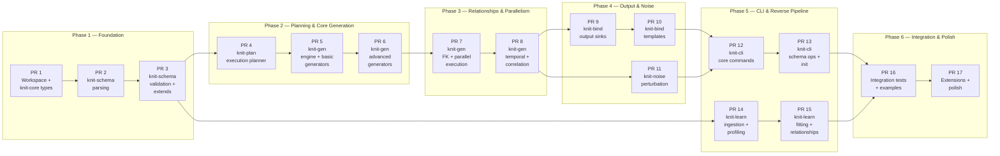

# Knit — Development Plan

**Version:** 0.1.0
**Status:** Draft

Each PR targets **< 2000 lines** of code changes (excluding generated files, test fixtures, and lockfiles). PRs follow the crate dependency graph bottom-up and are designed to be independently reviewable and testable.

---

## Overview



---

## Phase 1 — Foundation

### PR 1: Workspace Scaffold + knit-core Types

**Branch:** `feat/workspace-and-core`
**Est. lines:** ~1200
**Depends on:** —

**Scope:**
- Initialize Cargo workspace with 8 crate stubs (Cargo.toml for each, `lib.rs` with module stubs)
- Implement all `knit-core` types with serde derives:
  - `DataModel`, `Entity`, `Field`, `DataType` enum
  - `Value` enum (Null, Bool, Int, Float, String, DateTime, Date, Time, Duration, DateTimeTz, Uuid, Bytes, Array, Map)
  - `GeneratorSpec` enum (all 14 variants with param structs)
  - `DistributionSpec`, `DistributionKind` enum (17 distributions)
  - `NullSpec`, `CountSpec` enums
  - `Relationship`, `RelationshipKind`, `NoiseProfile`
  - `Constraint`, `WeightedChoice`, `Correlation`
- `ModelError` enum with `thiserror`
- Unit tests: serde round-trip (TOML ↔ struct ↔ JSON), `Display` impls, `Default` values

**Deliverables:**
- `Cargo.toml` (workspace root)
- `crates/knit-core/` — full implementation
- `crates/knit-{schema,plan,gen,noise,bind,learn,cli}/` — stub `Cargo.toml` + empty `lib.rs`

**Acceptance criteria:**
- `cargo build --workspace` succeeds
- `cargo test -p knit-core` passes all serde round-trip tests

---

### PR 2: knit-schema — TOML & JSON Parsing

**Branch:** `feat/schema-parsing`
**Est. lines:** ~1500
**Depends on:** PR 1

**Scope:**
- TOML parser: `.weave.toml` → raw serde `Value` tree → `DataModel`
- JSON parser: `.weave.json` → same path via `serde_json`
- Generator spec parsing (uniform `{ type, params }` shape → `GeneratorSpec` enum)
- Distribution parameter parsing and normalization
- Temporal type parsing (date, time, datetime, datetimetz, duration with shorthand)
- `SchemaError` type with element paths and source spans
- Human-readable error formatting
- Unit tests: parse valid schemas, reject malformed schemas, test each generator type

**Key types:**
```
SchemaParser
├── parse_toml(input: &str) -> Result<DataModel, SchemaError>
├── parse_json(input: &str) -> Result<DataModel, SchemaError>
└── (internal) lower_raw(raw: Value) -> Result<DataModel, SchemaError>
```

**Acceptance criteria:**
- Parse the e-commerce example schema from `design.md`
- Reject schemas with unknown generator types, missing required fields
- `cargo test -p knit-schema` passes

---

### PR 3: knit-schema — Validation + Extends Resolution

**Branch:** `feat/schema-validation`
**Est. lines:** ~1500
**Depends on:** PR 2

**Scope:**
- **Validation rules** (all 5 categories from design-schema.md §7):
  - Structural: required fields present, valid enum variants, no unknown keys
  - Type consistency: generator output type matches field `DataType`
  - Referential: relationship endpoints exist, FK field types match PK types
  - Semantic: distribution params valid (std_dev > 0, p ∈ [0,1]), uniqueness feasible
  - Expression: derived field expressions parse, no cycles in derived DAG
- **`extends` resolution**: single inheritance, keyed merge by name, `remove = true`, scalar override, array replacement
- **`includes` resolution**: type/mixin library imports
- **`params` substitution**: `${param_name}` → value replacement with defaults
- Schema operations: `normalize` (canonical form), `expand` (flatten extends)
- Tests: merge matrix tests, validation error tests, golden file tests

**Acceptance criteria:**
- Extends chain resolves correctly (base + overlay → merged schema)
- All validation checks produce clear error messages with paths
- `knit schema expand` produces standalone schemas

---

## Phase 2 — Planning & Core Generation

### PR 4: knit-plan — Execution Planner

**Branch:** `feat/execution-planner`
**Est. lines:** ~1500
**Depends on:** PR 3

**Scope:**
- Build entity dependency graph from relationships (`petgraph`)
- Topological sort for acyclic subgraph → phase ordering
- Cycle detection via Tarjan's SCC → two-phase assignment
- `ExecutionPlan`, `Phase`, `EntityPlan`, `PartitionRange`, `FieldPlan` types
- Partition planning: divide entity rows into partitions (~1M rows each, configurable)
- `RngTree` construction: hierarchical deterministic seeding via SipHash
  - `hash(global_seed, entity, field, partition)` → per-stream `ChaCha8Rng` seed
- `IndexStrategy` selection: in-memory (<10M), mmap (10M-100M), sampled (>100M)
- Derived field DAG ordering within entities
- Plan inspection: human-readable plan dump (for `knit plan` command)
- Tests: determinism (same input → same plan), cycle detection, RNG isolation

**Acceptance criteria:**
- E-commerce schema produces correct 2-phase plan (employee self-ref → phase 2)
- Same DataModel always produces identical ExecutionPlan
- `cargo test -p knit-plan` passes

---

### PR 5: knit-gen — Engine Core + Basic Generators

**Branch:** `feat/gen-engine-core`
**Est. lines:** ~1800
**Depends on:** PR 4

**Scope:**
- `FieldGenerator` trait definition:
  ```rust
  trait FieldGenerator: Send + Sync {
      fn generate(&self, rng: &mut impl Rng, count: usize, ctx: &GenContext) -> ArrayRef;
      fn output_type(&self) -> DataType;
  }
  ```
- `GenContext` struct (access to other columns, key stores, partition info)
- **Basic generators:**
  - `DistributionGenerator` — uniform, normal, log_normal, exponential, poisson (5 distributions)
  - `SequenceGenerator` — start, step, cycle
  - `ConstantGenerator` — fixed value
  - `UuidGenerator` — v4 random UUID
- Batch assembly: field generators → `RecordBatch`
- Null mask application from `NullSpec`
- `KeyStore` trait + `InMemoryKeyStore` (Vec<PK> + random sampling)
- Generator factory: `GeneratorSpec` → `Box<dyn FieldGenerator>`
- Tests: distribution output validation (mean/std_dev within tolerance), determinism tests

**Acceptance criteria:**
- Generate 100K rows for a single entity with numeric + UUID fields
- Output is valid `RecordBatch` with correct schema
- Same seed produces identical output

---

### PR 6: knit-gen — Advanced Generators

**Branch:** `feat/gen-advanced-generators`
**Est. lines:** ~1800
**Depends on:** PR 5

**Scope:**
- **Remaining distributions** (12 more): zipf, bernoulli, beta, gamma, pareto, weibull, cauchy, chi_squared, student_t, triangular, geometric + clamping (min/max)
- **OneOfGenerator** — weighted random choice via alias method (O(1) sampling)
- **FakerGenerator** — categories: name, email, phone, address, company, lorem, internet, credit_card. Locale support via `fake` crate
- **PatternGenerator** — regex-like expansion ("XXX-####" → "ABC-1234")
- **DerivedGenerator** — expression evaluator: field references, math ops (+, -, *, /), string concat, conditionals (if/then/else), ~20 built-in functions
- **ConditionalGenerator** — switch on field value → delegate to sub-generator
- **CompositeGenerator** — array generation (element generator + length distribution)
- **LookupGenerator** — sample from external CSV file
- **UniqueGenerator** — wraps another generator, HashSet dedup
- Tests: alias method correctness, faker locale variation, expression evaluation, uniqueness enforcement

**Acceptance criteria:**
- All 17 distributions generate valid output with correct statistical properties
- Faker generates realistic names/emails across locales
- Derived expressions evaluate correctly (field refs, math, conditionals)

---

## Phase 3 — Relationships & Parallelism

### PR 7: knit-gen — FK Resolution + Parallel Execution

**Branch:** `feat/gen-fk-parallel`
**Est. lines:** ~1500
**Depends on:** PR 6

**Scope:**
- **FK resolution pipeline:**
  - Phase executor: run entity plans in topological order
  - Key stores populated during generation (insert PKs)
  - FK fields sample from parent key store with cardinality distributions
  - `MmapKeyStore` for memory-mapped large-table support
- **Two-phase execution:**
  - Phase 1: generate all entities with PKs and non-deferred fields
  - Phase 2: backpatch deferred FK fields (cyclic/self-referential)
- **Rayon parallel execution:**
  - Partition-level parallelism within each entity
  - Per-partition deterministic RNG streams (from RngTree)
  - No shared mutable state between partitions
  - Read-only key store views per partition
- Tests: FK integrity (all FK values exist in parent), self-referential generation, reproducibility across thread counts

**Acceptance criteria:**
- E-commerce schema generates with valid FK relationships
- Employee self-referential hierarchy generates correctly
- Output is identical regardless of `--parallel N` setting

---

### PR 8: knit-gen — Temporal, Correlation & Graph Topology

**Branch:** `feat/gen-temporal-correlation`
**Est. lines:** ~1800
**Depends on:** PR 7

**Scope:**
- **Temporal generators:**
  - `RelativeGenerator` — datetime relative to another field (e.g., end = start + duration)
  - `BusinessHoursGenerator` — datetimes within business hours, timezone-aware
  - Duration generator with shorthand parsing
- **Time series generation:**
  - Trend + seasonality + noise composition
  - AR(p) autoregressive component
  - Event stream generation (Lewis–Shedler thinning)
  - Multi-timezone support
- **Correlation enforcement:**
  - Gaussian copula: generate correlated uniforms via Cholesky decomposition
  - Inverse CDF transform to target marginal distributions
  - Correlation matrix validation (positive semi-definite check)
  - Pairwise and matrix correlation modes
- **Graph topology generation:**
  - Barabási–Albert (preferential attachment)
  - Watts–Strogatz (small-world)
  - Erdős–Rényi (random)
  - Tree/forest generation with branching distributions
- Tests: temporal ordering correctness, correlation coefficient recovery, degree distribution validation

**Acceptance criteria:**
- Time series with trend+seasonality produces visually correct output
- Correlated fields achieve target correlation (±0.05 tolerance at 100K rows)
- BA model produces power-law degree distribution

---

## Phase 4 — Output & Noise

### PR 9: knit-bind — Output Sinks

**Branch:** `feat/bind-sinks`
**Est. lines:** ~1500
**Depends on:** PR 8

**Scope:**
- `Sink` trait:
  ```rust
  trait Sink: Send {
      fn write_batch(&mut self, batch: &RecordBatch) -> Result<()>;
      fn finish(self) -> Result<SinkStats>;
  }
  ```
- **ParquetSink** — zero-copy from RecordBatch, configurable compression (zstd, lz4, snappy, none), dictionary encoding for low-cardinality strings, row group alignment
- **JsonSink** — JSONL (one object per line) and JSON array modes, streaming writes
- **CsvSink** — header + streaming rows, configurable delimiter/quoting/null representation
- **ArrowIpcSink** — Arrow IPC file format for analytics pipelines
- **Output file management:**
  - Per-partition files: `{entity}_{partition:04d}.{ext}`
  - File rotation (optional: split at N rows or N bytes)
  - Manifest file generation (file list + row counts + checksums)
- Type mapping: Arrow types → format-specific representations (temporal formatting, UUID, null handling)
- Tests: round-trip tests (write → read back → compare), compression ratio checks

**Acceptance criteria:**
- Parquet output readable by PyArrow/DuckDB with correct schema
- JSON/CSV output parseable by standard tools
- Per-partition files written without contention

---

### PR 10: knit-bind — Template Engine

**Branch:** `feat/bind-templates`
**Est. lines:** ~800
**Depends on:** PR 9

**Scope:**
- MiniJinja integration for custom output formats
- `RecordBatch` → row iterator → template context conversion
- **Built-in template helpers:**
  - `format_date`, `format_number` — locale-aware formatting
  - `escape_sql`, `escape_xml`, `json_encode` — output escaping
  - `pad_left`, `pad_right`, `upper`, `lower` — string formatting
- **Example templates:**
  - SQL INSERT statements
  - XML documents
  - Log lines (Apache/nginx style)
  - Custom delimited formats
- Template compilation caching for performance
- Tests: template output golden tests, helper function tests

**Acceptance criteria:**
- SQL INSERT template produces valid SQL statements
- Templates render correctly for all Value types including temporals

---

### PR 11: knit-noise — Perturbation Pipeline

**Branch:** `feat/noise-pipeline`
**Est. lines:** ~1800
**Depends on:** PR 8

**Scope:**
- `Perturbator` trait + `InvariantSet` bitflags:
  ```rust
  trait Perturbator: Send + Sync {
      fn name(&self) -> &str;
      fn breaks(&self) -> InvariantSet;
      fn perturb(&self, batch: &mut RecordBatch, column: usize, rng: &mut impl Rng, config: &PerturbConfig);
  }
  ```
- Three-stage pipeline executor (clean → constrained → breaking)
- **Built-in perturbators (9):**
  - `NullInjector` — random null injection
  - `GaussianNoise` — numeric noise (absolute or relative)
  - `TypoInjector` — character-level typos (swap, insert, delete, substitute)
  - `OutlierInjector` — extreme value replacement
  - `DuplicateInjector` — exact/near-duplicate rows
  - `TemporalSpike` — timestamp clustering around event points
  - `FkViolator` — intentional FK integrity violations
  - `ValueDrifter` — gradual numeric drift over time
  - `FormatCorruptor` — string format corruption (invalid emails, dates)
- Scoped noise: predicate-based filtering (apply only to matching records)
- Noise composition: multiple perturbators chained with independent probabilities
- `NoiseProfile` → `Perturbator` resolution from schema config
- Tests: probability accuracy tests, invariant preservation tests, FK violation tests

**Acceptance criteria:**
- Clean stage never violates constraints
- Breaking stage produces measurable FK violations
- Actual null injection rate matches configured probability (±1%)

---

## Phase 5 — CLI & Reverse Pipeline

### PR 12: knit-cli — Core Commands

**Branch:** `feat/cli-core`
**Est. lines:** ~1500
**Depends on:** PR 10, PR 11

**Scope:**
- Clap command structure with subcommands
- **`knit validate <schema>`** — parse → validate → report errors
  - Human-readable output (default) with colored diagnostics
  - JSON output (`--json`) for CI/scripting
- **`knit plan <schema>`** — show execution plan (dry run)
  - Phase breakdown, partition counts, estimated sizes
  - Generator assignments, RNG tree summary
- **`knit generate <schema> -o <dir>`** — full forward pipeline
  - Orchestrate: parse → plan → generate → noise → bind
  - Progress bars via `indicatif` (per-entity, with ETA)
  - Summary stats on completion (rows, bytes, throughput, elapsed)
- **Global flags:**
  - `--seed`, `--format`, `--compression`, `--parallel`, `--batch-size`
  - `--param key=value` (repeatable), `--dry-run`, `--json`, `--quiet`/`--verbose`
- **Error handling:** exit codes (0 success, 1 validation, 2 generation, 3 I/O)
- **Graceful shutdown:** Ctrl+C → finish current batch → flush → report partial
- **Configuration precedence:** flags > env vars > `knit.toml` > schema defaults
- Tests: CLI flag parsing, error output formatting, integration smoke test

**Acceptance criteria:**
- `knit generate examples/ecommerce.weave.toml -o out/` produces valid output
- Progress bars update during generation
- Ctrl+C produces clean partial output

---

### PR 13: knit-cli — Schema Operations + Init

**Branch:** `feat/cli-schema-ops`
**Est. lines:** ~1000
**Depends on:** PR 12

**Scope:**
- **`knit schema expand <file>`** — flatten extends chain → standalone schema
- **`knit schema normalize <file>`** — reformat to canonical style (key ordering, whitespace)
- **`knit schema diff <a> <b>`** — compare two schemas, show added/removed/changed elements
- **`knit init`** — interactive wizard:
  - Choose from templates (e-commerce, IoT, logs, financial, custom)
  - Configure entity count, field types, relationships
  - Output `.weave.toml` starter file
- **`knit learn` command** (wiring only, delegates to knit-learn)
- **Config file support:** `knit.toml` in cwd or `~/.config/knit/config.toml`
- **Environment variables:** `KNIT_SEED`, `KNIT_PARALLEL`, `KNIT_FORMAT`, etc.
- Tests: expand/normalize golden tests, diff output tests, init template tests

**Acceptance criteria:**
- `knit schema expand` produces correct flattened output
- `knit init` creates a valid, parseable schema file
- `knit schema diff` shows meaningful differences

---

### PR 14: knit-learn — Ingestion + Profiling + Type Inference

**Branch:** `feat/learn-profiling`
**Est. lines:** ~1500
**Depends on:** PR 3

**Scope:**
- **Data ingestion:**
  - CSV reader (arrow-csv) with type sniffing, configurable delimiter/header
  - Parquet reader (arrow-parquet) with schema from metadata
  - JSON/JSONL reader (arrow-json) with nested object flattening
  - Multi-file ingestion: directory → entity mapping
- **Sampling strategies:**
  - `full` — read all rows
  - `head` — first N rows
  - `reservoir` — uniform random (single-pass)
  - `stratified` — preserve distribution of key column
  - Parquet row-group-level sampling
- **Column profiling** (`ColumnProfile` struct):
  - Basic: count, null_count, null_rate, distinct_count, cardinality_ratio
  - Numeric: min, max, mean, median, std_dev, skewness, kurtosis, percentiles (p1-p99)
  - String: min/max/avg length, pattern detection (email, phone, UUID, URL)
  - Temporal: min, max, granularity, business hours %, timezone detection
- **Type inference:**
  - Integer/float/boolean/date/UUID/categorical detection
  - Date format detection (ISO8601, US, EU, custom patterns)
  - Confidence scoring per type decision
- Tests: profiling accuracy, type inference correctness, sampling uniformity

**Acceptance criteria:**
- Profile a 1M-row Parquet file in < 5 seconds
- Type inference correctly identifies int, float, date, UUID, categorical columns
- Reservoir sampling produces uniform distribution

---

### PR 15: knit-learn — Distribution Fitting + Relationship Analysis

**Branch:** `feat/learn-fitting-relationships`
**Est. lines:** ~1800
**Depends on:** PR 14

**Scope:**
- **Distribution fitting:**
  - MLE fitting for 9 distributions (uniform, normal, log_normal, exponential, poisson, zipf, beta, gamma, pareto)
  - KS-test goodness-of-fit scoring
  - AIC/BIC model selection
  - Categorical columns → `one_of` with weights from frequencies
  - Best-fit distribution selection with confidence
- **Relationship detection (Phase 5):**
  - Column name matching (strip `_id`/`_key`/`_fk`, match entity names)
  - Value overlap ratio computation
  - Cardinality analysis (unique ratios → relationship kind)
  - Self-referential detection (column references own entity PK)
  - Composite key detection (pairs/triples)
  - Confidence scoring (weighted heuristic combination)
- **Relationship analysis (Phase 6):**
  - Cardinality distribution fitting (count per parent → fit Zipf/Poisson/etc.)
  - Temporal ordering detection (child timestamps after parent)
  - Graph topology inference (degree distribution → model matching)
  - Junction table detection
- **Cross-entity correlation detection (Phase 7):**
  - Intra-entity: Pearson, Spearman, Cramér's V
  - Cross-entity: conditional distributions via FK joins
  - Significance filtering (p-value < 0.05, |r| ≥ 0.3)
- **Schema assembly (Phase 8):**
  - Build `DataModel` from all inferred elements
  - Attach confidence scores and alternatives
  - Output annotated Weave schema with `_confidence` fields
  - Human-readable review report
- Tests: distribution recovery (generate → learn → compare params), FK detection accuracy, correlation detection, round-trip tests

**Acceptance criteria:**
- Normal distribution recovers μ and σ within 5% from 100K samples
- FK detection finds known relationships with confidence > 0.8
- Output schema is valid Weave that can be used with `knit generate`

---

## Phase 6 — Integration & Polish

### PR 16: Integration Tests + Example Schemas

**Branch:** `feat/integration-tests`
**Est. lines:** ~1500
**Depends on:** PR 13, PR 15

**Scope:**
- **Example schemas** (in `examples/` directory):
  - `ecommerce.weave.toml` — users, orders, products, reviews (FK, Zipf cardinality)
  - `iot_sensors.weave.toml` — devices, readings, alerts (time series, temporal)
  - `server_logs.weave.toml` — requests, errors (event stream, business hours)
  - `financial.weave.toml` — accounts, transactions, holdings (correlations, compliance)
  - `hr_org.weave.toml` — employees, departments (self-referential hierarchy)
- **End-to-end integration tests:**
  - `knit validate` on all example schemas → pass
  - `knit generate` on each example → valid output files
  - Verify FK integrity in generated Parquet files
  - Verify distribution statistics match spec (KS-test on output)
  - Verify determinism: same seed → byte-identical output
  - Verify reproducibility: same output regardless of `--parallel N`
- **Round-trip tests:**
  - Generate from schema → learn from output → compare inferred vs original
- **Performance benchmarks** (criterion):
  - Throughput: rows/sec and bytes/sec for numeric, string, mixed workloads
  - Scaling: throughput vs thread count (1, 2, 4, 8, 16)
  - Memory: peak RSS during generation

**Acceptance criteria:**
- All example schemas validate and generate successfully
- FK integrity holds in all outputs
- Determinism: bit-identical output across runs with same seed

---

### PR 17: Extensions + Documentation + Polish

**Branch:** `feat/extensions-polish`
**Est. lines:** ~1200
**Depends on:** PR 16

**Scope:**
- **Extension architecture:**
  - `inventory`-based compile-time plugin registry
  - `GeneratorPlugin`, `PerturbatorPlugin` registration macros
  - Example custom generator crate (in `examples/custom-generator/`)
- **SampledKeyStore** — sampled subset for >100M key tables
- **Documentation:**
  - README.md overhaul: features, quickstart, examples, architecture overview
  - CONTRIBUTING.md — build instructions, PR guidelines, testing
  - CLI `--help` text for all commands and flags
- **Polish:**
  - Structured logging via `tracing` (debug/trace output for pipeline stages)
  - JSON progress events (`--json` flag for programmatic consumption)
  - Error suggestion engine (common mistakes → fix suggestions)
  - `knit --version` with build metadata
- Tests: plugin registration tests, README example validation

**Acceptance criteria:**
- Custom generator plugin compiles and is discovered at runtime
- `cargo doc --workspace --no-deps` produces clean documentation
- README quickstart example works end-to-end

---

### PR 18: Retroactive Rustdoc — Comprehensive Public API Documentation

**Branch:** `feat/rustdoc-retroactive`
**Est. lines:** ~800
**Depends on:** PR 4 (can be done in parallel with later PRs)

**Scope:**
Apply the documentation convention from `agents.md` to all existing code:
- **knit-core:** Add `///` doc comments to all public types (`DataModel`, `Entity`, `Field`, `GeneratorSpec`, `DistributionSpec`, `NullSpec`, `CountSpec`, `Relationship`, `NoiseProfile`, `Correlation`, `Constraint`, `Value`, `WeightedChoice`, `TopologySpec`) and `ModelError`. Document each enum variant. Add `//!` crate-level doc.
- **knit-schema:** Add `///` doc comments to all public functions (`parse_toml`, `parse_json`, `parse_toml_file`, `parse_json_file`, `validate`, `merge_models`, `resolve_extends`) and `SchemaError`. Add `//!` crate-level doc explaining pipeline position.
- **knit-plan:** Add `///` doc comments to all plan types (`ExecutionPlan`, `Phase`, `EntityPlan`, `FieldPlan`, `GeneratorPlan`, `NullPlan`, `RngTree`, `IndexStrategy`, `KeyStoreKind`, `PlanMetadata`, `DeferredRef`, `DeferralStrategy`), `compile()`, and `PlanError`. Document each type's role and which crate produces/consumes it. Add `//!` crate-level doc.
- Ensure `cargo doc --workspace --no-deps` produces clean output with no warnings.

**Note:** All new code from PR 5 onward must follow the documentation convention in `agents.md` from the start. This PR retroactively covers PRs 1–4.

**Acceptance criteria:**
- Every public item in knit-core, knit-schema, and knit-plan has a `///` doc comment
- Key types document their pipeline role and cross-crate interactions
- `cargo doc --workspace --no-deps` succeeds with no missing-doc warnings

---

## Summary

| PR | Crate | Focus | Est. Lines | Depends On |
|----|-------|-------|-----------|------------|
| 1 | knit-core | Workspace scaffold + all model types | ~1200 | — |
| 2 | knit-schema | TOML/JSON parsing → DataModel | ~1500 | PR 1 |
| 3 | knit-schema | Validation + extends/includes/params | ~1500 | PR 2 |
| 4 | knit-plan | Execution planner + RNG tree | ~1500 | PR 3 |
| 5 | knit-gen | Engine core + 5 basic generators | ~1800 | PR 4 |
| 6 | knit-gen | 12 advanced generators + expressions | ~1800 | PR 5 |
| 7 | knit-gen | FK resolution + parallel execution | ~1500 | PR 6 |
| 8 | knit-gen | Temporal + correlation + graph topology | ~1800 | PR 7 |
| 9 | knit-bind | Parquet/JSON/CSV/Arrow IPC sinks | ~1500 | PR 8 |
| 10 | knit-bind | MiniJinja template engine | ~800 | PR 9 |
| 11 | knit-noise | Perturbation pipeline + 9 perturbators | ~1800 | PR 8 |
| 12 | knit-cli | validate/plan/generate commands | ~1500 | PR 10, 11 |
| 13 | knit-cli | Schema ops + init wizard | ~1000 | PR 12 |
| 14 | knit-learn | Ingestion + profiling + type inference | ~1500 | PR 3 |
| 15 | knit-learn | Fitting + relationships + correlations | ~1800 | PR 14 |
| 16 | — | Integration tests + example schemas | ~1500 | PR 13, 15 |
| 17 | — | Extensions + docs + polish | ~1200 | PR 16 |
| | | **Total** | **~25,200** | |

### Critical Path


The critical path runs through the forward pipeline: core → schema → plan → gen → bind → cli → integration.

`knit-learn` (PR 14–15) and `knit-noise` (PR 11) can be developed in parallel with later forward pipeline PRs once their dependencies are met.

### Parallelizable Work

| After PR | Can start in parallel |
|----------|----------------------|
| PR 3 | PR 4 (plan) **and** PR 14 (learn ingestion) |
| PR 8 | PR 9 (sinks) **and** PR 11 (noise) |
| PR 14 | PR 15 (learn fitting) independently of PR 9–13 |
