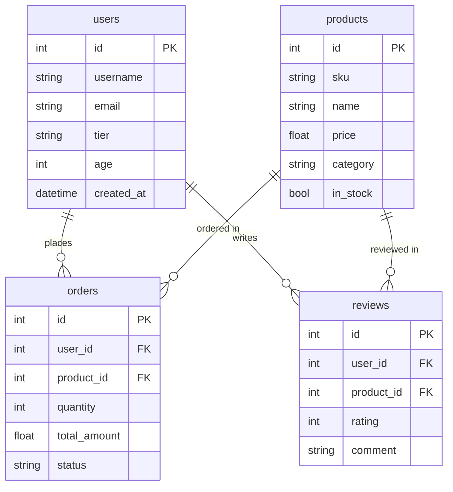
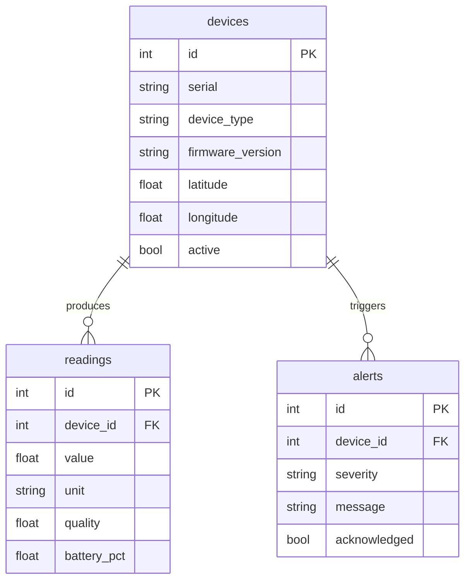
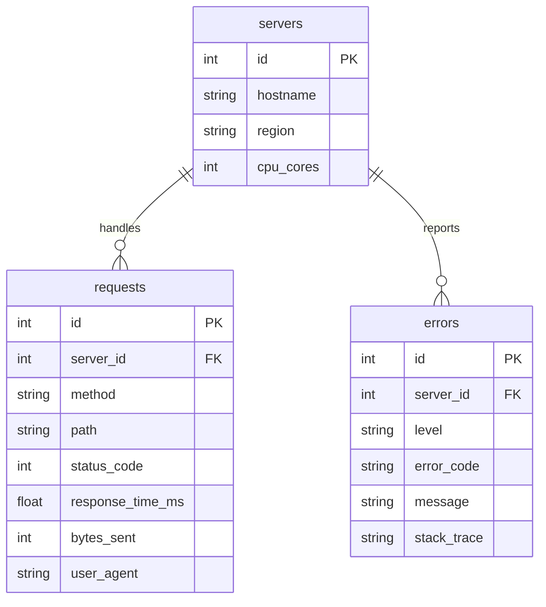
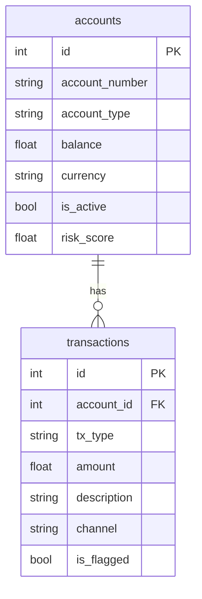
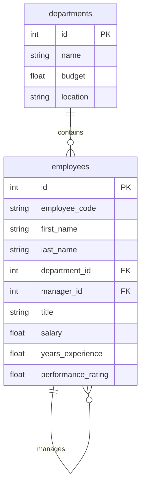

# Examples Walkthrough

Knit ships with five example schemas in the
[`examples/`](../../examples/) directory. This guide walks through each one,
explaining the data model, key generators, and what you'll see in the output.

**[← Back to User Guide](index.md)**

---

## Running Any Example

All examples follow the same workflow:

```bash
# Validate the schema
knit validate examples/ecommerce.weave.toml

# Preview the execution plan
knit plan examples/ecommerce.weave.toml

# Generate data as Parquet (default)
knit generate examples/ecommerce.weave.toml -o ./output/ecommerce

# Generate as CSV to inspect easily
knit generate examples/ecommerce.weave.toml -o ./output/ecommerce --format csv
```

---

## 1. E-Commerce — `ecommerce.weave.toml`

**What it demonstrates:** A classic multi-table transactional model with
foreign keys, weighted categories, and realistic value distributions.

### Data Model



### Key Techniques

| Feature | How It's Used |
|---------|---------------|
| **`sequence`** | Auto-increment IDs for all entities |
| **`pattern`** | Emails (`user####@example.com`), SKUs (`SKU-AAA-####`) |
| **`one_of`** (weighted) | User tiers (60% basic, 25% premium, 15% VIP) |
| **`distribution` (normal)** | Age centered around 35 |
| **`distribution` (log_normal)** | Prices — right-skewed, most items $20–$80 |
| **`distribution` (zipf)** | Quantities — most orders are 1–2 items |
| **`nullable`** | Review comments: 30% are null |
| **4 relationships** | Orders → users, orders → products, reviews → users, reviews → products |

### What to Expect

- **1,000 users** with realistic age distributions and tiered memberships
- **200 products** across categories with log-normal pricing
- **5,000 orders** with valid foreign keys to users and products
- **3,000 reviews** with Zipf-distributed ratings (more 5-star than 1-star)
- Every `user_id` and `product_id` in orders/reviews references a valid record

---

## 2. IoT Sensors — `iot_sensors.weave.toml`

**What it demonstrates:** Device telemetry with geographic data, sensor
readings, and alert systems.

### Data Model



### Key Techniques

| Feature | How It's Used |
|---------|---------------|
| **`distribution` (uniform)** | Geographic coordinates (SF Bay Area: lat 37–38, lon -122.5 to -121.5) |
| **`distribution` (normal)** | Sensor reading values |
| **`distribution` (beta)** | Quality scores — skewed toward high quality |
| **`distribution` (bernoulli)** | Active status (95% active), acknowledged alerts |
| **`one_of`** | Device types (temperature, humidity, pressure, motion, light) |
| **`pattern`** | Serial numbers: `DEV-AA######` |
| **`nullable`** | Battery percentage: 5% null (wired devices) |

### What to Expect

- **50 devices** scattered across the San Francisco Bay Area
- **10,000 readings** with unit-appropriate values and quality scores
- **500 alerts** with realistic severity distribution (40% info, 5% fatal)
- Multiple sensor types with different firmware versions

---

## 3. Server Logs — `server_logs.weave.toml`

**What it demonstrates:** Web server event streams with HTTP request patterns,
error rates, and multi-region deployment.

### Data Model



### Key Techniques

| Feature | How It's Used |
|---------|---------------|
| **`one_of`** (weighted) | HTTP methods (60% GET, 20% POST), status codes (70% 200) |
| **`distribution` (log_normal)** | Response times — most fast, some slow |
| **`distribution` (pareto)** | Bytes sent — heavy-tail distribution |
| **`pattern`** | Hostnames: `web-??-##`, stack traces: `at ??_??::??_??() line ###` |
| **`faker`** | Error messages: realistic sentence structures |
| **`nullable`** | Stack traces: 40% null (not all errors have traces) |

### What to Expect

- **10 servers** across 4 regions (us-east-1, us-west-2, eu-west-1, ap-southeast-1)
- **20,000 requests** with realistic HTTP method and status code distributions
- **1,000 errors** with severity levels and optional stack traces
- Response time distribution follows real-world patterns (most under 100ms)

---

## 4. Financial — `financial.weave.toml`

**What it demonstrates:** Banking transactions with correlated fields and
fraud detection flags.

### Data Model



### Key Techniques

| Feature | How It's Used |
|---------|---------------|
| **`pattern`** | Account numbers: `####-####-####` |
| **`distribution` (log_normal)** | Balance and transaction amounts |
| **`distribution` (beta)** | Risk scores — most accounts low-risk |
| **`distribution` (bernoulli)** | Active status (98%), fraud flags (2%) |
| **`one_of`** | Account types, currencies, transaction channels |
| **Correlations** | Balance ↔ risk_score: coefficient = -0.4 |
| **`nullable`** | Transaction description: 20% null |

### Key Feature: Correlations

This is the only example that uses **field correlations**:

```toml
[[correlations]]
entity = "accounts"
fields = ["balance", "risk_score"]
coefficient = -0.4
method = "copula"
```

This creates a negative correlation: accounts with higher balances tend to
have lower risk scores, and vice versa. This is realistic — established
customers with large balances are typically lower risk.

### What to Expect

- **500 accounts** with correlated balance/risk_score values
- **10,000 transactions** across online, mobile, ATM, and branch channels
- ~2% of transactions flagged for fraud
- Log-normal amount distributions (most transactions small, few very large)

---

## 5. HR Organization — `hr_org.weave.toml`

**What it demonstrates:** Self-referential hierarchies and organizational
structure.

### Data Model



### Key Techniques

| Feature | How It's Used |
|---------|---------------|
| **Self-referential FK** | `manager_id` → `employees.id` (org hierarchy) |
| **`nullable`** | `manager_id`: 4% null (top-level executives) |
| **`pattern`** | Employee codes: `EMP-#####` |
| **`faker`** | First and last names |
| **`distribution` (log_normal)** | Salary — right-skewed income distribution |
| **`distribution` (exponential)** | Years of experience — many junior, few senior |
| **`distribution` (beta)** | Performance ratings — bell-curved around 0.6–0.8 |
| **`one_of`** (weighted) | Titles: VP 5%, Director 8%, Manager 15%, engineers 72% |

### Key Feature: Self-Referential Hierarchy

The `employee_manager` relationship creates a tree structure:

```toml
[[relationships]]
name = "employee_manager"
from = "employees"
to = "employees"
kind = "many_to_one"
from_field = "manager_id"
to_field = "id"
```

With `nullable = { probability = 0.04 }` on `manager_id`, about 4% of
employees have no manager (they're at the top of the org chart). This creates
a natural organizational hierarchy.

### What to Expect

- **20 departments** with budgets and locations
- **500 employees** in a tree-structured hierarchy
- Realistic job title distribution (few VPs, many individual contributors)
- Log-normal salary distribution reflecting real-world income patterns
- Every employee belongs to a valid department

---

## Comparing the Examples

| Example | Entities | Total Rows | Key Feature |
|---------|----------|------------|-------------|
| E-Commerce | 4 | ~9,200 | Multi-table FK relationships |
| IoT Sensors | 3 | ~10,550 | Geographic data, sensor telemetry |
| Server Logs | 3 | ~21,010 | Event streams, HTTP distributions |
| Financial | 2 | ~10,500 | Correlated fields, fraud detection |
| HR Organization | 2 | ~520 | Self-referential hierarchy |

---

## What's Next?

- **[Schema Language Tutorial](schema-language.md)** — Learn to build your own
  schemas using these techniques
- **[Noise Injection Guide](noise.md)** — Add data quality issues to any of
  these examples
- **[CLI Reference](cli-reference.md)** — All generation options and formats
