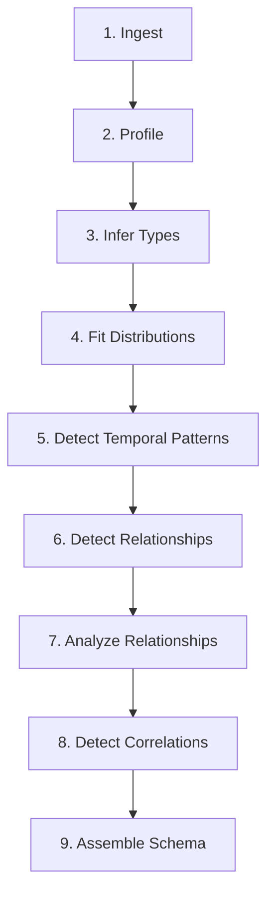

# Reverse Engineering Guide

> ⚠️ **Not Yet Implemented:** The `knit learn` command is planned but not yet
> implemented. Running `knit learn` today will print a placeholder message and
> exit. This page describes the **planned** functionality for future releases.
> All CLI examples below are aspirational — they will not work until the
> feature is completed.

Knit will be able to analyze existing datasets and automatically infer a
Weave schema — the reverse of data generation. This will be useful when you
have production data and want to generate realistic synthetic equivalents.

**[← Back to User Guide](index.md)**

---

## What `knit learn` Will Do

When implemented, the `knit learn` command will read your data, profile every
column, fit statistical distributions, detect relationships, and output a
`.weave.toml` schema that can reproduce data with similar characteristics.

```bash
# PLANNED — not yet implemented
knit learn data/users.csv
```

The output schema will include **confidence annotations** on every inferred
element, so you know which decisions are solid and which need manual review.

> **Current status:** `knit learn <PATH>` accepts a path argument but only
> prints a placeholder message. The flags `-o`, `--format`, and `--review`
> shown below do not exist yet.

---

## Supported Input Formats

| Format | Extension | Notes |
|--------|-----------|-------|
| CSV | `.csv` | Auto-detects delimiter, headers, encoding |
| Parquet | `.parquet` | Preserves types from the Parquet schema |
| JSON | `.json` | Expects an array of objects |
| JSON Lines | `.jsonl` | One JSON object per line |

You will also be able to point `knit learn` at a **directory** of files:

```bash
# PLANNED — not yet implemented
knit learn data/users/
knit learn data/
```

---

## The Learn Pipeline

The learning process runs through 9 phases:



### Phase 1: Ingestion

Reads data files into Arrow record batches. For large datasets, Knit samples
to keep profiling fast:

- **Default sample:** 100,000 rows
- **Sampling methods:** full scan, head (first N), reservoir sampling,
  stratified sampling

### Phase 2: Column Profiling

Computes comprehensive statistics for every column:

- **All types:** count, null count, null rate, distinct count, cardinality ratio
- **Numeric:** min, max, mean, median, std_dev, skewness, kurtosis,
  percentiles (p1, p5, p25, p50, p75, p95, p99)
- **String:** min/max/avg length, pattern detection (email, phone, UUID,
  date, URL, IP address)
- **Temporal:** date range, granularity (second/minute/hour/day),
  business hours percentage, timezone detection

### Phase 3: Type Inference

Determines the semantic type of each column:

| Detected Type | How It's Identified |
|---------------|---------------------|
| Integer | Numeric with no decimal digits |
| Float | Numeric with decimals |
| Boolean | Only true/false, 0/1, yes/no values |
| Date/Datetime | Matches ISO 8601, US, or EU date formats |
| UUID | Matches UUID v4/v7 pattern |
| Categorical | Low cardinality relative to row count |
| Continuous | High cardinality numeric |
| Free text | High cardinality, long strings |

Each inference includes a **confidence score** based on parse success rate
and format consistency.

### Phase 4: Distribution Fitting

For numeric and temporal columns, Knit fits multiple candidate distributions:

**Candidates tested:** uniform, normal, log_normal, exponential, poisson,
zipf, beta, gamma, pareto

**Method:**
1. Maximum Likelihood Estimation (MLE) for each candidate
2. Kolmogorov–Smirnov test for goodness of fit
3. AIC (Akaike Information Criterion) and BIC (Bayesian Information Criterion)
4. Best fit selected by AIC; alternatives within ΔAIC < 2 are reported

For categorical columns, value frequencies are captured as a `one_of`
generator with weights.

### Phase 5: Temporal Pattern Recognition

For date/time columns, Knit detects:

- **Periodicity:** Regular intervals between records
- **Frequency:** Events per time unit
- **Seasonality:** Daily, weekly, monthly, yearly cycles
- **Business-time patterns:** Concentration during work hours
- **Event cadence:** Burst patterns and quiet periods

This information maps to `time_series` generator components in the output
schema.

### Phase 6: Relationship Detection

Knit infers foreign key relationships using:

- **Naming conventions:** Columns like `user_id`, `customer_id` suggest FK
  relationships to `users`, `customers`
- **Value overlap:** High overlap between columns across tables indicates
  a referential relationship
- **Cardinality analysis:** One-to-many vs. many-to-many detection

### Phase 7: Relationship Analysis

For detected relationships, Knit profiles:

- **Degree distribution:** How many children per parent (fitted to a
  distribution)
- **Temporal ordering:** Whether child records always follow parent records
- **Graph topology:** For many-to-many relationships

### Phase 8: Correlation Detection

Knit identifies statistical correlations between fields:

| Method | What It Detects | Use Case |
|--------|----------------|----------|
| Pearson | Linear correlations | Numeric ↔ numeric |
| Spearman | Monotonic correlations | Ranked/ordinal data |
| Cramér's V | Categorical associations | Categorical ↔ categorical |

Strong correlations (|r| > 0.3) are included in the output schema as
`[[correlations]]` entries.

### Phase 9: Schema Assembly

All inferred information is assembled into a complete Weave schema with:

- Entity definitions with row counts
- Field types and generators
- Relationships with cardinality distributions
- Correlations
- **Confidence annotations** on every element

---

## Planned Usage (Not Yet Implemented)

The examples below show the **planned** interface. None of these commands
work today.

### Basic Usage

```bash
# PLANNED — not yet implemented
knit learn data/sales.csv
knit learn data/events.parquet
knit learn data/
```

### Interactive Review Mode (Planned)

An interactive review mode is planned for low-confidence decisions:

```
? Column "status" detected as categorical (confidence: 0.72)
  Inferred generator: one_of ["active", "inactive", "pending"]
  Accept? [Y/n/edit]
```

### Roundtrip Workflow (Planned)

A common workflow will be to learn a schema, tune it, and generate:

```bash
# Step 1: Infer schema from production data (PLANNED)
knit learn prod_export.csv

# Step 2: Review and tune the schema (edit in your editor)
# - Adjust distributions
# - Fix low-confidence inferences
# - Add noise profiles for testing

# Step 3: Validate your tuned schema
knit validate schema.weave.toml

# Step 4: Generate synthetic data
knit generate schema.weave.toml -o ./synthetic_data
```

---

## Output: Confidence Annotations

The inferred schema includes confidence scores as comments:

```toml
[[entities.fields]]
name = "amount"
data_type = "float"
# confidence: 0.94 — log_normal (AIC: 1234.5)
# alternatives: normal (ΔAIC: 3.2), gamma (ΔAIC: 5.1)
[entities.fields.generator]
type = "distribution"
kind = "log_normal"
[entities.fields.generator.params]
mu = 3.8
sigma = 1.1
```

**Confidence levels:**

| Score | Meaning | Action |
|-------|---------|--------|
| 0.9+ | High confidence | Usually correct, no review needed |
| 0.7–0.9 | Medium confidence | Quick review recommended |
| < 0.7 | Low confidence | Manual review and tuning advised |

---

## Limitations

- **Sample-based:** Large datasets are sampled (default 100K rows), so rare
  patterns may be missed
- **Single-table focus:** Multi-file relationship detection works best when
  column names follow conventions (`user_id` → `users.id`)
- **No semantic understanding:** Knit detects statistical patterns, not
  business logic. A column of employee IDs and a column of department IDs
  may look similar statistically
- **Distribution approximation:** Real data may not perfectly match any
  standard distribution. Complex multi-modal data may need manual tuning
- **Temporal patterns:** Complex seasonal patterns (holidays, business
  calendars) may not be fully captured automatically

### When Manual Tuning Is Needed

- Distribution fits have low confidence (< 0.7)
- Business rules that can't be inferred statistically (e.g., "orders can
  only be placed during business hours")
- Complex conditional logic between fields
- Specific noise profiles for testing scenarios
- Custom generator parameters (patterns, faker categories)

---

## What's Next?

- **[Schema Language Tutorial](schema-language.md)** — Understand and tune
  inferred schemas
- **[Noise Injection Guide](noise.md)** — Add noise to your learned schemas
- **[CLI Reference](cli-reference.md)** — All `knit learn` options
