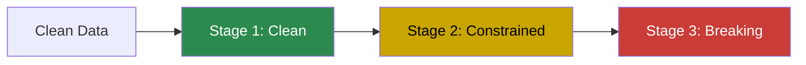

# Noise Injection Guide

Knit can inject realistic data quality issues into generated data — typos,
missing values, outliers, duplicates, and more. This lets you test how your
data pipelines handle imperfect data.

**[← Back to User Guide](index.md)**

---

## Why Noise Injection?

Real-world data is messy. Production pipelines must handle:

- Missing values where you don't expect them
- Typos in string fields
- Duplicate records
- Outlier values outside normal ranges
- Format inconsistencies
- Broken foreign key references

Knit's noise injection generates **clean data first**, then applies controlled
perturbations so you can test your data quality pipelines against known
defects.

---

## The Three-Stage Pipeline

Knit applies noise in three stages, from least to most destructive:



| Stage | What It Does | What It Preserves |
|-------|-------------|-------------------|
| **Clean** | Minor perturbations (typos, jitter) | All constraints: types, uniqueness, FKs, NOT NULL |
| **Constrained** | Soft constraint violations | Types and FKs, but may violate nullability or uniqueness |
| **Breaking** | Intentional structural violations | Nothing — tests extreme error handling |

---

## Built-In Perturbators

### 1. NullInjector

Replaces values with NULL. Tests missing-data handling.

```toml
[[noise]]
name = "null_emails"
entity = "users"
fields = ["email"]
null_rate = 0.05          # 5% of emails become NULL
```

- **Stage:** Constrained (violates NOT NULL if field is non-nullable)
- **Breaks:** `NOT_NULL`

### 2. TypoIntroducer

Introduces character-level errors: swaps, insertions, deletions, substitutions.

```toml
[[noise]]
name = "name_typos"
entity = "users"
fields = ["name"]
typo_rate = 0.02          # 2% of names get a typo
```

- **Stage:** Clean (preserves all constraints)
- **Error types:** Adjacent character swap, random insertion, deletion,
  keyboard-distance substitution

### 3. DuplicateInjector

Creates duplicate rows. Tests deduplication logic.

```toml
[[noise]]
name = "duplicate_orders"
entity = "orders"
fields = ["id"]
duplicate_rate = 0.01     # 1% of rows are duplicated
```

- **Stage:** Constrained (violates uniqueness)
- **Breaks:** `UNIQUE`

### 4. OutlierInjector

Replaces values with extreme outliers outside normal ranges.

```toml
[[noise]]
name = "amount_outliers"
entity = "orders"
fields = ["amount"]
outlier_rate = 0.01       # 1% of amounts become outliers
```

- **Stage:** Constrained / Breaking (violates range constraints)
- **Breaks:** `RANGE`

### 5. ValueDrifter

Gradually shifts numeric values over time, simulating sensor drift or
calibration issues.

```toml
[[noise]]
name = "sensor_drift"
entity = "readings"
fields = ["value"]
outlier_rate = 0.01       # Controls drift injection rate
```

- **Stage:** Clean (preserves constraints)
- **Use case:** IoT sensor calibration testing

### 6. StringTruncator

Truncates string values to shorter lengths, simulating data loss or
field-length issues.

```toml
[[noise]]
name = "truncate_names"
entity = "users"
fields = ["name"]
typo_rate = 0.01          # Controls truncation rate
```

- **Stage:** Clean (preserves type constraints)
- **Use case:** Testing handling of unexpectedly short string values

### 7. FormatVariator

Corrupts known formats (emails, dates, UUIDs) into invalid strings.

```toml
[[noise]]
name = "bad_emails"
entity = "users"
fields = ["email"]
typo_rate = 0.01          # Controls format corruption rate
```

- **Stage:** Breaking (violates type safety)
- **Breaks:** `TYPE_SAFETY`
- **Examples:** `user@example.com` → `user@@example`, `2024-01-15` → `01-2024-15`

---

## Configuring Noise in a Schema

Add `[[noise]]` sections to your `.weave.toml`:

```toml
schema_version = "1.0"

[model]
name = "noisy_ecommerce"
seed = 42

[[entities]]
name = "orders"
count = 10000
# ... fields ...

# ── Noise Configuration ────────────────────────────────────
[[noise]]
name = "amount_outliers"
entity = "orders"
fields = ["amount"]
outlier_rate = 0.01

[[noise]]
name = "status_typos"
entity = "orders"
fields = ["status"]
typo_rate = 0.02

[[noise]]
name = "null_customer_ids"
entity = "orders"
fields = ["customer_id"]
null_rate = 0.05
```

### Targeting

Each `[[noise]]` entry specifies:

- `name` — A unique name for the noise profile
- `entity` — The entity to apply noise to
- `fields` — An array of field names to target

---

## Practical Examples

### Testing a Data Quality Pipeline

Add a realistic mix of quality issues:

```toml
# 5% null injection on non-nullable fields
[[noise]]
name = "null_emails"
entity = "customers"
fields = ["email"]
null_rate = 0.05

# 2% typos in names
[[noise]]
name = "name_typos"
entity = "customers"
fields = ["name"]
typo_rate = 0.02

# 1% extreme outliers in amounts
[[noise]]
name = "amount_outliers"
entity = "orders"
fields = ["amount"]
outlier_rate = 0.01

# 0.5% duplicate orders
[[noise]]
name = "duplicate_orders"
entity = "orders"
fields = ["id"]
duplicate_rate = 0.005
```

### Testing Format Validation

```toml
# 3% malformed emails
[[noise]]
name = "bad_emails"
entity = "users"
fields = ["email"]
typo_rate = 0.03
```

### Rate Stacking

Multiple noise profiles on the same field stack independently:

```toml
# 5% become NULL + 2% get typos = ~7% of emails have some issue
[[noise]]
name = "null_emails"
entity = "users"
fields = ["email"]
null_rate = 0.05

[[noise]]
name = "typo_emails"
entity = "users"
fields = ["email"]
typo_rate = 0.02
```

### Pipeline Order

The three stages execute sequentially. A value nullified in stage 2 won't
receive a typo from stage 1 (clean runs first). This means:

1. **Clean perturbators** run first (typos, truncation, drift)
2. **Constrained perturbators** run next (null injection, outliers, duplicates)
3. **Breaking perturbators** run last (format corruption)

---

## What's Next?

- **[Schema Language Tutorial](schema-language.md)** — Full schema reference
- **[Examples Walkthrough](examples.md)** — See noise in context
- **[Weave Specification](../weave-spec.md)** — Formal noise profile grammar
