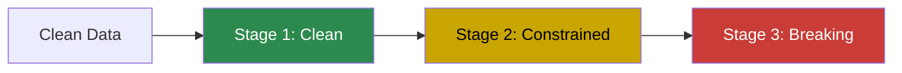

# Noise Injection Guide

Knit can inject realistic data quality issues into generated data — typos,
missing values, outliers, duplicates, and more. This lets you test how your
data pipelines handle imperfect data.

**[← Back to User Guide](index.md)**

---

## Why Noise Injection?

Real-world data is messy. Production pipelines must handle:

- Missing values where you don't expect them
- Typos in string fields
- Duplicate records
- Outlier values outside normal ranges
- Format inconsistencies
- Broken foreign key references

Knit's noise injection generates **clean data first**, then applies controlled
perturbations so you can test your data quality pipelines against known
defects.

---

## The Three-Stage Pipeline

Knit applies noise in three stages, from least to most destructive:



| Stage | What It Does | What It Preserves |
|-------|-------------|-------------------|
| **Clean** | Minor perturbations (typos, jitter) | All constraints: types, uniqueness, FKs, NOT NULL |
| **Constrained** | Soft constraint violations | Types and FKs, but may violate nullability or uniqueness |
| **Breaking** | Intentional structural violations | Nothing — tests extreme error handling |

---

## Built-In Perturbators

### 1. NullInjector

Replaces values with NULL. Tests missing-data handling.

```toml
[[noise_profiles]]
target = "users.email"
type = "null_inject"
probability = 0.05      # 5% of emails become NULL
```

- **Stage:** Constrained (violates NOT NULL if field is non-nullable)
- **Breaks:** `NOT_NULL`

### 2. TypoIntroducer

Introduces character-level errors: swaps, insertions, deletions, substitutions.

```toml
[[noise_profiles]]
target = "users.name"
type = "typo"
probability = 0.02      # 2% of names get a typo
error_rate = 0.1         # Per-character error rate within affected strings
```

- **Stage:** Clean (preserves all constraints)
- **Error types:** Adjacent character swap, random insertion, deletion,
  keyboard-distance substitution

### 3. DuplicateInjector

Creates duplicate rows. Tests deduplication logic.

```toml
[[noise_profiles]]
target = "orders"
type = "duplicate"
probability = 0.01      # 1% of rows are duplicated
count = 1                # Number of copies per duplicate
near_duplicate = true    # Slight variations in duplicates
```

- **Stage:** Constrained (violates uniqueness)
- **Breaks:** `UNIQUE`

### 4. OutlierInjector

Replaces values with extreme outliers outside normal ranges.

```toml
[[noise_profiles]]
target = "orders.amount"
type = "outlier"
probability = 0.01      # 1% of amounts become outliers
multiplier = 10.0        # How extreme (multiple of std_dev from mean)
direction = "both"       # "high", "low", or "both"
```

- **Stage:** Constrained / Breaking (violates range constraints)
- **Breaks:** `RANGE`

### 5. ValueDrifter

Gradually shifts numeric values over time, simulating sensor drift or
calibration issues.

```toml
[[noise_profiles]]
target = "readings.value"
type = "drift"
drift_rate = 0.001       # Drift amount per record
direction = "up"         # "up", "down", or "random"
```

- **Stage:** Clean (preserves constraints)
- **Use case:** IoT sensor calibration testing

### 6. ColumnSwapper

Swaps values between records in the same column, creating misattributed data.

```toml
[[noise_profiles]]
target = "orders.customer_id"
type = "swap"
probability = 0.005      # 0.5% of values swapped with another row
```

- **Stage:** Clean (values remain valid, just misplaced)
- **Use case:** Testing join integrity and data lineage

### 7. FormatVariator

Corrupts known formats (emails, dates, UUIDs) into invalid strings.

```toml
[[noise_profiles]]
target = "users.email"
type = "format_error"
probability = 0.01       # 1% of emails become malformed
```

- **Stage:** Breaking (violates type safety)
- **Breaks:** `TYPE_SAFETY`
- **Examples:** `user@example.com` → `user@@example`, `2024-01-15` → `01-2024-15`

---

## Configuring Noise in a Schema

Add `[[noise_profiles]]` sections to your `.weave.toml`:

```toml
schema_version = "1.0"

[model]
name = "noisy_ecommerce"
seed = 42

[[entities]]
name = "orders"
count = 10000
# ... fields ...

# ── Noise Configuration ────────────────────────────────────
[[noise_profiles]]
target = "orders.amount"
type = "outlier"
probability = 0.01
multiplier = 5.0
direction = "high"

[[noise_profiles]]
target = "orders.status"
type = "typo"
probability = 0.02

[[noise_profiles]]
target = "orders.customer_id"
type = "null_inject"
probability = 0.05
```

### Targeting

The `target` field uses `entity.field` notation:

- `"orders.amount"` — Apply to the `amount` field in `orders`
- `"orders"` — Apply to the entire entity (for `duplicate` type)

### Scoped Noise

Apply noise only to records matching a condition:

```toml
[[noise_profiles]]
target = "orders.amount"
type = "outlier"
probability = 0.05
scope = { where = "status == 'refunded'" }
```

This injects outliers only in refunded orders — useful for testing fraud
detection pipelines.

---

## Noise Rates and Interactions

### Rate Stacking

Multiple noise profiles on the same field stack independently:

```toml
# 5% become NULL + 2% get typos = ~7% of emails have some issue
[[noise_profiles]]
target = "users.email"
type = "null_inject"
probability = 0.05

[[noise_profiles]]
target = "users.email"
type = "typo"
probability = 0.02
```

### Pipeline Order

The three stages execute sequentially. A value nullified in stage 2 won't
receive a typo from stage 1 (clean runs first). This means:

1. **Clean perturbators** run first (typos, jitter, drift, swaps)
2. **Constrained perturbators** run next (null injection, outliers, duplicates)
3. **Breaking perturbators** run last (format corruption, FK violation)

---

## Practical Examples

### Testing a Data Quality Pipeline

Add a realistic mix of quality issues:

```toml
# 5% null injection on non-nullable fields
[[noise_profiles]]
target = "customers.email"
type = "null_inject"
probability = 0.05

# 2% typos in names
[[noise_profiles]]
target = "customers.name"
type = "typo"
probability = 0.02

# 1% extreme outliers in amounts
[[noise_profiles]]
target = "orders.amount"
type = "outlier"
probability = 0.01
multiplier = 10.0

# 0.5% duplicate orders
[[noise_profiles]]
target = "orders"
type = "duplicate"
probability = 0.005
```

### Testing Format Validation

```toml
# 3% malformed emails
[[noise_profiles]]
target = "users.email"
type = "format_error"
probability = 0.03

# 1% broken FK references
[[noise_profiles]]
target = "orders.customer_id"
type = "fk_violate"
probability = 0.01
strategy = "out_of_range"
```

---

## What's Next?

- **[Schema Language Tutorial](schema-language.md)** — Full schema reference
- **[Examples Walkthrough](examples.md)** — See noise in context
- **[Weave Specification](../weave-spec.md)** — Formal noise profile grammar
